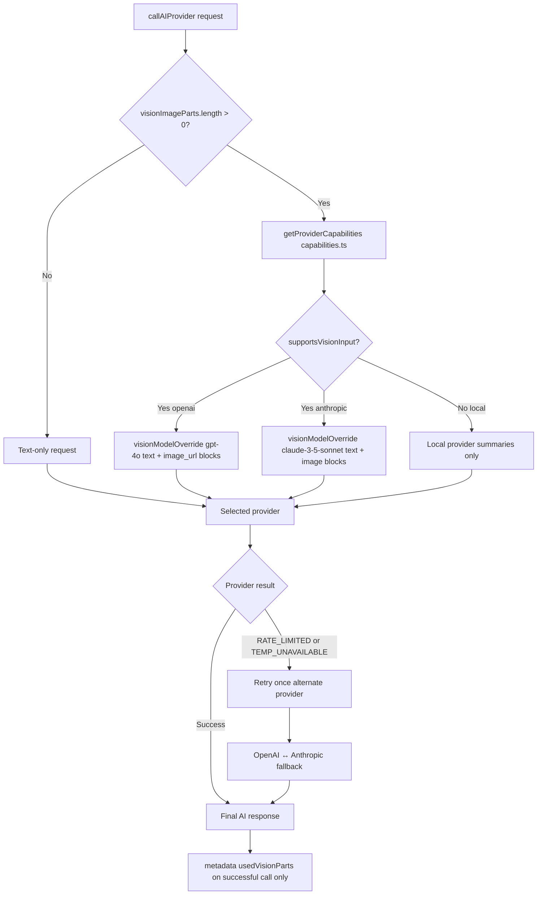

# AI Providers — Request Shapes & Capabilities

Documentation of how the Digital Life Twin sends requests to OpenAI and Anthropic, and how vision/model selection works.

**Scope:** Twin path (`DigitalLifeTwinCore` → provider adapters).  
**Specialized exemptions** (not covered by this document’s routing diagrams): Notebook AI completion, document/fact extraction helpers, Whisper/TTS/image generation routes — see [`../ai-system-audit/AI_PROVIDER_AND_MODEL_AUDIT.md`](../ai-system-audit/AI_PROVIDER_AND_MODEL_AUDIT.md) and [`../architecture/AI_SYSTEM_MENTAL_MODEL.md`](../architecture/AI_SYSTEM_MENTAL_MODEL.md).

**Navigation:** [`../architecture/AI_READING_GUIDE.md`](../architecture/AI_READING_GUIDE.md)

---

## Request shapes

### Text-only (no attachments or no image parts)

- **OpenAI**: Single user message with string content; system prompt separate.
- **Anthropic**: Single user message with one text block; system prompt in `system`.

### Multimodal (vision parts present)

- **OpenAI**: User message is an array: `[{ type: 'text', text: userTextWithVision }, { type: 'image_url', image_url: { url: 'data:image/...;base64,...' } }, ...]`. Vision instruction is prepended to the user text. Model must be vision-capable (e.g. gpt-4o).
- **Anthropic**: User message is an array of content blocks: `[{ type: 'text', text: userTextWithVision }, { type: 'image', source: { type: 'base64', media_type: 'image/png'|'image/jpeg'|..., data: base64 } }, ...]`. Allowed media types: png, jpeg, gif, webp. Model must be vision-capable (e.g. claude-3-5-sonnet-20241022).

---

## Capability matrix

Defined in `server/src/ai/providers/capabilities.ts` via `getProviderCapabilities(provider)`.

| Provider   | supportsVisionInput | visionModel                    | maxImageCount | supportedImageTypes (Anthropic)   |
|-----------|----------------------|--------------------------------|---------------|------------------------------------|
| openai    | true                 | gpt-4o                         | 5             | (all image types in vision API)   |
| anthropic | true                 | claude-3-5-sonnet-20241022     | 5             | png, jpeg, gif, webp               |
| local     | false                | —                              | 0             | —                                  |

When **local** is selected and the user attached images, vision parts are **not** sent; the prompt still includes file **summaries** (text) as fallback.

---

## Model selection rules

1. When **visionImageParts.length > 0** and the selected provider is **openai** or **anthropic**:  
   Core sets **visionModelOverride** from capabilities (gpt-4o or claude-3-5-sonnet-20241022). The provider uses this model for the API call so the request is vision-capable.

2. When the provider is **local**:  
   No vision parts are passed; no model override. Response is based on text and file summaries only.

3. Logging:  
   Core logs `[VISION_PIPELINE] vision request → model` with the chosen model and provider when vision is used. Provider logs include request shape (hasVision, visionPartsLength, model).

---

## callAIProvider routing

---

## Fallback when vision is not used

- **Provider does not support vision (e.g. local)**: Prompt already includes the **attached-files section** (text summaries from getFileSummaries). User sees the reply plus any **fileIssues** if some files failed.
- **All image parts filtered out (e.g. Anthropic and unsupported MIME)**: Provider sends the same user message as **text-only**; attached-files text is still in the prompt. Anthropic logs `vision fallback: no supported image types, using text only`.

---

## Adding a new provider

1. Implement the provider’s `process(request, context, data)` and read `data.visionImageParts` and `data.visionModelOverride` when building the API request.
2. Add an entry in **capabilities.ts**: `getProviderCapabilities('newprovider')` with `supportsVisionInput`, `visionModel` (if vision is supported), `maxImageCount`, and optionally `supportedImageTypes`.
3. In **DigitalLifeTwinCore.callAIProvider**, add a branch for the new provider and pass **providerData** (including visionImageParts and visionModelOverride when applicable).

---

## See also

- **ARCHITECTURE.md** — Attachment flow and storage.
- **RUNBOOK.md** — Logging and debugging.
- **GOLDEN_RULES.md** — Rules for editors.
