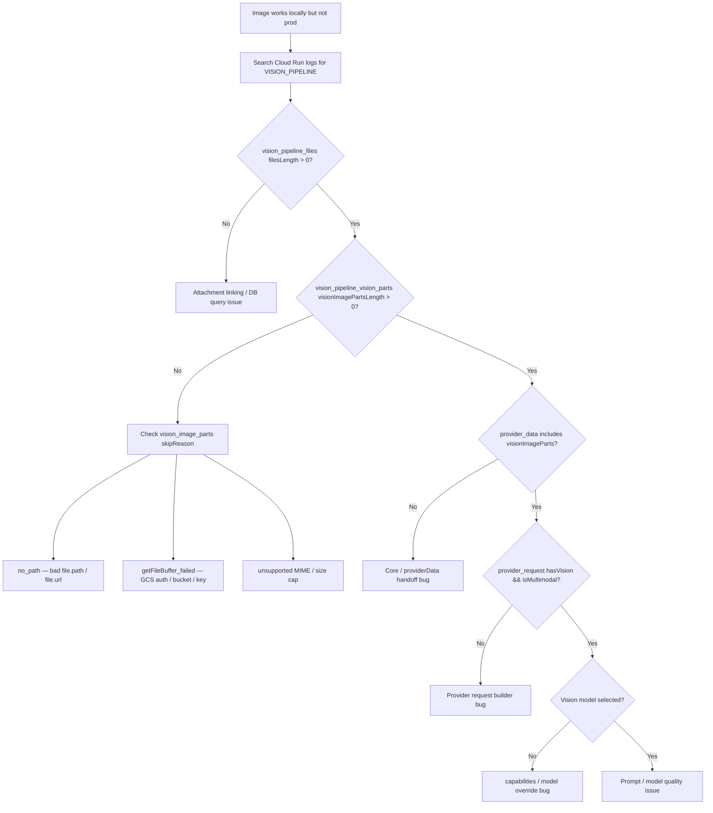

# AI Vision Pipeline — Runbook

Operational guide for debugging and verifying the AI vision pipeline (image attachments, multimodal requests) in local and production (Cloud Run).  
**Phase 6**: This runbook is the single place for log level, where to view Cloud Run logs, the exact `[VISION_PIPELINE]` prefix, and the "images work locally but not prod" checklist. See also **ARCHITECTURE.md**, **PROVIDERS.md**, **GOLDEN_RULES.md**.

---

## Log level and where to view logs

### Log level required for Phase 0 instrumentation

- **Development**: Phase 0 uses `logger.debug()`. The server logger only writes debug logs when `NODE_ENV === 'development'`, so you will see `[VISION_PIPELINE]` logs in local dev.
- **Production (Cloud Run)**: To see Phase 0 logs in production, ensure the runtime or logging pipeline is configured to capture **debug** level, or temporarily change the Phase 0 log calls from `logger.debug` to `logger.info` for the deployment you are debugging.

### Where Cloud Run logs are viewed

1. **Google Cloud Console** → **Logging** (or **Logs Explorer**).
2. Select the **Cloud Run** service (e.g. `vssyl-server`).
3. Use the **filter** bar to narrow by severity, resource, or text.

### Exact log prefix to search

Use this prefix to see all vision-pipeline instrumentation in one place:

- **Text filter**: `[VISION_PIPELINE]`
- Or filter by **operation** (if your logs are structured):  
  `operation=vision_pipeline_files`  
  `operation=vision_pipeline_vision_parts`  
  `operation=vision_pipeline_provider_data`  
  `operation=vision_pipeline_provider_request`  
  `operation=vision_pipeline_final_payload`  
  `operation=vision_image_parts` (skip reasons in fileAnalysisService)

Filtering by `[VISION_PIPELINE]` or by `requestId` (from the trace context) lets you follow a single request end-to-end.

---

## Troubleshooting flowchart: images work locally but not prod

---

## If images work locally but not in production

Work through this checklist:

1. **visionImageParts.length and provider in logs**
   - Search for `[VISION_PIPELINE]` and confirm:
     - `vision_pipeline_files`: `filesLength > 0`.
     - `vision_pipeline_vision_parts`: `visionImagePartsLength > 0` (if 0, check skip reasons in `vision_image_parts` logs).
     - `vision_pipeline_provider_data`: `visionImagePartsLength > 0` and `dataKeys` includes `visionImageParts`.
     - `vision_pipeline_provider_request`: `hasVision === true`, `isMultimodal === true`.
   - If any of these are missing or zero, the failure is at that step.

2. **resolveStoragePath and getFileBuffer (GCS)**
   - In production, files must be loadable from **GCS** (or the configured storage). The server does **not** use local disk for uploads in Cloud Run.
   - If `vision_image_parts` logs show `skipReason: 'no_path'`, then `File.path` or `File.url` is missing or not in a form `resolveStoragePath` / `extractPathFromUrl` can use.
   - If you see `skipReason: 'getFileBuffer_failed'`, check GCS bucket name, credentials (ADC or key), and object path (bucket + path must match where files are stored).

3. **Environment variables and bucket**
   - Backend (server) must have:
     - `STORAGE_PROVIDER=gcs`
     - `GOOGLE_CLOUD_PROJECT_ID`, `GOOGLE_CLOUD_STORAGE_BUCKET` set and correct for the environment.
   - For AI providers (for the request to succeed after vision parts are sent):
     - OpenAI: `OPENAI_API_KEY`
     - Anthropic: `ANTHROPIC_API_KEY`

---

## Required environment variables (reference)

### Backend (server) — AI and storage

| Variable | Purpose |
|----------|---------|
| `OPENAI_API_KEY` | OpenAI API (vision-capable model) |
| `ANTHROPIC_API_KEY` | Anthropic API (vision-capable model) |
| `STORAGE_PROVIDER` | `gcs` in production |
| `GOOGLE_CLOUD_PROJECT_ID` | GCP project |
| `GOOGLE_CLOUD_STORAGE_BUCKET` | GCS bucket for uploads (e.g. Drive/chat files) |

Other server env (e.g. `DATABASE_URL`, `FRONTEND_URL`, `JWT_SECRET`) are required for the app but not specific to the vision pipeline.

---

## Rate limit (429) and provider fallback

- **OpenAI 429**: Provider uses exponential backoff and parses **Retry-After**; on failure returns fallback with `metadata.code: 'RATE_LIMITED'` and `metadata.retryAfter` (seconds). Search logs for `openai_provider_error`, `openai_rate_limit_retry`, or `vision_pipeline_fallback`.
- **Core fallback**: When the selected provider returns `metadata.code === 'RATE_LIMITED'` or `'TEMP_UNAVAILABLE'`, Core retries **once** with the other provider (OpenAI ↔ Anthropic) with the same prompt and vision parts. Log: `[VISION_PIPELINE] provider fallback (openai → anthropic)` (or reverse).
- **"Image used in this reply"**: Set only when the final provider call succeeds (no error in metadata). Not set on fallback or error response.

---

## Quick reference: what the plan will reveal

- `files.length === 0` → attachment linking / DB query issue.
- `files.length > 0` but `resolveStoragePath === null` → bad path/url storage (log: `skipReason: 'no_path'`).
- Path OK but `getFileBuffer` fails → GCS auth, bucket, or object key (log: `skipReason: 'getFileBuffer_failed'`).
- `visionImageParts.length > 0` but provider logs show text-only → provider request builder bug.
- `hasVision === true` but model still vague → prompt injection or model selection (Phase 2 prompt and model choice).
