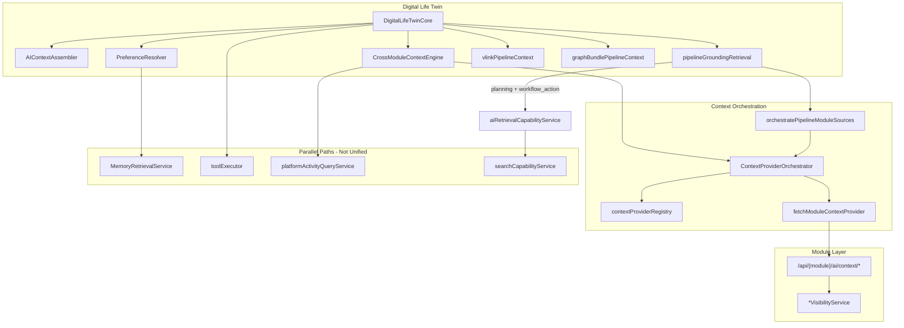

# AI Retrieval — Architecture Audit

**Program:** AI Retrieval Adapter — Phase 0A  
**Date:** 2026-06-23  
**Status:** As-built audit vs constitutional targets

**Authorities:** [AI_PLATFORM_CONSTITUTION.md](../../architecture/AI_PLATFORM_CONSTITUTION.md), [AI_RELATIONSHIP_RETRIEVAL_MODEL.md](../../architecture/AI_RELATIONSHIP_RETRIEVAL_MODEL.md), [SEARCH_CONSTITUTION.md](../../search/SEARCH_CONSTITUTION.md)

---

## 1. As-built architecture

**Phase 1B:** Two wired consumers (`workflow_action`, `planning`) via `runPipelineRetrievalDiscovery`. Consumer contract and expanded diagnostics standardized.

---

## 2. Constitutional alignment

| Rule (AI_RELATIONSHIP_RETRIEVAL_MODEL) | Status | Evidence |
|----------------------------------------|--------|----------|
| AI-1 Never bypass visibility | **Mostly C** | Drive/chat/calendar/todo/notes compliant |
| AI-2 No cross-module Prisma in twin | **P** | HR/scheduling controllers |
| AI-3 V_Link resolver + pipeline | **C** | `vlinkPipelineContextService` |
| AI-4 Tags via module providers | **C** | On-entity in notes/drive |
| AI-5 Search indexes layer 4 hydrate | **N** | No index; search unwired |
| AI-6 Events signal re-fetch | **S** | `AIEventConsumer` stubs |
| AI-7 Pending suggestions excluded | **C** | entity linking ephemeral |
| AI-8 Inference ephemeral | **C** | synthesis flagged |

---

## 3. Layer comparison: Search vs AI

| Layer | Unified Search | AI Retrieval |
|-------|----------------|--------------|
| **Entry** | `POST /api/search` | Twin + orchestrator |
| **Orchestrator** | `searchCapabilityService` | `ContextProviderOrchestrator` |
| **Provider model** | `RegisteredSearchProvider` | `RegisteredContextProvider` |
| **Operation** | Query substring match | Curated lists + summaries |
| **PE gate** | `search:read` | JWT + module read dual |
| **Output** | `SearchResult[]` | Module JSON blobs |
| **Shared delegate** | visibility `searchAccessible*` | visibility `list*ForAI` |

**Audit verdict:** Same **trust boundary** (visibility services), different **orchestration contracts**. Convergence requires an adapter — not merge of orchestrators.

---

## 4. Service boundary audit

| Component | Canonical? | Notes |
|-----------|:------------:|-------|
| `ContextProviderOrchestrator` | ✅ | Phase A canonical |
| `pipelineGroundingRetrieval` | ✅ | Grounding prepass |
| `ModuleAIContextService.fetchModuleContext` | ✅ | HTTP bridge |
| `AIContextAssembler` | ✅ | Prompt assembly |
| `MemoryRetrievalService` | ✅ | User facts |
| `searchCapabilityService` | ✅ | Search — **AI consumer missing** |
| `CrossModuleContextEngine.buildUserContext` | ⚠️ legacy | Skim path preferred |
| `searchTasksForAI` | ❌ orphan | Unused |

---

## 5. Double-fetch analysis

| Scenario | Pass 1 (orchestrator) | Pass 2 (grounding) | Mitigation |
|----------|----------------------|---------------------|------------|
| Place intent | optional providers | `vssyl_place` if needed | `moduleHasExistingContext` |
| Drive files | `recent_files` on match | `drive_files` grounding | skip if drive context exists |
| Calendar | intent providers | `calendar` grounding | skip if exists |
| V_Link | — | dedicated pipeline | separate service |

**Risk:** Two orchestration passes per twin request increases latency (AR-04).

---

## 6. Dependency boundaries

| Dependency | Direction | Allowed |
|------------|-----------|---------|
| AI → module visibility | ✅ | Canonical |
| AI → Unified Search | ✅ wired | `planning`, `workflow_action` via adapter |
| Search → AI | ❌ | Must never |
| AI → raw Prisma (HR) | ⚠️ exists | Must remediate |
| AI → domain events payload | ❌ | Signals only per AI-6 |

---

## 7. Certification posture

| Capability | Level | Retrieval relevance |
|------------|-------|---------------------|
| AI Platform | L2 Platform Compliant | Orchestrator production |
| Unified Search | L2 CwF | Discovery substrate candidate |
| Context Graph | L3 | Graph bundle retrieval |
| Platform Kernel | L2 CwF | Activity feed reads |

**Retrieval Adapter certification:** Phase 1B — two wired consumers + Consumer Standard. Full platform certification deferred.

---

## 8. Audit conclusions

1. **Architecture is sound** — Retrieval Adapter is shared infrastructure for query-driven discovery on two intents.
2. **Unified Search is wired** to AI for `planning` and `workflow_action` — broader migration per Readiness Matrix.
3. **Retrieval Adapter** sits between twin/orchestrator and Search + providers — specialized paths remain independent.
4. **HR/scheduling** provider paths violate AI-2 — remediate before `business_operations` consumer wire.

**References:** [Phase 1A](./AI_RETRIEVAL_PHASE_1A_CLOSEOUT.md) · [Phase 1B](./AI_RETRIEVAL_PHASE_1B_CLOSEOUT.md) · [Consumer Standard](./AI_RETRIEVAL_CONSUMER_STANDARD.md)

---

**Last updated:** 2026-06-23 (Phase 1B)
