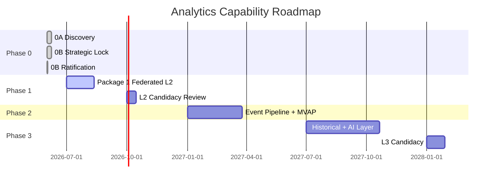

# Analytics Capability — Phase 1 Executive Summary

**Program:** Analytics Capability — Constitutional Modernization  
**Date:** 2026-06-22  
**Status:** Governance complete — **Phase 0B ratified, Phase 1 authorized (conditional)**

**Deliverables:**
- [Phase 0B Ratification](./ANALYTICS_PHASE0B_RATIFICATION.md)
- [Phase 1 Authorization Review](./ANALYTICS_PHASE1_AUTHORIZATION_REVIEW.md)
- [Phase 1 Scope Validation](./ANALYTICS_PHASE1_SCOPE_VALIDATION.md)
- [Phase 1 Risk Review](./ANALYTICS_PHASE1_RISK_REVIEW.md)
- [Phase 1 Authorization Decision](./ANALYTICS_PHASE1_AUTHORIZATION_DECISION.md)

---

## Bottom line

**Option A — Ratify Phase 0B + Authorize Phase 1 (Conditional)** is the formal council decision.

Analytics is now **constitutionally ratified** as a **Hybrid Domain** with **Platform Analytics Capability** as the primary engine. Phase 1 engineering may enter ACT to deliver **Federated L2 hardening** — no warehouse, no event pipeline, no certification, no ledger updates.

---

## Decisions recorded

| Decision | Outcome |
|----------|---------|
| Phase 0B ratification | ✅ **RATIFIED** — SB-01 through SB-08 |
| Hybrid Option C roadmap | ✅ **Ratified** — 2026 federation / 2027 pipeline / 2028 historical+AI |
| Phase 1 authorization | ✅ **AUTHORIZED (Conditional)** |
| Warehouse in Phase 1 | ❌ **Not authorized** |
| Event pipeline in Phase 1 | ❌ **Not authorized** — remove placeholder only |
| L2 certification in Phase 1 | ❌ **Not authorized** — candidacy after closeout |

---

## Ratified governance (SB-01 – SB-08)

| ID | Decision |
|----|----------|
| SB-01 | Analytics = **Hybrid Domain** |
| SB-02 | **Platform Analytics Capability** = primary engine |
| SB-03 | **Dashboard** consumes — does not own |
| SB-04 | **Modules** = Systems of Record |
| SB-05 | **No warehouse in 2026** |
| SB-06 | **Event rollups after Platform Events maturity** |
| SB-07 | **Not certifiable product module** |
| SB-08 | **Future warehouse derived-only, never authoritative** |

---

## Phase 1 package summary

**Name:** Package 1 — Federated L2 Trust & Service Boundary  
**Duration:** ~4–6 weeks engineering  
**Target readiness post-closeout:** **~20–22/27 (~74–81%)** — L2 CwF candidacy prep

### In scope

| Workstream | Outcome |
|------------|---------|
| Unified `analyticsCapabilityService` | No controller Prisma |
| Module rollup APIs (Chat, Todo) | Decouple CV-01, CV-02 |
| PE parity on all `/api/analytics/*` | AP1–AP5 |
| Remove placeholder event subscriber | Pipeline honesty |
| Business workspace wire or hide | No mock |
| Dashboard facade hardening | Stable consumer contract |
| Ownership registry + operation matrix | L2 documentation |
| Contract tests | All capability routes |
| API inventory cleanup | Canonical registry |
| Optional TTL cache | Performance — K1-05 |

### Out of scope

Warehouse, event pipeline, MVAP tables, relationship analytics, historical trends, AI consumption layer, L2 certification ceremony, ledger update, Admin Portal changes, `ai/analytics/*` wiring.

---

## Required questions — complete answers

| # | Question | Answer |
|---|----------|--------|
| 1 | Is Phase 0B ready for ratification? | **Yes — ratified 2026-06-22** |
| 2 | Should Hybrid Option C be ratified? | **Yes — ratified** |
| 3 | Is Analytics officially a Hybrid Domain? | **Yes** |
| 4 | Is Analytics officially a Platform Capability? | **Yes — primary engine class within Hybrid Domain** |
| 5 | Is a warehouse authorized in Phase 1? | **No** |
| 6 | Is an event pipeline authorized in Phase 1? | **No — remove placeholder subscriber only** |
| 7 | Highest-risk ownership violations? | Mock business workspace; placeholder subscriber; pseudo-module pretense |
| 8 | Highest-risk coupling violations? | Chat/Todo direct Prisma in capability service; controller inline Prisma; Activity conflation |
| 9 | Mock/placeholder systems to remove? | `analytics_placeholder` subscriber; business workspace mock; enterprise panel mock cells; orphan component disposition |
| 10 | APIs that must become canonical? | `GET /api/analytics/dashboard-summary`, `/personal`, `/modules/:moduleId`, `/export`; Dashboard AI quick-stats via capability |
| 11 | Services required for Phase 1? | `analyticsCapabilityService` (unified); refactored `analyticsDashboardSummaryService`; Chat/Todo rollup methods; remove event subscriber |
| 12 | Findings blocking L2 readiness? | AN-01–AN-08 (service, coupling, PE, placeholder, mock, matrix, registry, activity) |
| 13 | Readiness score after Phase 1? | **~20–22/27 (~74–81%)** — L2 candidacy ready, not certified |
| 14 | Is Phase 1 authorized? | **Yes — conditional Option A** |
| 15 | Next implementation package? | **Package 1 — Federated L2 Trust & Service Boundary** |

---

## Canonical APIs (Phase 1)

| API | Role |
|-----|------|
| `GET /api/analytics/dashboard-summary` | Primary cross-module tenant contract |
| `GET /api/analytics/personal` | User-scoped usage analytics |
| `GET /api/analytics/modules/:moduleId` | Module-scoped analytics read |
| `GET /api/analytics/export` | Governed export |
| `GET /api/dashboard/ai/context/quick-stats` | AI context — capability-backed |

**Client canonical entry:** `dashboardAnalyticsFacade.ts` — Dashboard must not bypass.

---

## Kickoff conditions (before merge)

| ID | Decision |
|----|----------|
| K1-01 | Business workspace: wire or hide |
| K1-02 | Enterprise panels: wire+flag or permanent gate |
| K1-03 | Analytics read PE action taxonomy |
| K1-04 | Orphan components: mount or delete |
| K1-05 | Cache: Redis / in-process / defer |

---

## Roadmap (ratified)

---

## Stop condition confirmation

| Constraint | Status |
|------------|--------|
| Governance only | ✅ |
| No runtime code | ✅ |
| No schemas | ✅ |
| No APIs / services created | ✅ |
| No certification | ✅ |
| No ledger updates | ✅ |
| No modernization packages executed | ✅ |

---

## Next action

Enter **ACT mode** for **Analytics Capability Phase 1 — Package 1: Federated L2 Trust & Service Boundary** after recording kickoff decisions K1-01 through K1-05.

---

**Last updated:** 2026-06-22
