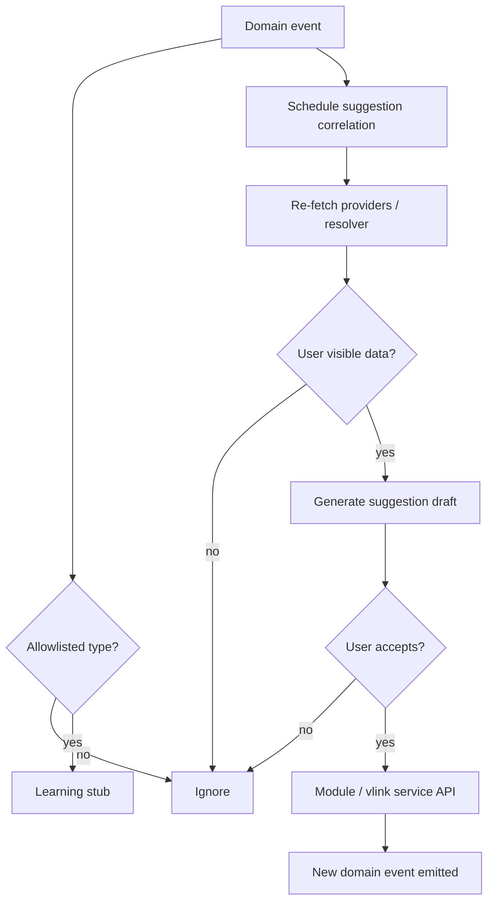

# AI Automation Boundary

**Program:** Vssyl Relationship Framework  
**Phase:** 2C — Automation trigger constitutional architecture  
**Status:** Canonical AI boundary  
**Date:** 2026-06-14  
**Catalog:** [RELATIONSHIP_AUTOMATION_TRIGGER_CATALOG.md](./RELATIONSHIP_AUTOMATION_TRIGGER_CATALOG.md)  
**Federation:** [RELATIONSHIP_READ_FEDERATION_CONTRACT.md](./RELATIONSHIP_READ_FEDERATION_CONTRACT.md)

> **Scope:** How AI **may and may not** interact with relationship-triggered automation. **No** AI pipeline changes in this phase.

---

## Purpose

AI already consumes a subset of domain events (`AIEventConsumer`) for learning stubs and ambient suggestion correlation. Relationship triggers multiply signal volume. This document prevents AI from becoming a **silent relationship writer** or **permission bypass**.

---

## Core distinctions

| Concept | AI role |
|---------|---------|
| **Domain event** | Signal that re-fetch may be needed — not grounding SoR |
| **AISuggestion / VLinkSuggestion** | Proposal — not relationship until accepted |
| **UserMemoryFact** | Explicit user-confirmed fact — separate from triggers |
| **Persisted V_Link** | Grounding after user confirmation — not from event payload |
| **Module provider payload** | Permission-checked entity context |

**Locked:** AI suggestions are **not relationships** until approved through canonical accept flows.

---

## What AI can do

### Observe (C5 — allowed)

| Action | Detail |
|--------|--------|
| Subscribe to allowlisted domain event types | Extend set only via catalog + safety review |
| Record learning stub | Diagnostic correlation — `userLearningSignalService` |
| Schedule ambient suggestion correlation | Async, non-blocking — `ambientSuggestionService` |
| Log trigger metadata | Safe fields only — no bodies |

**Current allowlist (reference):** `file.uploaded`, `chat.message.sent`, `calendar.event.created`, module install/enable/disable — not full relationship catalog.

### Suggest (C5 — allowed)

| Action | Detail |
|--------|--------|
| Propose V_Link attach | Creates **pending** `VLinkSuggestion` — not `vlink.entity.linked` |
| Propose task assign | UI suggestion — user confirms via Todo API |
| Propose tag strings | User confirms on entity update |
| Propose share | Explicit user action — never silent |
| Surface "related items" | Inference + persisted V_Link preference — disclose source |

### Prepare drafts / actions (C5 — allowed)

| Action | Detail |
|--------|--------|
| Pre-fill link dialog | User clicks accept |
| Draft notification text | User sends |
| Draft workflow rule | User saves rule — D2 confirmation at rule create |
| Prepare meeting prep bundle | User opens suggestion |

Drafts are **UI artifacts** — not mutations until user or authorized rule executes.

---

## What AI cannot do

### Silent execution (forbidden)

| Action | Why |
|--------|-----|
| Auto `file.shared` on trigger chain | Access grant requires PE + user intent |
| Auto `vlink.entity.linked` | Association requires link gate |
| Auto accept `vlink.suggestion` | Pending ≠ persisted |
| Auto `business.member.added` | Membership requires invite flow |
| Auto permanent delete | D4 forbidden |
| Auto tag write on host row | TAG_STRATEGY — user confirm unless explicit AI action tool with PE |
| Persist trigger payload as UserMemoryFact | Event ≠ user-stated fact |

### Permission bypass (forbidden)

| Action | Why |
|--------|-----|
| Ground on event metadata without resolver | May include ids user cannot access |
| Use V_Link membership as file read grant | Constitutional V_Link boundary |
| Cross-tenant correlation | Tenant isolation |
| Treat search index row as grounding | Index is derived |

### Relationship creation from inference (forbidden)

| Action | Why |
|--------|-----|
| Emit synthetic `relationship.created` | Inference not SoR |
| Promote tag co-occurrence to V_Link | Semantic collapse |
| Create NotebookLink from chat mention alone | Operational link needs user action |

---

## AI visibility by trigger concept

| Trigger concept | AI may observe? | AI may suggest from? | AI may ground from event? |
|-----------------|-----------------|----------------------|---------------------------|
| `relationship.created` | ⚠️ Allowlist expand | ✅ After re-fetch | ❌ Event only |
| `relationship.access_revoked` | ✅ | ❌ Invalidate only | ❌ |
| `relationship.deleted` | ✅ | ❌ | ❌ Excluded post-delete |
| `relationship.vlink_attached` | ✅ | ✅ Pending suggestion only | ❌ Use pipeline service |
| `vlink.suggestion.created` | ✅ Diagnostic | N/A | ❌ **Excluded** from grounding |
| `relationship.tag_added` | ⚠️ | ✅ Tag suggest on visible entity | ❌ Tag alone |
| Inference / entityLinking | ❌ No event | ✅ Ephemeral UI | ⚠️ Disclosed inference only |

---

## Grounding precedence (unchanged)

From federation contract — AI automation does not alter order:

```
1. UserMemoryFact (explicit user)
2. Persisted V_Link (confirmed, resolver-filtered)
3. Module AI context providers
4. Search / index hydrate (permission-checked)
5. Domain event signal → triggers re-fetch to layers 2–3
6. Inference (ephemeral, disclosed)
```

**Domain events sit at layer 5** — they **invalidate and suggest**, not replace layers 1–3.

---

## AI consumer flow (constitutional)



---

## Relationship to existing AI systems

| System | Boundary |
|--------|----------|
| `AIEventConsumer` | Observe allowlist only — expand via catalog amendment |
| `ambientSuggestionService` | Suggest only — no auto-exec |
| `vlinkPipelineContextService` | Ground confirmed V_Link — not from raw events |
| `entityLinking` | Inference — never writes SoR |
| AI action executors | PE-gated tools — user or explicit tool invocation |
| `MemoryRetrievalService` | UserMemoryFact — not event log |

---

## AI + automation tiers

| Tier | AI involvement |
|------|----------------|
| T0–T1 | Observe only — no user-facing action |
| T2 | Suggest — user accept |
| T3 | Webhook content may inform AI **after** partner delivery — not auto React |
| T4 | AI may **draft** workflow — user publishes rule |
| T5 | AI **excluded** from destructive execution |

---

## Audit and compliance

| Requirement | Rule |
|-------------|------|
| Log AI correlation id | Link suggestion to `domainEventId` |
| Retain suggestion accept/reject | Distinct from relationship audit |
| Admin AI tools | May view event + suggestion — not impersonate user accept |
| Deleted entity events | AI must purge suggestion targets |

---

## Expansion process

To add domain event type to AI allowlist:

1. Entry exists in [RELATIONSHIP_AUTOMATION_TRIGGER_CATALOG.md](./RELATIONSHIP_AUTOMATION_TRIGGER_CATALOG.md)  
2. Safety tier ≤ T2 for observe-only, or T4 with draft-only for suggest  
3. Update `AI_CONSUMED_DOMAIN_EVENT_TYPES` in implementation phase — not Phase 2C  
4. Document in [AI_CONTEXT_PROVIDER_MATRIX.md](./audits/AI_CONTEXT_PROVIDER_MATRIX.md)  

---

## Anti-patterns

| Anti-pattern | Correct pattern |
|--------------|-----------------|
| "AI heard file.shared so user can read file in prompt" | Re-fetch via driveVisibilityService |
| "Auto-link uploaded file to active V_Link" | Suggest link; user confirm |
| "Remember user shares everything with Jane" | UserMemoryFact after explicit user statement |
| "Trigger = relationship in graph DB" | Trigger → re-fetch SoR |
| Chat message event → auto NotebookLink | Suggest only |

---

## Related documents

| Document | Purpose |
|----------|---------|
| [AUTOMATION_CONSUMER_BOUNDARY.md](./AUTOMATION_CONSUMER_BOUNDARY.md) | C5 class |
| [AUTOMATION_TRIGGER_SAFETY_MODEL.md](./AUTOMATION_TRIGGER_SAFETY_MODEL.md) | Confirmation tiers |
| [TAG_STRATEGY.md](./TAG_STRATEGY.md) | AI tag rules |
| [V_LINK.md](./V_LINK.md) | Membership ≠ access |

**Last updated:** 2026-06-14
