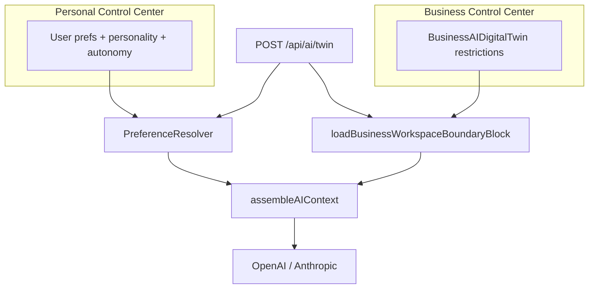

# Business vs personal AI twin boundaries

**Last updated:** 2026-05-18 (AI Identity Phase 3)

## Two configuration surfaces

| Surface | Who configures | Storage | Chat path today |
|--------|----------------|---------|-----------------|
| **AI Identity** (`/ai`) | End user | `UserPreference`, `AIPersonalityProfile`, `AIAutonomySettings`, `UserAIContext`, `UserMemoryFact` | `POST /api/ai/twin` via `DigitalLifeTwinCore` + `PreferenceResolver` |
| **Workspace AI** (business workspace admin) | Business admins | `BusinessAIDigitalTwin` (`restrictions`, `capabilities`, `aiPersonality`, …) | `POST /api/business-ai/:businessId/interact` (separate service; mock intelligence today) **and** injected into personal twin when `context.businessId` is set |

Personal preferences **do not** replace business policies. Business policies **do not** replace personal communication preferences. Both can apply in business workspace chat.

## Live path: business workspace chat uses personal twin + business policies

When the client sends `POST /api/ai/twin` with `context.businessId` (e.g. AI Chat on a business dashboard):

1. **Membership** is verified (`userHasActiveBusinessMembership` on the route).
2. **`PreferenceResolver`** loads **personal** effective preferences (unchanged).
3. **`loadBusinessWorkspaceBoundaryBlock`** loads active `BusinessAIDigitalTwin` policies for that business.
4. **`assembleAIContext`** adds a **Business workspace AI policies** block (`sourceType: business`) before the personal preference block.
5. Response metadata may include `businessWorkspace: { active, businessId, businessName }`.

## What is intentionally separate

- **`GET /api/ai/effective-preferences`** always describes **personal** settings (`preferenceScope: personal`). With `?businessId=`, the preview may include a note that business policies apply separately.
- **Business AI Control Center** edits do **not** write to `AIPersonalityProfile` or personal `UserAIContext`.
- **`POST /api/business-ai/.../interact`** remains the dedicated business AI API; it is not the same code path as `/api/ai/twin` but shares the same configuration record.

## Employee transparency (read-only)

- **`GET /api/business-ai/:businessId/employee-access`** includes `policyDigest` (formatted policy lines + personal AI Identity note).
- UI: **`WorkspaceAIDrawer`** — opened from `/ai-chat` (business dashboard), **AI Identity** home (workspace card), and business front-page assistant.

## Related code

- [`businessWorkspaceBoundaries.ts`](../../server/src/ai/enterprise/businessWorkspaceBoundaries.ts)
- [`workspaceAIPolicyDigest.ts`](../../server/src/ai/enterprise/workspaceAIPolicyDigest.ts)
- [`AIContextAssembler`](../../server/src/ai/context/AIContextAssembler.ts) — `BUSINESS_WORKSPACE_POLICY_BLOCK_TITLE`
- [`AI_TWIN_PROMPT_PIPELINE.md`](./AI_TWIN_PROMPT_PIPELINE.md)
