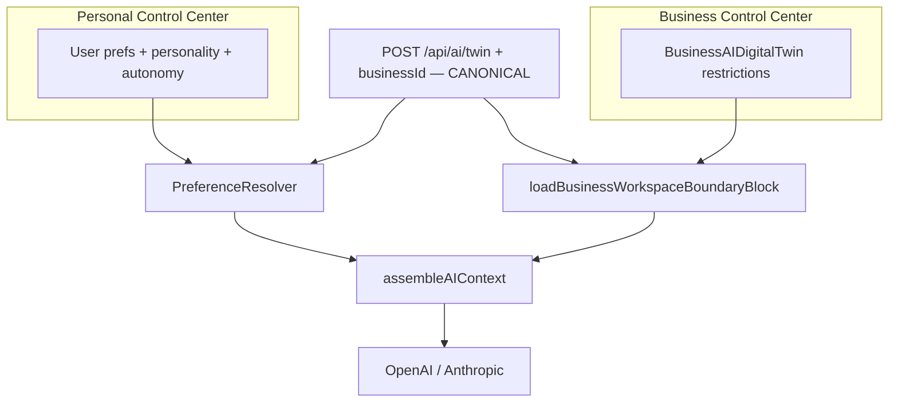

# Business vs personal AI twin boundaries

**Last updated:** 2026-08-25 (Digital Life Twin documentation reconciliation)

## Foundational rule

**PERSONAL** and **BUSINESS** are primarily **scopes of authorized reality/context**, not two separate intelligence engines.

The canonical conversational runtime is the shared **Digital Life Twin** (`POST /api/ai/twin`).

| Scope may add | Examples |
|---------------|----------|
| **Business** | Tenant truth, module context, business policy, permissions, organizational state |
| **Personal** | Conversation history, durable personal memory, user preferences, personal platform state |

Reasoning intelligence is shared. Business-specific governance and configuration remain real — they overlay the shared runtime; they do not fork it.

---

## Two configuration surfaces

| Surface | Who configures | Storage | Chat path today |
|--------|----------------|---------|-----------------|
| **AI Identity** (`/ai`) | End user | `UserPreference`, `AIPersonalityProfile`, `AIAutonomySettings`, `UserAIContext`, `UserMemoryFact` | **`POST /api/ai/twin`** via `DigitalLifeTwinService` → `DigitalLifeTwinCore` + `PreferenceResolver` |
| **Workspace AI** (business workspace admin) | Business admins | `BusinessAIDigitalTwin` (`restrictions`, `capabilities`, `aiPersonality`, …) | **Canonical:** `POST /api/ai/twin` + `context.businessId` (policy overlay). **Noncanonical:** `POST /api/business-ai/:businessId/interact` (mock — do not treat as Twin) |

Personal preferences **do not** replace business policies. Business policies **do not** replace personal communication preferences. Both can apply in business workspace chat.

---

## `businessId` semantics (B1 / B1-R)

`businessId` identifies **which** tenant/business scope is authorized.

It does **not** identify **whether** the question is about business state.

| Situation | Implication |
|-----------|-------------|
| User in business workspace asks about org PTO / HR truth | Business platform state may be required |
| User in business workspace asks a personal/general question | Do not invent business intent from scope alone |
| Bare “budget” under `businessId` | Not automatically business financial truth |

Explicit/current business truth is documented separately from personal/general questions asked while `businessId` is present.

---

## Live path: business workspace chat uses shared Twin + business policies

When the client sends `POST /api/ai/twin` with `context.businessId` (e.g. AI Chat on a business dashboard):

1. **Membership** is verified (`userHasActiveBusinessMembership` on the route).
2. **`PreferenceResolver`** loads **personal** effective preferences (unchanged).
3. **`loadBusinessWorkspaceBoundaryBlock`** loads active `BusinessAIDigitalTwin` policies for that business.
4. **`assembleAIContext`** adds a **Business workspace AI policies** block (`sourceType: business`) before the personal preference block.
5. Response metadata may include `businessWorkspace: { active, businessId, businessName }`.

---

## Legacy Business AI interact path

| Item | Classification |
|------|----------------|
| `BusinessAIDigitalTwinService` + `POST /api/business-ai/:businessId/interact` | **NONCANONICAL / LEGACY / MOCK** |
| Business AI config / Control Center APIs on `/api/business-ai` | Still used for policy configuration consumed by Twin |
| Architectural ownership of conversational turns | **`/api/ai/twin` only** |

Do not delete the interact route in documentation-only work. Do not describe it as the canonical conversational Business Twin.

Evidence also noted in [`AI_EXECUTION_ARCHITECTURE.md`](./AI_EXECUTION_ARCHITECTURE.md), [`AI_PHASE1B_OPEN_LIMITATIONS.md`](./AI_PHASE1B_OPEN_LIMITATIONS.md).

---

## What is intentionally separate

- **`GET /api/ai/effective-preferences`** always describes **personal** settings (`preferenceScope: personal`). With `?businessId=`, the preview may include a note that business policies apply separately.
- **Business AI Control Center** edits do **not** write to `AIPersonalityProfile` or personal `UserAIContext`.
- Response contract `enterprise` means **structured deliverable shape** — not “anything about a business.”

---

## Employee transparency (read-only)

- **`GET /api/business-ai/:businessId/employee-access`** includes `policyDigest` (formatted policy lines + personal AI Identity note).
- UI: **`WorkspaceAIDrawer`** — opened from `/ai-chat` (business dashboard), **AI Identity** home (workspace card), and business front-page assistant.

---

## Related code

- [`businessWorkspaceBoundaries.ts`](../../server/src/ai/enterprise/businessWorkspaceBoundaries.ts)
- [`workspaceAIPolicyDigest.ts`](../../server/src/ai/enterprise/workspaceAIPolicyDigest.ts)
- [`AIContextAssembler`](../../server/src/ai/context/AIContextAssembler.ts) — `BUSINESS_WORKSPACE_POLICY_BLOCK_TITLE`
- [`AI_TWIN_PROMPT_PIPELINE.md`](./AI_TWIN_PROMPT_PIPELINE.md)
- [`AI_SYSTEM_MENTAL_MODEL.md`](./AI_SYSTEM_MENTAL_MODEL.md)
- [`AI_CANONICAL_ROUTE_MAP.md`](./AI_CANONICAL_ROUTE_MAP.md)
