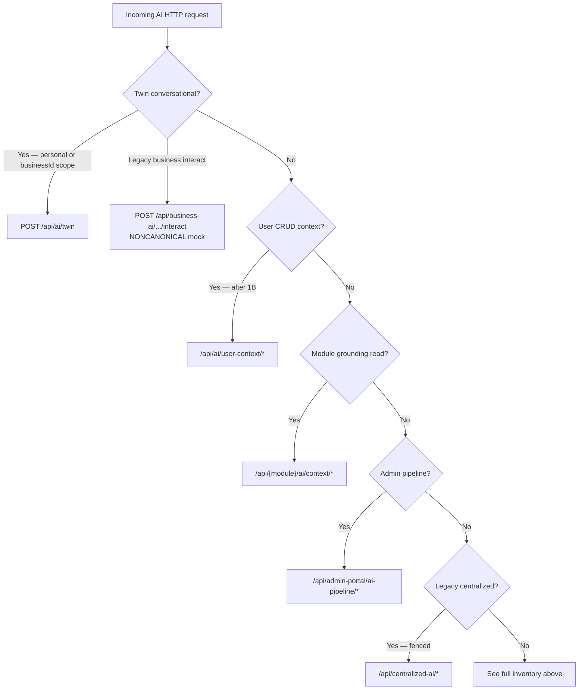

# AI Canonical Route Map

**Wave:** AI Platform **1A** — Route consolidation & legacy path retirement audit
**Status:** Active — HTTP inventory + **shipped Twin runtime flow** (reconciled 2026-08-25)
**Last updated:** 2026-08-25 (Digital Life Twin documentation reconciliation)
**Parent:** [AI_PLATFORM_OVERVIEW.md](./AI_PLATFORM_OVERVIEW.md), [AI_SYSTEM_MENTAL_MODEL.md](./AI_SYSTEM_MENTAL_MODEL.md), [AI_PLATFORM_BOUNDARY_MODEL.md](./AI_PLATFORM_BOUNDARY_MODEL.md)
**Evidence:** Code on `main` (`DigitalLifeTwinService` / `DigitalLifeTwinCore`); [AI_LEGACY_DUPLICATION_REGISTER.md](./audits/AI_LEGACY_DUPLICATION_REGISTER.md)

**Scope:** Architecture documentation. HTTP inventory below is historical Wave 1A/1B evidence; **§ Canonical Twin runtime** is the current conversational path.

---

## Canonical Twin runtime (shipped)

**HTTP owner:** `POST /api/ai/twin` → `DigitalLifeTwinService` → `DigitalLifeTwinCore`.

Business-scoped turns use the **same** path with `context.businessId` (membership enforced on the route).
`POST /api/business-ai/:businessId/interact` is **noncanonical** (mock conversational intelligence) — see Business AI inventory note below.

```
USER REQUEST
    ↓
DigitalLifeTwinService
    ├─ current-thread history
    ├─ resolveCanonicalTwinRouting  (inferStructuredResponseMode + axes)
    ├─ recent conversation memory
    ├─ recallRelevantMessages (if recall intent)
    └─ MemoryRetrievalService / UserMemoryFact
    ↓
DigitalLifeTwinCore
    ├─ C3: shouldRetrieveModuleContext?
    │     ├─ required/unsafe → CrossModuleContextEngine → ContextProviderOrchestrator
    │     └─ safe conversation → skip MODULE orchestration (not “LLM-only”)
    ├─ V_Link / entity linking / files (as applicable)
    ├─ preferences + business policy overlay
    ├─ grounding/source/tool prepass (runPipelineGroundingRetrieval) when policy requires
    ├─ AIContextAssembler + coaching / response contract
    ├─ provider/model (+ governed tools)
    └─ post-turn learning / observation
```

| Axis | Owner (code) | Notes |
|------|--------------|-------|
| Outcome / structured mode | `inferStructuredResponseMode`, `inferQueryIntent` | Resolved once in Service before memory/orchestration |
| Response contract | `resolveResponseContract` | `conversation` \| `grounded_answer` \| `enterprise` |
| Authoritative truth need | `requiresAuthoritativeContext` | Coarse; module/file/platform strongest |
| Action | `isActionMutationRequest` | Imperative mutation ≠ historical read |
| Module ContextProviders | `shouldRetrieveModuleContext` (C3) | Conditional |
| Personal recall | `recallIntent` + message recall + memory facts | Independent of C3 / often `reqAuth=false` |
| Context budget | `contextProfile` + `AIContextAssembler` | What enters the prompt |
| Pipeline | `runPipelineGroundingRetrieval` | Source/grounding/tool policy — not primary outcome router |

Mental model detail: [`AI_SYSTEM_MENTAL_MODEL.md`](./AI_SYSTEM_MENTAL_MODEL.md).

---

## Summary counts (Wave 1A inventory)

| Metric | Count | Notes |
|--------|------:|-------|
| **Total inventoried routes** | **263** | All HTTP handlers under AI mounts in `server/src/index.ts` + module `*/ai/context/*` |
| **Canonical active routes** | **92** | Intended production owner; not deprecated; not a duplicate shadow |
| **Duplicate / shadow routes** | **~12** | Post-1B: user-context collision resolved; chat/autonomous deprecated |
| **Deprecated routes** | **33** | Includes `POST /api/ai/chat`, `/api/ai/autonomous/*` writes |
| **Legacy scaffold routes** | **97** | `/api/centralized-ai/*` — admin/scaffold fence; not twin path |
| **Retirement candidates (P1)** | **9** | Surfaces in [AI_LEGACY_RETIREMENT_PLAN.md](./AI_LEGACY_RETIREMENT_PLAN.md) |

**Mount authority:** `server/src/index.ts` lines 889–920, 936 (`moduleAIContextRouter`).

---

## Route inventory — Digital Life Twin (`/api/ai`)

**Router:** `server/src/routes/ai.ts` (mounted at `/api/ai` **before** all sub-mounts)

| Route | Purpose | Canonical owner | Active? | Deprecated? | Duplicate? | Retirement candidate? |
|-------|---------|-----------------|---------|-------------|------------|----------------------|
| `GET /api/ai/models` | Model catalog for twin UI | `ai.ts` → provider layer | Yes | No | No | No |
| `POST /api/ai/twin` | **Canonical** conversational twin | `DigitalLifeTwinService` / `DigitalLifeTwinCore` | Yes | No | No | No |
| `POST /api/ai/generate-image` | Vision: image generation | `ai.ts` media handlers | Yes | No | No | No |
| `POST /api/ai/generate-image/save-to-drive` | Persist generated image to Drive | `ai.ts` (should use `driveUploadService` — FH audit) | Yes | No | No | P2 — service boundary |
| `POST /api/ai/edit-image` | Vision: image edit | `ai.ts` media handlers | Yes | No | No | No |
| `POST /api/ai/extract-document` | Document extraction | `ai.ts` media handlers | Yes | No | No | No |
| `POST /api/ai/create-expense-from-extraction` | Expense flow from extraction | `ai.ts` media handlers | Yes | No | No | No |
| `POST /api/ai/transcribe` | Audio transcription | `ai.ts` media handlers | Yes | No | No | No |
| `POST /api/ai/speech` | TTS | `ai.ts` media handlers | Yes | No | No | No |
| `GET /api/ai/suggestions` | List ambient suggestions | `AISuggestionService` / event consumer | Yes | No | No | No |
| `GET /api/ai/suggestions/:id` | Suggestion detail | Ambient path | Yes | No | No | No |
| `POST /api/ai/suggestions/:id/accept` | Accept suggestion | Ambient path | Yes | No | No | No |
| `POST /api/ai/suggestions/:id/dismiss` | Dismiss suggestion | Ambient path | Yes | No | No | No |
| `GET /api/ai/context` | Cross-module orchestrated context (twin) | `DigitalLifeTwin.getCrossModuleContext` | Yes | No | No — **1B resolved** | No |
| `GET /api/ai/context/:module` | Module-scoped twin context (module id only) | `DigitalLifeTwin.getModuleContext` | Yes | No | No — UUID guard **1B** | No |
| `GET /api/ai/learning/events` | Personal learning events | `personalAILearningEventsService` | Yes | No | Partial — vs centralized learning | P2 — R-06 |
| `PUT /api/ai/learning/events/:eventId/review` | Review learning event | `personalAILearningEventsService` | Yes | No | Partial | P2 |
| `GET /api/ai/learning/what-changed` | Learning diff summary | Twin learning layer | Yes | No | No | No |
| `POST /api/ai/learning/signals` | Record learning signal | Twin learning layer | Yes | No | No | No |
| `GET /api/ai/learning/my-patterns` | User patterns | Twin learning layer | Yes | No | Partial — vs `/api/ai/patterns` | P2 |
| `POST /api/ai/chat` | Legacy pre-twin chat (compat shim) | `digitalLifeTwin.processRequest` | Yes | **Yes** — R-03 | No | Deprecated — use twin |
| `GET /api/ai/personality` | Personality shim | `ai.ts` duplicate | Yes | **Yes** — R-04 | **Yes** | P2 — use `/api/ai/personality/*` |
| `PUT /api/ai/personality` | Personality shim | `ai.ts` duplicate | Yes | **Yes** | **Yes** | P2 |
| `GET /api/ai/autonomy` | Autonomy shim | `ai.ts` duplicate | Yes | **Yes** — R-04 | **Yes** | P2 — use `/api/ai/autonomy/*` |
| `PUT /api/ai/autonomy` | Autonomy shim | `ai.ts` duplicate | Yes | **Yes** | **Yes** | P2 |
| `GET /api/ai/approvals` | Pending action approvals (twin) | Twin approval flow | Yes | No | Partial — vs `/api/ai/autonomous` | P2 |
| `POST /api/ai/approvals/:id/respond` | Respond to approval | Twin approval flow | Yes | No | Partial | P2 |
| `GET /api/ai/history` | Twin interaction history | Twin service | Yes | No | No | No |
| `POST /api/ai/feedback` | User feedback on twin | Twin service | Yes | No | No | No |
| `GET /api/ai/usage` | Usage stats | Twin / billing adjacency | Yes | No | No | No |
| `GET /api/ai/insights` | User-facing insights | Twin intelligence adjacency | Yes | No | Partial — vs centralized insights | P3 |
| `POST /api/ai/teach` | Explicit teach signal | Twin learning | Yes | No | No | No |

---

## Route inventory — User-defined context (`/api/ai/user-context`)

**Router:** `server/src/routes/ai-user-context.ts`
**Canonical mount:** `/api/ai/user-context` (Wave 1B)
**Legacy mount:** `/api/ai/context` (migration only — `GET /` still twin aggregate on `ai.ts`)

| Route | Purpose | Canonical owner | Active? | Deprecated? | Duplicate? | Retirement candidate? |
|-------|---------|-----------------|---------|-------------|------------|----------------------|
| `GET /api/ai/user-context` | List user CRUD context entries | `userAIContextController` | Yes | No | No | No |
| `GET /api/ai/context/pending` | Pending inferred entries | `userAIContextController` | Yes* | No | Path prefix collision | P1 |
| `POST /api/ai/context/:id/review` | Review pending entry | `userAIContextController` | Yes* | No | Path prefix | P1 |
| `GET /api/ai/context/:id` | Get entry by id | `userAIContextController` | Ambiguous† | No | Partial | P1 |
| `POST /api/ai/context` | Create entry | `userAIContextController` | Yes‡ | No | **Yes** | P1 |
| `PUT /api/ai/context/:id` | Update entry | `userAIContextController` | Yes‡ | No | Partial | P1 |
| `DELETE /api/ai/context/:id` | Delete entry | `userAIContextController` | Yes‡ | No | Partial | P1 |

\* `pending` not shadowed by `ai.ts` (no matching route).
† `GET /api/ai/context/:module` in `ai.ts` may capture UUID-shaped ids as module names.
‡ POST/PUT/DELETE reach `ai-user-context` when `ai.ts` has no matching method.

**Web clients affected:** `web/src/components/ai/CustomContext.tsx`, `AIMemoriesView.tsx`, `web/src/api/aiContextLearning.ts`.

---

## Route inventory — Preferences & identity (split routers)

| Mount | Routes | Purpose | Owner | Active | Deprecated | Duplicate | Retire? |
|-------|--------|---------|-------|--------|------------|-----------|---------|
| `/api/ai` + `ai-preferences.ts` | 2 | Legacy preference bundle | `ai-preferences` | Yes | Partial | vs session prefs | P3 |
| `/api/ai/effective-preferences` | 1 | Resolved prefs for twin | `PreferenceResolver` path | Yes | No | No | No |
| `/api/ai/identity` | 1 | AI identity profile | `ai-identity` | Yes | No | No | No |
| `/api/ai/preferences` | 1 | Session preferences | `ai-session-preferences` | Yes | No | No | No |
| `/api/ai/autonomy` | 14 | Autonomy settings & evaluate | `ai-autonomy` | Yes | No | vs `ai.ts` shims | P2 |
| `/api/ai/intelligence` | 10 | Intelligence engines API | `ai-intelligence` | Yes | No | No | No |
| `/api/ai/personality` | 3 | Personality settings | `ai-personality` | Yes | No | vs `ai.ts` shims | P2 |
| `/api/ai/patterns` | 3 | Pattern analysis (user) | `ai-patterns` | Yes | No | vs learning routes | P3 |

---

## Route inventory — Deprecated autonomous (`/api/ai/autonomous`)

**Router:** `server/src/routes/ai/autonomous.ts` — header marks deprecated May 2026 (R-05, E-03, P1-5)

| Route | Purpose | Owner | Active | Deprecated | Duplicate | Retire? |
|-------|---------|-------|--------|------------|-----------|---------|
| `POST /api/ai/autonomous/execute` | Autonomous write | `AutonomousActionExecutor` | Yes | **Yes** | vs twin tools + `ActionExecutor` | **P1** — 1B |
| `GET /api/ai/autonomous/pending-approvals` | Approval queue | Autonomous path | Yes | **Yes** | vs `/api/ai/approvals` | **P1** |
| `POST /api/ai/autonomous/approval/:actionId` | Approve action | Autonomous path | Yes | **Yes** | vs twin approvals | **P1** |
| `POST /api/ai/autonomous/suggest` | Suggest actions | Autonomous path | Yes | **Yes** | vs suggestions | P2 |
| `GET /api/ai/autonomous/history` | Autonomous history | Autonomous path | Yes | **Yes** | vs `/api/ai/history` | P2 |

---

## Route inventory — Conversations, memory, queries, stats

| Mount | Count | Purpose | Canonical owner | Retire? |
|-------|------:|---------|-----------------|---------|
| `/api/ai-conversations` | 9 | Conversation CRUD + messages | `aiConversations` controllers | No |
| `/api/ai/memory/facts` | 4 | Structured user memory facts | `userMemoryFactService` | No |
| `/api/ai/queries` | 7 | Saved / analytic AI queries | `aiQueries` | No |
| `/api/ai-stats` | 2 | Aggregate AI stats | `ai-stats` | No |

---

## Route inventory — Module context providers

Per-module routes (mounted on module routers). **Canonical** for grounding reads; twin orchestrator calls these via `ContextProviderOrchestrator`.

| Module | Routes | Controller / service | Duplicate concern | Retire? |
|--------|--------|----------------------|-------------------|---------|
| Drive `/api/drive/ai/context/*` | 2 | `driveAIContextController` → `driveAIContextService` → `driveVisibilityService` | — (C-05 / P1-3 resolved 1C) | — |
| Chat `/api/chat/ai/context/*` | 2 | chat AI context | No | No |
| Calendar `/api/calendar/ai/context/*` | 2 | calendar AI context | No | No |
| Todo `/api/todo/ai/context/*` | 5 | todo AI context | No | No |
| Notes `/api/notes/ai/context/*` | 2 | notes AI context | C-03 notebook compose | No |
| Dashboard `/api/dashboard/ai/context/*` | 3 | dashboard AI context | No | P2 stub actions |
| HR `/api/hr/ai/context/*` | 3 | HR AI context | No | No |
| Scheduling `/api/scheduling/ai/context/*` | 3 | scheduling AI context | No | No |
| Place `/api/place/ai/context/*` | 5 | place AI context | No | No |
| VLinks `/api/vlinks/ai/context/*` | 1 | vlink AI context | No | No |

**Subtotal:** 28 module provider routes.

---

## Route inventory — Platform module context registry (`/api`)

**Router:** `server/src/routes/moduleAIContext.ts` (mounted `/api`)

| Route | Purpose | Owner | Active | Duplicate | Retire? |
|-------|---------|-------|--------|-----------|---------|
| `POST /api/modules/:moduleId/ai/context` | Register module context payload | Marketplace / built-in registry | Yes | vs per-module GET providers | No — different contract |
| `GET /api/modules/:moduleId/ai/context` | Fetch registered context | Registry | Yes | Partial | No |
| `DELETE /api/ai/context-cache` | Invalidate provider cache | `ContextProviderOrchestrator` | Yes | No | No |

---

## Route inventory — Admin pipeline (`/api/admin-portal`)

**Router:** `adminPortalRoutes.aiPipeline.ts` — **canonical** admin diagnostics surface (boundary model §3)

| Route | Purpose | Owner | Retire? |
|-------|---------|-------|---------|
| `GET /api/admin-portal/ai-pipeline/catalog` | Pipeline catalog | `pipelineCatalogService` | No |
| `GET /api/admin-portal/ai-pipeline/registry/graph` | Registry graph | Admin pipeline | No |
| `POST /api/admin-portal/ai-pipeline/registry/validate` | Validate registry | Admin pipeline | No |
| `POST /api/admin-portal/ai-pipeline/policies/intents` | Intent policies | Admin pipeline | No |
| `POST /api/admin-portal/ai-pipeline/policies/grounding` | Grounding policies | Admin pipeline | No |
| `POST /api/admin-portal/ai-pipeline/policies/sources` | Source policies | Admin pipeline | No |
| `POST /api/admin-portal/ai-pipeline/policies/tools` | Tool policies | Admin pipeline | No |
| `GET /api/admin-portal/ai-pipeline/audit` | Policy audit log | Admin pipeline | No |
| `GET /api/admin-portal/ai-pipeline/quality/stats` | Quality stats | Admin pipeline | No |
| `GET /api/admin-portal/ai-pipeline/diagnostics` | Trace list | `pipelineTrace` persistence | No |
| `GET /api/admin-portal/ai-pipeline/diagnostics/:traceId` | Trace detail | Admin pipeline | No |
| `POST /api/admin-portal/ai-pipeline/test-lab` | Admin test lab | Admin pipeline | No |
| `GET /api/admin-portal/ai-pipeline/retention` | Trace retention | Admin pipeline | No |
| `PUT /api/admin-portal/ai-pipeline/retention` | Set retention | Admin pipeline | No |

---

## Route inventory — Context debug (`/api/ai-context-debug`)

Admin-only; overlaps diagnostics (P-03). **Fence** from user twin; consolidate field list in 1D.

| Route | Purpose | Retire? |
|-------|---------|---------|
| `GET /api/ai-context-debug/user/:userId` | User context dump | P3 — align 1D |
| `GET /api/ai-context-debug/session/:sessionId` | Session dump | P3 |
| `POST /api/ai-context-debug/validate` | Validate context | P3 |
| `GET /api/ai-context-debug/cross-module/:userId` | Cross-module debug | P3 — overlaps twin context |
| `GET /api/ai-context-debug/stats` | Debug stats | P3 |
| `POST /api/ai-context-debug/assemble` | Force assemble | P3 |

---

## Route inventory — Provider usage admin (`/api/admin/ai-providers`)

8 routes — provider billing/usage inspection. Canonical admin; not twin path. (See `ai-provider-usage.ts`.)

---

## Route inventory — Business AI

| Mount | Count | Purpose | Canonical | Retire? |
|-------|------:|---------|-----------|---------|
| `/api/business-ai` | 9 | Business AI **config** + legacy interact | Config: yes; interact: **no** | Interact = deprecate candidate |
| `/api/admin/business-ai` | 5 | Admin business AI ops | `adminBusinessAI` | No |

**Canonical business conversational path:** `POST /api/ai/twin` + `context.businessId` (shared Digital Life Twin + policy overlay).

**`POST /api/business-ai/:businessId/interact`:** **NONCANONICAL / LEGACY / MOCK** — `BusinessAIDigitalTwinService.processEmployeeInteraction` does not call Twin Core. Do not delete in docs-only work; do not treat as architecture owner. Config/init/analytics routes on `/api/business-ai` remain useful.

---

## Route inventory — Centralized AI scaffold (`/api/centralized-ai`)

**Router:** `server/src/routes/ai-centralized.ts` — **97 routes**, ~3494 LOC.
**Disposition (R-01):** Fenced **admin/scaffold** only (Wave **1D**): mount `requireAdmin`; `POST /learning/event` and `/models/*` return **410**. Not canonical twin path.

**Categories (representative):**

| Category | Example routes | Twin overlap? | Retire? |
|----------|----------------|---------------|---------|
| Learning | `/learning/event`, `/patterns`, `/insights` | Partial — R-06 | P2 — fence |
| Analytics | `/analytics/*`, `/predictive/*` | No — admin only | P3 |
| Models / AutoML | `/models/*`, `/automl/*` | No | Future |
| Workflows | `/workflows/*` | No — S-01 | Future |
| Security / SSO | `/security/*`, `/sso/*` | No | Future |
| Notifications | `/notifications/*` | No | P3 |
| Business intelligence | `/business/*`, `/ai-insights/*` | Partial insights UX F-02 | P3 |

**Web callers (F-03):** `web/src/app/admin-portal/ai-learning/page.tsx`, `web/src/lib/adminApiService.ts` — must remain on fence, not twin UI.

---

## Collision register (route-level)

| ID | Collision | Routes involved | Severity | Wave |
|----|-----------|-----------------|----------|------|
| **C-CTX-1** | User CRUD vs twin context | `GET /api/ai/context` (`ai.ts` vs `ai-user-context`) | **P1** | 1B |
| **C-CTX-2** | Module param vs entry id | `GET /api/ai/context/:module` vs `GET /api/ai/context/:id` | P1 | 1B |
| **C-CHAT-1** | Legacy chat vs twin | `POST /api/ai/chat` vs `POST /api/ai/twin` | P1 | 1B |
| **C-PERS-1** | Personality shims | `/api/ai/personality` on `ai.ts` vs `/api/ai/personality/*` router | P2 | 1C |
| **C-AUTO-1** | Autonomy shims | `/api/ai/autonomy` on `ai.ts` vs `/api/ai/autonomy/*` router | P2 | 1C |
| **C-AUTON-1** | Autonomous vs twin approvals | `/api/ai/autonomous/*` vs `/api/ai/approvals` | P1 | 1B |
| **C-LRN-1** | Twin learning vs centralized | `/api/ai/learning/*` vs `/api/centralized-ai/learning/*` | P2 | 1D |
| **C-DIAG-1** | Context debug vs pipeline diagnostics | `/api/ai-context-debug/*` vs `/api/admin-portal/ai-pipeline/diagnostics` | P3 | 1D |
| **C-INS-1** | User insights vs centralized insights | `/api/ai/insights` vs `/api/centralized-ai/insights` | P3 | 1D |

---

## Canonical path decision tree



---

## Wave 1A sign-off

| Criterion | Met |
|-----------|-----|
| Every AI mount in `index.ts` inventoried | Yes |
| Collision on `GET /api/ai/context` documented with mount order | Yes |
| `centralized-ai` fenced from twin | Yes |
| Module provider routes listed | Yes |
| No runtime changes in 1A | Yes |

**Next:** [AI_WAVE_1B_EXECUTION_PLAN.md](./AI_WAVE_1B_EXECUTION_PLAN.md) — implement P1 mount fix + executor compliance.
