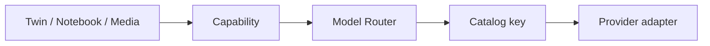

# AI Capability Model

**Program:** AI Architecture Phase 7  
**Date:** 2026-07-13  
**Status:** Active  
**Source of Truth for:** Provider-neutral capability taxonomy  
**Code:** `server/src/ai/routing/capabilityModel.ts` · types in `shared/src/types/ai-model-routing.ts`

---

## Principle

Callers request a **capability**. They do not select OpenAI/Anthropic/Local model ids. The Model Router maps capability (+ tier/privacy/policy) → catalog entry → adapter.

---

## Taxonomy

| Capability | Purpose | Default tier | Privacy |
|------------|---------|--------------|---------|
| FAST_CHAT | Low-latency chat | FAST | standard |
| BALANCED_CHAT | Default Twin chat + tools | BALANCED | standard |
| DEEP_REASONING | Hard analysis | DEEP | standard |
| LONG_CONTEXT | Large-context synthesis | DEEP | standard |
| STRUCTURED_EXTRACTION | Schema extraction | SPECIALIZED | elevated |
| STRUCTURED_SUMMARY | Notebook/page summaries | FAST | standard |
| VISION | Image understanding | SPECIALIZED | elevated |
| IMAGE_GENERATION | Image create | SPECIALIZED | standard |
| IMAGE_EDIT | Image edit | SPECIALIZED | standard |
| AUDIO_TRANSCRIPTION | STT | SPECIALIZED | elevated |
| TEXT_TO_SPEECH | TTS | SPECIALIZED | standard |
| EMBEDDINGS | Vectors | SPECIALIZED | standard |
| LOCAL_PRIVATE | No-external | LOCAL_OR_PRIVATE | local_required |

Each definition includes: required/optional features, streaming, vision, structured output, tool calling, context hint, privacy, fallback policy — see code for full fields.

