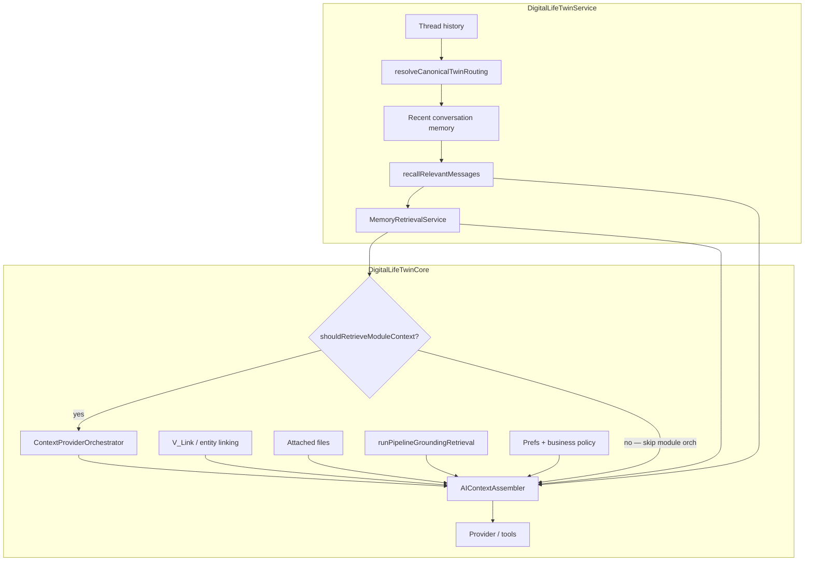

# AI context assembly (Digital Life Twin)

**Last updated:** 2026-08-25
**Audience:** Platform engineers, module authors
**Source of Truth for:** Context acquisition vs assembly behavior on the Twin path
**Related:** [AI_SYSTEM_MENTAL_MODEL.md](./AI_SYSTEM_MENTAL_MODEL.md), [AI_CANONICAL_ROUTE_MAP.md](./AI_CANONICAL_ROUTE_MAP.md), [AI_TWIN_PROMPT_PIPELINE.md](./AI_TWIN_PROMPT_PIPELINE.md), [../guides/AI_CONTEXT_PROVIDER_API.md](../guides/AI_CONTEXT_PROVIDER_API.md)

`assembleAIContext` in **`AIContextAssembler.ts`** turns heterogeneous inputs into **`AIAssembledContext`** — bounded blocks injected into provider system prompts. This is deterministic (no embeddings in the assembly path).

---

## Two layers (do not conflate)

| Layer | Question | Primary owners |
|-------|----------|----------------|
| **Context acquisition** | Where *potential* information comes from this turn? | Service memory/recall; C3-gated ContextProviders; V_Link; files; grounding prepass; tools |
| **Context selection / assembly** | What *actually* enters the model prompt? | `AIContextAssembler` + budget / `contextProfile` |

Not every request traverses every source.

---

## ContextProviders vs everything else

**ContextProviders** = module/platform **senses** (curated SoR reads via `ContextProviderOrchestrator`).

They are **not:** personal memory · conversation history · generic web retrieval · general intelligence · the whole Twin context system.

| Component | Role |
|-----------|------|
| `ContextProviderOrchestrator` | What module/platform info **can** be retrieved |
| `CrossModuleContextEngine` | Facade / entry that calls the orchestrator (when C3 retrieves) |
| `AIContextAssembler` | What bounded context **is given** to the provider/model |

---

## C3 — conditional MODULE retrieval

Core calls module orchestration only when `shouldRetrieveModuleContext(structuredResolution, hasAttachedFiles)` is true.

**Skip MODULE orchestration** only when resolution exists **and** all of:

- `responseContract === 'conversation'`
- `requiresAuthoritativeContext !== true`
- `isActionRequest !== true`
- no attached files
- `isFollowUp !== true` (F-GUARD)
- `isBroadDiscovery !== true`

Missing resolution → **retrieve** (safe default).

C3 does **not** skip: conversation history, recalled messages, UserMemoryFact, preferences, identity, V_Link attempts, file attachments, grounding prepass, tools.

**Broad discovery** blocks skip for ambiguous attention queries; it is a **safety signal**, not an attention product.

---

## Personal memory / history (P-TRUTH) — independent of C3

Loaded in **`DigitalLifeTwinService`** before Core:

| Source | When |
|--------|------|
| Current-thread history | Always (bounded) |
| Recent conversation memory | Always attempt |
| Cross-conversation recall | Explicit recall intent |
| `UserMemoryFact` | `MemoryRetrievalService` (biased when recall) |

**CURRENT IMPLEMENTATION:** Pure personal recall often keeps `requiresAuthoritativeContext = false` + `conversation` because authoritative/grounding semantics remain primarily module/file/platform-oriented. Conceptually still non-model personal truth.

---

## End-to-end flow (shipped)

---

## Module context providers (when C3 retrieves)

### Registration → fetch

1. **`ModuleAIContextRegistry`** — keywords, patterns, provider endpoints (manifest / `registerBuiltInModules.ts`).
2. **Query analysis** — keyword/pattern match or explicit `@mention`.
3. **Fetch policy** — multi-module queries may fetch high + medium relevance; sub-intent provider selection.
4. **Cache** — `ModuleInstallation.contextProviderCache` keyed by `provider:scope`.
5. **Audit** — `providerFetchAudit` for density reporting.

### Provider rules

- Auth’d, tenant-scoped, bounded result sets — see **AI_CONTEXT_PROVIDER_API.md**.
- Marketplace modules must pass certification validator (providers required).

---

## Memory and preferences

| Source | Service / path | Prompt behavior |
|--------|----------------|-----------------|
| **User memory facts** | `MemoryRetrievalService` | Explicit vs inferred tiers; expiry; provenance |
| **Recalled messages** | recall intent + message recall | When explicit recall signals |
| **UserAIContext** | `PreferenceResolver` | Only `learningStatus: active` rows prompt-eligible |
| **Learning applied** | `LearningApplicationService` | Promoted events as inferred context |
| **Preferences block** | `effectivePreferences.contextBlock` | Style + autonomy boundaries |

---

## V_Link and entity linking

`fetchVLinkPipelineContext` when catalog source **`vlink`** is enabled:

- Matches VL codes and relationship-query signals
- Returns **confirmed** vlinks the user is a member of
- Includes linked entity refs with access markers
- **Ignores** pending suggestions

`linkEntitiesAcrossModules` connects entities across module payloads; `ContextSynthesisService` may add a data-backed cross-module summary when enabled.

---

## Grounding / pipeline vs ContextProviders

| Layer | Role |
|-------|------|
| **Module ContextProviders** | Curated module SoR context for the turn (C3-gated) |
| **Grounding prepass** | Catalog-driven source/retrieval/evidence (`runPipelineGroundingRetrieval`) — can call `orchestratePipelineModuleSources` separately |
| **Assembled context** | Prompt blocks after compression/budget |
| **Pipeline** | Policy, enforcement, diagnostics — **not** primary user-outcome router |

| Platform source concept | Status |
|-------------------------|--------|
| `location`, `vlink`, `business_context` | Existing adapters (as cataloged) |
| **`web_search`** | **NOT SHIPPED** — catalog/stub / failed-attempt trace only. No live Twin web retrieval. See [`AI_EXTERNAL_CAPABILITY_MODEL.md`](./AI_EXTERNAL_CAPABILITY_MODEL.md). |
| **`google_places` / external reads** | **SHIPPED (Wave 1)** — pipeline prepass + Twin details tool; not ContextProviders. See external capability model. |

---

## Business workspace overlay

When `context.businessId` is set on `/api/ai/twin`:

- Personal `PreferenceResolver` output unchanged in personal scope
- **`loadBusinessWorkspaceBoundaryBlock`** adds business AI policies
- **`businessId` ≠ business intent** — personal/general questions may still be asked under business scope

See [AI_BUSINESS_PERSONAL_TWIN_BOUNDARIES.md](./AI_BUSINESS_PERSONAL_TWIN_BOUNDARIES.md).

---

## Budget and observability

**ContextBudgetManager** tier allocation (default ~35/25/25/15):

- High priority blocks kept; medium/low fill remaining budget
- Diversity across `sourceType` when possible
- Blocks tagged `available` vs `usedInPrompt`

**Admin visibility:** `contextDensityReport`, `POST /api/ai-context-debug/assemble`, Test Lab fields.

Default estimated-token cap: **~6000**. Logs: `[AI_CONTEXT_COMPRESSION]`, `[AI_CONTEXT_RELEVANCE]`, `[AI_CONTEXT_BUDGET]`.

---

## Context Provider Orchestrator (operational detail)

| Concern | Behavior |
|---------|----------|
| **Twin module fetch** | C3 → `CrossModuleContextEngine` → `orchestrateContextRetrieval`; legacy if `AI_CONTEXT_ORCHESTRATOR_ENABLED=false` |
| **Grounding module sources** | Prepass → `orchestratePipelineModuleSources` for mapped catalog sources |
| **No double-fetch** | Grounding skips when module payload already present for mapped modules |
| **`contextGenerationId`** | New UUID per orchestration pass |
| **Freshness** | Diagnostics `fresh` \| `stale` \| `unknown`; no SWR yet |

**Deferred:** event-driven invalidation, health ranking, Live External Truth, formal source-kind planner.

---

## Related code

| Path | Role |
|------|------|
| `server/src/ai/core/DigitalLifeTwinService.ts` | Routing + personal memory/recall before Core |
| `server/src/ai/core/DigitalLifeTwinCore.ts` | C3 gate + orchestration + generate |
| `server/src/ai/utils/shouldRetrieveModuleContext.ts` | C3 |
| `server/src/ai/context/AIContextAssembler.ts` | Main assembler |
| `server/src/ai/context/ContextBudgetManager.ts` | Token tier allocation |
| `server/src/ai/context/ContextProviderOrchestrator.ts` | Module provider selection + fetch |
| `server/src/ai/pipeline/pipelineGroundingRetrieval.ts` | Grounding prepass |
| `server/src/ai/memory/MemoryRetrievalService.ts` | Memory fact retrieval |
| `server/src/ai/preferences/PreferenceResolver.ts` | Preferences + active user context |
