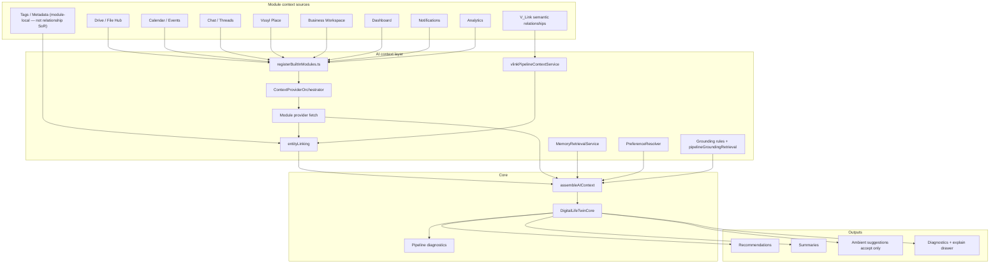
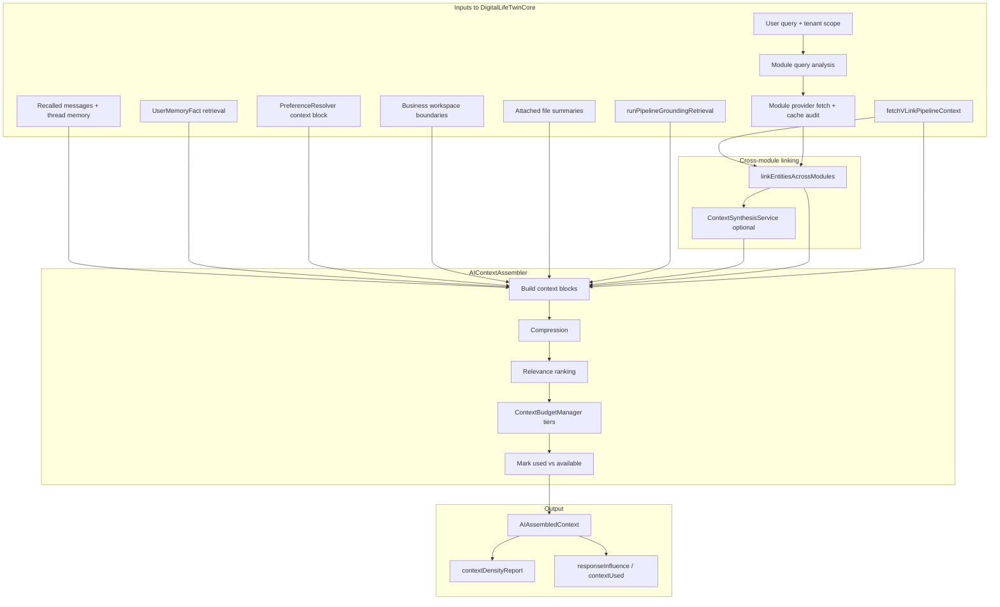

# AI context assembly (Digital Life Twin)

**Last updated:** 2026-05-26  
**Audience:** Platform engineers, module authors  
**Related:** [AI_PLATFORM_OVERVIEW.md](./AI_PLATFORM_OVERVIEW.md), [AI_TWIN_PROMPT_PIPELINE.md](./AI_TWIN_PROMPT_PIPELINE.md), [../guides/AI_CONTEXT_PROVIDER_API.md](../guides/AI_CONTEXT_PROVIDER_API.md)

`assembleAIContext` in **`AIContextAssembler.ts`** turns heterogeneous inputs into **`AIAssembledContext`** — bounded blocks injected into provider system prompts. This is deterministic (no embeddings in the assembly path).

---

## Module context sources → AI context layer

How registered modules and platform sources feed the twin. **`CrossModuleContextEngine`** delegates module provider fetch to **`ContextProviderOrchestrator`** (Phase A) when `AI_CONTEXT_ORCHESTRATOR_ENABLED` is not `false`. Assembly still flows through **`entityLinking`** + **`AIContextAssembler`**.

---

## End-to-end assembly flow

---

## Module context providers

### Registration → fetch

1. **`ModuleAIContextRegistry`** — keywords, patterns, provider endpoints (from module manifest / `registerBuiltInModules.ts`).
2. **Query analysis** — keyword/pattern match or explicit `@mention` (todo, notes, place, drive, …).
3. **Fetch policy** — multi-module queries may fetch high + medium relevance modules; sub-intent provider selection.
4. **Cache** — `ModuleInstallation.contextProviderCache` keyed by `provider:scope` (migration `20260521190000_module_context_provider_cache`).
5. **Audit** — each fetch records attempt/success/fail/cache in `providerFetchAudit` for density reporting.

### Provider rules

- Auth’d, tenant-scoped, bounded result sets — see **AI_CONTEXT_PROVIDER_API.md**.
- Marketplace modules must pass certification validator 1.1.0 (providers required).

---

## Memory and preferences

| Source | Service / path | Prompt behavior |
|--------|----------------|-----------------|
| **User memory facts** | `MemoryRetrievalService`, resolver | Explicit vs inferred tiers; expiry; provenance badges in UI |
| **Recalled messages** | recall intent + semantic recall | Injected when query signals explicit recall |
| **UserAIContext** | `PreferenceResolver` | Only `learningStatus: active` rows are prompt-eligible |
| **Learning applied** | `LearningApplicationService` | Promoted events consumed as inferred context |
| **Preferences block** | `effectivePreferences.contextBlock` | Communication style + autonomy boundaries (not autonomous actions) |

---

## V_Link and entity linking

### V_Link pipeline context

`fetchVLinkPipelineContext` runs when catalog source **`vlink`** is enabled:

- Matches VL codes and relationship-query signals in the user message
- Returns **confirmed** vlinks the user is a member of
- Includes linked entity refs with `full` vs `restricted` access markers
- **Ignores** pending suggestions (`suggestionsIgnored` counted in trace)

### Entity linking v1

`linkEntitiesAcrossModules` connects entities across module payloads:

- Chat ↔ calendar people
- Chat ↔ drive files
- **Persisted V_Links** from `toPersistedVLinksForEntityLinking`

`ContextSynthesisService` (when `AI_SYNTHETIC_CONTEXT_ENABLED`) may add a data-backed **Cross-module summary** block.

---

## Budget and observability

**ContextBudgetManager** tier allocation (default ~35/25/25/15):

- **High** priority blocks always kept
- **Medium/low** fill remaining estimated-token budget by relevance
- **Diversity** — avoid dropping every block from one `sourceType` when budget allows
- Blocks tagged **`available`** vs **`usedInPrompt`**; drop reasons logged

**Admin visibility:**

- `contextDensityReport` on pipeline trace
- `POST /api/ai-context-debug/assemble` dry-run
- Test Lab exposes `crossModuleSynthesis`, `referencesMultipleModules`
- Dev flag: `NEXT_PUBLIC_AI_CONTEXT_DENSITY_DEBUG`

Default estimated-token cap: **~6000** (~4 chars/token heuristic). Logs: `[AI_CONTEXT_COMPRESSION]`, `[AI_CONTEXT_RELEVANCE]`, `[AI_CONTEXT_BUDGET]`.

---

## Business workspace overlay

When `context.businessId` is set on `/api/ai/twin`:

- Personal `PreferenceResolver` output unchanged in scope
- **`loadBusinessWorkspaceBoundaryBlock`** adds “Business workspace AI policies” (`sourceType: business`)
- Does **not** write to personal `AIPersonalityProfile`

See [AI_BUSINESS_PERSONAL_TWIN_BOUNDARIES.md](./AI_BUSINESS_PERSONAL_TWIN_BOUNDARIES.md).

---

## Context Provider Orchestrator (Phase A/B)

| Concern | Behavior |
|---------|----------|
| **Twin module fetch** | `CrossModuleContextEngine` → `orchestrateContextRetrieval`; legacy path if `AI_CONTEXT_ORCHESTRATOR_ENABLED=false`. |
| **Grounding module sources** | `runPipelineGroundingRetrieval` → `orchestratePipelineModuleSources` for `vssyl_place`, `drive_files`, `calendar` only. |
| **No double-fetch** | Grounding skips orchestration when `existingModuleContexts` already has `place` / `drive` / `calendar` payload. |
| **Platform sources** | `location` (IP geolocation), `vlink` (`fetchVLinkPipelineContext`), `web_search`, `business_context` stay on existing adapters. |
| **`contextGenerationId`** | New UUID per orchestration pass; twin retains ≤2 in `contextGenerations[]`. |
| **Lazy `fullContext`** | User context bundle loaded only when needed (default off for provider-only passes). |
| **Freshness (Phase B)** | Diagnostics: `fresh` \| `stale` \| `unknown` from cache age vs `maxAgeMs`; `staleContextWarnings[]`. No invalidation/SWR. |
| **Required failures** | Always in `requiredSourceFailures`; enforcement block unchanged. |

**Grounding map:** `pipelineSourceProviderMap.ts` + provider `pipelineSourceIds` in registry.

**Diagnostics:** `contextDensityReport.orchestration`, `mapPipelineTraceInputs`, `ai-context-debug` route.

**Orchestration snapshots (Phase B.5):** `AIOrchestrationSnapshot` logged and attached to density/trace (`orchestration.snapshots`); metadata only. Optional `orchestratorVersion` (replay compatibility) and `traceTags` (lightweight filter labels) are additive — see `AI_CONTEXT_PROVIDER_API.md`.

**Deferred (Phase C+):** event-driven invalidation, health ranking, SWR, websocket refresh, Active Context Graph, embeddings, dedicated snapshot DB table.

---

## Grounding prepass vs assembled context

| Layer | What it is | Examples |
|-------|------------|----------|
| **Grounding prepass** | Structured retrieval before/assembled alongside blocks | IP location, Place discoveries, V_Link confirmed links |
| **Assembled context** | Prompt blocks after compression/budget | Module summaries, memory, preferences, synthesis |
| **Pipeline trace** | Diagnostics comparing required vs performed | `retrievalPerformed`, `contextUsed`, evidence bundle |

Grounding enforcement (block/disclose/regenerate) uses trace output — see [AI_PIPELINE_ADMIN_TOOLS.md](./AI_PIPELINE_ADMIN_TOOLS.md).

**Tags vs relationships:** Module-local tags (`Task.tags`, etc.) are **not** relationship federation inputs unless a module provider explicitly exports them. Cross-module grouping for AI uses **V_Link** (`vlink` source) and module operational links via providers — see [RELATIONSHIP_READ_FEDERATION_CONTRACT.md](./RELATIONSHIP_READ_FEDERATION_CONTRACT.md).

---

## Related code

| Path | Role |
|------|------|
| `server/src/ai/context/AIContextAssembler.ts` | Main assembler |
| `server/src/ai/context/ContextBudgetManager.ts` | Token tier allocation |
| `server/src/ai/context/ContextSynthesisService.ts` | Cross-module synthesis |
| `server/src/ai/context/entityLinking.ts` | Entity link graph |
| `server/src/ai/context/vlinkPipelineContextService.ts` | V_Link pipeline source |
| `server/src/ai/context/ContextProviderOrchestrator.ts` | Intent-aware provider selection + fetch |
| `server/src/ai/context/pipelineSourceProviderMap.ts` | Catalog source id → module/provider |
| `server/src/ai/pipeline/pipelineGroundingRetrieval.ts` | Grounding prepass (orchestrator for module sources) |
| `server/src/ai/memory/MemoryRetrievalService.ts` | Memory fact retrieval |
| `server/src/ai/preferences/PreferenceResolver.ts` | Preferences + active user context |
