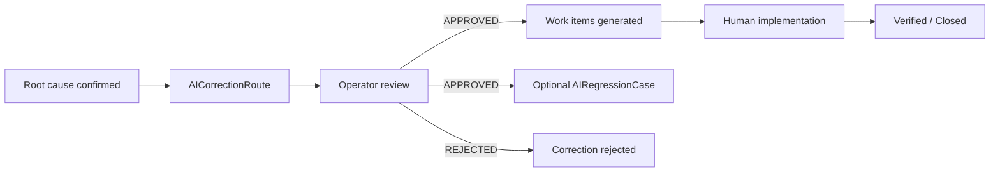

# AI Correction Workflow

> **Scope note (Phase 6B):** This document is the **operator / Pipeline Hub** governed correction-proposal workflow (Phase 6). Corrections never mutate Twin runtime.  
> For the **end-user Teach Vssyl / in-chat Improve answer UX design** (not yet shipped), see [`../ai-knowledge/AI_CORRECTION_WORKFLOW.md`](../ai-knowledge/AI_CORRECTION_WORKFLOW.md).

**Program:** AI Architecture Phase 6  
**Date:** 2026-07-13  
**Status:** Active  
**Source of Truth for:** Governed correction proposals (never direct runtime mutation)  
**Companions:** [`AI_EVALUATION_WORKFLOW.md`](./AI_EVALUATION_WORKFLOW.md) · [`AI_CORRECTION_ROUTING.md`](./AI_CORRECTION_ROUTING.md) · [`AI_RESOLUTION_WORKFLOW.md`](./AI_RESOLUTION_WORKFLOW.md)

---

## Principle

Every correction is a **governed proposal**. Approving a proposal does not rewrite prompts, routing, Twin reasoning, grounding, tools, or knowledge. Implementation happens out-of-band via work items; runtime changes require separate governed engineering processes.

---

## Proposal model

Store: `AICorrectionRoute` (Phase 3+) with Phase 6 `historyJson` and linked `AICorrectionWorkItem` rows.

Typical destinations (examples): Prompt Policy · Routing Policy · Knowledge · Business Configuration · Personal Memory · Tool · Context Provider · Grounding · Business Data.

Each proposal tracks: owner, status, routing approval, destinations / overrides, related execution, evaluation, regressions, work items.

---

## Approval behavior

On `routingApprovalStatus = APPROVED`:

1. Generate internal work items from destinations (`correctionWorkItemService`)  
2. Advance linked evaluation to `CORRECTION_APPROVED`  
3. Optionally auto-create `AIRegressionCase` (default on; disable with `createRegression: false`)  
4. Notify assigned owner  

Work-item kinds map destinations → `ENGINEERING` / `KNOWLEDGE_REVIEW` / `PROMPT_REVIEW` / `BUSINESS_REVIEW` / etc. No external ticketing.

---

## Surfaces

| Layer | Location |
|-------|----------|
| Routing taxonomy | `correctionRouting.ts` |
| Workflow | `operationsWorkflowService.updateCorrectionRoute` |
| Work items | `correctionWorkItemService.ts` |
| API | `PATCH /corrections/:id`, `GET /corrections/:id/work-items`, `PATCH /work-items/:id` |
| UI | Pipeline corrections list + execution workflow panel |
