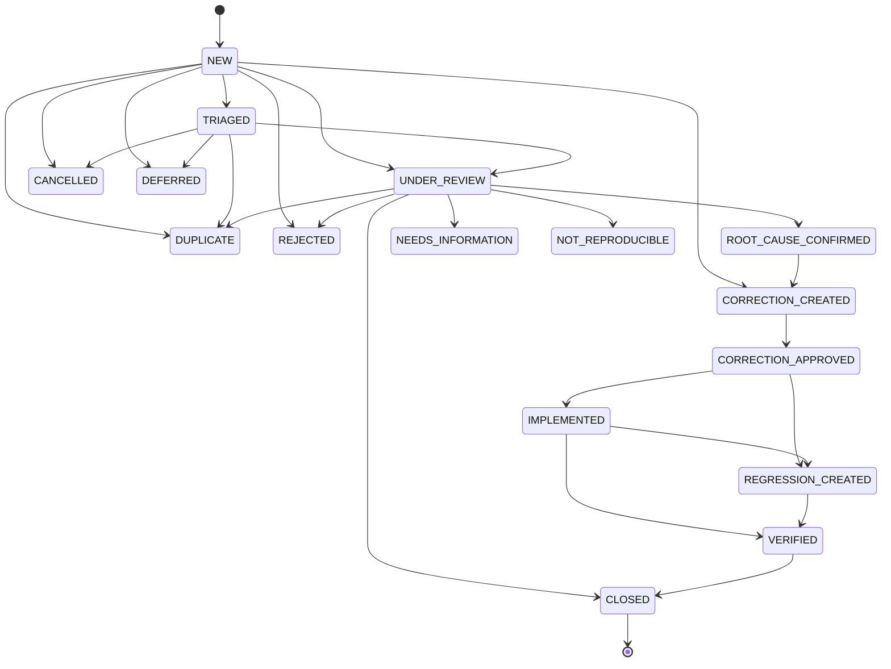

# AI Evaluation Workflow

**Program:** AI Architecture Phase 6  
**Date:** 2026-07-13  
**Status:** Active  
**Source of Truth for:** Operator evaluation lifecycle (human workflow after an AI response is judged wrong)  
**Companions:** [`AI_CORRECTION_WORKFLOW.md`](./AI_CORRECTION_WORKFLOW.md) · [`AI_REVIEW_WORKFLOW.md`](./AI_REVIEW_WORKFLOW.md) · [`AI_RESOLUTION_WORKFLOW.md`](./AI_RESOLUTION_WORKFLOW.md) · [`AI_EVALUATION_ARCHITECTURE.md`](./AI_EVALUATION_ARCHITECTURE.md)

---

## Principle

Evaluation never modifies Twin runtime. `AIEvaluation.mutatesRuntime` remains `false`. Phase 6 completes the **human** lifecycle on top of Phase 3–4 models — one `workflowStatus` field, extended vocabulary, enforced transitions.

---

## Lifecycle

Terminal / diversion statuses: `DUPLICATE`, `REJECTED`, `CANCELLED`, `DEFERRED`, `NEEDS_INFORMATION`, `NOT_REPRODUCIBLE`, `ARCHIVED`, `CLOSED`.

Phase 4 aliases (`PENDING`, `ASSIGNED`, `RESOLVED`, …) normalize for display via `normalizeEvaluationWorkflowStatus`.

---

## Surfaces

| Layer | Location |
|-------|----------|
| State machine | `server/src/ai/operations/evaluationWorkflowStateMachine.ts` |
| Workflow service | `operationsWorkflowService.updateEvaluationWorkflow` |
| API | `PATCH /api/admin/ai/operations/evaluations/:id` |
| UI | Pipeline Hub execution detail → `EvaluationWorkflowPanel` |

---

## Operator path

1. Locate execution in AI Pipeline  
2. Create evaluation (labels + notes) → `NEW`  
3. Assign / triage → `TRIAGED` / `UNDER_REVIEW`  
4. Confirm root causes → `ROOT_CAUSE_CONFIRMED`  
5. Correction proposals appear (or advance to `CORRECTION_CREATED`)  
6. Approve correction → `CORRECTION_APPROVED` (+ optional regression → `REGRESSION_CREATED`)  
7. Mark implemented / verified → close with resolution code  

All updates append `historyJson` and optional comments. Assignment / review / verification requests emit notifications.
