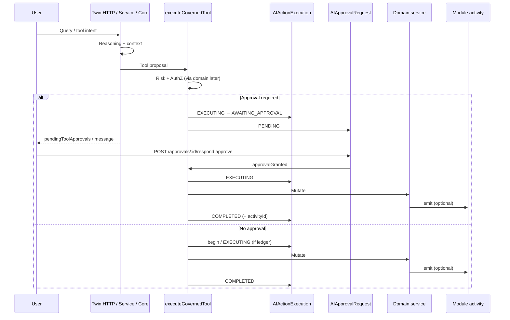
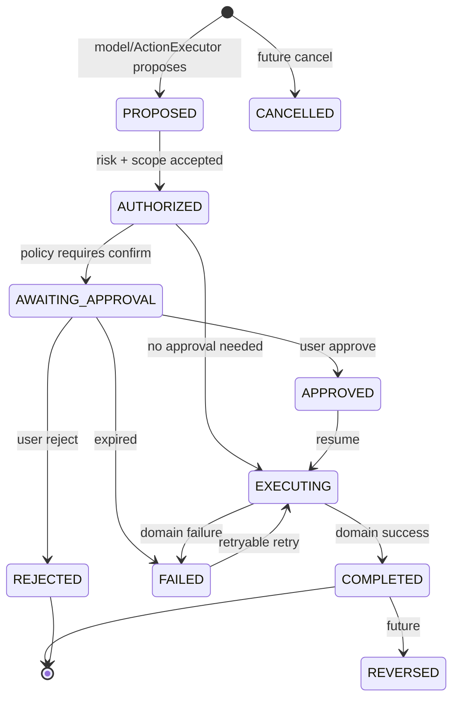

# AI Execution Lifecycle

**Program:** AI Architecture Phase 2  
**Date:** 2026-07-12  
**Status:** Active — official mutation lifecycle  

---

## Official lifecycle

---

## State machine

Statuses are defined in `AIActionExecutionStatus` (`shared`).

---

## Stages (normative)

1. **User request** — Twin query or legacy action payload  
2. **Reasoning** — conversation reasoning / intent (does not authorize)  
3. **Tool / action proposal** — model tool-call or ActionExecutor action  
4. **Authorization** — proven at domain service boundary  
5. **Risk classification** — `aiToolRiskRegistry` / `legacyActionRiskRegistry`  
6. **Approval (optional)** — `AIApprovalRequest` + ledger `AWAITING_APPROVAL`  
7. **Execution** — domain mutation exactly once under idempotency key  
8. **Activity** — module SoR activity when domain emits; link `activityId` when available  
9. **Notification** — product optional; not required for execution correctness  
10. **Learning signal** — separate from execution (do not conflate)  
11. **Complete** — ledger `COMPLETED` / `FAILED` / `REJECTED`  

---

## Identity

One execution identity: **`AIActionExecution.id` (`executionId`)**.

- Approvals reference it in `actionData.executionId` and `approvalId` on the ledger row  
- Activity may be linked via `activityId`  
- Notifications (if any) should prefer `approvalId` + `executionId`  

Do not create a second parallel execution record for the same mutation.
