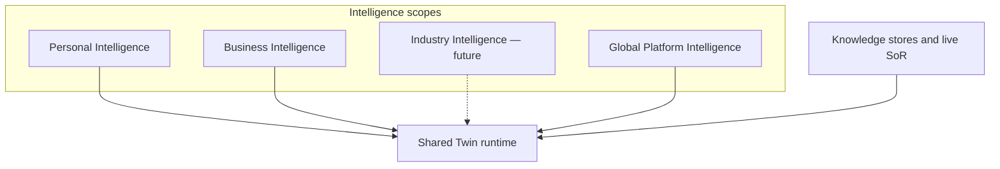

# AI Intelligence Model

**Program:** AI Architecture Phase 0  
**Date:** 2026-07-12  
**Status:** Active — constitutional model for intelligence scopes  
**Owner:** AI Platform / Architecture council  
**Source of Truth for:** Personal / Business / Industry / Global intelligence scopes; Knowledge vs Intelligence distinction  
**Supporting:** [`AI_SYSTEM_MENTAL_MODEL.md`](./AI_SYSTEM_MENTAL_MODEL.md) · [`../ai-knowledge/AI_KNOWLEDGE_CONSTITUTION.md`](../ai-knowledge/AI_KNOWLEDGE_CONSTITUTION.md) · [`AI_PLATFORM_CONSTITUTION.md`](./AI_PLATFORM_CONSTITUTION.md)  
**Implementation note:** Industry Intelligence is **future architecture**. Do not treat as shipped.

---

## Purpose

Define how Vssyl thinks about **intelligence** at four scopes, and permanently separate that idea from **knowledge**.

This document does **not** implement industry packs, global training, or new services.

---

## Knowledge vs Intelligence (non-negotiable)

| | **Knowledge** | **Intelligence** |
|---|---------------|------------------|
| **What it is** | Information that may influence an answer | Capability to reason, route, ground, evaluate, and act safely over information |
| **Examples** | “I prefer morning meetings”; a Drive file; a business leave policy | Choosing which sources to fetch; conversation posture; grounding enforcement; evals; prompt quality |
| **Ownership** | User, business, or Application SoR | Platform (and policies that constrain it) |
| **Durability** | Often durable with review/deletion | Improves over time as platform quality; not a private fact store |
| **Must not** | Be silently inferred into lasting influence without governance | Become a excuse to collect private knowledge “for the model” |

**Rule:** Improving Global Platform Intelligence must **not** mean copying personal or business knowledge into a shared corpus.

Knowledge ingress philosophy: [`../ai-knowledge/AI_KNOWLEDGE_DECISION_MODEL.md`](../ai-knowledge/AI_KNOWLEDGE_DECISION_MODEL.md).  
Knowledge composition runtime: Knowledge Engine under `server/src/knowledge/` (see audit + Knowledge Constitution).

---

## Four intelligence scopes

Shared runtime + **scoped knowledge**. Intelligence scopes change *what is eligible* and *which policies apply*, not whether there is a separate LLM product per scope.

---

### 1. Personal Intelligence

**Purpose:** Help the individual user.

| Aspect | Description |
|--------|-------------|
| Learns | The individual — with governance |
| Includes | Personal memory, preferences, relationships the user owns, private taught knowledge |
| Boundary | Must not leak into other users or other businesses |
| Runtime | Personal Twin surfaces over shared runtime |
| Status | **Active** (maturity varies by surface) |

---

### 2. Business Intelligence

**Purpose:** Help the organization and its members under policy.

| Aspect | Description |
|--------|-------------|
| Learns | The organization — under admin and membership rules |
| Includes | Protected business knowledge, business AI policies, workflows, employee assistance context |
| Boundary | Business-scoped; employees see only what membership and policy allow |
| Runtime | Business Twin wrapper over shared runtime |
| Status | **Active** (control center + employee interact) |

Business protection is a first-class requirement: isolation, policy blocks, and no silent promotion of personal knowledge into business knowledge (or the reverse) without explicit product rules.

---

### 3. Industry Intelligence (future)

**Purpose:** Reusable **industry knowledge packs** that encode common patterns for a vertical (for example retail scheduling norms, clinic intake vocabulary) without becoming any one customer’s private data.

| Aspect | Description |
|--------|-------------|
| Fits how | Packs would be **versioned, reviewable, optional** knowledge/policy overlays — not automatic training on tenant data |
| Runtime fit | Would inject as governed context sources or catalogs into the shared runtime |
| Must not | Train vendor models on customer content; silently merge tenant secrets into packs |
| Status | **Future architecture only — not implemented** |

Phase 0 records the slot in the mental model so future work does not invent a conflicting “fifth AI.”

---

### 4. Global Platform Intelligence

**Purpose:** Make Vssyl better for everyone as a product.

| Improves | Does **not** collect |
|----------|----------------------|
| Reasoning quality, routing policy, grounding rules | Private personal knowledge |
| Prompts, workflows, safety | Private business knowledge |
| Evaluations, regression quality | Customer Systems of Record as a shared brain |

Global improvement uses **operator controls, evals, anonymized quality signals (where product policy allows), and engineering** — not a centralized private-knowledge warehouse. The retired `/api/centralized-ai` plane must not be revived as “global intelligence = harvest tenant data.”

**Status:** Partially realized via pipeline catalog, diagnostics, eval specs, and platform engineering — not a separate customer-facing “Global Twin.”

---

## How scopes interact with Knowledge

| Scope | Typical knowledge it may use |
|-------|------------------------------|
| Personal | UserMemoryFact, UserAIContext, personal module SoR |
| Business | BusinessAIDigitalTwin policy, business-scoped module SoR |
| Industry (future) | Curated pack content, not live tenant secrets |
| Global | Platform rules, catalogs, eval fixtures — not tenant PII |

Live Application data remains **Systems of Record** and is retrieved, not duplicated into intelligence layers.

---

## What is *not* an intelligence scope

| Concept | Why it is not a scope |
|---------|------------------------|
| Model provider (OpenAI/Anthropic) | Adapter under Model Routing |
| AI Pipeline admin hub | Operator plane for the shared runtime |
| Ambient suggestions | Experience feature on a parallel path |
| Notebook AI helper | Specialized completion path |
| “Centralized AI” legacy | Deprecated/fenced — do not use as a scope name |

---

## Acceptance (Phase 0)

This Intelligence Model is **accepted** as constitutional guidance for documentation and future design. Industry packs and ModelTier routing remain **deferred** for later phases.
