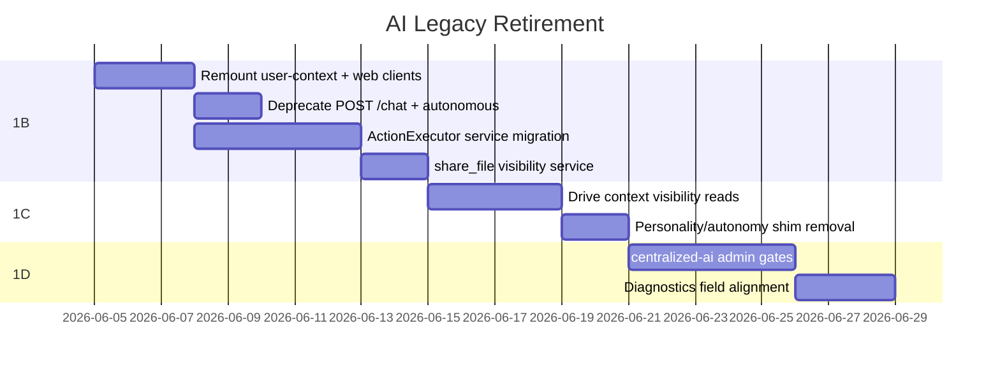

# AI Legacy Retirement Plan

**Wave:** AI Platform **1A** (plan) → **1B** ✅ → **1C–1E** (pending)  
**Last updated:** 2026-06-10  
**Parent:** [AI_LEGACY_DUPLICATION_REGISTER.md](./audits/AI_LEGACY_DUPLICATION_REGISTER.md), [AI_CANONICAL_ROUTE_MAP.md](./AI_CANONICAL_ROUTE_MAP.md)

Disposition-only in 1A. No routes removed in this wave.

---

## Severity definitions

| Level | Meaning |
|-------|---------|
| **P1** | Blocks AI Platform L1→L2; constitutional V1/V2 or route shadow breaking live UX |
| **P2** | Documented duplication or fence gap; fix before L2 review completion |
| **P3** | Scaffold, admin UX overlap, or low-traffic legacy; safe to defer |

## Target waves

| Wave | Scope |
|------|-------|
| **1B** | P1 executors, route mount fix, autonomous sunset, legacy chat deprecation |
| **1C** | Context provider service consolidation (Drive Prisma) |
| **1D** | Diagnostics truth, centralized-ai admin gates, learning fence |
| **1E** | Provider capability matrix hardening |
| **Future** | Delete scaffold handlers, legacy engine removal |

---

## Legacy retirement matrix

| Surface | Canonical | Legacy | Severity | Remove In |
|---------|-----------|--------|----------|-----------|
| **User context GET** | `GET /api/ai/user-context` | `GET /api/ai/context` twin aggregate only | **P1** | ✅ **1B done** |
| **User context CRUD mount** | `/api/ai/user-context/*` | Legacy `/api/ai/context` (non-GET) | **P1** | ✅ **1B done** |
| **Twin aggregate context** | `GET /api/ai/context` | Unambiguous vs user CRUD | P1 | ✅ **1B done** |
| **Context id vs module param** | `GET /api/ai/user-context/:id` | UUID guard on `/:module` | **P1** | ✅ **1B done** |
| **Conversational entry** | `POST /api/ai/twin` | `POST /api/ai/chat` deprecated | **P1** | ✅ **1B done** |
| **Drive tool actions** | `driveAIActionService` | ~~Mock controllers~~ | **P1** | ✅ **1B done** |
| **HR / Scheduling actions** | `hrAIActionService` / `schedulingAIActionService` | ~~Mock controllers~~ | **P1** | ✅ **1B done** |
| **share_file tool** | `grantFileShareByEmail` | ~~Prisma in toolExecutor~~ | **P1** | ✅ **1B done** |
| **Autonomous writes** | Twin + approvals | `/api/ai/autonomous/*` → **410** | **P1** | ✅ **1B done** |
| **Drive context provider** | `listAccessibleDriveFiles` / visibility service | `driveAIContextController` direct Prisma | **P1** | **Wave 1C** (P1-3) |
| **Personality API** | `/api/ai/personality/*` router | `GET/PUT /api/ai/personality` on `ai.ts` | P2 | **Wave 1C** |
| **Autonomy API** | `/api/ai/autonomy/*` router | `GET/PUT /api/ai/autonomy` on `ai.ts` | P2 | **Wave 1C** |
| **Twin approvals** | `/api/ai/approvals` | `/api/ai/autonomous/approval/*` | P2 | **Wave 1B** disable autonomous |
| **Learning pipelines** | `/api/ai/learning/*` (twin) | `/api/centralized-ai/learning/*` | P2 | **Wave 1D** |
| **User insights** | `/api/ai/insights` | `/api/centralized-ai/insights` | P3 | **Wave 1D** |
| **Context debug** | `/api/admin-portal/ai-pipeline/diagnostics` | `/api/ai-context-debug/*` | P3 | **Wave 1D** |
| **centralized-ai scaffold** | Admin portal pages (fenced) | 97 routes in `ai-centralized.ts` | P2 | **Wave 1D** gate + **Future** prune |
| **centralized-ai auth** | `requireAdmin` on all mutating routes | JWT-only handlers | P2 | **Wave 1D** |
| **Provider legacy routing** | `ContextProviderOrchestrator` | `legacyProviderCanHandle.ts` | P3 | **Future** |
| **CrossModuleContextEngine** | Orchestrator path | Direct engine call sites | P2 | **Wave 1C** review |
| **AIProviderTest.tsx** | Admin test-lab | Dev component | P3 | **Future** |
| **AI save-to-drive** | `driveUploadService` | Direct route persistence in `ai.ts` | P2 | **Wave 1B** follow-up |
| **Household/dashboard stubs** | Real services or explicit N | Synthetic success in `ActionExecutor` | P2 | **Wave 1B** document + stub guard |

---

## P1 retirement candidates (summary)

Nine surfaces must clear before **AI Platform Level 2** per [AI_PLATFORM_CERTIFICATION_STRATEGY.md](./AI_PLATFORM_CERTIFICATION_STRATEGY.md):

1. **P1-2** — `GET /api/ai/context` collision (user CRUD vs twin aggregate)  
2. **P1-2b** — `/:module` vs `/:id` param ambiguity  
3. **P1-1** — `ActionExecutor` mock req/res (Drive, HR, Scheduling)  
4. **P1-4** — `share_file` direct Prisma in `toolExecutor`  
5. **P1-5** — `AutonomousActionExecutor` + `/api/ai/autonomous`  
6. **P1-3** — Drive context provider Prisma (scheduled **1C**, tracked as P1 dependency)  
7. Legacy **`POST /api/ai/chat`**  
8. **Autonomous execute/approval** routes  
9. **Web client** paths assuming user-context on `GET /api/ai/context`

---

## Retirement sequence (recommended)

---

## Client migration checklist (1B)

| Client file | Current path | Target path |
|-------------|--------------|-------------|
| `web/src/components/ai/CustomContext.tsx` | `/api/ai/context` | `/api/ai/user-context` |
| `web/src/components/ai/AIMemoriesView.tsx` | `/api/ai/context` | `/api/ai/user-context` |
| `web/src/api/aiContextLearning.ts` | `/api/ai/context/pending`, `/:id/review` | `/api/ai/user-context/...` |

**Server:** Remount `aiUserContextRouter` at `/api/ai/user-context`; add 308/deprecated response on old CRUD paths optional in 1B.

---

## centralised-ai fence policy

Until prune (**Future**):

1. No new user-facing features may call `/api/centralized-ai/*`.  
2. Admin portal pages remain allowed (grep-confirmed callers only).  
3. Wave **1D** adds `requireAdmin` to all non-health centralized routes.  
4. Operation matrix row R-06 updated when learning ownership is decided.

---

## Register cross-reference

| Register ID | Retirement row |
|-------------|----------------|
| R-01 | centralized-ai fence |
| R-02 | User context remount |
| R-03 | POST /chat |
| R-04 | Personality/autonomy shims |
| R-05 | autonomous.ts |
| R-06 | Learning dual pipeline |
| E-01 | ActionExecutor mocks |
| E-03 | AutonomousActionExecutor |
| C-05 | Drive context Prisma |

---

## Wave 1A sign-off

| Criterion | Met |
|-----------|-----|
| Every legacy item has Canonical + Legacy + Severity + Wave | Yes |
| P1 items enumerated for 1B | Yes |
| No runtime retirement in 1A | Yes |

**Execution:** [AI_WAVE_1B_EXECUTION_PLAN.md](./AI_WAVE_1B_EXECUTION_PLAN.md)
