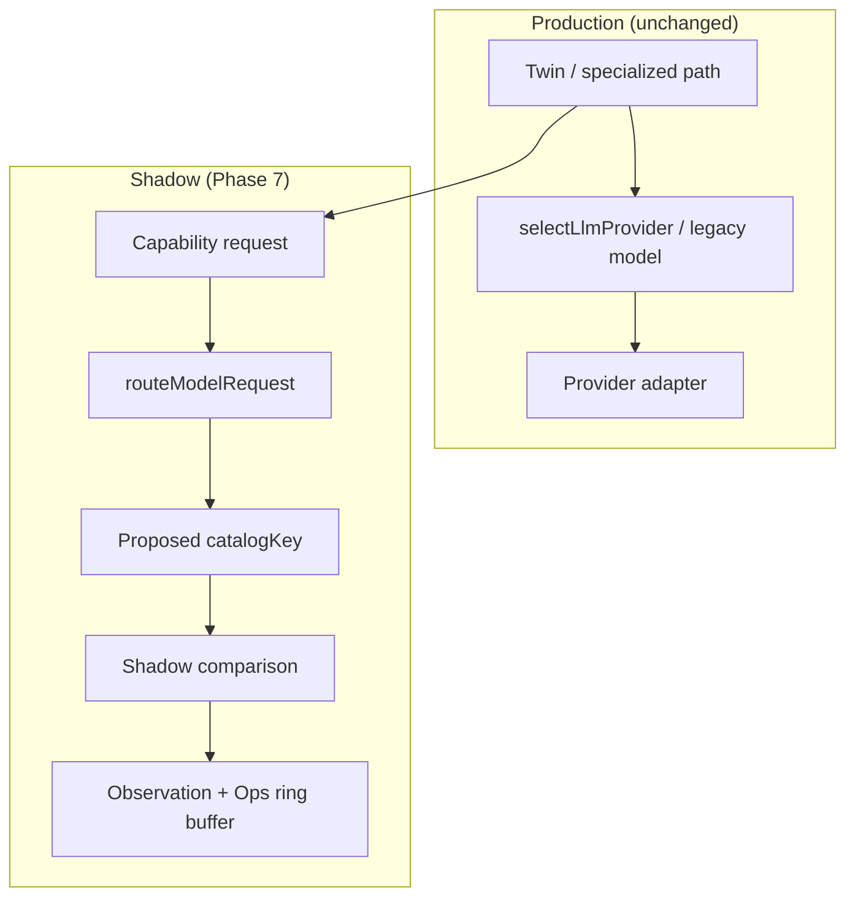

# AI Model Router Architecture

**Program:** AI Architecture Phase 7  
**Date:** 2026-07-13  
**Status:** Active  
**Source of Truth for:** Model Router + Shadow Mode architecture  
**Companions:** [`AI_CAPABILITY_MODEL.md`](./AI_CAPABILITY_MODEL.md) · [`AI_ROUTING_TIERS.md`](./AI_ROUTING_TIERS.md) · [`AI_MODEL_CATALOG.md`](./AI_MODEL_CATALOG.md) · [`AI_ROUTING_POLICY.md`](./AI_ROUTING_POLICY.md) · [`AI_MODEL_ROUTING_AUDIT.md`](./AI_MODEL_ROUTING_AUDIT.md)

---

## Absolute principle

Twin, Business Twin, Execution, Knowledge, Observation, Evaluation, and Operations **must not own provider model names** for routing decisions. They ask for capabilities. The Model Router decides. Adapters execute.

Phase 7 ships **Shadow Mode**: production selection path is unchanged; the router proposes and records comparisons.

---

## Components

| Component | Path |
|-----------|------|
| Router | `server/src/ai/routing/modelRouter.ts` |
| Catalog | `canonicalModelCatalog.ts` |
| Shadow | `shadowRouting.ts` + `shadowRingBuffer.ts` |
| Live seam | `providers/providerRouting.selectLlmProvider` (attaches shadow) |
| Ops API | `GET /api/admin/ai/operations/routing/overview|shadow` |
| Ops UI | `/admin-portal/ai-pipeline/model-routing` |
| Observation | `ModelRoutingShadowCompared` (+ pipelineTrace `llmProviderRouting.shadowComparison`) |

---

## Flow

---

## Inputs → outputs

**Inputs:** capability, tier, privacy, business policy, user preference, availability signals  

**Outputs:** selected provider, catalogKey, providerModelId (adapter), fallback chain, reason, confidence  

Router **does not** execute LLM calls.

---

## Integration rules

1. Do not rewrite Twin Core orchestration — live pick stays in `selectLlmProvider`.  
2. Specialized paths keep legacy native models; emit capability shadow only.  
3. Observation reuses existing emitter; no new telemetry product.  
4. Pipeline Model Routing page is observe-only (no policy edit).
