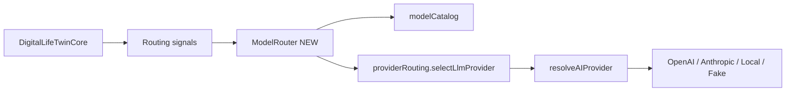

# AI Model Routing Readiness

**Program:** AI Architecture Phase 6B  
**Date:** 2026-07-13  
**Status:** Active — readiness assessment only (**do not implement** Model Routing here)  
**Companion:** [`../ai-system-audit/AI_MODEL_ROUTING_TARGET_ARCHITECTURE.md`](../ai-system-audit/AI_MODEL_ROUTING_TARGET_ARCHITECTURE.md) · [`AI_PLATFORM_ARCHITECTURE_CERTIFICATION.md`](./AI_PLATFORM_ARCHITECTURE_CERTIFICATION.md)

---

## Verdict

**The platform is ready to begin Phase 7 — Model Routing Engine.**

Integrate at existing seams. Do **not** rewrite Twin Core, prompts, observation, evaluation, or execution governance.

---

## Where abstractions already exist

| Seam | Path | Role in Phase 7 |
|------|------|-----------------|
| Model catalog | `server/src/ai/providers/modelCatalog.ts` | Map tiers → concrete model IDs (config) |
| Provider routing | `server/src/ai/providers/providerRouting.ts` | Select provider + fallback + vision adjust |
| Capability matrix | `providerCapabilityMatrix.ts` | Capability gates |
| Factory | `aiProviderFactory.ts` / `resolveAIProvider` | Process-level provider resolution + FakeAI |
| Twin model override | Twin Core validates optional model against catalog | User/pref override entry |
| Public models API | `GET /api/ai/models` | Catalog exposure |

Target design (tiers FAST / BALANCED / DEEP / SPECIALIZED / LOCAL_OR_PRIVATE) remains in the audit target architecture — **not shipped**.

---

## Where provider coupling still exists

| Area | Coupling | Phase 7 action |
|------|----------|----------------|
| `OpenAIProvider` defaults | Hardcoded `gpt-4o`, `gpt-4o-mini`, image models | Defaults become catalog/config |
| `AnthropicProvider` default | Hardcoded Claude Sonnet id | Same |
| Capability matrix vision models | Hardcoded vision model ids | Move to catalog SPECIALIZED |
| Twin Core | Calls routing helpers directly | Inject `ModelRouter.route(signals)` behind same helpers |
| Business Twin | Shares Core path | Inherit routing automatically if Core seam is correct |

---

## Where hardcoded model names exist (SPECIALIZED / bypass)

| Location | Example | Notes |
|----------|---------|-------|
| `routes/ai.ts` | `whisper-1` | Transcription — SPECIALIZED(media) |
| `notebookAICompletion.ts` | `gpt-4o-mini` / env override | **Bypasses Twin routing** |
| `factExtractionService.ts` | `gpt-4o` | Outside Twin |
| `documentExtractionService.ts` | `gpt-4o` | Outside Twin |
| Image gen/edit paths | DALL·E / gpt-image | SPECIALIZED(media) |

Phase 7 should either (a) register these as SPECIALIZED routes in the router, or (b) explicitly document permanent exemptions.

---

## Where routing will integrate (recommended)

**Do not** place Model Routing inside:

- Observation collectors  
- Evaluation workflow  
- Correction proposals  
- Knowledge composition  
- Approval policy  

Those systems consume outcomes; they do not choose models.

---

## Provider assumptions to retire carefully

1. “Chat always goes through OpenAI default unless preferred otherwise.”  
2. “Notebook and Twin share no routing policy.” (true today — fix or exempt explicitly)  
3. “Vision model is a constant string in the matrix.”  
4. “Fallback is provider-brand first rather than tier-first.” (target architecture is tier-first)

---

## Readiness checklist

| Check | Status |
|-------|--------|
| Twin chat uses factory + routing | Pass |
| Catalog exists for chat models | Pass |
| Fallback tests exist | Pass (`providerFallbackPhase1`, routing tests) |
| FakeAI seam for tests | Pass |
| Observation independent of provider brand | Pass |
| Evaluation independent of provider brand | Pass |
| All modality paths on catalog | **Fail** — notebook/whisper/extraction |
| Tier policy (FAST/BALANCED/DEEP) shipped | **Fail** — design only |
| Twin Core free of new routing god-logic | Required constraint for Phase 7 |

---

## Recommended Phase 7 scope (preview only)

1. Introduce `ModelRouter` (or equivalent) behind `providerRouting` / catalog.  
2. Configuration for tier → model/provider maps.  
3. Wire Twin chat path only first.  
4. Register SPECIALIZED media/extraction routes or document exemptions.  
5. Expand tests; do not touch evaluation/observation/execution ledgers.  
6. Update PROVIDERS.md + Reading Guide when shipped.

**Out of scope for Phase 7:** Skills, Industry Packs, autonomous learning, replay CI, Twin Core rewrite.
