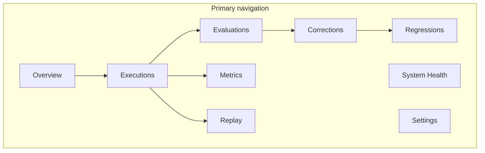

# AI Operations Center Architecture

> **Phase 4B notice:** Phase 4 initially introduced the AI Operations Center as a separate
> route. Phase 4B consolidated these capabilities into the canonical **AI Pipeline Hub**
> (`/admin-portal/ai-pipeline`). This document is retained for implementation history.
> Current IA: [`AI_PIPELINE_OPERATOR_INFORMATION_ARCHITECTURE.md`](./AI_PIPELINE_OPERATOR_INFORMATION_ARCHITECTURE.md).

**Program:** AI Architecture Phase 4 (superseded product framing by Phase 4B)  
**Date:** 2026-07-12  
**Status:** Historical (implementation history) — capabilities live in AI Pipeline Hub  
**Source of Truth for:** Phase 4 product framing history (not current nav)

---

## Purpose

Vssyl's **AI Operations Center** is an operational product for authorized operators to understand, evaluate, improve, and govern AI behavior. It consumes Phase 3 intelligence models — it does not compete with Twin, `AIActionExecution`, or the approval platform.

---

## Information architecture

| Area | Route | Backend |
|------|-------|---------|
| Overview | `/admin-portal/ai/operations` | `GET /overview` |
| Executions | `…/executions`, `…/executions/:id` | `GET /executions` |
| Evaluations | `…/evaluations` | `GET/PATCH /evaluations` |
| Corrections | `…/corrections` | `GET/PATCH /corrections` |
| Regressions | `…/regressions` | `GET/POST /regressions` |
| Metrics | `…/metrics` | `GET /metrics` |
| Replay | `…/replay` | `POST /executions/:id/replay/prepare` |
| System Health | `…/system-health` | `GET /health` |
| Settings | `…/settings` | RBAC docs |

---

## Principles

1. **Operational product** — not a debug console (pipeline diagnostics remain in AI Pipeline).
2. **Single storage** — `AIExecutionRecord`, `AIEvaluation`, `AIRootCauseFinding`, `AICorrectionRoute`, `AIRegressionCase`, linked `AIActionExecution`.
3. **Observe only** — corrections are proposals; evaluations never set `mutatesRuntime`.
4. **Knowledge scoped** — platform intelligence improves globally without copying user memories.

---

## Future expansion

- Observe hook: auto-create execution records after Twin turns
- Business-scoped operations views via `x-ai-operations-business-id`
- Replay sandbox executor
- Regression CI
- GraphQL read layer (contracts designed for compatibility)

---

## Related

- [`AI_OPERATIONS_CENTER_API.md`](./AI_OPERATIONS_CENTER_API.md)
- [`AI_OPERATIONS_CENTER_RBAC.md`](./AI_OPERATIONS_CENTER_RBAC.md)
- [`AI_OPERATIONS_CENTER_UX.md`](./AI_OPERATIONS_CENTER_UX.md)
- Phase 3: [`AI_OPERATOR_PLATFORM.md`](./AI_OPERATOR_PLATFORM.md)
