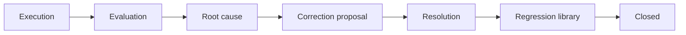

# AI Phase 6 Closeout — Evaluation & Correction Workflow

**Program:** AI Architecture Phase 6  
**Date:** 2026-07-13  
**Status:** Complete (awaiting review; not committed in this session unless requested)  
**Source of Truth for:** Phase 6 delivery boundary and reuse decisions

---

## Executive summary

Phase 6 completes the human ops loop on the **existing** AI Pipeline / Operations substrate (Phases 3–4). Operators can: locate an execution → evaluate → confirm root cause → create/approve a governed correction proposal → generate work items + optional regression → verify → close — with auditable history and notifications. Corrections never mutate Twin runtime.

---

## Reuse decision

| Existing capability | Phase 6 action |
|---------------------|----------------|
| `AIEvaluation`, `AIRootCauseFinding`, `AICorrectionRoute`, `AIRegressionCase` | Extended fields + lifecycle vocabulary |
| `/api/admin/ai/operations/*` | Extended — no duplicate API product |
| Pipeline Hub UI | Extended execution panel + metrics report |
| `operationsWorkflowService` | Extended transitions, work items, regression link, notifications |
| New admin shell / parallel workflow system | **Not built** |

---

## End-to-end pipeline integration

Visible from execution detail via `EvaluationWorkflowPanel`.

---

## Deliverables

- State machine + workflow history  
- Correction work items (`AICorrectionWorkItem`)  
- Notifications (assignment, review, approval, regression, verification)  
- Workflow reporting endpoint + metrics UI  
- RBAC role assumption for operators / support / auditors  
- Docs: evaluation / correction / review / resolution workflows + this closeout  
- Tests: transitions, work items, assignment notifications, regression linkage  

---

## Explicitly out of scope (unchanged)

Provider routing · prompts · Twin reasoning · context selection · grounding · tools · approvals · execution platform · observation architecture · autonomous learning · replay execution · regression CI · provider benchmarking · DigitalLifeTwinCore refactor

---

## Remaining future work

- Business Reviewer with membership-validated tenant scope  
- Attachment uploads on evaluations  
- External ticketing adapters (optional)  
- Regression CI and replay execution  
- Notification preference / digest UX in product notifications center  

---

## Certification posture

**Workflow substrate: CERTIFIED** for governed proposal + audit trail.  
**Runtime mutation: NONE** (by design).  
**CI / autonomous learning: NOT INCLUDED.**
