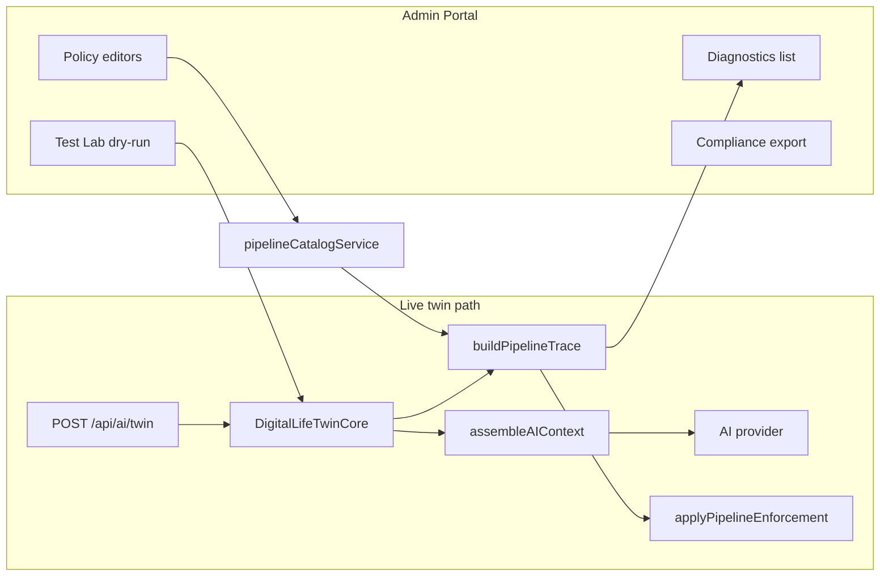

# AI Pipeline Admin Tools

**Status:** Shipped (Phases 1–5, May 2026)  
**Audience:** Admins, platform engineers  
**Related:** `memory-bank/activeContext.md`, `memory-bank/aiContextSystem.md` (assembled context), `docs/architecture/AI_TWIN_PROMPT_PIPELINE.md`

## Problem

The Digital Life Twin could answer conversationally while skipping grounding, retrieval, tools, and evidence. Admins had no way to inspect *why* a response was generic (e.g. “yoga clubs near me” without Place/location/web search).

## Solution

An **additive** Admin Portal **AI Pipeline** section instruments the live twin path: diagnostics, editable policies, test lab, enforcement, evidence viewer, and compliance export — without rewriting provider prompts by default.

**Hub:** `/admin-portal/ai-pipeline`  
**API prefix:** `/api/admin-portal/ai-pipeline/*` (all routes use `authenticateJWT` + `requireAdmin`)

---

## Phase summary

| Phase | Scope | Key deliverables |
|-------|--------|------------------|
| **1A** | Read-only diagnostics (backend only) | `pipelineDiagnostics` types, `defaultPipelineCatalog`, `inferPipelineIntents`, `buildPipelineTrace`, unit tests |
| **1B** | Twin instrumentation + admin APIs | `DigitalLifeTwinCore` trace + tool usage; `metadata.pipelineTrace`; history `_pipelineTrace`; `GET/POST` admin pipeline routes |
| **1 (UI)** | Admin Portal surfaces | Hub, diagnostics, test-lab, read-only catalog pages, AI System card |
| **2** | Persisted diagnostics + quality | `AIPipelineDiagnostic` model; sampling env; quality stats API + dashboard |
| **3** | Editable policies + audit | DB-backed intents/grounding/sources/tools/settings; CRUD APIs; policy audit log |
| **4** | Grounding enforcement | Modes: off / disclose / block / regenerate; Place + IP location prepass; twin response gating |
| **5** | Evidence + compliance | Unified `evidenceBundle`; retention/export/purge APIs; evidence viewer UI |

---

## Architecture

### Core server modules

| Path | Role |
|------|------|
| `server/src/ai/types/pipelineDiagnostics.ts` | Types: intents, trace, catalog, evidence bundle, retention |
| `server/src/ai/pipeline/defaultPipelineCatalog.ts` | Code defaults (10 intents) |
| `server/src/ai/pipeline/pipelineCatalogDefaults.ts` | Canonical default constants |
| `server/src/ai/pipeline/pipelineCatalogService.ts` | DB seed/load, policy CRUD, cache, audit |
| `server/src/ai/pipeline/buildPipelineTrace.ts` | Pure trace builder + risk/issues |
| `server/src/ai/pipeline/inferPipelineIntents.ts` | Heuristic intent detection |
| `server/src/ai/pipeline/mapPipelineTraceInputs.ts` | Map orchestration → trace input |
| `server/src/ai/pipeline/pipelineDiagnosticPersistence.ts` | Persist/list/stats |
| `server/src/ai/pipeline/pipelineEnforcement.ts` | Block/disclose/regenerate rules |
| `server/src/ai/pipeline/pipelineGroundingRetrieval.ts` | Location + Place prepass |
| `server/src/ai/pipeline/buildPipelineEvidenceBundle.ts` | Assembled vs structured evidence |
| `server/src/ai/pipeline/pipelineRetentionService.ts` | Export, purge, retention settings |
| `server/src/routes/admin-portal/adminPortalRoutes.aiPipeline.ts` | Admin HTTP API |

### Database

| Model | Purpose |
|-------|---------|
| `AIPipelineDiagnostic` | Persisted traces (`traceJson`, risk flags, source TWIN/TEST_LAB) |
| `AIPipelineIntentPolicy` | Editable intent definitions |
| `AIPipelineGroundingRulePolicy` | Per-intent grounding sources |
| `AIPipelineContextSourcePolicy` | Context source + wired flags |
| `AIPipelineToolPolicyRow` | Tool policies |
| `AIPipelineSettings` | Weak phrases, enforcement, retention |
| `AIPipelinePolicyAuditLog` | Before/after on policy edits |

**Migrations:** `20260520010440_ai_pipeline_diagnostics`, `20260520011146_ai_pipeline_policy_config`, `20260520012656_ai_pipeline_enforcement`, `20260520013518_ai_pipeline_retention_phase5`

---

## Admin API (reference)

| Method | Path | Description |
|--------|------|-------------|
| GET | `/ai-pipeline/catalog` | Effective catalog (DB + defaults) |
| GET | `/ai-pipeline/diagnostics` | List traces (DB + history fallback) |
| GET | `/ai-pipeline/diagnostics/:traceId` | Trace detail |
| GET | `/ai-pipeline/diagnostics/:traceId/evidence` | Evidence bundle |
| POST | `/ai-pipeline/test-lab` | Dry-run twin (`adminDryRun`, no history) |
| GET | `/ai-pipeline/quality/stats` | At-risk aggregates |
| PUT | `/ai-pipeline/policies/intents/:id` | Update intent |
| PUT | `/ai-pipeline/policies/grounding/:intentId` | Update grounding rule |
| PUT | `/ai-pipeline/policies/sources/:id` | Update context source |
| PUT | `/ai-pipeline/policies/tools/:toolId` | Update tool policy |
| PUT | `/ai-pipeline/policies/settings` | Weak phrases + enforcement |
| GET | `/ai-pipeline/audit` | Policy change log |
| GET/PUT | `/ai-pipeline/retention` | Retention + redaction flags |
| POST | `/ai-pipeline/diagnostics/export` | JSON or CSV export |
| POST | `/ai-pipeline/retention/purge` | Purge expired diagnostics (`dryRun` optional) |

---

## Environment variables

| Variable | Default | Effect |
|----------|---------|--------|
| `AI_PIPELINE_DIAGNOSTICS_ENABLED` | on | Set `false` to skip DB persistence |
| `AI_PIPELINE_DIAGNOSTIC_SAMPLE_RATE` | `1` | 0–1 sampling for twin traces |
| `AI_PIPELINE_ENFORCEMENT_ENABLED` | — | `true`/`false` overrides DB enforcement flag |
| `AI_PIPELINE_ENFORCEMENT_MODE` | — | `block`, `disclose`, `regenerate` when enabled via env |

---

## Enforcement behavior (Phase 4)

- **off:** Diagnostics only; model response unchanged.
- **disclose:** Appends grounding disclaimer when grounding required but retrieval missing.
- **block** / **regenerate (post-check):** Replaces response with safe message when violation persists.
- **regenerate (prepass):** Before provider call, runs IP geolocation + `place_discoveries` context when policies allow.

Twin passes `clientIp` from `POST /api/ai/twin` for location grounding.

**Not shipped:** Live `web_search` tool in twin (catalog marks disabled; prepass logs failed attempt).

---

## Operational notes

1. Run migrations: `pnpm prisma:migrate:deploy`
2. Enable enforcement in Admin → AI Pipeline → Quality (or env) after validating in Test Lab.
3. Schedule periodic `POST .../retention/purge` (dry-run first) or add cron later.
4. Exports respect `exportRedactUserMessages` / `exportRedactResponsePreviews` (default true).

---

## AI Operations Console (hub UX)

**Route:** `/admin-portal/ai-pipeline`  
**Polling:** Live activity feed refreshes every **60s** via `GET /ai-pipeline/diagnostics?limit=15` (no WebSockets).

### Health metrics (7-day window)

| Metric | Source |
|--------|--------|
| Grounded response rate | % of grounding-required traces with `retrievalPerformed` |
| Generic risk rate | `atRiskPercent` |
| Retrieval / tool usage rate | Extended `GET /ai-pipeline/quality/stats` |
| Average confidence | Distribution over `confidenceLevel` column |
| Top failed intent | First entry in `intentsAtRisk` |
| Diagnostics retained | All-time count + exportable within retention window |

### Trace insights (read-time)

Computed by `server/src/ai/pipeline/pipelineTraceInsights.ts` and attached as `trace.insights` on admin diagnostic APIs (not persisted in `traceJson`).

| Field | Meaning |
|-------|---------|
| `flagReasons` | Human-readable “why flagged” bullets |
| `contextUsed` | Checklist: used / not_used / planned / disabled per catalog source |
| `reasoningDepth` | **LOW** / **MEDIUM** / **HIGH** (derived, not model output) |
| `failureCategories` | Operational tags (e.g. `GROUNDING_FAILURE`, `GENERIC_RESPONSE`) |

**Reasoning depth**

- **LOW:** No retrieval, no tools, no meaningful context; generic risk or low confidence.
- **HIGH:** Retrieval + tools + multiple sources + grounding satisfied + evidence when available.
- **MEDIUM:** Everything else.

**Context-used semantics**

- **used:** Heuristics match trace memory, retrieval, tools, or assembled modules.
- **planned:** Catalog `enabled` but `wiredInTwin: false`.
- **disabled:** Catalog or tool policy disabled (e.g. `web_search`).
- **not_used:** Available but not detected in trace.

**Activity feed colors**

- Green: grounded success · Yellow: grounding required, no retrieval · Orange: generic risk · Red: enforcement block/disclose · Blue: Test Lab (`diagnosticSource: TEST_LAB`)

**Deep link:** `/admin-portal/ai-pipeline/diagnostics?traceId={id}`

---

## Dynamic AI orchestration registry (R0–R5, May 2026)

Admin-managed **orchestration registry** for intents, context sources, tool policies, and grounding rules. This is infrastructure for a future cognitive/relationship graph — not plain CRUD.

### Lifecycle

- **Archive only** — no hard delete (protects audit, diagnostics, and references).
- **System rows** (`isSystem: true`) — seeded defaults; archive blocked.
- **Custom rows** — admin-created extensions; duplicate suggests `{id}_copy`.

### Capability flags (`capabilities` JSON)

| Field | Meaning |
|-------|---------|
| `executable` | Runnable in twin or prepass today |
| `inferable` | Participates in intent inference (system intents only until v2) |
| `retrievalEnabled` | May trigger retrieval |
| `enforceable` | Subject to grounding enforcement |

Custom intents default to `inferable: false` — **catalog-driven inference is v2**; they exist as policy/orchestration metadata now.

### Tool `runtimeKind`

| Value | Meaning |
|-------|---------|
| `openai_tool` | OpenAI tool loop (`list_drive_files`, `share_file`, `create_todo`) |
| `prepass` | Pre-LLM prepass (`location`, `place_search`, `memory`) |
| `policy_only` | Policy metadata only — UI: “Policy only — not executable yet” |

### Context sources

- `mappedTools[]` per source replaces static-only `SOURCE_TO_TOOLS` for custom sources.
- `lifecycleStatus`: `planned` | `live` | `disabled`.

### Validation API

- `POST /api/admin-portal/ai-pipeline/registry/validate` — dry-run create/update/archive/duplicate.
- `GET /api/admin-portal/ai-pipeline/registry/graph` — nodes/edges for dependency chips (no visual graph yet).

Blocking errors include: `DUPLICATE_ID`, `ORPHAN_*`, `SYSTEM_PROTECTED`, `GROUNDING_RULE_EXISTS`, `INVALID_SLUG`. Warnings include: `POLICY_ONLY_TOOL`, `NO_INFERENCE_MATCH`, `MISSING_GROUNDING_RULE`.

### Registry CRUD APIs

Create / duplicate / archive / restore / enable / disable for intents, sources, tools, grounding (see `adminPortalRoutes.aiPipeline.ts`). Catalog: `GET /catalog?includeArchived=true`.

### Code map

| Area | Path |
|------|------|
| IDs | `server/src/ai/pipeline/pipelineRegistryIds.ts` |
| Validator + graph | `server/src/ai/pipeline/pipelineRegistryValidator.ts` |
| CRUD + audit | `server/src/ai/pipeline/pipelineRegistryService.ts` |
| Catalog load | `server/src/ai/pipeline/pipelineCatalogService.ts` (no silent ID stripping) |
| Admin UI | `web/src/components/admin-portal/ai-pipeline/registry/` |

### Deferred (intentional)

- Catalog-driven inference for custom intents (v2)
- Graph visualization UI
- `web_search` runtime wiring
- Provider/prompt/enforcement default changes

---

## Out of scope / future

- Automatic scheduled purge job (cron)
- Full provider-level regenerate loop (second model call)
- `web_search` wiring in twin
- Replacing legacy `QueryIntent` with pipeline intents in production routing

**Last updated:** 2026-05-20 (dynamic registry R0–R5)
