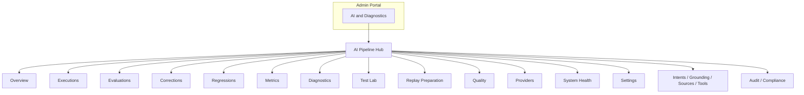

# AI Pipeline Operator Information Architecture

**Program:** AI Architecture Phase 4B  
**Date:** 2026-07-12  
**Status:** Active  
**Source of Truth for:** Merged Admin Portal AI operator IA

---

## Declaration

**The AI Pipeline Hub is the canonical Admin Portal AI operations product.**  
Phase 3 intelligence capabilities and Phase 4 operational workflows are presented inside this hub.

---

## Navigation diagram

---

## Route map

| Section | Canonical route |
|---------|-----------------|
| Overview | `/admin-portal/ai-pipeline` |
| Executions | `/admin-portal/ai-pipeline/executions` |
| Execution detail | `/admin-portal/ai-pipeline/executions/:id` |
| Evaluations | `/admin-portal/ai-pipeline/evaluations` |
| Corrections | `/admin-portal/ai-pipeline/corrections` |
| Regressions | `/admin-portal/ai-pipeline/regressions` |
| Metrics | `/admin-portal/ai-pipeline/metrics` |
| Diagnostics | `/admin-portal/ai-pipeline/diagnostics` |
| Test Lab | `/admin-portal/ai-pipeline/test-lab` |
| Replay | `/admin-portal/ai-pipeline/replay` |
| Quality | `/admin-portal/ai-pipeline/quality` |
| Providers | `/admin-portal/ai-pipeline#provider-governance` |
| System Health | `/admin-portal/ai-pipeline/system-health` |
| Settings | `/admin-portal/ai-pipeline/settings` |

---

## Old → new redirects

| Old | New |
|-----|-----|
| `/admin-portal/ai/operations` | `/admin-portal/ai-pipeline` |
| `/admin-portal/ai/operations/executions` | `…/ai-pipeline/executions` |
| `/admin-portal/ai/operations/executions/:id` | `…/ai-pipeline/executions/:id` |
| `/admin-portal/ai/operations/evaluations` | `…/ai-pipeline/evaluations` |
| `/admin-portal/ai/operations/corrections` | `…/ai-pipeline/corrections` |
| `/admin-portal/ai/operations/regressions` | `…/ai-pipeline/regressions` |
| `/admin-portal/ai/operations/metrics` | `…/ai-pipeline/metrics` |
| `/admin-portal/ai/operations/replay` | `…/ai-pipeline/replay` |
| `/admin-portal/ai/operations/system-health` | `…/ai-pipeline/system-health` |
| `/admin-portal/ai/operations/settings` | `…/ai-pipeline/settings` |

Redirects are Next.js server `redirect()` — no second layout behind them.

---

## Permissions

| Who | Access |
|-----|--------|
| Platform `ADMIN` JWT | Full Pipeline + intelligence APIs |
| Non-admin | 403 on `/api/admin/ai/operations/*` |
| Business headers | **Do not grant access** (deferred) |

See [`AI_PIPELINE_OPERATOR_RBAC.md`](./AI_PIPELINE_OPERATOR_RBAC.md).

---

## Retained vs merged

**Retained (single instance):** Overview hub, Diagnostics, Test Lab, Quality, Providers, Configure/Govern cards.  
**Merged into hub:** Phase 4 overview KPIs, System Health, Settings, Metrics (intelligence) alongside Quality.  
**Redirected:** Entire former Operations Center route tree.

---

## Future extension points

- Twin observe hook → populate `AIExecutionRecord` (not Phase 4B)
- Membership-validated business operator views
- Replay sandbox executor
- Regression CI
- Optional retirement of unused `ai-operations` layout wrappers

---

## Explicitly out of scope (separate products)

- `/ai` personal Identity  
- Personal memory / learning review  
- Business AI configuration / employee assistant  
- Business knowledge administration  
- Billing / query packs  
- Centralized AI revival  
- Autonomous execution  
