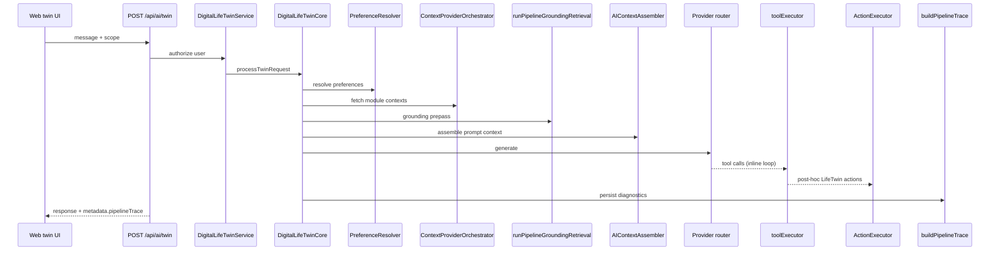
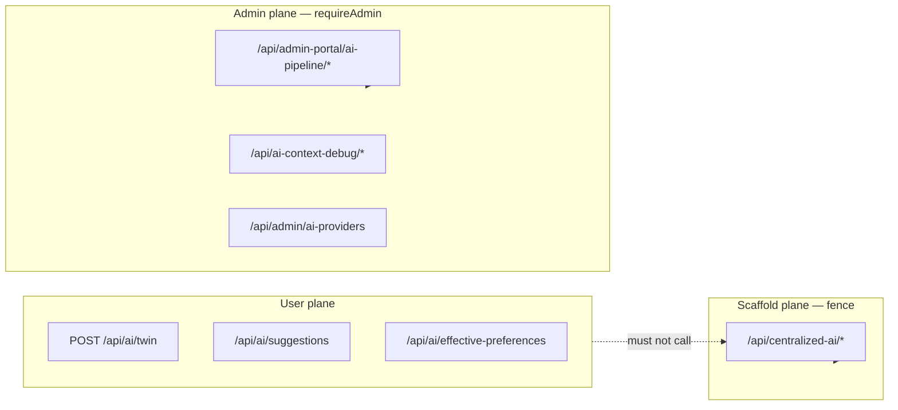

# AI Pipeline Ownership Map

**Wave:** AI Platform **1A**  
**Last updated:** 2026-06-03 (Wave **1E**)  
**Parent:** [AI_PLATFORM_OVERVIEW.md](./AI_PLATFORM_OVERVIEW.md), [AI_PLATFORM_BOUNDARY_MODEL.md](./AI_PLATFORM_BOUNDARY_MODEL.md)  
**Companion:** [AI_CANONICAL_ROUTE_MAP.md](./AI_CANONICAL_ROUTE_MAP.md)

Maps each pipeline stage to its **canonical owner** and **known duplicate paths**. No runtime changes in Wave 1A.

---

## End-to-end twin pipeline (canonical)

---

## Stage ownership matrix

| Pipeline stage | Canonical owner module / service | Primary entry route(s) | Known duplicate / legacy paths | Severity |
|----------------|----------------------------------|------------------------|--------------------------------|----------|
| **Twin requests** | `DigitalLifeTwinService` → `DigitalLifeTwinCore` | `POST /api/ai/twin` | `POST /api/ai/chat` (deprecated compat); `POST /api/business-ai/:id/interact` | P2 business fence |
| **Provider selection** | `providerCapabilityMatrix.ts` + `providerRouting.ts` + `modelCatalog.ts` | Internal to twin; `GET /api/ai/models` (+ `capabilities`) | `legacyProviderCanHandle.ts` (module context only); centralized `/models` **410** (1D) | — |
| **Context retrieval (orchestrated)** | `ContextProviderOrchestrator` + `AIContextAssembler` | Twin internal; module `GET /api/{module}/ai/context/*` | `GET /api/ai/context` (twin aggregate); `CrossModuleContextEngine` direct calls (C-01) | — (user-context collision resolved 1B) |
| **Context retrieval (user CRUD)** | `userAIContextController` + DB | `/api/ai/user-context` | Legacy `/api/ai/context` subpaths (migration) | — |
| **Grounding retrieval** | `runPipelineGroundingRetrieval`, `fetchVLinkPipelineContext` | Twin internal | `ai-context-debug` assemble endpoints; admin test-lab | P3 |
| **Conversation reasoning** | `server/src/ai/conversation/*` | Twin internal (`metadata.conversationReasoning`) | None on separate route | — |
| **Preference resolution** | `PreferenceResolver` | Twin internal; `GET /api/ai/effective-preferences` | `ai-preferences` bundle; shims on `ai.ts` | P2 |
| **Tool execution (inline)** | `toolExecutor` + `toolDefinitions` | Twin tool loop | — (share_file via `grantFileShareByEmail`, 1B) | — |
| **Action execution (post-hoc)** | `ActionExecutor` + `ActionExecutorRegistry` | Twin LifeTwin action channel | `AutonomousActionExecutor` writes retired (410, 1B); household/business/dashboard stubs remain | P2 stubs |
| **Ambient suggestions** | `AIEventConsumer` + suggestion routes | `GET/POST /api/ai/suggestions*` | Centralized pattern endpoints (admin only) | P3 |
| **Learning signals (twin)** | `personalAILearningEventsService`, twin learning routes | `/api/ai/learning/*` | `/api/centralized-ai/learning/event` **410**; admin `/patterns` fenced (1D) | — |
| **Memory facts** | `userMemoryFactService` | `/api/ai/memory/facts` | User context CRUD overlap (different data model) | — |
| **Diagnostics (runtime trace)** | `buildPipelineTrace`, orchestration snapshot | Twin `metadata.pipelineTrace` | Legacy metadata fields (P-02) | P2 |
| **Diagnostics (admin)** | Admin pipeline routes | `/api/admin-portal/ai-pipeline/diagnostics*` | `/api/ai-context-debug/*` (P-03) | P3 |
| **Trace persistence** | Pipeline trace store + retention APIs | Admin retention routes | Centralized analytics streams | P3 |
| **Admin inspection** | `adminPortalRoutes.aiPipeline` | `/api/admin-portal/ai-pipeline/*` | `/api/centralized-ai/*` admin scaffold (fenced 1D) | — |
| **Provider usage / billing** | `ai-provider-usage` routes | `/api/admin/ai-providers` | Centralized performance metrics | P3 |

---

## Boundary ownership (who must NOT own)

From [AI_PLATFORM_BOUNDARY_MODEL.md](./AI_PLATFORM_BOUNDARY_MODEL.md):

| Surface | Must NOT own | Risk if violated |
|---------|--------------|------------------|
| **Modules** | Twin orchestration, provider routing, global tool dispatch | Split-brain context; certification fail |
| **Analytics module** | Default twin context source | Wrong grounding; tenant leak |
| **Business Workspace** | LLM calls or executor dispatch | Shell bypasses platform governance |
| **centralized-ai router** | User-facing twin conversational path | Ungated admin/scaffold on user UI |
| **Controllers** | Direct Prisma for domain reads/writes on AI paths | V1 constitutional violation |

---

## Context layer — three channels

| Channel | Owner | HTTP surface | Used by |
|---------|-------|--------------|---------|
| **A. Module providers** | Per-module controllers → visibility services | `/api/{module}/ai/context/*` | `ContextProviderOrchestrator` — Drive: `driveAIContextService` → `driveVisibilityService` (1C) |
| **B. User-defined context** | `userAIContextController` | `/api/ai/context` (broken GET) → **planned** `/api/ai/user-context` | Control Center, memories UI |
| **C. Twin aggregate** | `DigitalLifeTwin` | `GET /api/ai/context`, `GET /api/ai/context/:module` | Programmatic cross-module fetch |

**1B decision:** Rename **B** to `/api/ai/user-context`; keep **C** at `/api/ai/context` OR move **C** to `/api/ai/orchestrated-context` — recommend **rename B only** (smaller client diff).

---

## Execution layer — two channels

| Channel | When | Owner | Duplicate |
|---------|------|-------|-----------|
| **Tool loop** | During LLM turns | `toolExecutor` | Must use module services (Drive list, share, etc.) |
| **LifeTwin actions** | After response | `ActionExecutor.executeByModule` | Mock controllers for drive/HR/scheduling/household/dashboard |
| **Autonomous (deprecated)** | Standalone API | `AutonomousActionExecutor` | Parallel approval + Prisma writes |

**Canonical:** Tool loop + LifeTwin actions inside twin only. Autonomous API **hard-disable** in 1B after migration note.

---

## Admin vs twin separation

**Resolved (1D):** `/api/centralized-ai/*` requires `authenticateJWT` + `requireAdmin`; retired duplicates return 410. See [AI_PLATFORM_WAVE_1D_ADMIN_DIAGNOSTICS_CLOSEOUT.md](./audits/AI_PLATFORM_WAVE_1D_ADMIN_DIAGNOSTICS_CLOSEOUT.md).

---

## File-level ownership index

| Concern | Canonical files |
|---------|-------------------|
| Twin core | `server/src/ai/DigitalLifeTwinCore.ts`, `DigitalLifeTwinService.ts` |
| Twin route | `server/src/routes/ai.ts` (`POST /twin`) |
| Orchestrator | `server/src/ai/context/ContextProviderOrchestrator.ts` |
| Assembler | `server/src/ai/context/AIContextAssembler.ts` |
| Grounding | `server/src/ai/pipeline/runPipelineGroundingRetrieval.ts` |
| Preferences | `server/src/ai/preferences/PreferenceResolver.ts` |
| Reasoning | `server/src/ai/conversation/*` |
| Tools | `server/src/ai/tools/toolExecutor.ts`, `toolDefinitions.ts` |
| Actions | `server/src/ai/actions/ActionExecutor.ts`, `ActionExecutorRegistry.ts` |
| Trace | `server/src/ai/pipeline/buildPipelineTrace.ts`, `orchestrationSnapshot.ts` |
| Admin diagnostics | `server/src/routes/admin-portal/adminPortalRoutes.aiPipeline.ts` |
| Drive AI context | `server/src/controllers/driveAIContextController.ts` → `driveAIContextService.ts` → `driveVisibilityService.ts` |
| LLM provider matrix | `server/src/ai/providers/providerCapabilityMatrix.ts`, `providerRouting.ts` |
| Legacy autonomous | `server/src/routes/ai/autonomous.ts`, `AutonomousActionExecutor.ts` |

---

## Wave 1A sign-off

| Stage | Canonical owner documented | Duplicates listed |
|-------|---------------------------|-------------------|
| Twin → trace | Yes | Yes |
| Context triple-channel | Yes | Yes |
| Execution triple-channel | Yes | Yes |
| Admin/scaffold fence | Yes | Yes |

**Implementation:** [AI_WAVE_1B_EXECUTION_PLAN.md](./AI_WAVE_1B_EXECUTION_PLAN.md)
