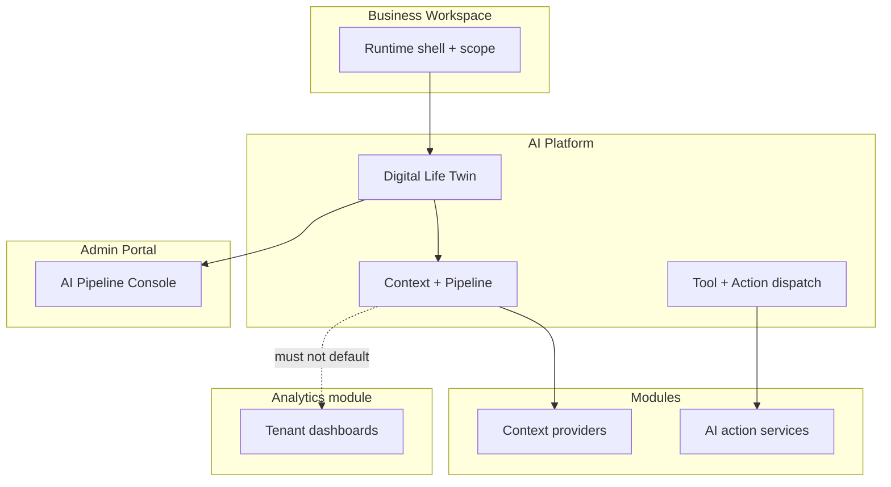

# AI Platform Boundary Model

**Version:** 1.0.0  
**Status:** Active  
**Last updated:** 2026-06-04  
**Parent:** [AI_PLATFORM_CONSTITUTION.md](./AI_PLATFORM_CONSTITUTION.md)  
**Evidence:** [AI_ADMIN_ANALYTICS_BOUNDARY_REVIEW.md](./audits/AI_ADMIN_ANALYTICS_BOUNDARY_REVIEW.md)

---

## Overview

Five surfaces interact with AI. Each has explicit **owns**, **delegates**, and **prohibited ownership**. Violations are constitutional (see [AI_PLATFORM_CONSTITUTION.md](./AI_PLATFORM_CONSTITUTION.md) §5).

---

## 1. AI Platform

### Owns

- Twin orchestration (`DigitalLifeTwinCore`, `DigitalLifeTwinService`).  
- `ContextProviderOrchestrator`, `AIContextAssembler`, grounding prepass, pipeline enforcement.  
- Provider routing (OpenAI, Anthropic, local), model catalog, vision capability selection.  
- `PreferenceResolver`, conversation reasoning layer, memory recall injection.  
- `toolExecutor` / `ActionExecutor` / `ActionExecutorRegistry` **dispatch only**.  
- Pipeline trace, orchestration snapshots, diagnostic persistence.  
- Ambient suggestion consumer (ranking, no auto-execute).  
- `moduleAIContextRegistry` and provider certification metadata.  
- User AI context record CRUD (user-declared context).  
- Query billing (`/api/ai/queries`).  
- Admin pipeline backend (`adminPortalRoutes.aiPipeline.ts`).

### Delegates

| To | What |
|----|------|
| **Modules** | All domain reads/writes, PE, activity, notifications, realtime |
| **Modules** | HTTP context provider payloads |
| **Admin Portal** | UI for pipeline ops (platform supplies APIs) |
| **Business Workspace** | Active `businessId`, policy digest via `businessWorkspaceBoundaries` |
| **V_Link platform** | Confirmed relationship graph (`vlinkPipelineContextService`) |

### Prohibited ownership

- Domain tables (files, messages, events, tasks, pages, listings, employees, shifts).  
- Tenant analytics aggregates.  
- Business module install/provisioning logic.  
- Marketplace partner domain code in-process (registry/webhook only).  
- Product UI routes (`/place`, `/chat`, etc.).

---

## 2. Modules (`moduleId`)

### Owns

- Product data model and canonical `*Service` / `*AIActionService` layers.  
- `/api/{module}/ai/context/*` handlers and visibility-scoped DTOs.  
- Manifest `aiContext`, `contextProviders`, notifications for AI events.  
- Policy Engine adapters for module writes.  
- Module-specific AI panels (Notebook, Todo suggestions, etc.).

### Delegates

| To | What |
|----|------|
| **AI Platform** | When to fetch providers; catalog source mapping; twin prompt assembly |
| **AI Platform** | Tool/action execution invocation after model proposes operation |
| **File Hub** | Storage for attachments (vision pipeline) |
| **Chat** | Realtime for message-adjacent AI features |
| **Calendar** | Time semantics for scheduling AI |
| **Other modules** | Composition (Notebook → Notes + Todo APIs) |

### Prohibited ownership

- Duplicate twin orchestrators inside module services.  
- Direct calls to OpenAI/Anthropic **bypassing** platform provider wiring for user twin (module-specific **domain** AI endpoints e.g. Place purchase help are allowed if documented and read-scoped).  
- Storing pipeline traces as substitute for module activity.  
- Registering Analytics dashboards as module context without platform catalog approval.

**Reference patterns:** [REFERENCE_MODULE_CATALOG.md](./REFERENCE_MODULE_CATALOG.md) — Chat #2 (actions), File Hub #1 (visibility reads).

---

## 3. Admin Portal

### Owns

- Admin-only UI: `/admin-portal/ai-system`, `/admin-portal/ai-pipeline/*`, `/admin-portal/ai-learning`, `/admin-portal/business-ai`, `/admin-portal/ai-context`.  
- Presentation of pipeline catalog, policy editors, trace tables, test-lab.  
- Navigation and role gating (`requireAdmin`).

### Delegates

| To | What |
|----|------|
| **AI Platform** | All pipeline APIs, trace persistence, registry validation |
| **AI Platform** | Provider usage/expense (`/api/admin/ai-providers`) |
| **Modules** | Module registry inspection (read-only via admin APIs) |
| **Centralized learning** | Collective patterns (fence from twin — see legacy register) |

### Prohibited ownership

- Twin generation for end users (admin test-lab is **diagnostic**, not product chat).  
- Mutation of module domain data except through documented admin tools.  
- Replacing product Analytics module dashboards.  
- Exposing full evidence bundles to non-admin sessions.

---

## 4. Analytics (`moduleId: analytics`)

### Owns

- Tenant/business **product** metrics, charts, exports.  
- Analytics workspace UI and module manifest (Level 1 stabilizing).  
- Subscriber hooks to domain events (stubs per roadmap).

### Delegates

| To | What |
|----|------|
| **Modules** | Source events and entity counts |
| **AI Platform** | Only if future explicit, PE-gated context provider is approved |

### Prohibited ownership

- Pipeline trace storage or twin grounding prepass.  
- Admin OpenAI expense reports.  
- `POST /api/ai/twin` or context orchestration.  
- Module AI action execution.

**Rule:** Analytics **≠** AI Operations Console. Naming in docs must say “product analytics module” vs “admin AI pipeline.”

---

## 5. Business Workspace

### Owns

- Workspace **runtime shell**: layout, module switch, scope bridge (`businessId`, `dashboardId`).  
- `BusinessWorkspaceContent` module mount switch.  
- Business AI Control Center **policy UX** (enterprise preferences boundary).  
- Widget slots (including AI assistant widget placement).

### Delegates

| To | What |
|----|------|
| **AI Platform** | Twin, tools, actions when user invokes AI from workspace |
| **AI Platform** | `loadBusinessWorkspaceBoundaryBlock` — policy digest in prompts |
| **Modules** | All domain content inside `case '{moduleId}'` |
| **Admin Portal** | Global business AI admin, not per-tenant product analytics |

### Prohibited ownership

- `moduleId` in built-in registry (not a certifiable product module).  
- Canonical services for Chat/Calendar/Todo/etc.  
- Unified Business Workspace context provider (none registered Wave 0).  
- Reference Module #6 designation (declined — see Business Workspace audit).

**Wave 1C option:** Explicit business-scoped context providers **delegating** to HR/scheduling/dashboard — platform registry only, data still module-owned.

---

## 6. Cross-boundary rules

| Rule | Surfaces |
|------|----------|
| Twin path is single front door for conversational AI | Platform + user UI |
| Context HTTP providers are module-owned endpoints | Modules + Platform orchestrator |
| Diagnostics are platform-owned artifacts | Platform + Admin |
| Writes always land in module services | Modules; Platform dispatches only |
| Analytics never default-imports into twin assembly | Analytics ⊥ Platform unless catalogued |
| Business Workspace passes scope only | Shell → Platform |

---

## 7. Boundary violation examples (Wave 0)

| Example | Violation |
|---------|-----------|
| `driveAIContextController` uses Prisma directly | Module context — V1 pattern |
| `ActionExecutor` calls `createFolder(mockReq)` | Platform — V2 |
| Admin trace API without `requireAdmin` | Admin — V8 |
| Analytics route added to `pipelineSourceProviderMap` without PE | Analytics + Platform — V7 |
| Business Workspace widget calls `centralized-ai` for user chat | Shell + Admin — wrong surface |

---

## 8. References

- [AI_PLATFORM_CONSTITUTION.md](./AI_PLATFORM_CONSTITUTION.md)  
- [AI_PLATFORM_OPERATION_MATRIX.md](./AI_PLATFORM_OPERATION_MATRIX.md)  
- [AI_LEGACY_DUPLICATION_REGISTER.md](./audits/AI_LEGACY_DUPLICATION_REGISTER.md)  
- [BUSINESS_WORKSPACE_CONSTITUTIONAL_AUDIT.md](./audits/BUSINESS_WORKSPACE_CONSTITUTIONAL_AUDIT.md)

---

*Governance Wave G0 — 2026-06-04.*
