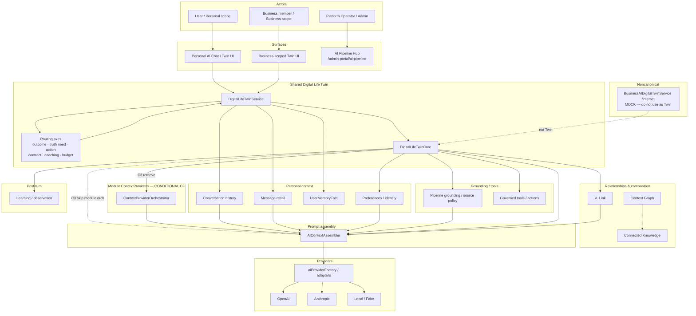

# AI Platform Canonical Diagram

**Program:** AI Architecture Phase 6B (reconciled 2026-08-25)
**Date:** 2026-08-25
**Status:** Active — **canonical** whole-platform relationship diagram
**Owner:** AI Platform / Architecture council
**Source of Truth for:** One-page AI Platform topology
**Companion:** [`AI_SYSTEM_MENTAL_MODEL.md`](./AI_SYSTEM_MENTAL_MODEL.md) · [`AI_CANONICAL_ROUTE_MAP.md`](./AI_CANONICAL_ROUTE_MAP.md) · [`AI_PLATFORM_ARCHITECTURE_CERTIFICATION.md`](./AI_PLATFORM_ARCHITECTURE_CERTIFICATION.md)

---

## Master diagram

---

## Relationship rules (canonical)

| From | To | Rule |
|------|----|------|
| Personal / Business UI | `DigitalLifeTwinService` | **One** conversational runtime; scopes differ |
| Routing axes | Core orchestration | Independent decisions — not one giant domain class |
| Module ContextProviders | Core | **Conditional (C3)** — not every turn |
| Personal memory / history | Assembler | Independent of C3 module skip |
| Pipeline grounding | Twin | Source/evidence/enforcement — not primary outcome router |
| V_Link / Graph / Connected Knowledge | Twin | Alongside / downstream of discovery — not memory or routing replacements |
| Business `/interact` | Twin | **Noncanonical mock** — use `/api/ai/twin` + `businessId` |
| Observation / Learning | Runtime | Post-turn; Learning ≠ general intelligence |
| Providers | Product logic | Adapters only |
| Live External Truth / `web_search` | Twin | **NOT SHIPPED** |

---

## Non-relationships (intentional)

- C3 skip is **not** “LLM-only mode.”
- `businessId` is **not** business intent.
- `currentModule` is **not** global query domain.
- Recommendation coaching is **not** automatically `enterprise`.
- `conversation` contract is **not** “ungrounded.”
- Corrections do **not** auto-mutate Twin prompts or provider selection.
- Skills runner does **not** fork Twin Core (Phase 8 pilots).

---

## Skills relationship rules (Phase 8)

| From | To | Rule |
|------|----|------|
| Skill runner | Twin Core | **No** invocation — dedicated execution path |
| Skill runner | Module adapters | Wraps authorized SoR services |
| Skill runner | Observation | `surface: SKILL` events + optional execution record |
| Intent type | Skill | Selection hint only — explicit `skillKey` authoritative on customer API |
