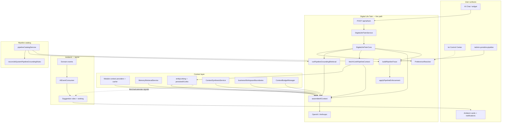
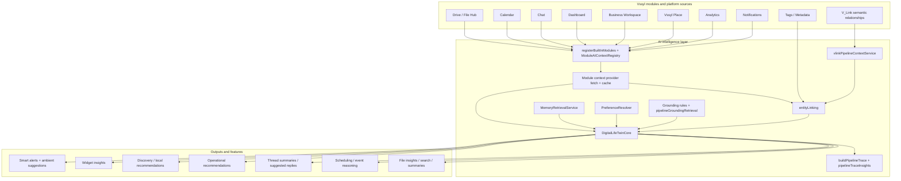
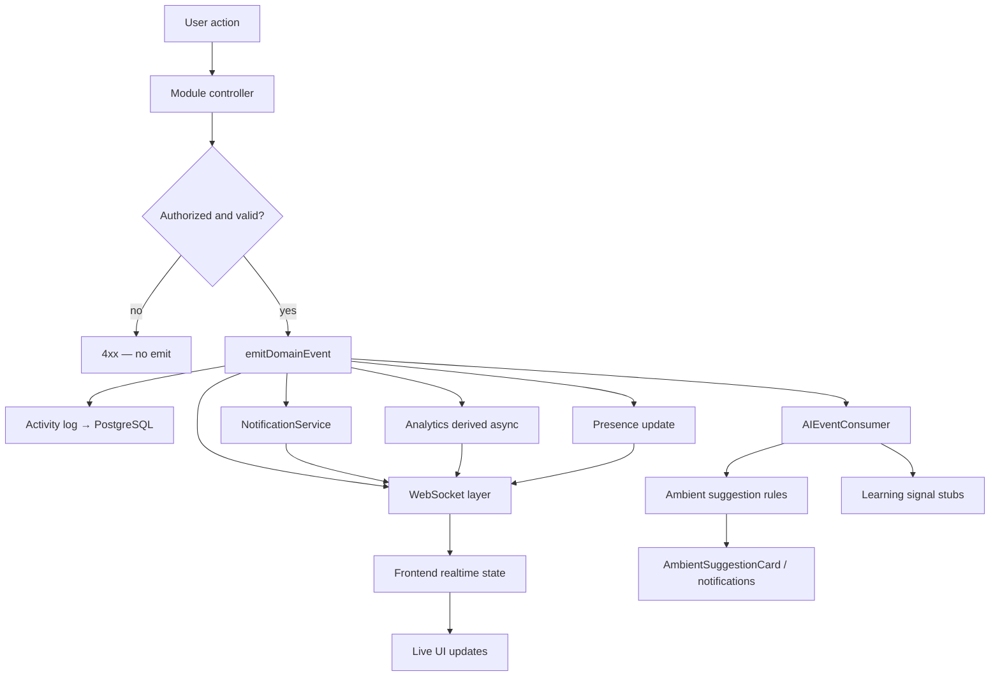

# AI platform overview (canonical diagrams)

**Last updated:** 2026-05-23  
**Audience:** Engineers, admins, onboarding  
**Status:** Shipped — reflects Phases 1–5 maturity, pipeline admin, V_Link pipeline integration, ambient suggestions

This document is the **visual hub** for the live AI platform. Detailed sub-diagrams live in linked architecture docs; avoid duplicating long prose here.

**Narrative textbook (May 2026):** [`AI_SYSTEM_TEXTBOOK.md`](./AI_SYSTEM_TEXTBOOK.md) — internal onboarding; links here for canonical diagrams.

**Platform standards:** AI integration rules (§6) — [VSSYL_PLATFORM_STANDARDS_AND_MODULE_CONTRACT.md](./VSSYL_PLATFORM_STANDARDS_AND_MODULE_CONTRACT.md). AI actions MUST use canonical services; no direct Prisma bypass.

**Supersedes in part:** [`docs/guides/AI_SYSTEM_ARCHITECTURE_MAP.md`](../guides/AI_SYSTEM_ARCHITECTURE_MAP.md) (legacy map — see deprecation banner there).

---

## Platform map (May 2026)

Two primary AI paths share context infrastructure but **do not share the twin LLM call**:

| Path | Entry | Purpose |
|------|-------|---------|
| **Digital Life Twin** | `POST /api/ai/twin` | Conversational assistant with assembled context, grounding, trace, enforcement |
| **Ambient suggestions** | Domain events → `AIEventConsumer` | Explainable nudges (accept / dismiss / ignore); **no auto-execution** |

---

## Twin request lifecycle

Canonical step order inside `DigitalLifeTwinCore.processAsDigitalTwin`:

1. **Recall & memory** — conversation history, `getRecentConversationMemory`, recall intent, `getRelevantUserMemoryFacts` (`DigitalLifeTwinService`).
2. **Preferences** — `PreferenceResolver.resolve` (personality, autonomy boundaries, active `UserAIContext`).
3. **Module context** — query analysis, provider fetch (with cache), attached files.
4. **V_Link grounding prepass** — `fetchVLinkPipelineContext` when catalog source `vlink` is enabled; **confirmed memberships only**; suggestions ignored.
5. **Entity linking** — `linkEntitiesAcrossModules` merges module payloads + `persistedVLinks`.
6. **Cross-module synthesis** — optional `ContextSynthesisService` when `AI_SYNTHETIC_CONTEXT_ENABLED`.
7. **Grounding prepass** — location, Place, memory prepass via `runPipelineGroundingRetrieval`.
8. **Assembly** — `assembleAIContext` (compression, relevance, budget tiers, preference + business blocks).
9. **Provider call** — `buildSystemPrompt` + `buildProviderUserPrompt` (`userQuery` = user message).
10. **Trace & enforcement** — `buildPipelineTrace`, `applyPipelineEnforcement`, evidence bundle for admins.

See **[AI_TWIN_PROMPT_PIPELINE.md](./AI_TWIN_PROMPT_PIPELINE.md)** for the prompt-specific slice and **[AI_CONTEXT_ASSEMBLY.md](./AI_CONTEXT_ASSEMBLY.md)** for assembly internals.

---

## V_Link in AI (first-class pipeline source)

V_Link is **not** a marketplace module. In AI it appears as:

- **Catalog context source:** `vlink` / “V_Link Relationships”
- **Runtime:** `vlinkPipelineContextService.ts` — permission-filtered confirmed vlinks + linked entity refs
- **Entity linking:** `toPersistedVLinksForEntityLinking` feeds `entityLinking.ts`
- **Trace:** `source: vlink` in pipeline diagnostics when used
- **Grounding rules:** idempotent reconcile adds optional `vlink` to system intents (`reconcileSystemPipelineGroundingRules`)

**Non-negotiable:** Unapproved V_Link suggestions never ground twin responses. V_Link membership does not grant access to linked entity content.

Product plan: [`docs/plans/V_LINK_PLATFORM_LAYER_PLAN.md`](../plans/V_LINK_PLATFORM_LAYER_PLAN.md)

---

## Admin observability

Admins inspect **why** a twin reply was generic or grounded via:

- **Hub:** `/admin-portal/ai-pipeline`
- **Trace insights:** `pipelineTraceInsights.ts` (`contextUsed`, `reasoningDepth`, failure categories)
- **Evidence bundle:** assembled vs structured retrieval vs tools vs grounding prepass
- **Registry:** intents, context sources, tools, grounding rules (archive-only, R0–R5)

See **[AI_PIPELINE_ADMIN_TOOLS.md](./AI_PIPELINE_ADMIN_TOOLS.md)**.

---

## Ambient contextual assistance (Phase 5)

Shipped separately from the twin path:

- **Lifecycle:** domain event → correlation → ranked candidate → shown → accept/dismiss → learning signal
- **Rules:** document upload, meeting prep, file-after-chat, thread activity spike
- **UI:** dashboard widget, header dropdown, `/ai` tab, notifications category `ai`

Canonical plan (includes lifecycle diagram): [`docs/plans/AI_AMBIENT_CONTEXTUAL_ASSISTANCE_PLAN.md`](../plans/AI_AMBIENT_CONTEXTUAL_ASSISTANCE_PLAN.md)

---

## Deprecated / de-emphasized (do not diagram as primary paths)

| Legacy concept | Current truth |
|----------------|---------------|
| `AutonomyManager` autonomous action loop | Deprecated; boundaries via `PreferenceResolver` only |
| Autonomous Actions tab as core UX | Hidden unless `NEXT_PUBLIC_AI_ACTIONS_UI=true` |
| Monolithic `buildDigitalTwinPrompt` | Removed; use assembler + provider prompts |
| `CrossModuleContextEngine` as sole context hub | Supplemented by `AIContextAssembler`, `entityLinking`, synthesis |
| Generic “AI Router → Context Engine” | `DigitalLifeTwinCore` + module providers + pipeline catalog |

---

## Document index

| Topic | Document | Key diagrams |
|-------|----------|--------------|
| **This hub** | `AI_PLATFORM_OVERVIEW.md` | Platform map, module→intelligence layers, domain events |
| Twin prompt path | [AI_TWIN_PROMPT_PIPELINE.md](./AI_TWIN_PROMPT_PIPELINE.md) | Full request flow + grounding gate |
| Context assembly | [AI_CONTEXT_ASSEMBLY.md](./AI_CONTEXT_ASSEMBLY.md) | Module sources → assembler |
| Business vs personal boundaries | [AI_BUSINESS_PERSONAL_TWIN_BOUNDARIES.md](./AI_BUSINESS_PERSONAL_TWIN_BOUNDARIES.md) | Policy merge |
| Admin pipeline + registry | [AI_PIPELINE_ADMIN_TOOLS.md](./AI_PIPELINE_ADMIN_TOOLS.md) | Admin architecture + grounding diagnostics |
| Attachments & vision | [../ai/ARCHITECTURE.md](../ai/ARCHITECTURE.md) | File attachment pipelines |
| Vision provider routing | [../ai/PROVIDERS.md](../ai/PROVIDERS.md) | `callAIProvider` multimodal |
| Vision troubleshooting | [../ai/RUNBOOK.md](../ai/RUNBOOK.md) | Prod vs local checklist |
| Control Center / Learning hub | [AI_INTELLIGENCE_HUB.md](./AI_INTELLIGENCE_HUB.md) | — |
| Module provider contract | [../guides/AI_CONTEXT_PROVIDER_API.md](../guides/AI_CONTEXT_PROVIDER_API.md) | — |
| Memory Bank status | [../../memory-bank/activeContext.md](../../memory-bank/activeContext.md) | — |
| Legacy full map (partially stale) | [../guides/AI_SYSTEM_ARCHITECTURE_MAP.md](../guides/AI_SYSTEM_ARCHITECTURE_MAP.md) | — |

---

## Module → intelligence layers

How first-party modules feed the twin (May 2026). V_Link is a **platform** source, not a marketplace module.

---

## Domain events and AI (module → twin context)

Mutations follow **authorize → execute → emit** (see `applicationMermaidDiagrams.md`). Domain events fan out to realtime and AI consumption; they do **not** auto-execute twin actions.

**Note:** The twin (`POST /api/ai/twin`) is invoked by **user chat**, not by every domain event. Events feed **ambient suggestions** and **learning signals** asynchronously.

---

## Related code (quick map)

| Area | Path |
|------|------|
| Twin orchestration | `server/src/ai/core/DigitalLifeTwinCore.ts` |
| Context assembly | `server/src/ai/context/AIContextAssembler.ts` |
| V_Link pipeline context | `server/src/ai/context/vlinkPipelineContextService.ts` |
| Entity linking | `server/src/ai/context/entityLinking.ts` |
| Preferences | `server/src/ai/preferences/PreferenceResolver.ts` |
| Pipeline trace | `server/src/ai/pipeline/buildPipelineTrace.ts` |
| Grounding retrieval | `server/src/ai/pipeline/pipelineGroundingRetrieval.ts` |
| Catalog + reconcile | `server/src/ai/pipeline/pipelineCatalogService.ts` |
| Ambient consumer | `server/src/ai/consumers/AIEventConsumer.ts` |
