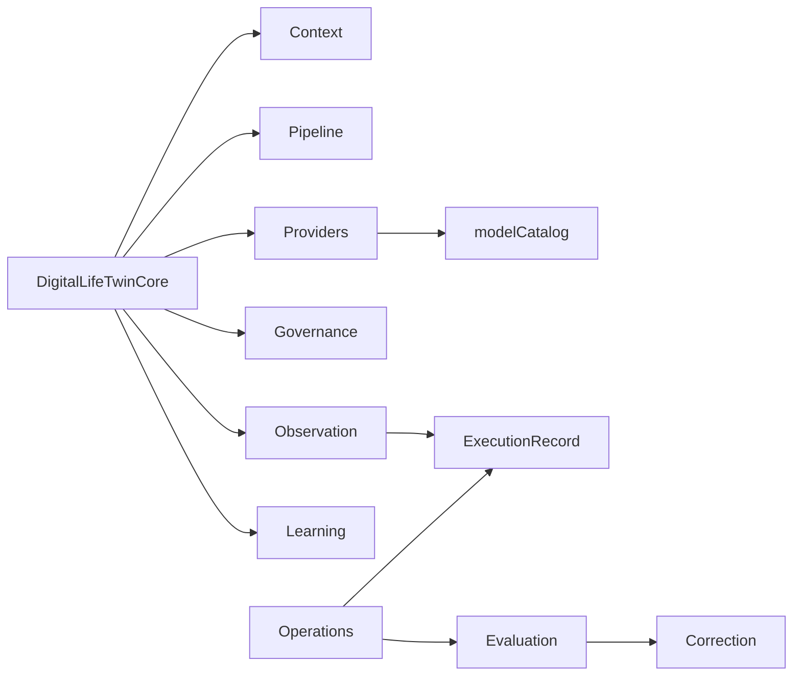

# AI Platform Subsystem Inventory

**Program:** AI Architecture Phase 6B (reconciled 2026-08-25)
**Date:** 2026-08-25
**Status:** Active — complete subsystem inventory + ownership + debt
**Companion:** [`AI_PLATFORM_ARCHITECTURE_CERTIFICATION.md`](./AI_PLATFORM_ARCHITECTURE_CERTIFICATION.md) · [`AI_SYSTEM_MENTAL_MODEL.md`](./AI_SYSTEM_MENTAL_MODEL.md)

Certification key: **CERTIFIED** · **CERTIFIED_WITH_LIMITATION** · **DESIGN_ONLY** · **LEGACY** · **ORPHAN** · **STUB / NOT SHIPPED**

---

## Ownership matrix (exactly one owner per responsibility)

| Responsibility | Single owner | Notes |
|----------------|--------------|-------|
| Twin conversational orchestration | `DigitalLifeTwinCore` (via `DigitalLifeTwinService` facade) | **CANONICAL** shared runtime; Personal/Business are scopes |
| Query outcome / routing axes | `inferStructuredResponseMode` (+ `inferQueryIntent`, related utils) resolved in Service | Not pipeline intent policies |
| Response contract | `resolveResponseContract` | `conversation` \| `grounded_answer` \| `enterprise` |
| Authoritative truth need | `requiresAuthoritativeContext` | Coarse boolean; not full source planner |
| Module ContextProvider retrieval | `shouldRetrieveModuleContext` → `ContextProviderOrchestrator` | **CANONICAL, CONDITIONAL (C3)** |
| Context assembly / budget | `AIContextAssembler` + budget manager / `contextProfile` | What enters the prompt |
| Personal memory / recall | Service recall path + `MemoryRetrievalService` / `UserMemoryFact` | Independent of C3 |
| Grounding / source policy | `runPipelineGroundingRetrieval` + pipeline catalog | Not primary outcome router |
| Provider selection (chat) | `providerRouting` + `modelCatalog` + `aiProviderFactory` | Orthogonal to turn outcome routing |
| Governed Skills | `server/src/ai/skills/*` | Dedicated runner — not Twin |
| Conversation understanding / coaching | `conversationReasoningLayer` + coaching profiles | |
| Knowledge composition | `server/src/knowledge/*` | Not `server/src/ai/knowledge` |
| Learning (canonical twin path) | `AdvancedLearningEngine` (+ Centralized persistence) | Post-turn; ≠ general intelligence |
| Tool risk policy | `aiToolRiskRegistry` | |
| Twin tool execution | `governedToolExecutor` | |
| Post-hoc LifeTwin actions | `ActionExecutor` (+ bridge to governed) | Dual channel — intentional lifecycle split |
| Approvals | Twin approval path + `ApprovalManager` (settings/legacy execute stub) | |
| Action ledger | `AIActionExecution` / `aiActionExecutionService` | |
| Runtime observation | `server/src/ai/observation/*` | |
| Execution intelligence record | `AIExecutionRecord` / `executionRecordService` | |
| Evaluation workflow | `operationsWorkflowService` + state machine | |
| Correction proposals | `AICorrectionRoute` + correction routing | |
| Work items | `AICorrectionWorkItem` / `correctionWorkItemService` | |
| Regression library | `AIRegressionCase` / `regressionCaseService` | |
| Replay | `replayPreparationService` (prepare only) | No execution owner yet |
| Operator UI | AI Pipeline Hub | |
| Operator API | `/api/admin/ai/operations` | Name ≠ UI; one API |
| Pipeline catalog / diagnostics | Admin pipeline routes + `server/src/ai/pipeline` | |
| Reporting / metrics | `operationsMetricsService` + platform metrics | |
| Notebook AI | Notebook module services | Specialized exemption |
| Media (Whisper / image) | `routes/ai.ts` media endpoints | Specialized exemption |
| Live External Truth / `web_search` | — | **STUB / NOT SHIPPED** |
| Legacy business interact chat | `BusinessAIDigitalTwinService` | **NONCANONICAL / LEGACY / MOCK** |

---

## Subsystem inventory

### Constitution

| Field | Value |
|-------|-------|
| Purpose | Platform AI law and boundaries |
| Owner | Architecture council |
| SoT | `AI_PLATFORM_CONSTITUTION.md` (+ Knowledge / Retrieval constitutions) |
| Services | N/A (docs + review gates) |
| Models | N/A |
| APIs | N/A |
| Dependencies | Certification strategy, boundary model |
| Consumers | All AI work |
| Future | Stable |
| Certification | **CERTIFIED** |

### Knowledge Engine

| Field | Value |
|-------|-------|
| Purpose | Compose trusted knowledge for answers |
| Owner | Knowledge platform (`server/src/knowledge`) |
| SoT | `docs/ai-knowledge/*`, Knowledge Constitution |
| Services | composition orchestrator, neighborhoods, trust, convergence |
| Models | Emergent (memory + SoR + graph); no single Knowledge* table |
| APIs | `/api/context-graph/knowledge/*` |
| Dependencies | Context graph, memory, modules |
| Consumers | Twin grounding / retrieval consumers |
| Future | Teach Vssyl UX still design-only in places |
| Certification | **CERTIFIED_WITH_LIMITATION** |

### Knowledge Governance

| Field | Value |
|-------|-------|
| Purpose | Ingress decisions, transitions, trust |
| Owner | Knowledge Decision Model (docs) + knowledge services |
| SoT | `AI_KNOWLEDGE_DECISION_MODEL.md`, `KNOWLEDGE_TRANSITION_MODEL.md` |
| Certification | **CERTIFIED** (philosophy); UX partial |

### Memory

| Field | Value |
|-------|-------|
| Purpose | Durable personal facts influencing Twin |
| Owner | Memory services + `UserMemoryFact` |
| SoT | Memory docs / Twin boundaries |
| APIs | `/api/ai/memory/facts` |
| Certification | **CERTIFIED** |

### Learning

| Field | Value |
|-------|-------|
| Purpose | Capture signals; reviewed improvement — not silent autopilot |
| Owner | **AdvancedLearningEngine** (canonical) |
| SoT | Intelligence Model; avoid “ContinuousLearning” wording |
| Models | `AILearningEvent`, global patterns |
| APIs | `/api/ai/learning/*`, intelligence learning routes |
| Future | Retire Core `LearningEngine`; remove ContinuousLearning scaffolds |
| Certification | **CERTIFIED_WITH_LIMITATION** (dual stack) |

### Digital Life Twin (canonical)

| Field | Value |
|-------|-------|
| Purpose | Shared conversational AI runtime; Personal/Business are scopes of authorized reality |
| Owner | `DigitalLifeTwinService` → `DigitalLifeTwinCore` |
| SoT | [`AI_SYSTEM_MENTAL_MODEL.md`](./AI_SYSTEM_MENTAL_MODEL.md), [`AI_CANONICAL_ROUTE_MAP.md`](./AI_CANONICAL_ROUTE_MAP.md), business/personal boundaries |
| APIs | **`POST /api/ai/twin`** (+ `businessId` for business scope) |
| Status | **CANONICAL** |
| Certification | **CERTIFIED_WITH_LIMITATION** (god-object size) |

### BusinessAIDigitalTwinService conversational path

| Field | Value |
|-------|-------|
| Purpose | Historical business interact API |
| Owner | `BusinessAIDigitalTwinService` |
| APIs | `POST /api/business-ai/:businessId/interact` |
| Status | **NONCANONICAL / LEGACY / MOCK** — does not call Twin Core |
| Note | Business **config** records still used as policy overlay on canonical Twin |

### Context System / Providers

| Field | Value |
|-------|-------|
| Purpose | Module-scoped context for Twin |
| Owner | `ContextProviderOrchestrator` (+ CrossModule facade) |
| SoT | `AI_CONTEXT_ASSEMBLY.md`, `memory-bank/aiContextSystem.md` |
| Status | **CANONICAL, CONDITIONAL (C3)** — not every Twin turn |
| Certification | **CERTIFIED** |

### Response contracts / routing axes

| Field | Value |
|-------|-------|
| Purpose | Outcome, truth need, action, contract, coaching, budget decisions |
| Owner | `structuredResponseMode` / `responseContract` / related utils |
| Status | **CANONICAL** |
| SoT | Mental Model + code |

### Broad discovery

| Field | Value |
|-------|-------|
| Purpose | Safety signal blocking C3 module skip for unscoped attention queries |
| Owner | `isBroadDiscoveryQuery` |
| Status | **SAFETY SIGNAL ONLY — NOT A PRODUCT ENGINE** |

### External Capability Model

| Field | Value |
|-------|-------|
| Purpose | Canonical contract for external read adapters (Places, Routes, web, future providers) |
| Status | **CANONICAL DESIGN** — see [`AI_EXTERNAL_CAPABILITY_MODEL.md`](./AI_EXTERNAL_CAPABILITY_MODEL.md) |
| Owner | Pipeline catalog + external read adapters (future `server/src/ai/external/`) |

### Google Places (external)

| Field | Value |
|-------|-------|
| Purpose | Live physical-place discovery via Google Maps Platform Places API (New) |
| Status | **DESIGNED / NOT SHIPPED** — no client, no GCP APIs enabled |
| Owner | External capability model; first implementation vertical slice |

### Google Routes / Geocoding (external)

| Field | Value |
|-------|-------|
| Purpose | Distance, ETA, address ↔ coordinates |
| Status | **FUTURE** — designed in external capability model; not scoped for first ACT |
| Owner | External capability model |

### Live External Truth / web_search

| Field | Value |
|-------|-------|
| Purpose | Future live public-web retrieval |
| Status | **STUB / NOT SHIPPED** — catalog + failed-attempt telemetry only |
| Owner | [`AI_EXTERNAL_CAPABILITY_MODEL.md`](./AI_EXTERNAL_CAPABILITY_MODEL.md) — same adapter lifecycle as Places |

### Pipeline / Grounding / Reasoning

| Field | Value |
|-------|-------|
| Purpose | Catalog, grounding, enforcement, diagnostics, capability/tool planning |
| Owner | `server/src/ai/pipeline`, `conversation/*` |
| SoT | Pipeline admin tools, retrieval constitution, conversation reasoning |
| Models | AIPipeline* |
| Note | **Not** the primary owner of Twin user-outcome / response-contract classification |
| Certification | **CERTIFIED** |

### Execution / Action Platform

| Field | Value |
|-------|-------|
| Purpose | Safe tool/action execution with risk + approval + ledger |
| Owner | governance + tools (+ ActionExecutor for post-hoc) |
| SoT | Execution architecture, tool risk policy, approval architecture |
| Models | `AIActionExecution` |
| Certification | **CERTIFIED_WITH_LIMITATION** (dual channel + bridge) |

### Observation Platform

| Field | Value |
|-------|-------|
| Purpose | Immutable runtime events; reliability/delivery |
| Owner | `server/src/ai/observation` |
| SoT | Runtime observation architecture + Phase 5/5B closeouts |
| Models | `AIObservationEvent` (+ hub fields on execution record) |
| Certification | **CERTIFIED_WITH_LIMITATION** (delivery posture per 5B) |

### Evaluation / Correction / Regression

| Field | Value |
|-------|-------|
| Purpose | Human improvement loop after bad answers |
| Owner | intelligence + operations workflow services |
| SoT | Phase 3–6 evaluation/correction/resolution docs |
| Models | Evaluation, RootCause, CorrectionRoute, WorkItem, RegressionCase |
| APIs | `/api/admin/ai/operations/*` |
| Certification | **CERTIFIED** |

### Replay

| Field | Value |
|-------|-------|
| Purpose | Prepare replay previews only |
| Owner | `replayPreparationService` |
| Certification | **CERTIFIED_WITH_LIMITATION** (no execution) |

### Providers / Media / Vision / Whisper

| Field | Value |
|-------|-------|
| Purpose | LLM and modality adapters |
| Owner | `server/src/ai/providers` (+ media routes) |
| SoT | `docs/ai/PROVIDERS.md` |
| Future | Phase 7 Model Routing (shadow shipped); live cutover future |
| Certification | **CERTIFIED_WITH_LIMITATION** (hardcoded SPECIALIZED paths) |

### Notebook AI

| Field | Value |
|-------|-------|
| Purpose | Page-scoped AI helpers |
| Owner | Notebook module |
| Certification | **CERTIFIED** (specialized; not Twin parity) |

### AI Skills Framework (Phase 8)

| Field | Value |
|-------|-------|
| Purpose | Governed task contracts — selection, plan, execute, observe |
| Owner | `server/src/ai/skills` (`skillRunner`, `skillRegistry`) |
| SoT | `docs/architecture/AI_SKILLS_ARCHITECTURE.md`, `shared/src/types/ai-skills.ts` |
| Services | registry, selection, planner, runner, implementations, metrics, observation |
| Models | In-process maps only — **no** Prisma skill executable tables |
| APIs | `/api/ai/skills` (customer); `/api/admin/ai/operations/skills/*` (operator) |
| UI | `/admin-portal/ai-pipeline/skills` |
| Dependencies | Module adapters, observation, execution records, Phase 7 shadow routing |
| Consumers | Module clients, operators, future governed task callers |
| Future | Additional Skill candidates; intent API; durable metrics |
| Certification | **CERTIFIED_WITH_LIMITATION** (three pilots; dual-path legacy routes) |

### Admin AI / Business AI / Personal AI

| Field | Value |
|-------|-------|
| Purpose | Operator hub vs business vs personal surfaces |
| Owner | Pipeline Hub (admin); Twin UIs (personal/business) |
| Certification | **CERTIFIED** |

### Analytics / Diagnostics / Testing

| Field | Value |
|-------|-------|
| Purpose | Insights engines, pipeline diagnostics, FakeAI tests |
| Owner | Mixed — diagnostics under pipeline; analytics partially orphan |
| Certification | Diagnostics **CERTIFIED**; analytics scaffolds **ORPHAN** / **LEGACY** |

---

## Dependency analysis (highlights)

| Issue | Assessment |
|-------|------------|
| Tight coupling | Twin Core → many layers (expected hub; Skills must not route through Core) |
| Cycles | No hard runtime cycles found; learning async side-effects exist |
| God objects | Twin Core, ActionExecutor |
| Architecture violations | Orphan analytics engines; Core LearningEngine parallel path |
| Extension points | `resolveAIProvider`, `selectLlmProvider`, `modelCatalog`, FakeAI factory |

---

## Duplication report (summary)

| Item | Class |
|------|-------|
| Pipeline UI + Operations redirects | Necessary |
| Ops component folder name under Pipeline | Historical |
| Advanced + Centralized learning | Necessary (layered) |
| Core LearningEngine | Historical / Candidate Removal later |
| analytics vs intelligence PredictiveIntelligenceEngine | Accidental name; analytics Candidate Removal |
| ActionExecutor + governedToolExecutor | Necessary (lifecycle split) |
| AutonomousActionExecutor | Candidate Removal |
| CrossModule + Orchestrator | Necessary (facade) |
| Two AI_CORRECTION_WORKFLOW.md files | Necessary different scopes — disambiguate |
| Ops Center docs vs Pipeline docs | Historical framing |

---

## Legacy report (recommend only — do not remove in 6B)

| Item | Recommendation |
|------|----------------|
| AutonomousActionExecutor + `/api/ai/autonomous` | Keep 410 stubs; delete executor later |
| Core LearningEngine | Consolidate into Advanced path later |
| analytics PredictiveIntelligenceEngine | Delete later (orphan) |
| ContinuousLearning scaffolds | Delete later |
| AIModelManagementService | Delete later if confirmed unused |
| ai-context-debug | Merge into Pipeline diagnostics then remove |
| Admin ai-learning / ai-context / ai-system redirects | Keep until traffic quiet |
| centralized-ai fence | Must remain (410) |

---

## Compatibility layer report

| Layer | Verdict |
|-------|---------|
| `/admin-portal/ai/operations/*` redirects | Still required |
| `/api/centralized-ai` fence | Must remain |
| `actionExecutorBridge` | Must remain |
| `legacyActionRiskRegistry` | Must remain until ActionExecutor retired |
| `ai-context-debug` transitional middleware | Still required → remove later |
| `/api/ai/chat` deprecated shim | Still required |
| `proactiveSuggestionsService` re-export | Safe to remove after import sweep |

---

## Technical debt register (Phase 6B)

| ID | Debt | Priority | Target phase |
|----|------|----------|--------------|
| TD-01 | Shrink Twin Core / extract routing injection | High | 7+ |
| TD-02 | Finish ActionExecutor → governed migration | High | Post-7 |
| TD-03 | Retire Core LearningEngine dual path | Medium | Post-7 |
| TD-04 | Delete orphan analytics Predictive + ContinuousLearning | Medium | Anytime low-risk |
| TD-05 | Bring notebook/whisper/extraction onto modelCatalog | High | 7 |
| TD-06 | Rename ai-operations components folder | Low | Anytime |
| TD-07 | Business Reviewer RBAC | Medium | Post-6 |
| TD-08 | Replay execution + regression CI | Medium | Future |
| TD-09 | Disambiguate knowledge vs ops correction docs | Low | 6B (done via banners) |
| TD-10 | Unify UserContext type shapes | Medium | Post-7 |

---

## Dependency / LOC hotspots

| File | ~LOC | Role |
|------|------|------|
| DigitalLifeTwinCore.ts | 2842 | Orchestration hub |
| ActionExecutor.ts | 2448 | Post-hoc actions |
| AdvancedLearningEngine.ts | 1319 | Learning |
| analytics/PredictiveIntelligenceEngine.ts | 1225 | Orphan |
| CrossModuleContextEngine.ts | 1134 | Context facade |
| OpenAIProvider.ts | 823 | Provider adapter |
