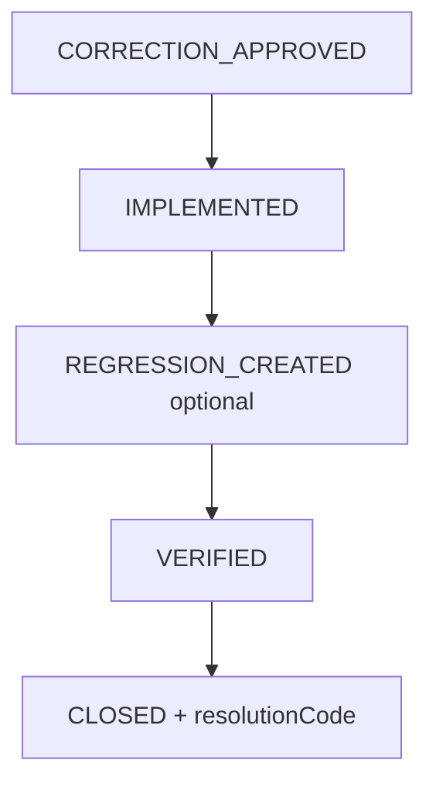

# AI Resolution Workflow

**Program:** AI Architecture Phase 6  
**Date:** 2026-07-13  
**Status:** Active  
**Source of Truth for:** Closing evaluations and classifying outcomes  
**Companions:** [`AI_EVALUATION_WORKFLOW.md`](./AI_EVALUATION_WORKFLOW.md) · [`AI_CORRECTION_WORKFLOW.md`](./AI_CORRECTION_WORKFLOW.md) · [`AI_REGRESSION_INTELLIGENCE.md`](./AI_REGRESSION_INTELLIGENCE.md)

---

## Resolution codes

Stored on `AIEvaluation.resolutionCode` when closing / diverting:

| Code | Meaning |
|------|---------|
| `IMPLEMENTED` | Proposal implemented out-of-band |
| `VERIFIED` | Behavior verified after implementation |
| `REJECTED` | Not a valid issue |
| `DUPLICATE` | Duplicate of another evaluation |
| `WONT_FIX` | Accepted limitation |
| `NOT_REPRODUCIBLE` | Cannot reproduce |
| `NEEDS_INFORMATION` | Blocked on more info |
| `ARCHIVED` | Historical archive |

Workflow status and resolution code are related but distinct: status is lifecycle position; resolution code is outcome classification.

---

## Happy path to closed

Diversions may jump to `DUPLICATE` / `REJECTED` / `CANCELLED` / `DEFERRED` / `NOT_REPRODUCIBLE` with matching resolution codes. History is append-only via `historyJson`.

---

## Regression linkage

When a correction is accepted, operators may create (or auto-create) an `AIRegressionCase` linked to execution + evaluation + correction. **No CI integration** in Phase 6 — library only.

---

## Reporting

`GET /api/admin/ai/operations/reports/workflow` returns open evaluations, average resolution time, corrections by destination/status, root-cause and label trends, provider trends, open work items, linked regressions.

Rendered on Pipeline Metrics alongside Phase 4 platform metrics.
