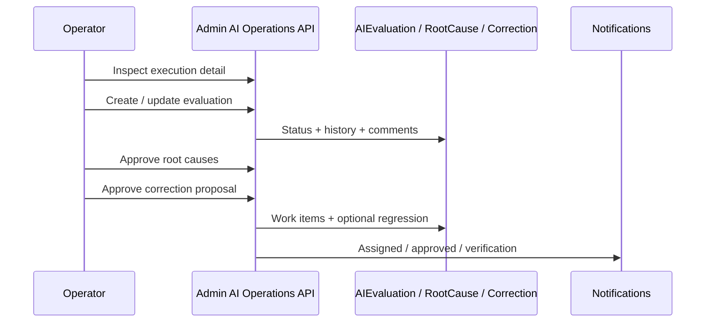

# AI Review Workflow

**Program:** AI Architecture Phase 6  
**Date:** 2026-07-13  
**Status:** Active  
**Source of Truth for:** Operator review actions on executions and evaluations  
**Companions:** [`AI_EVALUATION_WORKFLOW.md`](./AI_EVALUATION_WORKFLOW.md) · [`AI_OPERATIONS_CENTER_UX.md`](./AI_OPERATIONS_CENTER_UX.md) · [`AI_PIPELINE_OPERATOR_INFORMATION_ARCHITECTURE.md`](./AI_PIPELINE_OPERATOR_INFORMATION_ARCHITECTURE.md)

---

## Principle

Review is inspection + auditable human judgment. Operators use the existing AI Pipeline Hub — Phase 6 does **not** add a second admin product.

---

## Operator can

| Capability | Where |
|------------|--------|
| Inspect execution | Execution detail |
| Timeline / explainability / retrieval / grounding / tools / approvals / provider / context | Existing Phase 3–5 panels on execution detail |
| Attach notes / comments | Evaluation / correction patches |
| Assign reviewer | `assignedToUserId` + notification |
| Change priority / severity | Evaluation workflow patch |
| Request additional review | `requestReviewFromUserId` |
| Confirm root causes | Suggested → Approved with confidence / owner |
| Approve / reject correction proposals | Correction workflow |

Everything writes history (`historyJson` / comments). Nothing mutates Twin runtime.

---

## RBAC (review)

| Role | Review writes |
|------|----------------|
| Platform Admin | Full |
| Platform Operator | Full except settings |
| Support Engineer | Evaluations / corrections / root causes |
| Read-only Auditor | Read only |
| Future Business Reviewer | Deferred — membership-validated business scope only |

Business A cannot modify Business B review data when business scope is applied; unverified headers never grant cross-tenant access.
