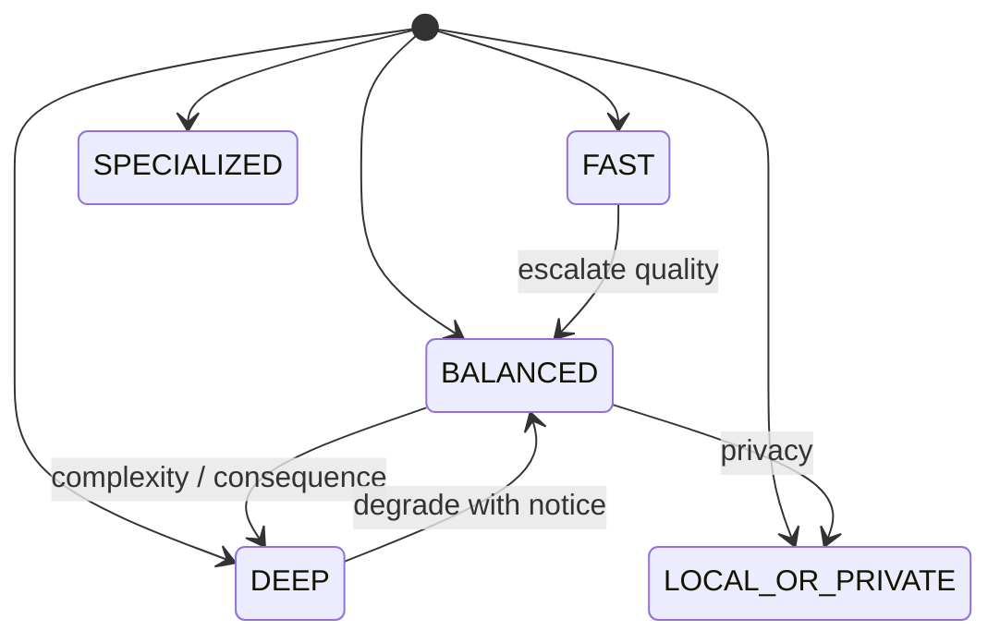

# AI Routing Tiers

**Program:** AI Architecture Phase 7  
**Date:** 2026-07-13  
**Status:** Active  
**Source of Truth for:** Logical routing tiers (not providers)  
**Code:** `server/src/ai/routing/routingTiers.ts`

---

## Tiers

| Tier | Intent | Latency | Quality | Cost | Privacy |
|------|--------|---------|---------|------|---------|
| FAST | Cheap simple work | Low | Good enough | Lowest | Standard |
| BALANCED | Default Twin | Moderate | Strong + tools | Standard | Standard |
| DEEP | Hard reasoning | Higher OK | Best | Premium | Standard |
| SPECIALIZED | Modality models | Varies | Modality best | Modality | Often elevated |
| LOCAL_OR_PRIVATE | Keep data local | Hardware-bound | Best effort | Infra | Local required |

Tiers are **not** providers. A FAST request may land on OpenAI or Anthropic catalog entries.

