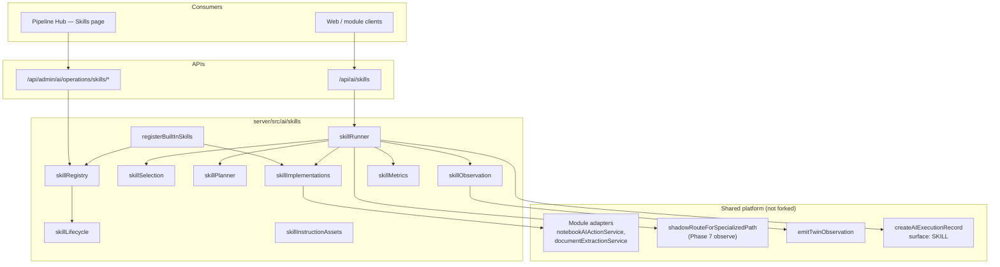
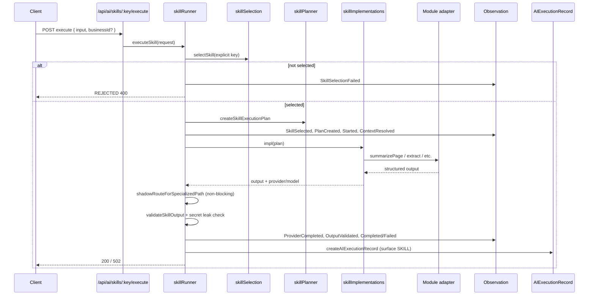
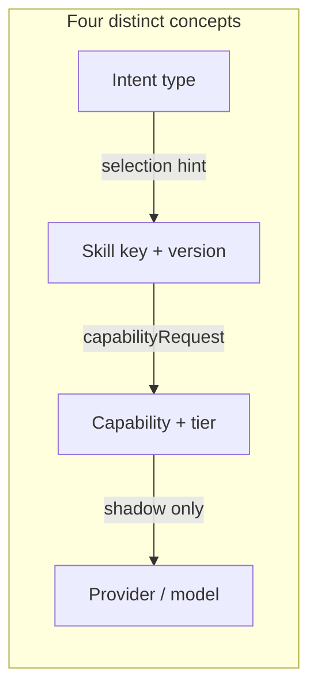

# AI Skills Architecture

**Program:** AI Architecture Phase 8  
**Date:** 2026-07-13  
**Status:** Active  
**Source of Truth for:** Skills Framework topology and request flow  
**Code:** `server/src/ai/skills/**` · types in `shared/src/types/ai-skills.ts`  
**Companion:** [`AI_SKILL_CONTRACT.md`](./AI_SKILL_CONTRACT.md) · [`AI_SKILL_EXECUTION_MODEL.md`](./AI_SKILL_EXECUTION_MODEL.md)

---

## Purpose

Phase 8 introduces **governed Skills** — versioned task contracts with declared input/output schemas, context requirements, grounding policy, capability requests, and code-owned implementations. Skills are **not** saved prompts, provider model ids, or a second conversational Twin.

Policy version: `AI_SKILLS_POLICY_VERSION` = `phase8-2026-07-13`.

---

## Architectural boundaries

| In scope (Phase 8) | Out of scope (by design) |
|--------------------|--------------------------|
| Code-first registry | Customer-created Skills |
| Three pilot Skills | AI Studio |
| Customer API `/api/ai/skills` | Industry Packs (`INDUSTRY_FUTURE` inactive) |
| Operator API `/api/admin/ai/operations/skills/*` | Prisma skill executable tables |
| Pipeline UI `/admin-portal/ai-pipeline/skills` | Live Model Router cutover |
| Observation + execution records (`surface: SKILL`) | Intent-only auto-execution when ambiguous |
| Shadow routing comparison (Phase 7) | Tool mutation rounds in pilots |

---

## Component map

---

## Startup registration

At server boot (`server/src/index.ts`):

1. `registerBuiltInSkills()` registers `PHASE8_PILOT_SKILLS` definitions into `skillRegistry`
2. `registerPilotImplementations()` binds `implementationKey` → adapter functions
3. Customer router mounts at `/api/ai/skills` (JWT required)

No database migration defines Skill behavior.

---

## End-to-end execution flow

---

## Separation of concerns

- **Intent** — coarse task classification (`AISkillIntentType`); used for conservative auto-selection when no explicit key
- **Skill** — governed contract (`AISkillDefinition`) with schemas and policies
- **Capability** — provider-neutral routing request (`AIModelCapability` + `AIRoutingTier`)
- **Provider/model** — adapter choice; production routing unchanged; shadow comparison attached post-execution

---

## APIs

### Customer (`server/src/routes/aiSkills.ts`)

| Method | Path | Purpose |
|--------|------|---------|
| GET | `/api/ai/skills` | List customer-visible ACTIVE/CERTIFIED Skills |
| GET | `/api/ai/skills/:key` | Read metadata + schemas |
| GET | `/api/ai/skills/:key/versions` | Version list (no DRAFT) |
| GET | `/api/ai/skills/:key/quality` | In-process metrics ring summary |
| POST | `/api/ai/skills/:key/execute` | Execute Skill |

### Operator (`server/src/routes/adminAiOperations.ts`)

| Method | Path | Purpose |
|--------|------|---------|
| GET | `/api/admin/ai/operations/skills/overview` | Registry + metrics + feature flags |
| GET | `/api/admin/ai/operations/skills/:key` | Full definition, versions, instruction asset |

RBAC: `operations:read` (same as other Pipeline observe endpoints).

### Pipeline UI

`web/src/app/admin-portal/ai-pipeline/skills/page.tsx` — observe-only registry browser.

---

## Observation & intelligence

- Skill events emit via `emitSkillObservation` → `emitTwinObservation` with `surface: 'SKILL'`
- Event types: `SkillSelected`, `SkillPlanCreated`, `SkillExecutionStarted`, `SkillContextResolved`, `SkillProviderCompleted`, `SkillOutputValidated`, `SkillExecutionCompleted`, `SkillExecutionFailed`, etc.
- Successful/failed runs may persist `AIExecutionRecord` when `observationPolicy.attachToExecutionRecord` is true (all pilots: true)
- In-process metrics ring (`skillMetrics.ts`, max 500 samples) powers operator summaries — not a separate warehouse

---

## Relationship to Twin

| Twin | Skills |
|------|--------|
| Conversational, multi-turn | Single-shot governed task |
| Tool rounds + approvals | Pilots: `maxToolRounds: 0`, mutations off |
| Full context assembly | Declared `contextRequirements.providers` only |
| `surface: TWIN` (typical) | `surface: SKILL` |

Skills **reuse** adapters and observation infrastructure; they do **not** instantiate `DigitalLifeTwinCore`.

---

## Phase 8 posture

- **Shipped:** registry, selection, planner, runner, three pilots, APIs, Pipeline section, tests
- **Shadow:** Model Router comparisons on Skill completion paths
- **Dual paths:** legacy module routes remain alongside Skill API
- **Future:** additional Skill candidates per [`AI_SKILL_CANDIDATE_AUDIT.md`](./AI_SKILL_CANDIDATE_AUDIT.md) — manual promotion only

---

## Related

- [`AI_SKILL_REGISTRY.md`](./AI_SKILL_REGISTRY.md)  
- [`AI_SKILL_LIFECYCLE.md`](./AI_SKILL_LIFECYCLE.md)  
- [`AI_SKILL_SECURITY_MODEL.md`](./AI_SKILL_SECURITY_MODEL.md)  
- [`AI_PHASE8_CLOSEOUT.md`](./AI_PHASE8_CLOSEOUT.md)
