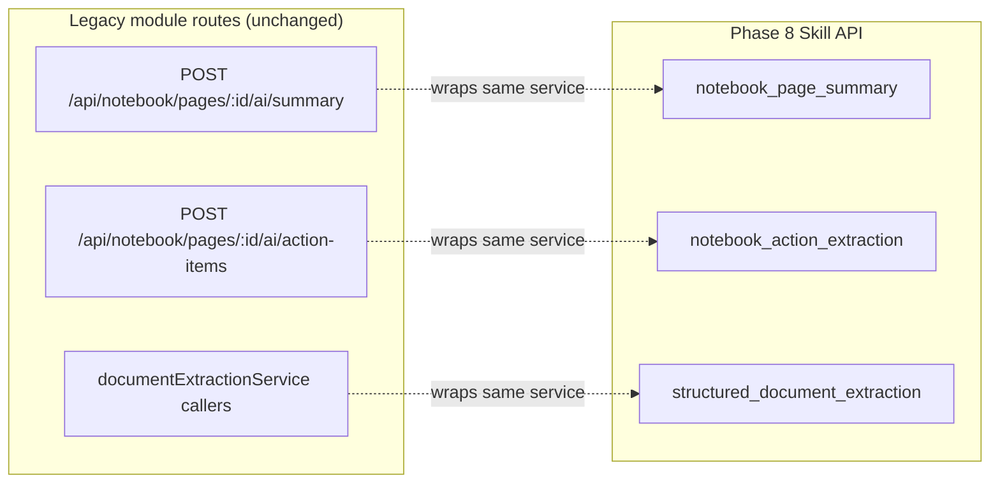
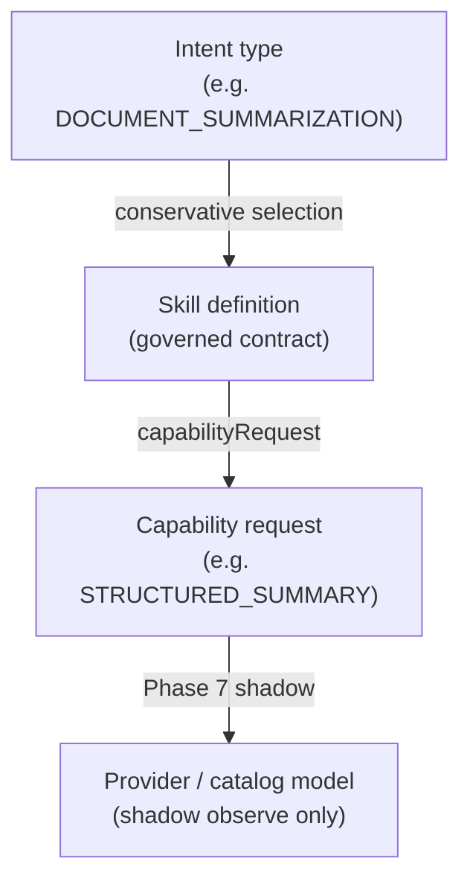

# AI Skill Candidate Audit

**Program:** AI Architecture Phase 8  
**Date:** 2026-07-13  
**Status:** Active — inventory of skill-like behaviors and classification  
**Owner:** AI Platform / Architecture council  
**Source of Truth for:** What is a Skill vs what is not; pilot selection rationale  
**Companion:** [`AI_SKILLS_ARCHITECTURE.md`](./AI_SKILLS_ARCHITECTURE.md) · [`AI_SKILL_PILOT_CATALOG.md`](./AI_SKILL_PILOT_CATALOG.md)

---

## Classification key

| Class | Meaning |
|-------|---------|
| **SKILL_CANDIDATE** | Governed task contract candidate; structured I/O, bounded context, certifiable |
| **SPECIALIZED_ADAPTER** | Module-scoped AI helper outside Twin; may wrap as Skill later |
| **DOMAIN_SERVICE** | Deterministic or hybrid business logic; not a governed Skill contract |
| **CONTEXT_PROVIDER** | Read-only context fetch for Twin or Skills |
| **TOOL** | Governed mutating action in Twin tool registry |
| **PRODUCT_WORKFLOW** | Multi-step UX that may invoke Twin, Skills, or module routes |
| **HISTORICAL** | Retired or superseded path |
| **NOT_A_SKILL** | Correctly excluded (prompt blocks, routing, provider ids, etc.) |

**Important:** This audit does **not** imply automatic migration. Each candidate requires explicit Skill definition, implementation registration, certification, and consumer cutover.

---

## Summary matrix

| Behavior | Location | Class | Pilot / status | Migration risk |
|----------|----------|-------|----------------|----------------|
| Notebook page summary | `notebookAIActionService.summarizePage` | **SKILL_CANDIDATE** | **Selected** → `notebook_page_summary` | **Low** — Skill wraps existing service; module route remains |
| Notebook action extraction | `notebookAIActionService.extractActionItems` | **SKILL_CANDIDATE** | **Selected** → `notebook_action_extraction` | **Low** — propose-only; confirm path stays separate |
| Structured document extraction | `documentExtractionService.extractInvoiceOrReceipt` | **SKILL_CANDIDATE** | **Selected** → `structured_document_extraction` | **Low** — input-in / JSON-out |
| Notebook meeting recap | `notebookAIActionService` + `/ai/meeting-recap` | **SKILL_CANDIDATE** | Not selected (Phase 8) | **Medium** — overlaps summary intent; needs distinct contract |
| Notebook suggest links | `notebookAIActionService` + `/ai/suggest-links` | **SPECIALIZED_ADAPTER** | Deferred | **Medium** — graph/link semantics |
| Drive Ask AI | Drive UI → Twin chat with file pre-attach | **PRODUCT_WORKFLOW** | N/A | **High** — conversational; not a bounded Skill |
| Drive AI actions | `driveAIActionService` (create/move/share) | **TOOL** | N/A | N/A — governed Twin tools |
| Drive context providers | `/api/drive/ai/context/*` | **CONTEXT_PROVIDER** | N/A | N/A |
| Todo prioritization | `todoAIPrioritizationService` + `/ai/prioritize/*` | **SKILL_CANDIDATE** | Deferred | **Medium** — mutation execute path; approval coupling |
| Calendar context | `/api/calendar/ai/context/*` | **CONTEXT_PROVIDER** | N/A | N/A |
| Calendar availability query | `/api/calendar/ai/query/availability` | **DOMAIN_SERVICE** | N/A | Low if ever wrapped |
| Meeting prep signals | `userLearningSignalService` / correlation rules | **DOMAIN_SERVICE** | N/A | N/A |
| Place meetings | `placeService` + domain events | **DOMAIN_SERVICE** | N/A | N/A — SoR, not AI task |
| Local / general discovery | `aiRetrievalConsumerContract` + grounding | **CONTEXT_PROVIDER** | N/A | N/A — retrieval intent, not Skill |
| Conversation recommendations | `conversationReasoningLayer` + richness policy | **NOT_A_SKILL** | N/A | N/A — Twin behavior policy |
| Scheduling recommendations | `schedulingPhilosophyService` | **DOMAIN_SERVICE** | N/A | N/A — deterministic heuristics |
| Business AI recommendations | `BusinessAIDigitalTwinService` | **DOMAIN_SERVICE** | N/A | N/A — insight aggregation |
| Twin prompt blocks | `server/src/ai/prompts/*` | **NOT_A_SKILL** | N/A | N/A — instruction assets for Twin |
| Skill instruction assets | `skillInstructionAssets.ts` | **NOT_A_SKILL** | Phase 8 support | N/A — metadata for Skills, not executable Skills |
| Module `/ai/context/*` routes | chat, calendar, drive, workforce-comms, etc. | **CONTEXT_PROVIDER** | N/A | N/A |
| Module `/ai/query/*` routes | bounded reads | **DOMAIN_SERVICE** / **CONTEXT_PROVIDER** | N/A | Case-by-case |
| Centralized AI / autonomous | retired routes | **HISTORICAL** | N/A | N/A |
| Provider model ids | `modelCatalog`, env overrides | **NOT_A_SKILL** | N/A | N/A — Capability ≠ Skill |
| Model Router shadow | `shadowRouteForSpecializedPath` | **NOT_A_SKILL** | Phase 7 observe-only | N/A |

---

## Selected pilots (Phase 8)

Three behaviors were promoted to governed Skills. Legacy module routes **remain**; Skills add a parallel governed path via `/api/ai/skills`.

| Pilot key | Wraps | Dual-path note |
|-----------|-------|----------------|
| `notebook_page_summary` | `summarizePage` | Module route and Skill API both callable |
| `notebook_action_extraction` | `extractActionItems` | Confirm/create todos **excluded** (`confirmExtractedActionItems` prohibited) |
| `structured_document_extraction` | `extractInvoiceOrReceipt` | Text-in only; no Drive file resolution in Skill input |

---

## Detailed notes by area

### Notebook

| Route / function | Class | Notes |
|------------------|-------|-------|
| `POST .../ai/summary` | SKILL_CANDIDATE | Pilot selected; intent `DOCUMENT_SUMMARIZATION` |
| `POST .../ai/action-items` | SKILL_CANDIDATE | Pilot selected; intent `ACTION_EXTRACTION` |
| `POST .../ai/action-items/confirm` | **TOOL** / workflow | Mutating; must never be inside propose-only Skill |
| `POST .../ai/meeting-recap` | SKILL_CANDIDATE | Intent overlap with `MEETING_RECAP`; not piloted |
| `POST .../ai/suggest-links` | SPECIALIZED_ADAPTER | Structured but graph-sensitive |

**Migration risk (Notebook):** Low for summary/extraction (adapter already exists). Meeting recap needs separate evaluation profile and output schema before Skill promotion.

### Drive

| Surface | Class | Notes |
|---------|-------|-------|
| "Ask AI about this file" (UI) | PRODUCT_WORKFLOW | Opens Twin with attachment context — conversational |
| `driveAIActionService` mutations | TOOL | Policy + `governedToolExecutor` |
| `/api/drive/ai/context/*` | CONTEXT_PROVIDER | Feeds Twin context assembly |

**Migration risk (Drive):** High for Ask AI — bounded Skill would require file-scoped input schema, grounding policy, and non-conversational output; not attempted in Phase 8.

### Document extraction

| Surface | Class | Notes |
|---------|-------|-------|
| `extractInvoiceOrReceipt` | SKILL_CANDIDATE | Pilot selected; Zod-validated output |
| Drive-triggered extraction UX | PRODUCT_WORKFLOW | May call service directly today |

**Migration risk:** Low for service wrapper; consumers must opt into Skill API explicitly.

### Todo prioritization

| Route | Class | Notes |
|-------|-------|-------|
| `GET /ai/prioritize/suggestions` | SKILL_CANDIDATE | Read-heavy suggestions |
| `POST /ai/prioritize/analyze` | SKILL_CANDIDATE | Structured analysis output |
| `POST /ai/prioritize/execute` | TOOL | Mutations — approval territory |
| `POST /ai/prioritize/feedback` | DOMAIN_SERVICE | Telemetry |

**Migration risk:** Medium — `execute` path couples to priority mutations; Skill would need strict `mutationsDefaultOff` and separate confirmation Skill or tool.

### Calendar & meetings

| Surface | Class | Notes |
|---------|-------|-------|
| `/api/calendar/ai/context/upcoming` | CONTEXT_PROVIDER | |
| `/api/calendar/ai/context/today` | CONTEXT_PROVIDER | |
| `/api/calendar/ai/query/availability` | DOMAIN_SERVICE | |
| Place meeting CRUD + events | DOMAIN_SERVICE | Not AI Skills |
| Notebook meeting recap | SKILL_CANDIDATE | AI summarization of page content |

### Recommendations & discovery

| Surface | Class | Notes |
|---------|-------|-------|
| `shouldSuppressRecommendationRichness` | NOT_A_SKILL | Twin coaching policy |
| `schedulingPhilosophyService.generateRecommendations` | DOMAIN_SERVICE | Rule-based schedules |
| `local_discovery` / `general_discovery` retrieval | CONTEXT_PROVIDER | Intent for retrieval, not Skill registry |
| `SmartPatternEngine` | DOMAIN_SERVICE | Pattern analytics |

### Prompts & instructions

| Asset | Class | Notes |
|-------|-------|-------|
| `notebookAIPromptBuilder` | NOT_A_SKILL | Implementation detail inside adapter |
| `server/src/ai/prompts/*` | NOT_A_SKILL | Twin system blocks |
| `skillInstructionAssets.ts` | NOT_A_SKILL | Operator-visible instruction metadata keyed by `instructionAssetKey` |

### Module AI routes (pattern)

Most modules expose:

- **`/api/{module}/ai/context/*`** → CONTEXT_PROVIDER (fast, bounded, auth'd)
- **`/api/{module}/ai/query/*`** → DOMAIN_SERVICE or CONTEXT_PROVIDER
- **Specialized completion helpers** → SPECIALIZED_ADAPTER or SKILL_CANDIDATE

Skills **consume** context providers via `contextRequirements.providers`; they do not replace provider routes.

---

## Intent vs Skill vs Capability vs Provider

| Layer | Example | Owned by |
|-------|---------|----------|
| Intent | `ACTION_EXTRACTION` | Selection input; not executable alone |
| Skill | `notebook_action_extraction@1.0.0` | Registry + certification |
| Capability | `STRUCTURED_EXTRACTION` + `BALANCED` tier | Phase 7 capability model |
| Provider | `openai` + `gpt-4o-mini` | Adapter; production unchanged |

---

## Explicit non-candidates (Phase 8)

- **AI Studio** — not implemented  
- **Industry Packs** — `INDUSTRY_FUTURE` scope inactive  
- **Customer-created Skills** — registry is code-first only  
- **Prisma skill executable tables** — no DB-backed Skill execution definitions  
- **Second Twin** — Skill runner is a dedicated execution path, not conversational fork  

---

## Related

- [`AI_SKILL_PILOT_CATALOG.md`](./AI_SKILL_PILOT_CATALOG.md)  
- [`AI_PHASE8_CLOSEOUT.md`](./AI_PHASE8_CLOSEOUT.md)  
- [`AI_MODEL_ROUTER_ARCHITECTURE.md`](./AI_MODEL_ROUTER_ARCHITECTURE.md) (shadow only)
