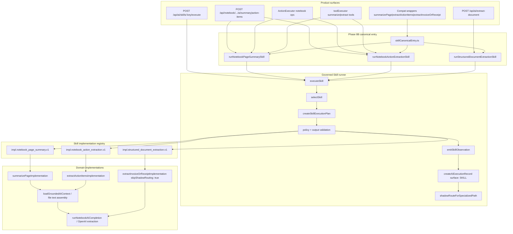
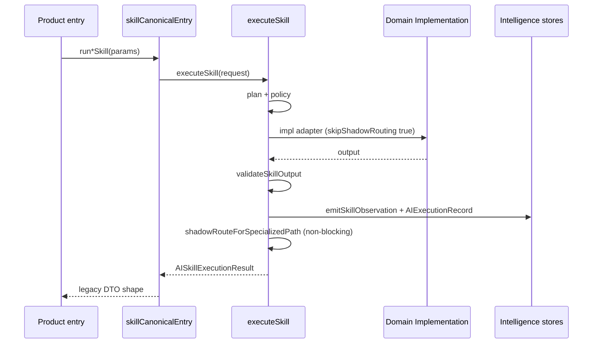

# AI Skill Canonical Execution Model (Phase 8B)

**Program:** AI Architecture Phase 8B  
**Date:** 2026-07-14  
**Status:** Active  
**Source of Truth for:** Product → Skill runner → domain implementation flow for certified pilots  
**Code:** `skillCanonicalEntry.ts` · `skillRunner.ts` · `skillImplementations.ts` · domain `*Implementation`  
**Companion:** [`AI_SKILL_EXECUTION_MODEL.md`](./AI_SKILL_EXECUTION_MODEL.md) (Phase 8 runner internals) · [`AI_SKILL_PRODUCTIZATION.md`](./AI_SKILL_PRODUCTIZATION.md)

---

## Principle

Phase 8B makes **product surfaces** converge on one execution spine:

1. **Canonical entry** — stable helper per pilot (`skillCanonicalEntry.ts`)  
2. **Governed runner** — `executeSkill` owns policy, observation, execution record, shadow routing  
3. **Domain implementation** — existing Notebook/document LLM logic; no second observation layer  

This is **not** a Twin rewrite and **not** Model Router live cutover.

---

## End-to-end flow (all three pilots)

---

## Per-pilot call graph

### `notebook_page_summary`

| Step | Component | File |
|------|-----------|------|
| 1 | HTTP `postPageSummary` or Twin/tool | `notebookAIController.ts`, `ActionExecutor.ts`, `toolExecutor.ts` |
| 2 | `runNotebookPageSummarySkill({ pageId, userId, ... })` | `skillCanonicalEntry.ts` |
| 3 | `executeSkill({ skillKey: 'notebook_page_summary', input: { pageId }, moduleId: 'notebook' })` | `skillRunner.ts` |
| 4 | `impl.notebook_page_summary.v1` | `skillImplementations.ts` |
| 5 | `summarizePageImplementation(pageId, userId)` | `notebookAIActionService.ts` |
| 6 | Return DTO mapped from Skill output | `skillCanonicalEntry.ts` |

### `notebook_action_extraction`

Same spine; input may include `selectedText`. Output is **proposals only** — confirm path is outside this graph (see deferred paths in productization audit).

### `structured_document_extraction`

| Step | Component | File |
|------|-----------|------|
| 1 | `/api/ai/extract-document` assembles file text | `routes/ai.ts` |
| 2 | `runStructuredDocumentExtractionSkill({ documentText, documentType, userId })` | `skillCanonicalEntry.ts` |
| 3 | `executeSkill({ skillKey: 'structured_document_extraction', ... })` | `skillRunner.ts` |
| 4 | `impl.structured_document_extraction.v1` | `skillImplementations.ts` |
| 5 | `extractInvoiceOrReceiptImplementation(..., { skipShadowRouting: true })` | `documentExtractionService.ts` |

---

## Observation and routing boundaries

**Rule:** Domain `*Implementation` must **not** emit Skill-surface execution records or shadow comparisons when called from Skill adapters. The runner is the single IO boundary for governed telemetry.

---

## Parallel path: Skill API

`POST /api/ai/skills/:key/execute` (`routes/aiSkills.ts`) calls `executeSkill` **directly**, bypassing `skillCanonicalEntry.ts`. It is equivalent at the runner layer but returns the full `AISkillExecutionResult` envelope.

Product module routes use canonical entry helpers for **DTO stability** and existing error mapping (`NotebookAIServiceError`, HTTP status codes).

---

## Explicitly outside this model

| Path | Why excluded |
|------|--------------|
| `confirmExtractedActionItems` | Mutation + todo SoR; HTTP-only confirm |
| `generateMeetingRecap` | Not certified as Skill in 8B |
| `suggestLinks` | Specialized adapter |
| `DigitalLifeTwinCore` conversational loop | Twin unchanged |
| Model Router live provider selection | `productionRoutingUnchanged: true` |

---

## Related documents

- Entry-point audit: [`AI_SKILL_PRODUCTIZATION_AUDIT.md`](./AI_SKILL_PRODUCTIZATION_AUDIT.md)  
- Runner layer detail: [`AI_SKILL_EXECUTION_MODEL.md`](./AI_SKILL_EXECUTION_MODEL.md)  
- Quality from execution records: [`AI_SKILL_QUALITY_MODEL.md`](./AI_SKILL_QUALITY_MODEL.md)
