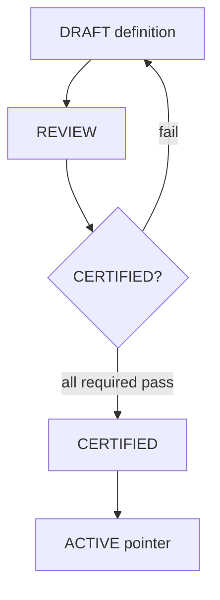

# AI Skill Certification Standard

**Program:** AI Architecture Phase 8  
**Date:** 2026-07-13  
**Status:** Active  
**Source of Truth for:** Requirements to certify a Skill for `CERTIFIED` / `ACTIVE`  
**Companion:** [`AI_PHASE8_SKILLS_CERTIFICATION_MATRIX.md`](./AI_PHASE8_SKILLS_CERTIFICATION_MATRIX.md)

---

## Purpose

Certification proves a Skill is safe to execute under platform law: tenant boundaries, grounding, schema discipline, observation, and explicit non-mutation posture where required.

---

## Certification gates

Operator promotion in Phase 8 is **code registration + review**; no self-service certification UI.

---

## Required checklist (all Skills)

| # | Requirement | Evidence |
|---|-------------|----------|
| 1 | Complete `AISkillDefinition` per [`AI_SKILL_CONTRACT.md`](./AI_SKILL_CONTRACT.md) | TypeScript definition file |
| 2 | `scope` is `PLATFORM` or `MODULE_INTERNAL` only | Registry registration succeeds |
| 3 | `inputSchema` + `outputSchema` documented and validated | Planner + `validateSkillOutput` tests |
| 4 | `contextRequirements.minNecessary === true` | Runner assert |
| 5 | `implementationKey` registered | `skillImplementations.ts` |
| 6 | `instructionAssetKey` present for operator review | `skillInstructionAssets.ts` |
| 7 | Tenant/auth path uses `userId` (+ `businessId` when required) | Implementation + API JWT |
| 8 | Module SoR reads go through existing authorized services | Adapter code review |
| 9 | `observationPolicy.emitSkillEvents === true` | Observation events in runner |
| 10 | `attachToExecutionRecord` decision documented | Execution record fields |
| 11 | `evaluationProfile` with prohibited claims | Definition + tests |
| 12 | Secret leak check enabled when `privacyPolicy.redactSecrets` | `detectSecretLeak` |
| 13 | Tool policy explicit (`maxToolRounds`, prohibited tools) | Definition |
| 14 | Phase 8 tests cover happy + reject paths | `skillsPhase8.test.ts` |
| 15 | Added to [`AI_SKILL_CANDIDATE_AUDIT.md`](./AI_SKILL_CANDIDATE_AUDIT.md) disposition | Doc update |

---

## Read-only / propose-only Skills (Phase 8 pilots)

Additional requirements:

| # | Requirement |
|---|-------------|
| R1 | `allowedTools` empty, `maxToolRounds: 0` |
| R2 | `mutationsDefaultOff: true` |
| R3 | `prohibitedTools` includes `*` or named mutating tools |
| R4 | No call paths to confirm/create mutations in implementation |
| R5 | `certificationNotes` documents wrapped service and exclusions |

---

## Grounding certification

| `groundingPolicy` | Certification expectation |
|-------------------|---------------------------|
| `sourceCitationRequired: true` | Output includes citations or citedSources |
| `refuseWhenUngrounded: true` | Runner fails when `groundingFailed` |
| `allowSpeculation: false` | No fabricated SoR content in tests |

---

## Capability certification

- `capabilityRequest` must use valid `AIModelCapability` + `AIRoutingTier` from Phase 7 taxonomy  
- Shadow routing comparison must not block execution  
- Document actual adapter model env vars in `certificationNotes` (operational, not contract)  

---

## Customer visibility certification

Before `customerVisible: true`:

| Check | |
|-------|---|
| `internalOnly: false` | |
| `description` accurate for end users | |
| Input schema fields documented | |
| No operator-only secrets in schemas | |
| Customer API 404 rules verified for non-visible statuses | |

---

## Deprecation certification

When superseding a Skill:

1. New version passes full checklist  
2. Prior version → `DEPRECATED` with `replacementKey`  
3. Metrics monitored for old version executions  
4. Audit doc updated — **manual consumer cutover**  

---

## Anti-patterns (automatic fail)

| Anti-pattern | Why |
|--------------|-----|
| Provider model id in Skill `key` | Capability layer owns routing |
| Prompt text as Skill `key` | Skills are contracts, not prompts |
| DB-stored executable logic | Phase 8 code-first only |
| Twin Core invocation inside runner | Boundary violation |
| Silent auto-migration from legacy routes | Dual-path only |
| Missing tenant scoping in adapter | Trust boundary violation |
| `INDUSTRY_FUTURE` scope | Inactive in Phase 8 |

---

## Sign-off roles

| Role | Responsibility |
|------|----------------|
| Skill owner (`owner` field) | Definition accuracy, adapter correctness |
| AI Platform | Runner, observation, record surface |
| Security review | Tool policy, secret leak, tenant scope |
| Operator | Pipeline visibility, metrics sanity |

---

## Related

- [`AI_SKILL_LIFECYCLE.md`](./AI_SKILL_LIFECYCLE.md)  
- [`AI_PHASE8_SKILLS_CERTIFICATION_MATRIX.md`](./AI_PHASE8_SKILLS_CERTIFICATION_MATRIX.md)  
- [`AI_PLATFORM_ARCHITECTURE_CERTIFICATION.md`](./AI_PLATFORM_ARCHITECTURE_CERTIFICATION.md)
