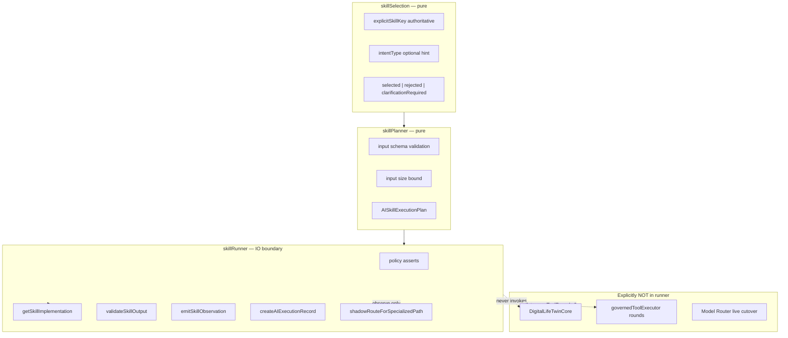

# AI Skill Execution Model

**Program:** AI Architecture Phase 8  
**Date:** 2026-07-13  
**Status:** Active  
**Source of Truth for:** Selection → plan → runner boundaries  
**Code:** `skillSelection.ts` · `skillPlanner.ts` · `skillRunner.ts` · `routes/aiSkills.ts`

---

## Principle

Skill execution is a **dedicated governed path** — not a second Twin, not silent intent routing, not provider selection override.

Customer entry: **`POST /api/ai/skills/:key/execute`**

---

## Layer boundaries



| Layer | Side effects | Responsibility |
|-------|--------------|----------------|
| **Selection** | none | Resolve Skill key+version |
| **Planner** | none | Build immutable plan from definition + input |
| **Runner** | yes | Policy, adapter call, validation, observation, records |
| **Implementation** | yes (adapter) | Module-specific AI work |

---

## Selection model

### Authoritative rule

**Explicit `skillKey` (API path param) is authoritative.** The customer execute route always passes `request.skillKey` from the URL.

`selectSkill` behavior:

| Input | Result |
|-------|--------|
| Explicit key found + executable | `selected`, reason `explicit_invocation`, confidence `1` |
| Explicit key missing | `rejected`, reason `explicit_not_found` |
| Explicit key `SUSPENDED` / `RETIRED` / `DRAFT` | `rejected` |
| Business required but missing | `rejected`, reason `business_membership_required` |
| No explicit key + no `intentType` | `clarificationRequired: true` |
| `intentType` + single eligible Skill | `selected`, reason `unique_intent_match`, confidence `0.85` |
| `intentType` + multiple eligible | `clarificationRequired: true`, reason `ambiguous_intent` |
| `preferShadowAutoSelect` + ambiguous | shadow select first with `clarificationRequired: true` |

**Customer API does not expose intent-only execution** — path always includes `:key`.

### Intent-based selection (internal / future)

Intent selection is **conservative**:

- Filters `executableOnly: true`
- Enforces `businessMembershipRequired`
- Enforces `MODULE_INTERNAL` `moduleIds` when `moduleId` provided
- **Never** silently auto-executes when multiple candidates match (unless shadow mode flag)

---

## Planning model

`createSkillExecutionPlan` produces:

| Plan field | Source |
|------------|--------|
| `executionId` | `randomUUID()` |
| `policyVersion` | `AI_SKILLS_POLICY_VERSION` |
| `normalizedInput` | shallow copy of validated input |
| `requiredContextProviders` | `contextRequirements.providers` |
| `requiredKnowledgeSources` | derived from `knowledgeRequirements` flags |
| `groundingRequirements` | copy of `groundingPolicy` |
| `capabilityRequest` | copy from definition |
| `allowedTools` | copy from definition |
| `timeoutMs` | `timeoutPolicy.hardTimeoutMs` |
| `implementationKey` | from definition |

Validation failures return `{ ok: false, error }` before any adapter call.

---

## Runner model

### Pre-execution asserts

1. `assertNoUnauthorizedTools` — allow/prohibit consistency  
2. `assertNoUndeclaredContext` — `minNecessary` must be true  
3. Executable status check (excluding hard rejects for `SUSPENDED` / `RETIRED`)

### Execution sequence

1. `SkillSelected` observation  
2. Plan creation → `SkillPlanCreated`  
3. `SkillExecutionStarted`  
4. `SkillContextResolved` (declared providers/knowledge)  
5. Implementation invoke  
6. Shadow routing comparison (non-blocking, Phase 7)  
7. `SkillProviderCompleted`  
8. Output validation + secret leak check → `SkillOutputValidated`  
9. `SkillExecutionCompleted` or `SkillExecutionFailed`  
10. Metrics sample + optional `AIExecutionRecord`

### HTTP mapping (`aiSkills.ts`)

| Result status | HTTP |
|---------------|------|
| `COMPLETED` + `ok: true` | 200 |
| `REJECTED` | 400 |
| `FAILED` | 502 |

---

## Execution record surface

When `observationPolicy.attachToExecutionRecord` is true:

```typescript
createAIExecutionRecord(prisma, {
  surface: 'SKILL',
  userQuery: `skill:${plan.skillKey}`,
  routingSummary: { shadow?, capabilityRequest, productionUnchanged: true },
  diagnosticsSummary: { skillKey, skillVersion, evaluationProfileId, selectionReason, ... },
  learningSignals: { skillKey, skillVersion, instructionAssetKey, owner },
});
```

Persist failures are **non-blocking** (logged, execution result still returned).

---

## Shadow routing (Phase 7)

After implementation returns `provider` + `model`:

```typescript
shadowRouteForSpecializedPath({
  capability: plan.capabilityRequest.primary,
  currentProvider: provider,
  currentModel: model,
  surface: `SKILL:${plan.skillKey}`,
  extra: { tier: plan.capabilityRequest.tier },
});
```

- Attached to result as `shadowRouting`  
- Recorded in metrics as `routerShadowAgreement`  
- **Does not** change which model the adapter used  

---

## Not a second Twin

| Concern | Twin path | Skill path |
|---------|-----------|------------|
| Entry | Chat message | `POST .../execute` with schema input |
| Orchestration | `DigitalLifeTwinCore` | `skillRunner` only |
| Multi-turn | yes | no |
| Tool loops | yes | pilots: disabled |
| Context | full assembly | declared providers |
| Conversation id | primary | optional metadata |
| Surface | `TWIN` / chat | `SKILL` |

Skills may share **adapters** (e.g. `summarizePage`) with legacy module routes; they do not share Twin orchestration.

---

## Dual-path coexistence

Legacy routes (e.g. `POST /api/notebook/pages/:pageId/ai/summary`) remain operational. Skill API wraps the same services with additional governance layers. Consumers choose explicitly; **no auto-migration**.

---

## Related

- [`AI_SKILLS_ARCHITECTURE.md`](./AI_SKILLS_ARCHITECTURE.md)  
- [`AI_SKILL_SECURITY_MODEL.md`](./AI_SKILL_SECURITY_MODEL.md)  
- [`AI_MODEL_ROUTER_ARCHITECTURE.md`](./AI_MODEL_ROUTER_ARCHITECTURE.md)
