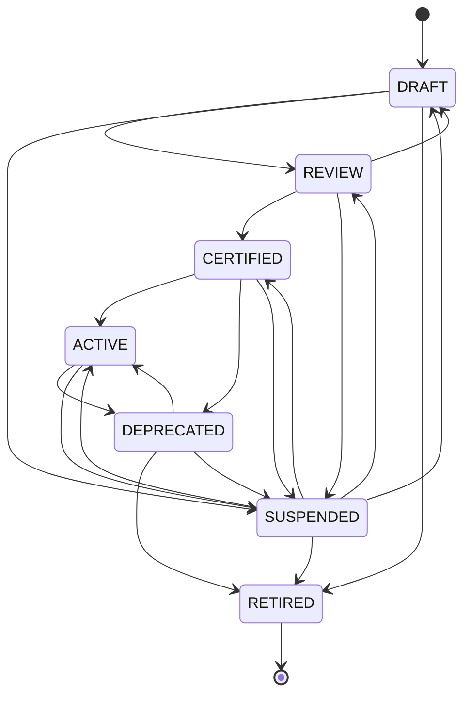

# AI Skill Lifecycle

**Program:** AI Architecture Phase 8  
**Date:** 2026-07-13  
**Status:** Active  
**Source of Truth for:** Skill status machine and legal transitions  
**Code:** `server/src/ai/skills/skillLifecycle.ts`

---

## Statuses

| Status | Executable | Customer-visible | Meaning |
|--------|------------|------------------|---------|
| `DRAFT` | no | no | Work in progress; not registered for execution |
| `REVIEW` | no | no | Awaiting certification review |
| `CERTIFIED` | **yes** | if `customerVisible` | Passed certification; may execute |
| `ACTIVE` | **yes** | if `customerVisible` | Production-active version pointer |
| `DEPRECATED` | yes* | limited | Superseded; still executable with caution |
| `SUSPENDED` | no | no | Emergency stop |
| `RETIRED` | no | no | Permanently off; terminal |

\* `DEPRECATED` remains executable in Phase 8 for graceful cutover; runner allows with warning posture in ops.

---

## Executable definition

```typescript
isExecutableStatus(status) => status === 'ACTIVE' || status === 'CERTIFIED'
```

Customer list API filters to `ACTIVE` or `CERTIFIED` only. Explicit execute rejects `SUSPENDED`, `RETIRED`, `DRAFT`.

---

## Transition graph



---

## Legal transitions (code-enforced)

| From | To (allowed) |
|------|----------------|
| `DRAFT` | `REVIEW`, `SUSPENDED`, `RETIRED` |
| `REVIEW` | `CERTIFIED`, `DRAFT`, `SUSPENDED` |
| `CERTIFIED` | `ACTIVE`, `DEPRECATED`, `SUSPENDED` |
| `ACTIVE` | `DEPRECATED`, `SUSPENDED` |
| `DEPRECATED` | `RETIRED`, `SUSPENDED`, `ACTIVE` |
| `SUSPENDED` | `DRAFT`, `REVIEW`, `CERTIFIED`, `ACTIVE`, `RETIRED` |
| `RETIRED` | *(none)* |

Illegal transitions return `{ ok: false, error: 'Illegal skill status transition: X → Y' }` from `assertSkillStatusTransition`.

**Phase 8 note:** Transitions are validated in code and tests; operator UI does not yet expose a mutation API — status changes require code registration updates.

---

## Immutability after publish

```typescript
IMMUTABLE_AFTER = { CERTIFIED, ACTIVE, DEPRECATED, RETIRED }
```

Published versions are **immutable** definitions. To change behavior:

1. Register a **new version** (e.g. `1.1.0`) with updated fields  
2. Certify and activate the new version  
3. Deprecate the prior active pointer  

Do not edit frozen `AISkillDefinition` objects in place after certification.

---

## Version pointers

`skillRegistry` maintains per-key pointers:

| Pointer field | Meaning |
|---------------|---------|
| `activeVersion` | Version returned by `getSkillDefinition(key)` without version |
| `certifiedVersions` | All versions ever `CERTIFIED` or `ACTIVE` |

When a new `ACTIVE` version registers, it becomes the active pointer. Older versions remain addressable by explicit version.

---

## Operational playbooks

### Promote pilot → ACTIVE

1. Complete certification checklist ([`AI_SKILL_CERTIFICATION_STANDARD.md`](./AI_SKILL_CERTIFICATION_STANDARD.md))  
2. Register definition with `status: 'ACTIVE'` and `activatedAt`  
3. Ensure `implementationKey` registered in `skillImplementations`  
4. Deploy; verify Pipeline Skills overview counts  

### Deprecate

1. Register successor version as `ACTIVE`  
2. Set prior version `DEPRECATED` + `deprecatedAt` + `replacementKey`  
3. Monitor metrics ring for lingering consumers on old version  

### Emergency suspend

1. Change status to `SUSPENDED` in code registration (requires deploy)  
2. Runner rejects with `Skill suspended`  
3. Investigate; resume via `SUSPENDED → ACTIVE` or `CERTIFIED`  

### Retire

1. `DEPRECATED → RETIRED` when no executions expected  
2. Set `retiredAt`; customer API returns 404  

---

## Relationship to certification matrix

Lifecycle gates align with [`AI_PHASE8_SKILLS_CERTIFICATION_MATRIX.md`](./AI_PHASE8_SKILLS_CERTIFICATION_MATRIX.md):

- `DRAFT` / `REVIEW` — pre-certification  
- `CERTIFIED` — matrix requirements satisfied  
- `ACTIVE` — production pointer for pilots  

---

## Related

- [`AI_SKILL_REGISTRY.md`](./AI_SKILL_REGISTRY.md)  
- [`AI_SKILL_CERTIFICATION_STANDARD.md`](./AI_SKILL_CERTIFICATION_STANDARD.md)
