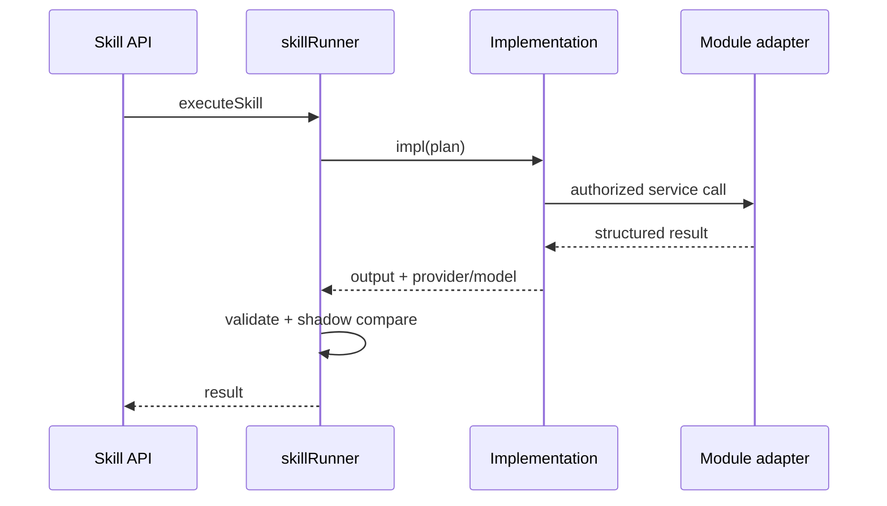

# AI Skill Pilot Catalog

**Program:** AI Architecture Phase 8  
**Date:** 2026-07-13  
**Status:** Active  
**Source of Truth for:** Shipped pilot Skills (v1.0.0)  
**Code:** `server/src/ai/skills/pilotSkillDefinitions.ts`

---

## Overview

Phase 8 ships **three** pilot Skills. All are `ACTIVE`, `customerVisible`, read-only or propose-only, with `maxToolRounds: 0`.

| Key | Version | Scope | Owner | Intent types |
|-----|---------|-------|-------|--------------|
| `notebook_page_summary` | 1.0.0 | `MODULE_INTERNAL` | `module:notebook` | `DOCUMENT_SUMMARIZATION`, `MEETING_RECAP` |
| `notebook_action_extraction` | 1.0.0 | `MODULE_INTERNAL` | `module:notebook` | `ACTION_EXTRACTION` |
| `structured_document_extraction` | 1.0.0 | `PLATFORM` | `platform:ai` | `STRUCTURED_DOCUMENT_EXTRACTION` |

---

## `notebook_page_summary`

**Purpose:** Summarize an authorized Notebook page with key decisions, open tasks, and risks.

| Attribute | Value |
|-----------|-------|
| Implementation | `impl.notebook_page_summary.v1` → `summarizePage` |
| Instruction asset | `notebook_page_summary.instructions.v1` |
| Capability | `STRUCTURED_SUMMARY` + `LONG_CONTEXT`, tier `BALANCED` |
| Context providers | `notebook` |
| SoR reads | `notebook.page` |
| Grounding | Citations required; refuse when ungrounded |

### Input schema

| Field | Type | Required |
|-------|------|----------|
| `pageId` | string | yes |

### Output schema (required fields)

| Field | Type |
|-------|------|
| `summary` | string |
| `keyDecisions` | string[] |
| `openTasks` | string[] |
| `risksAndFollowUps` | string[] |
| `warnings` | string[] |

Optional: `citedSources`, `uncertainties`

### API

- Customer: `POST /api/ai/skills/notebook_page_summary/execute`
- Legacy: `POST /api/notebook/pages/:pageId/ai/summary` (unchanged)

### Evaluation profile

`eval.notebook_page_summary.v1` — grounding, schema, completeness; prohibits `fabricated_page_content`

---

## `notebook_action_extraction`

**Purpose:** Extract proposed action items from an authorized Notebook page. **Does not create Todos.**

| Attribute | Value |
|-----------|-------|
| Implementation | `impl.notebook_action_extraction.v1` → `extractActionItems` |
| Instruction asset | `notebook_action_extraction.instructions.v1` |
| Capability | `STRUCTURED_EXTRACTION` + `STRUCTURED_SUMMARY`, tier `BALANCED` |
| Prohibited tools | `confirm_extracted_action_items`, `todo.create` |
| Grounding | Citations encouraged; does not refuse on ungrounded (empty proposals allowed) |

### Input schema

| Field | Type | Required |
|-------|------|----------|
| `pageId` | string | yes |
| `selectedText` | string | no |

### Output schema (required fields)

| Field | Type |
|-------|------|
| `proposals` | array of `{ title, description?, dueDate?, priority? }` |
| `warnings` | string[] |

Optional: `unresolvedQuestions`

### API

- Customer: `POST /api/ai/skills/notebook_action_extraction/execute`
- Legacy: `POST /api/notebook/pages/:pageId/ai/action-items` (unchanged)
- **Excluded:** `POST .../action-items/confirm` — mutation workflow, not a Skill

### Evaluation profile

`eval.notebook_action_extraction.v1` — prohibits `auto_created_todo`

---

## `structured_document_extraction`

**Purpose:** Extract structured invoice/receipt fields from provided document text.

| Attribute | Value |
|-----------|-------|
| Implementation | `impl.structured_document_extraction.v1` → `extractInvoiceOrReceipt` |
| Instruction asset | `structured_document_extraction.instructions.v1` |
| Capability | `STRUCTURED_EXTRACTION`, tier `BALANCED` |
| Context providers | none (text-in only) |
| SoR reads | none |
| Grounding | Refuse when ungrounded |

### Input schema

| Field | Type | Required | Constraints |
|-------|------|----------|-------------|
| `documentText` | string | yes | |
| `documentType` | string | yes | enum: `invoice`, `receipt` |

### Output schema

| Field | Type | Required |
|-------|------|----------|
| `success` | boolean | yes |
| `data` | object | when success |
| `error` | string | when failure |

`additionalProperties: true` on output (Zod-validated adapter shape)

### API

- Customer: `POST /api/ai/skills/structured_document_extraction/execute`
- Legacy: direct `documentExtractionService` callers (unchanged)

### Evaluation profile

`eval.structured_document_extraction.v1` — schema + grounding

---

## Shared pilot policies

All pilots share:

| Policy | Value |
|--------|-------|
| `privacyPolicy.redactSecrets` | true |
| `timeoutPolicy` | soft 45s / hard 90s |
| `costPolicy.costTierHint` | `standard` |
| `observationPolicy` | emit events + attach execution record |
| `approvalPolicy` | no mandatory approval; mutations require approval if ever enabled |
| `tags` | includes `pilot` |
| `compatibility.minPlatformPhase` | `phase8` |
| `activatedAt` | `2026-07-13T00:00:00.000Z` |

---

## Execution flow (all pilots)

---

## Metrics & operator view

Each pilot accumulates samples in the in-process metrics ring. Operator detail:

- `GET /api/admin/ai/operations/skills/:key`
- Pipeline UI: `/admin-portal/ai-pipeline/skills`

---

## Related

- [`AI_SKILL_CANDIDATE_AUDIT.md`](./AI_SKILL_CANDIDATE_AUDIT.md)  
- [`AI_PHASE8_SKILLS_CERTIFICATION_MATRIX.md`](./AI_PHASE8_SKILLS_CERTIFICATION_MATRIX.md)
