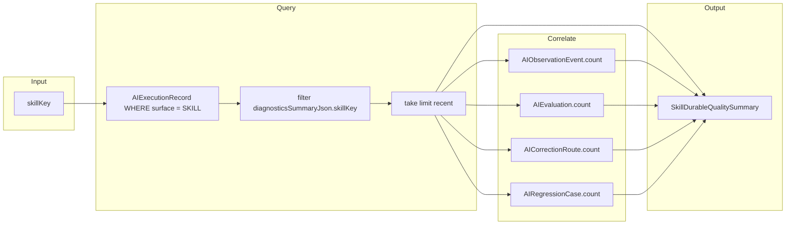

# AI Skill Quality Model (Phase 8B)

**Program:** AI Architecture Phase 8B  
**Date:** 2026-07-14  
**Status:** Active  
**Source of Truth for:** Durable Skill quality derived from intelligence platform stores  
**Code:** `server/src/ai/skills/skillDurableQuality.ts` · `server/src/ai/skills/skillFingerprints.ts` · `server/src/ai/skills/skillMetrics.ts`  
**Companion:** [`AI_EXECUTION_RECORD_ARCHITECTURE.md`](./AI_EXECUTION_RECORD_ARCHITECTURE.md) · [`AI_SKILL_PRODUCTIZATION.md`](./AI_SKILL_PRODUCTIZATION.md)

---

## Principle

Phase 8B adds **durable** Skill quality without a second metrics warehouse:

- **Process-local metrics** (`skillMetrics.ts`) — ring buffer for hot-path summaries (Phase 8)  
- **Durable quality** (`skillDurableQuality.ts`) — aggregates from existing Phase 3 intelligence tables keyed by Skill executions  

Operator UI and admin API expose both; durable quality is the certification and regression signal across process restarts.

---

## Data sources

| Store | Prisma model | Used for |
|-------|--------------|----------|
| Execution records | `AIExecutionRecord` | Skill runs (`surface: 'SKILL'`), latency, success/failure, shadow routing summary |
| Observations | `AIObservationEvent` | Linked events per execution |
| Evaluations | `AIEvaluation` | Human/automated eval linkage |
| Corrections | `AICorrectionRoute` | Correction workflow linkage |
| Regressions | `AIRegressionCase` | Regression case linkage |

Skill identity on execution records comes from **`diagnosticsSummaryJson.skillKey`** and **`skillVersion`** (set by `skillRunner` / `createAIExecutionRecord`).

---

## Durable quality summary shape

`SkillDurableQualitySummary` (`skillDurableQuality.ts`):

| Field | Source |
|-------|--------|
| `skillKey`, `skillVersion` | Diagnostics on matched execution records |
| `executionCount`, `successCount`, `failureCount` | Recent `AIExecutionRecord` rows for Skill surface |
| `averageLatencyMs` | `usageJson.latencyMs` or `completedAt - createdAt` |
| `observationEventCount` | Count of `AIObservationEvent` for matched execution IDs |
| `evaluationCount` | Count of `AIEvaluation` |
| `correctionCount` | Count of `AICorrectionRoute` |
| `regressionCount` | Count of `AIRegressionCase` |
| `routerShadowAgreementRate` | `routingSummaryJson.shadow.match` on Skill records |
| `recentExecutionIds` | Up to 20 IDs for drill-down |

Default query window: up to **200** matched executions per skill (`getDurableSkillQualitySummary`).

Batch helper: `listDurableSkillQuality(prisma, skillKeys[])` — used by admin skills overview.

---

## Query flow

**No duplicate writes:** durable quality is read-only aggregation over existing intelligence persistence.

---

## Fingerprint integrity (certification)

File: `server/src/ai/skills/skillFingerprints.ts`

| Concept | Purpose |
|---------|---------|
| `fingerprintSkillDefinition` | Hash of certifiable definition fields |
| `fingerprintInstructionAsset` | Hash of instruction asset content |
| `fingerprintSkillBundle` | Combined `bundleHash` (definition + instructions + `implementationKey`) |
| `CERTIFIED_SKILL_BUNDLE_FINGERPRINTS` | Expected hashes for `key@version` pilots |
| `sealCertifiedSkillFingerprints` | Populates expected hashes at startup |
| `assertSkillFingerprintIntegrity` | Fails registration if certified bundle drifted without version bump |

Sealed at `registerBuiltInSkills()` for all three Phase 8B pilots at `1.0.0`.

Admin overview returns live `fingerprints` map; detail endpoint runs integrity assert for the requested skill.

---

## Regression fixtures (contract quality)

Static contract regression — **no provider calls**:

| Fixture | Path |
|---------|------|
| Page summary | `server/src/ai/skills/__fixtures__/notebook_page_summary.regression.json` |
| Action extraction | `server/src/ai/skills/__fixtures__/notebook_action_extraction.regression.json` |
| Document extraction | `server/src/ai/skills/__fixtures__/structured_document_extraction.regression.json` |

Tests: `server/src/ai/skills/__tests__/skillsPhase8b.regression.test.ts`

Each case validates:

- Planner acceptance/rejection (`createSkillExecutionPlan`)
- Output schema validation (`validateSkillOutput`)
- Fingerprint integrity after seal
- No mutation tools on propose-only Skills where asserted

---

## API and UI exposure

| Consumer | Endpoint / page | Metrics shown |
|----------|-----------------|---------------|
| Admin overview | `GET /api/admin/ai/operations/skills/overview` | `durableQuality` per skill + process `metrics` + `fingerprints` |
| Admin detail | `GET /api/admin/ai/operations/skills/:key` | `durableQuality` + linked intelligence counts |
| Pipeline UI | `web/src/app/admin-portal/ai-pipeline/skills/page.tsx` | Execution/success/failure, obs/eval/correction/regression counts, shadow agreement |
| Customer API | `GET /api/ai/skills/:key/quality` | Process-local `summarizeSkillMetrics` only (no draft internals) |

---

## Process-local vs durable

| Aspect | `skillMetrics.ts` | `skillDurableQuality.ts` |
|--------|-------------------|--------------------------|
| Storage | In-process ring buffer | PostgreSQL intelligence tables |
| Survives restart | No | Yes |
| Shadow agreement | Yes (in-memory) | Yes (from execution record routing JSON) |
| Eval / correction / regression | No | Yes (correlated by execution ID) |
| Primary use | Fast customer quality endpoint | Operator certification and Phase 8B pipeline |

---

## Related documents

- Execution records: [`AI_EXECUTION_RECORD_ARCHITECTURE.md`](./AI_EXECUTION_RECORD_ARCHITECTURE.md)  
- Evaluation / correction: [`AI_EVALUATION_ARCHITECTURE.md`](./AI_EVALUATION_ARCHITECTURE.md) · [`AI_CORRECTION_ROUTING.md`](./AI_CORRECTION_ROUTING.md)  
- Regression: [`AI_REGRESSION_INTELLIGENCE.md`](./AI_REGRESSION_INTELLIGENCE.md)  
- Productization: [`AI_SKILL_PRODUCTIZATION.md`](./AI_SKILL_PRODUCTIZATION.md) · [`AI_PHASE8B_CLOSEOUT.md`](./AI_PHASE8B_CLOSEOUT.md)
