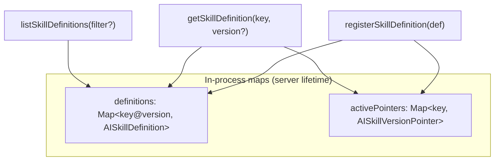

# AI Skill Registry

**Program:** AI Architecture Phase 8  
**Date:** 2026-07-13  
**Status:** Active  
**Source of Truth for:** Code-first Skill registry design  
**Code:** `server/src/ai/skills/skillRegistry.ts` · `registerBuiltInSkills.ts`

---

## Principle

Skills are **code-first**. Definitions live in TypeScript, register at startup, and freeze on publish. There are **no** Prisma tables for Skill executable behavior in Phase 8.

---

## Registry structure



| Store | Key | Value |
|-------|-----|-------|
| `definitions` | `notebook_page_summary@1.0.0` | Frozen `AISkillDefinition` |
| `activePointers` | `notebook_page_summary` | `{ activeVersion, certifiedVersions[] }` |

---

## Registration rules

1. **Scope gate:** only `PLATFORM` and `MODULE_INTERNAL`; other scopes throw  
2. **Uniqueness:** duplicate `key@version` throws  
3. **Immutability:** registered defs are `Object.freeze`  
4. **Pointer update:** `ACTIVE` sets `activeVersion`; first registration seeds pointer  
5. **Certified tracking:** `CERTIFIED` or `ACTIVE` appends to `certifiedVersions`  

---

## Startup path

```typescript
// server/src/index.ts (boot)
await registerBuiltInSkills();

// registerBuiltInSkills.ts
for (const def of PHASE8_PILOT_SKILLS) {
  registerSkillDefinition(def);
}
await registerPilotImplementations();
```

Pilot definitions: `server/src/ai/skills/pilotSkillDefinitions.ts`  
Implementations: `server/src/ai/skills/skillImplementations.ts`

---

## Query API (internal)

| Function | Purpose |
|----------|---------|
| `getSkillDefinition(key, version?)` | Resolve definition; default active version |
| `listSkillDefinitions(filter?)` | Filter by scope, intent, executable, customerVisible |
| `listSkillRegistryItems(opts?)` | Summary list for APIs (one row per key, active version) |
| `listVersionsForKey(key)` | All versions for a key |
| `getActivePointer(key)` | Version pointer metadata |
| `clearSkillRegistryForTests()` | Test reset |

---

## Implementation registry (separate map)

`skillImplementations.ts` maintains `implementationKey → SkillImplementation` functions.

| Key | Adapter |
|-----|---------|
| `impl.notebook_page_summary.v1` | `summarizePage` |
| `impl.notebook_action_extraction.v1` | `extractActionItems` |
| `impl.structured_document_extraction.v1` | `extractInvoiceOrReceipt` |

Definition `implementationKey` must match a registered implementation or runner returns `FAILED: implementation_missing`.

---

## Instruction assets (non-executable)

`skillInstructionAssets.ts` holds operator-readable metadata keyed by `instructionAssetKey`. These are **not** registered in the Skill definition map and are **not** executable.

---

## External surfaces

### Customer list

`listSkillRegistryItems({ customerVisibleOnly: true })` filtered to `ACTIVE` / `CERTIFIED`.

### Operator overview

`listSkillDefinitions()` + `listSkillRegistryItems()` + metrics — full internal view including non-customer-visible fields when added in future.

---

## What is NOT in the registry

| Item | Where it lives |
|------|----------------|
| Provider model ids | `modelCatalog` / env |
| Twin prompt blocks | `server/src/ai/prompts/*` |
| Tool definitions | `aiToolRiskRegistry` / tool executor |
| Intent classification runtime | Twin / conversation reasoning |
| Customer-created Skills | **Not supported** |
| DB-backed Skill versions | **Not supported** |

---

## Adding a new Skill (checklist)

1. Define `AISkillDefinition` in code (new file or extend pilots module)  
2. Add `SkillInstructionAsset` if operator visibility needed  
3. Implement `registerSkillImplementation(implementationKey, fn)`  
4. Append to built-in registration array  
5. Complete certification ([`AI_SKILL_CERTIFICATION_STANDARD.md`](./AI_SKILL_CERTIFICATION_STANDARD.md))  
6. Add tests in `skillsPhase8.test.ts`  
7. Update [`AI_SKILL_PILOT_CATALOG.md`](./AI_SKILL_PILOT_CATALOG.md) or successor catalog doc  

---

## Testing

`resetAndRegisterBuiltInSkillsForTests()` clears both registry and implementation maps, then re-registers pilots.

Tests verify: duplicate rejection, scope rejection, active version resolution, intent filtering.

---

## Related

- [`AI_SKILL_CONTRACT.md`](./AI_SKILL_CONTRACT.md)  
- [`AI_SKILL_LIFECYCLE.md`](./AI_SKILL_LIFECYCLE.md)  
- [`AI_SKILLS_ARCHITECTURE.md`](./AI_SKILLS_ARCHITECTURE.md)
