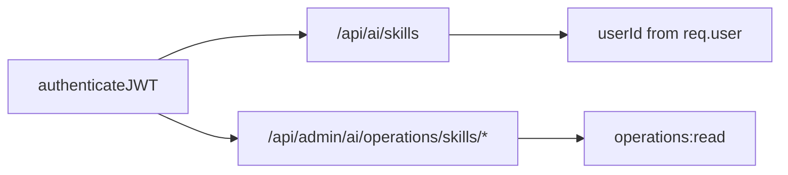

# AI Skill Security Model

**Program:** AI Architecture Phase 8  
**Date:** 2026-07-13  
**Status:** Active  
**Source of Truth for:** Skill execution security boundaries  
**Code:** `skillRunner.ts` · `skillPlanner.ts` · `skillSelection.ts` · `routes/aiSkills.ts`

---

## Threat model (Phase 8)

| Threat | Mitigation |
|--------|------------|
| Unauthorized Skill execution | JWT on `/api/ai/skills`; `req.user` required |
| Cross-tenant data access | Adapters use existing module auth (`loadGroundedAIContext`, etc.) |
| Skill injection via arbitrary input | Input schema validation; `additionalProperties: false` on pilots |
| Oversized prompt injection | Input JSON capped at ~200k characters in planner |
| Secret exfiltration in output | `detectSecretLeak` on structured output |
| Undeclared tool mutation | `maxToolRounds: 0`; prohibited tools; runner policy asserts |
| Executing draft/retired Skills | Selection + customer API 404 filters |
| Business context bypass | `businessMembershipRequired` enforced in selection + planner |
| Operator data leak via customer API | `customerVisible` + `internalOnly` gates; no instruction assets on customer routes |
| Shadow routing altering production | Shadow try/catch; never blocks; `productionUnchanged: true` on records |

---

## Authentication & authorization



| Surface | Auth |
|---------|------|
| Customer Skill API | JWT; 401 without user |
| Operator Skill API | JWT + `requireOperationsPermission(ctx, 'operations:read')` |
| Skill implementation | Trusts `userId` / `businessId` from runner — **must** delegate to module services that re-verify access |

Skills do not implement their own permission model; they inherit module SoR authorization.

---

## Input security

| Control | Location |
|---------|----------|
| Required field validation | `skillPlanner.validateRequiredFields` |
| Unknown field rejection | When `additionalProperties: false` |
| Object type enforcement | Planner rejects non-objects |
| Size bound | `JSON.stringify(input).length > 200_000` |

---

## Output security

| Control | Location |
|---------|----------|
| Required output fields | `validateSkillOutput` |
| Extra field rejection | When `additionalProperties: false` |
| Secret patterns | `detectSecretLeak` — API keys, private keys |
| Grounding failure | Fail when `refuseWhenUngrounded` and adapter reports `groundingFailed` |

Failed validation → `status: FAILED`; output not returned to client (`ok: false`).

---

## Tool & mutation security

Phase 8 pilots are **read-only / propose-only**:

```typescript
actionPolicy: {
  allowedMutatingTools: [],
  prohibitedTools: ['*'], // or named tools e.g. 'todo.create'
  maxToolRounds: 0,
  mutationsDefaultOff: true,
}
```

Runner checks:

- Tool not in both `allowedTools` and `prohibitedTools`  
- `prohibitedTools: ['*']` with non-empty allowlist rejected  
- `minNecessary` context must be declared  

Future mutating Skills require: approval policy, explicit mutating tool allowlist, and certification re-review.

---

## Context & memory security

| Policy | Pilot posture |
|--------|---------------|
| `personalMemory: 'disallowed'` | All three pilots |
| `personalMemoryAllowed: false` | All three pilots |
| `liveModuleSoR: true` | Notebook pilots only |
| Context providers | Declared explicitly — no undeclared fetches in runner |

---

## Observation & records

| Data | Handling |
|------|----------|
| Observation events | `emitTwinObservation` with redaction policies from Phase 5 |
| Execution record summary | Truncated output (`slice(0, 2000)`) |
| Error summary | Truncated (`slice(0, 500)`) |
| Persist failure | Non-blocking; no retry with expanded payload |

`surface: 'SKILL'` isolates Skill executions in operator search filters.

---

## Operator vs customer exposure

| Field / asset | Customer API | Operator API |
|---------------|--------------|--------------|
| Full `AISkillDefinition` | No (subset) | Yes |
| `instructionAsset` | No | Yes |
| `certificationNotes` | No | Yes |
| `implementationKey` | No | Yes (in full definition) |
| Internal metrics ring | Per-skill quality endpoint | Overview + detail |

---

## Dependency security

| Dependency | Trust assumption |
|------------|------------------|
| Module adapters | Same trust as pre-Phase-8 module AI routes |
| `createAIExecutionRecord` | Platform intelligence; tenant-scoped |
| `shadowRouteForSpecializedPath` | Read-only comparison |
| In-process metrics ring | Ephemeral; no PII stored beyond skill key + timings |

---

## Incident response

| Action | Mechanism |
|--------|-----------|
| Stop Skill executions | Set `SUSPENDED` in code registration + deploy |
| Revoke customer visibility | `customerVisible: false` or `internalOnly: true` |
| Audit executions | Operator executions search `surface=SKILL` |
| Review failures | Pipeline Skills metrics + observation timeline |

---

## Related

- [`AI_SKILL_EXECUTION_MODEL.md`](./AI_SKILL_EXECUTION_MODEL.md)  
- [`AI_REDACTION_POLICY.md`](./AI_REDACTION_POLICY.md)  
- [`AI_TOOL_RISK_AND_APPROVAL_POLICY.md`](./AI_TOOL_RISK_AND_APPROVAL_POLICY.md)  
- [`backend-trust-boundaries.mdc`](../../.cursor/rules/backend-trust-boundaries.mdc)
