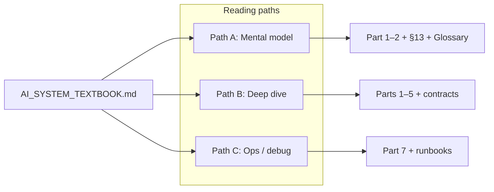

# Vssyl AI System Textbook

**Last verified:** 2026-05-26  
**Audience:** Platform engineers, module authors, admins onboarding to the AI stack  
**Status:** Internal reference — not marketing, not autogenerated API docs  
**Orchestrator version:** `phase-b5-v1` · Snapshot schema: `AI_ORCHESTRATION_SNAPSHOT_SCHEMA_VERSION = 1`

---

## Purpose

This textbook explains **how Vssyl AI works as a system**: what each component does, why it exists, how pieces connect, and how to debug production behavior. It is written for deep understanding and long-term onboarding — not for partner API contracts (see [`AI_CONTEXT_PROVIDER_API.md`](../guides/AI_CONTEXT_PROVIDER_API.md)) or operational checklists alone (see [`docs/ai/RUNBOOK.md`](../ai/RUNBOOK.md)).

**Canonical diagrams** remain in existing architecture docs. This book **links** to them and adds narrative, mental models, and textbook-only diagrams where no canonical source exists yet.

---

## How to read this book

Three intentional paths:

### Path A — Quick-start mental model (~45 min)

Goal: explain a twin request end-to-end to a new engineer.

1. [§1 What Vssyl AI Actually Is](./ai-textbook/01-foundations.md#1-what-vssyl-ai-actually-is)
2. [§2 High-Level Architecture](./ai-textbook/01-foundations.md#2-high-level-architecture)
3. [§3 Core Principles](./ai-textbook/01-foundations.md#3-core-architectural-principles) (skim)
4. [§4 Request Entry Flow](./ai-textbook/02-request-lifecycle.md#4-request-entry-flow)
5. [§5 DigitalLifeTwinCore](./ai-textbook/02-request-lifecycle.md#5-digitallifetwincore)
6. [§13 Diagnostics System](./ai-textbook/04-observability.md#13-diagnostics-system) (skim)
7. [§25 Glossary](./ai-textbook/07-operations.md#25-glossary)

### Path B — Advanced deep dive (~1–2 days)

Read Parts 1–4 in order, then Part 3 §7–12 and Part 5 §16–18. Cross-read:

- [`AI_CONTEXT_ASSEMBLY.md`](./AI_CONTEXT_ASSEMBLY.md)
- [`AI_CONTEXT_PROVIDER_API.md`](../guides/AI_CONTEXT_PROVIDER_API.md)
- `shared/src/types/ai-context-provider-contract.ts`

### Path C — Operations / debugging (~2 hr reference)

1. [§22 Logs, Traces, and Runbooks](./ai-textbook/07-operations.md#22-logs-traces-and-runbooks)
2. [§23 Failure Modes & Troubleshooting](./ai-textbook/07-operations.md#23-failure-modes--troubleshooting)
3. [§24 Testing Strategy](./ai-textbook/07-operations.md#24-testing-strategy)
4. Link out: [`docs/ai/RUNBOOK.md`](../ai/RUNBOOK.md), [`AI_PIPELINE_ADMIN_TOOLS.md`](./AI_PIPELINE_ADMIN_TOOLS.md)

---

## One-page mental model

Vssyl is an **AI-native platform**, not a chatbot bolted onto CRUD apps.

1. **Modules** own tenant-scoped data (Drive files, Calendar events, Chat threads, HR records, etc.) and expose **context providers** — fast HTTP endpoints the platform calls at query time.
2. The **Digital Life Twin** is the platform cognitive runtime: it receives a user message, decides **which context to retrieve**, assembles bounded prompt blocks, calls an **LLM provider**, and returns a response with **diagnostics** proving what ran.
3. **Orchestration** (`ContextProviderOrchestrator`) selects providers by intent, grounding requirements, cost, and priority — deterministically, not by prompt magic.
4. **Grounding** ensures the twin does not answer as if it knows facts it never retrieved (Place, location, required module sources).
5. **Observability** (pipeline trace, context density, orchestration snapshots) is a product requirement: users and admins must see *why* a reply looks the way it does.

Two AI paths share infrastructure but **do not share the twin LLM call**:

| Path | Entry | Purpose |
|------|-------|---------|
| **Digital Life Twin** | `POST /api/ai/twin` | Conversational assistant with assembled context, grounding, trace |
| **Ambient suggestions** | Domain events → `AIEventConsumer` | Explainable nudges; user accepts or dismisses; no auto-execution |

See canonical platform map: [`AI_PLATFORM_OVERVIEW.md`](./AI_PLATFORM_OVERVIEW.md).

---

## Table of contents

| Part | File | Sections |
|------|------|----------|
| **1 — Foundations** | [ai-textbook/01-foundations.md](./ai-textbook/01-foundations.md) | §1–3 |
| **2 — Request lifecycle** | [ai-textbook/02-request-lifecycle.md](./ai-textbook/02-request-lifecycle.md) | §4–8 |
| **3 — Context + grounding** | [ai-textbook/03-context-grounding.md](./ai-textbook/03-context-grounding.md) | §9–12 |
| **4 — Observability** | [ai-textbook/04-observability.md](./ai-textbook/04-observability.md) | §13–15 |
| **5 — Multimodal + providers** | [ai-textbook/05-multimodal-providers.md](./ai-textbook/05-multimodal-providers.md) | §16–18 |
| **6 — Realtime + future** | [ai-textbook/06-realtime-future.md](./ai-textbook/06-realtime-future.md) | §19–21 |
| **7 — Operations** | [ai-textbook/07-operations.md](./ai-textbook/07-operations.md) | §22–25 |

---

## Document map (what lives where)

| Need | Location |
|------|----------|
| **Narrative / textbook** | This file + `ai-textbook/*` |
| **Canonical Mermaid diagrams** | [`AI_PLATFORM_OVERVIEW.md`](./AI_PLATFORM_OVERVIEW.md), [`AI_TWIN_PROMPT_PIPELINE.md`](./AI_TWIN_PROMPT_PIPELINE.md), [`AI_CONTEXT_ASSEMBLY.md`](./AI_CONTEXT_ASSEMBLY.md) |
| **Provider API contract (must comply)** | [`AI_CONTEXT_PROVIDER_API.md`](../guides/AI_CONTEXT_PROVIDER_API.md) |
| **Vision / multimodal ops** | [`docs/ai/ARCHITECTURE.md`](../ai/ARCHITECTURE.md), [`PROVIDERS.md`](../ai/PROVIDERS.md), [`RUNBOOK.md`](../ai/RUNBOOK.md) |
| **Product Q&A / streaming UX** | [`memory-bank/aiContextSystem.md`](../../memory-bank/aiContextSystem.md) |
| **Roadmap / phase plans** | [`docs/plans/AI_PLATFORM_MATURITY_PLAN.md`](../plans/AI_PLATFORM_MATURITY_PLAN.md), [`AI_PLATFORM_EXECUTION_PRINCIPLES.md`](../plans/AI_PLATFORM_EXECUTION_PRINCIPLES.md) |
| **Current shipping status** | [`memory-bank/activeContext.md`](../../memory-bank/activeContext.md), [`memory-bank/progress.md`](../../memory-bank/progress.md) |
| **Legacy entry-point inventory** | [`AI_SYSTEM_ARCHITECTURE_MAP.md`](../guides/AI_SYSTEM_ARCHITECTURE_MAP.md) (partially superseded) |

---

## Key flags and constants

| Name | Purpose |
|------|---------|
| `AI_CONTEXT_ORCHESTRATOR_ENABLED=false` | Legacy module fetch path in `CrossModuleContextEngine` |
| `AI_ORCHESTRATION_SNAPSHOT_ENABLED` | Prod snapshot logging (default off) |
| `AI_ORCHESTRATION_SNAPSHOT_SAMPLE_RATE` | Sampling for snapshot logs |
| `ORCHESTRATOR_VERSION` | `phase-b5-v1` in `orchestrationSnapshot.ts` — bump when selection semantics change |
| `MAX_ORCHESTRATION_SNAPSHOTS_PER_REQUEST` | Cap of 2 snapshots per twin request |

---

## Diagram index

| ID | Diagram | Source |
|----|---------|--------|
| D0 | Platform map (twin + ambient + catalog) | [`AI_PLATFORM_OVERVIEW.md`](./AI_PLATFORM_OVERVIEW.md) |
| D1 | Twin request lifecycle | [`AI_PLATFORM_OVERVIEW.md`](./AI_PLATFORM_OVERVIEW.md) |
| D2 | Grounding gate | [`AI_TWIN_PROMPT_PIPELINE.md`](./AI_TWIN_PROMPT_PIPELINE.md) |
| D3 | Module sources → orchestrator → assembly | [`AI_CONTEXT_ASSEMBLY.md`](./AI_CONTEXT_ASSEMBLY.md) |
| D4 | Pipeline admin architecture | [`AI_PIPELINE_ADMIN_TOOLS.md`](./AI_PIPELINE_ADMIN_TOOLS.md) |
| D8 | Orchestrator dual-pass | [§7](./ai-textbook/02-request-lifecycle.md#7-context-provider-orchestration) |
| D9 | Snapshot timeline (cap 2) | [§14](./ai-textbook/04-observability.md#14-orchestration-snapshots) |
| D10 | CrossModuleContextEngine delegate | [§8](./ai-textbook/02-request-lifecycle.md#8-crossmodulecontextengine) |
| D11 | Request envelope | [§4](./ai-textbook/02-request-lifecycle.md#4-request-entry-flow) |
| D12 | Symptom → debug surface | [§23](./ai-textbook/07-operations.md#23-failure-modes--troubleshooting) |

---

## Maintenance

Update this hub and the relevant part file when you change:

- `ContextProviderOrchestrator` selection or pass semantics
- Orchestration snapshot schema or `ORCHESTRATOR_VERSION`
- Grounding enforcement modes or pipeline catalog reconcile
- Twin request contract (`POST /api/ai/twin`)

**PR checklist:** “Textbook impact?” — if yes, update `last verified` on affected part front matter.

**Ownership:** indexed in [`docs/architecture/README.md`](./README.md).

---

## Glossary shortcut

Full glossary: [§25](./ai-textbook/07-operations.md#25-glossary). Quick terms:

- **Grounding** — Retrieved evidence required before the model answers certain intents.
- **Orchestration** — Deterministic selection and fetch of module context providers.
- **Context generation** — One orchestration pass; identified by `contextGenerationId`.
- **Pipeline trace** — Admin-visible record of intents, sources, tools, and enforcement on a twin turn.
