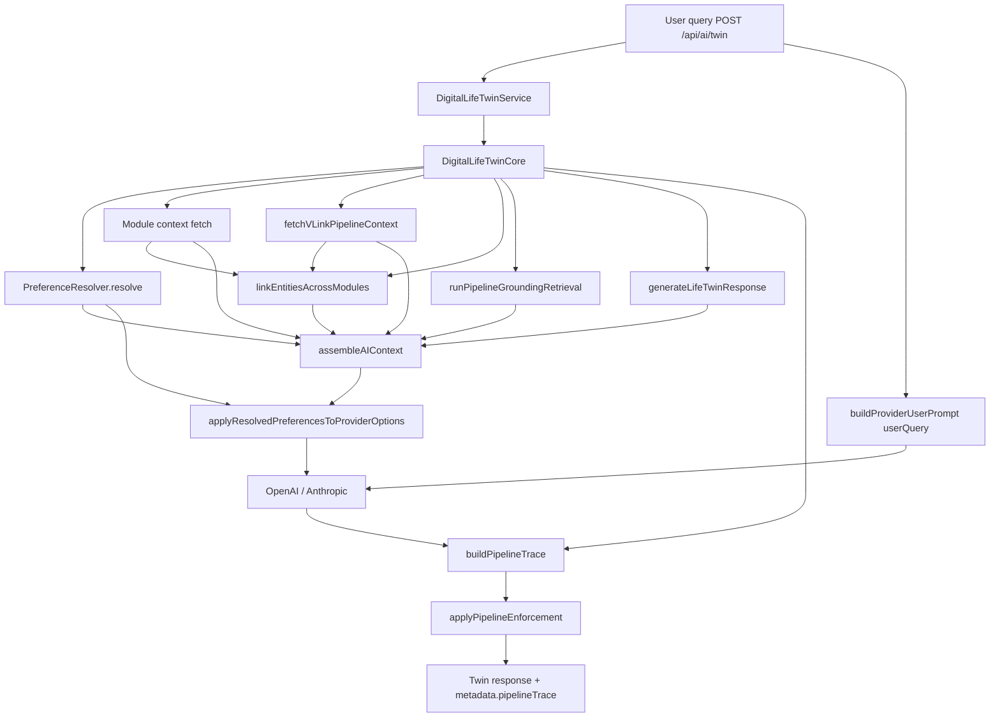
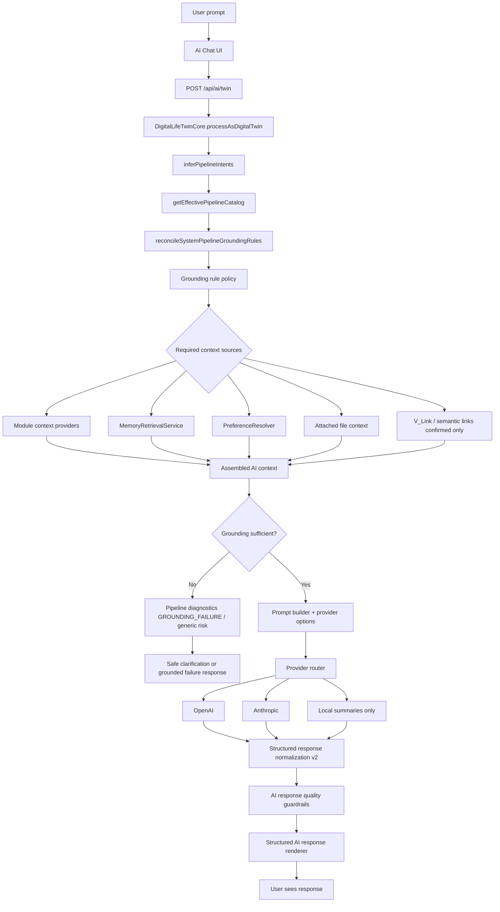

# Digital Life Twin — prompt pipeline (canonical)

**Last updated:** 2026-05-23 (V_Link pipeline + full trace path)

**Hub diagram:** [AI_PLATFORM_OVERVIEW.md](./AI_PLATFORM_OVERVIEW.md)  
**Assembly detail:** [AI_CONTEXT_ASSEMBLY.md](./AI_CONTEXT_ASSEMBLY.md)

## Single live path (chat / twin)

User messages on `/api/ai/twin` (and streaming) follow this pipeline:

1. **`DigitalLifeTwinService.processAsDigitalLifeTwin`** — recall, memory facts, conversation history.
2. **`DigitalLifeTwinCore.processAsDigitalTwin`**
   - Module context fetch + **`fetchVLinkPipelineContext`** (when catalog source `vlink` enabled)
   - **`linkEntitiesAcrossModules`** + optional synthesis
   - **`PreferenceResolver.resolve`**
   - **`runPipelineGroundingRetrieval`** (location, Place, memory prepass)
3. **`generateLifeTwinResponse`**
   - **`assembleAIContext`** — bounded context blocks (files, memory, modules, V_Link, preferences, business policies, thread).
   - **`applyResolvedPreferencesToProviderOptions`** — `personalityForProvider`, `autonomyBoundariesForProvider`, `resolvedEffectivePreferences`.
   - **`options.userQuery = query.query`** — **this is what the model sees as the user message** (via `buildProviderUserPrompt`).
4. **`callAIProvider`** — passes assembled context + preference payloads to OpenAI/Anthropic **`buildSystemPrompt`** / **`buildProviderUserPrompt`**.
5. **`buildPipelineTrace`** + **`applyPipelineEnforcement`** — diagnostics, grounding gating, metadata on response.

## Full request flow (with grounding gate)

Vertical view from UI to rendered response. Matches the detailed twin pipeline diagram used in onboarding.

**Provider errors:** `RATE_LIMITED` / `TEMP_UNAVAILABLE` trigger one OpenAI ↔ Anthropic fallback retry before normalization. See [../ai/PROVIDERS.md](../ai/PROVIDERS.md).

## Intentionally unused: monolithic legacy prompt

`buildDigitalTwinPrompt` was removed in Phase 0B. It duplicated content now covered by:

- `AIContextAssembler` (context blocks),
- `preferencePromptBlocks` + provider system prompts,
- `structuredResponseFormat` / conversation momentum blocks.

**Do not** reintroduce a second full-text prompt passed as `AIRequest.query` while `userQuery` is also set — providers prefer `data.userQuery` and would ignore the legacy string.

## API surfaces (canonical vs legacy)

| Concern | Canonical | Legacy (delegates, deprecated) |
|--------|-----------|-------------------------------|
| Autonomy settings | `GET/PUT /api/ai/autonomy/settings` | `GET/PUT /api/ai/autonomy` on `/api/ai` router |
| Personality profile | `GET/POST/DELETE /api/ai/personality/profile` | `GET/PUT /api/ai/personality` (GET = engine shape; PUT = interaction feedback only) |
| Effective preview | `GET /api/ai/effective-preferences` | — |
| Autonomous actions | — | `/api/ai/autonomous/*`, `AutonomyManager` (deprecated) |

New UI and integrations should use **canonical** routes only.

## Business workspace context (`businessId`)

When `context.businessId` is present on `/api/ai/twin`, the personal pipeline still runs, but **`assembleAIContext`** also injects policies from **`BusinessAIDigitalTwin`** (admin Business AI Control Center). See **[AI_BUSINESS_PERSONAL_TWIN_BOUNDARIES.md](./AI_BUSINESS_PERSONAL_TWIN_BOUNDARIES.md)**.

- Personal: `PreferenceResolver` + “User communication and AI preference settings” block  
- Business: “Business workspace AI policies” block (`sourceType: business`)

## Personal Intelligence hub (Control Center)

Learning review lives under **`/ai` → Learning**; optional analytics live under **More → Insights** (`?tab=more&section=insights`). See **[AI_INTELLIGENCE_HUB.md](./AI_INTELLIGENCE_HUB.md)** (Insights).

## Related code

- [`DigitalLifeTwinCore`](../../server/src/ai/core/DigitalLifeTwinCore.ts)
- [`PreferenceResolver`](../../server/src/ai/preferences/PreferenceResolver.ts)
- [`AIContextAssembler`](../../server/src/ai/context/AIContextAssembler.ts)
- [`vlinkPipelineContextService`](../../server/src/ai/context/vlinkPipelineContextService.ts)
- [`businessWorkspaceBoundaries.ts`](../../server/src/ai/enterprise/businessWorkspaceBoundaries.ts)
- [`buildProviderUserPrompt`](../../server/src/ai/prompts/providerUserPrompt.ts)
- [`buildPipelineTrace`](../../server/src/ai/pipeline/buildPipelineTrace.ts)
- [`pipelineEnforcement`](../../server/src/ai/pipeline/pipelineEnforcement.ts)
