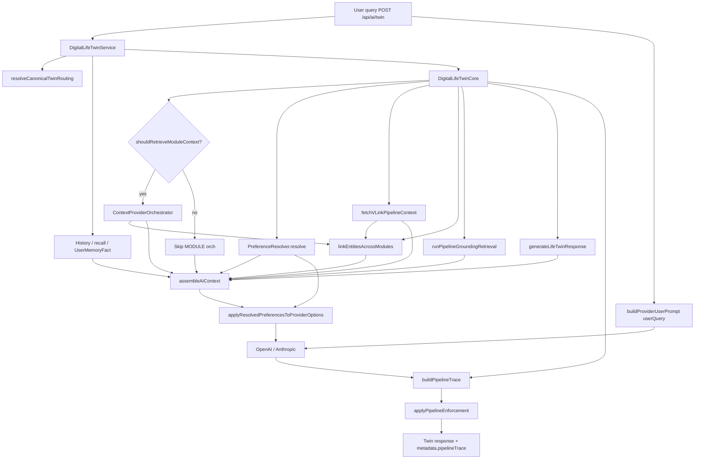
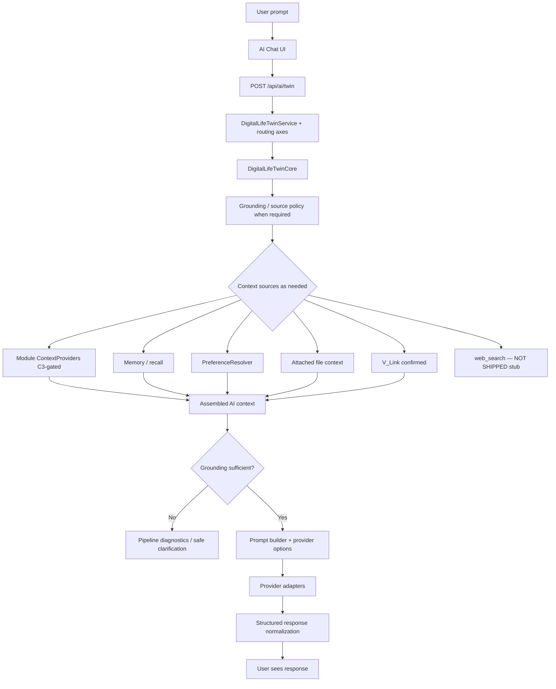

# Digital Life Twin — prompt pipeline

**Last updated:** 2026-08-25
**Status:** Supporting — prompt/assembly detail on the Twin path
**Runtime order SoT:** [`AI_CANONICAL_ROUTE_MAP.md`](./AI_CANONICAL_ROUTE_MAP.md) § Canonical Twin runtime · [`AI_SYSTEM_MENTAL_MODEL.md`](./AI_SYSTEM_MENTAL_MODEL.md)

**Hub diagram:** [AI_PLATFORM_OVERVIEW.md](./AI_PLATFORM_OVERVIEW.md)
**Assembly detail:** [AI_CONTEXT_ASSEMBLY.md](./AI_CONTEXT_ASSEMBLY.md)

## Single live path (chat / twin)

User messages on `/api/ai/twin` (and streaming) follow this pipeline:

1. **`DigitalLifeTwinService.processAsDigitalLifeTwin`**
   - Current-thread history
   - **`resolveCanonicalTwinRouting`** (`inferStructuredResponseMode` + response contract / truth / action axes)
   - Recent conversation memory, recall (if intent), `UserMemoryFact` retrieval
2. **`DigitalLifeTwinCore.processAsDigitalTwin`**
   - **C3:** `shouldRetrieveModuleContext` → optional `CrossModuleContextEngine` / ContextProviderOrchestrator (not every turn)
   - **`fetchVLinkPipelineContext`** (when catalog source `vlink` enabled) + entity linking / optional synthesis
   - Attached files; **`PreferenceResolver.resolve`**; business policy overlay when `businessId` set
   - Optional **`runPipelineGroundingRetrieval`** (source/grounding/tool policy — independent of C3)
3. **`generateLifeTwinResponse`**
   - **`assembleAIContext`** — bounded context blocks (files, memory, modules when retrieved, V_Link, preferences, business policies, thread)
   - Coaching / structured response format per contract
   - **`applyResolvedPreferencesToProviderOptions`**
   - **`options.userQuery = query.query`** — what the model sees as the user message (`buildProviderUserPrompt`)
4. **`callAIProvider`** — assembled context + preference payloads → OpenAI/Anthropic adapters
5. Post-turn learning / observation; **`buildPipelineTrace`** + **`applyPipelineEnforcement`**

## Grounding gate (pipeline layer)

Pipeline catalog intents, sources, and grounding rules drive **retrieval policy, evidence, enforcement, and diagnostics**. They are **not** the primary owner of Twin user-outcome / response-contract classification (that is Service routing).

**Provider errors:** `RATE_LIMITED` / `TEMP_UNAVAILABLE` trigger one OpenAI ↔ Anthropic fallback retry before normalization. See [../ai/PROVIDERS.md](../ai/PROVIDERS.md).

## Intentionally unused: monolithic legacy prompt

`buildDigitalTwinPrompt` was removed in Phase 0B. It duplicated content now covered by:

- `AIContextAssembler` (context blocks),
- `preferencePromptBlocks` + provider system prompts,
- `structuredResponseFormat` / conversation momentum blocks.

**Do not** reintroduce a second full-text prompt passed as `AIRequest.query` while `userQuery` is also set — providers prefer `data.userQuery` and would ignore the legacy string.

## API surfaces (canonical vs legacy)

| Concern | Canonical | Legacy (delegates, deprecated) |
|--------|-----------|-------------------------------|
| Twin chat | `POST /api/ai/twin` (+ optional `businessId`) | `POST /api/business-ai/:id/interact` (mock) |
| Autonomy settings | `GET/PUT /api/ai/autonomy/settings` | `GET/PUT /api/ai/autonomy` on `/api/ai` router |
| Personality profile | `GET/POST/DELETE /api/ai/personality/profile` | `GET/PUT /api/ai/personality` |
| Effective preview | `GET /api/ai/effective-preferences` | — |
| Autonomous actions | — | `/api/ai/autonomous/*`, `AutonomyManager` (deprecated) |

New UI and integrations should use **canonical** routes only.

## Business workspace context (`businessId`)

When `context.businessId` is present on `/api/ai/twin`, the shared Twin pipeline still runs, and **`assembleAIContext`** also injects policies from **`BusinessAIDigitalTwin`**. `businessId` is scope — not automatic business intent. See **[AI_BUSINESS_PERSONAL_TWIN_BOUNDARIES.md](./AI_BUSINESS_PERSONAL_TWIN_BOUNDARIES.md)**.

## Personal Intelligence hub (Control Center)

Learning review lives under **`/ai` → Learning**; optional analytics live under **More → Insights**. See **[AI_INTELLIGENCE_HUB.md](./AI_INTELLIGENCE_HUB.md)**.

## Related code

- [`DigitalLifeTwinService`](../../server/src/ai/core/DigitalLifeTwinService.ts)
- [`DigitalLifeTwinCore`](../../server/src/ai/core/DigitalLifeTwinCore.ts)
- [`shouldRetrieveModuleContext`](../../server/src/ai/utils/shouldRetrieveModuleContext.ts)
- [`PreferenceResolver`](../../server/src/ai/preferences/PreferenceResolver.ts)
- [`AIContextAssembler`](../../server/src/ai/context/AIContextAssembler.ts)
- [`vlinkPipelineContextService`](../../server/src/ai/context/vlinkPipelineContextService.ts)
- [`businessWorkspaceBoundaries.ts`](../../server/src/ai/enterprise/businessWorkspaceBoundaries.ts)
- [`buildProviderUserPrompt`](../../server/src/ai/prompts/providerUserPrompt.ts)
- [`buildPipelineTrace`](../../server/src/ai/pipeline/buildPipelineTrace.ts)
- [`pipelineEnforcement`](../../server/src/ai/pipeline/pipelineEnforcement.ts)
