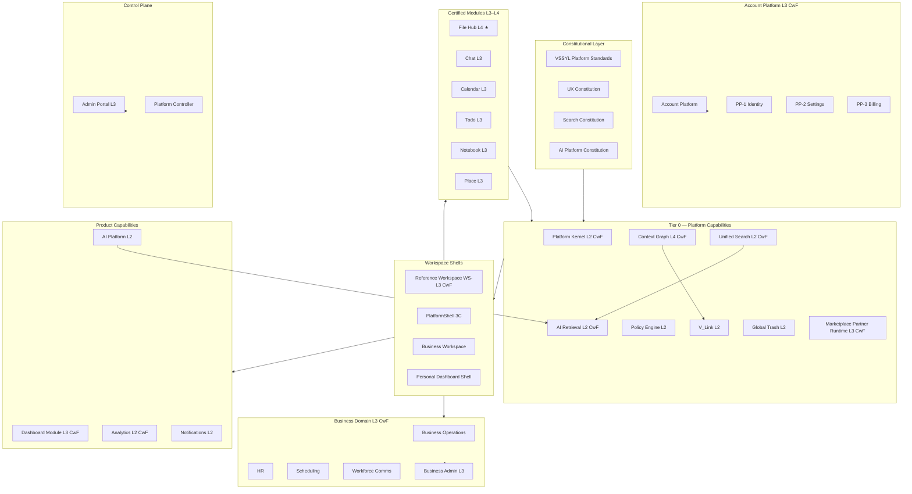

# Architecture Domain Map

**Program:** Architecture Consolidation — Phase 0A  
**Date:** 2026-06-29  
**Status:** Discovery — **refreshes stale [`PLATFORM_PORTFOLIO_DOMAIN_MAP.md`](../platform-portfolio/PLATFORM_PORTFOLIO_DOMAIN_MAP.md) (2026-06-19)**  
**Authority:** Synchronized to [`CERTIFICATION_LEDGER.md`](./CERTIFICATION_LEDGER.md) (2026-06-24)

Visual ownership of every architectural domain. For canonical links, see [`VSSYL_ARCHITECTURE_INDEX.md`](./VSSYL_ARCHITECTURE_INDEX.md).

---

## Domain tree

```
Vssyl Platform Architecture
│
├── Platform Kernel & Standards
│   ├── VSSYL Platform Standards (constitutional)
│   ├── Platform Kernel (Activity + Domain Events) — L2 CwF
│   ├── Policy Engine — L2
│   ├── Global Trash — L2
│   ├── Platform Entity Model
│   ├── Platform Job Registry — L1
│   └── Manifest Governance — L1
│
├── Platform Shell & Workspace
│   ├── PlatformShell (3C-4E personal / 3C-4F business)
│   ├── Reference Workspace Program — WS-L3 CwF
│   │   ├── Business Workspace (hub archetype)
│   │   └── Personal Dashboard shell (dashboard archetype)
│   ├── Navigation Discovery (Phase 0A)
│   └── Cross-Surface Transitions
│
├── Navigation & Discovery
│   ├── Unified Search — L2 CwF
│   ├── AI Retrieval Adapter — L2 CwF
│   ├── V_Link — L2
│   └── Command Palette — UNDECIDED (no implementation)
│
├── Context & Relationships
│   ├── Context Graph — L4 CwF
│   ├── Relationship Framework
│   └── Connected Knowledge — constitution only
│
├── Applications & Lifecycle
│   ├── Application Lifecycle Architecture
│   ├── Application Manager
│   ├── Dashboard Assignment (membership SoT)
│   ├── Marketplace Partner Runtime — L3 CwF
│   └── Dashboard Module — L3 CwF
│
├── AI Platform
│   ├── AI Platform Constitution
│   ├── Digital Life Twin Pipeline
│   ├── AI Context System
│   ├── AI Orchestration & Tools — L2
│   └── Connected Knowledge (future)
│
├── Realtime & Notifications
│   ├── Realtime (Chat socket hub) — no ledger row
│   └── Notifications Service — L2 / UX Ref #2
│
├── Product Modules (Tier 2)
│   ├── File Hub (drive) — L4 Reference Implementation ★
│   ├── Chat — L3 Ref #2
│   ├── Calendar — L3 Ref #3 / UX #5
│   ├── Todo — L3 Ref #4 / UX #3
│   ├── Notebook — L3 composition
│   ├── Place — L3 Ref #5 (dual-surface)
│   └── Notes — L2 sub-domain
│
├── Business Domain
│   ├── Business Operations — L3 CwF domain
│   │   ├── HR — L3 CwF Ref Candidate #1
│   │   ├── Scheduling — L3 CwF Ref Candidate #6
│   │   └── Workforce Comms — L3 CwF Ref Candidate #7
│   ├── Business Administration — L3 (#OC-1/2/3)
│   └── Analytics Capability — L2 CwF (not product module)
│
├── Account & Identity
│   └── Account Platform — L3 CwF
│       ├── PP-1 Identity & Profile — L3 CwF
│       ├── PP-2 Settings Platform — L3 CwF
│       └── PP-3 Billing & Entitlements — L3 CwF (#AP-BILL-1)
│
├── Control Plane
│   ├── Admin Portal — L3 Control Plane Ref
│   └── Platform Controller IA — Phase 1B complete
│
├── Design System
│   ├── UX Constitution
│   ├── Design Tokens
│   ├── UX Reference Program (#1–#5)
│   └── UX Pattern Catalog (NAV/WS/MOB)
│
├── Infrastructure
│   ├── Deployment (GCP / Cloud Run)
│   ├── Security (Memory Bank only — gap)
│   └── Runbooks (fragmented — gap)
│
├── Developer Platform
│   ├── Third-Party Module Pipeline
│   ├── Module Development Guide
│   └── Search Delegate Architecture
│
└── Commercial / GTM
    └── Go-to-Market Phase 0A (discovery)
```

---

## Topology diagram (certification-aware)



---

## Domain inventory table

### Platform Kernel & Standards

| Domain | Owner | Primary SoT | Cert | Ref impl | Status |
|--------|-------|-------------|------|----------|--------|
| Platform Standards | Platform Engineering | `VSSYL_PLATFORM_STANDARDS_AND_MODULE_CONTRACT.md` | Constitutional | — | Active |
| Platform Kernel | Platform Engineering | `platform-kernel/PLATFORM_KERNEL_STATUS_RECORD.md` | L2 CwF | — | Archived |
| Policy Engine | Platform Engineering | `POLICY_ENGINE.md` | L2 | File Hub `*PolicyDual` | Partial rollout |
| Domain Events | Platform Engineering | `DOMAIN_EVENTS.md` | L2 CwF | Event registry (192 types) | Active |
| Module Activity | Platform Engineering | `platform-kernel/PLATFORM_ACTIVITY_QUERY_MODEL.md` | L2 CwF | Federation query service | Active |
| Global Trash | Platform Engineering | `GLOBAL_TRASH.md` | L2 | File Hub handler | Active |
| Platform Entity Model | Platform Engineering | `PLATFORM_ENTITY_MODEL.md` | — | File Hub descriptors | Active |
| Platform Scheduler | Platform Engineering | `PLATFORM_JOB_REGISTRY.md` | L1 | — | Inventory-first |
| Manifest Governance | Platform Engineering | `builtInModuleManifests.ts` | L1 | File Hub manifest | Reconcile incomplete |

### Platform Shell & Workspace

| Domain | Owner | Primary SoT | Cert | Ref impl | Status |
|--------|-------|-------------|------|----------|--------|
| Reference Workspace | Reference Workspace Program | `workspace/WORKSPACE_CERTIFICATION_RECORD.md` | WS-L3 CwF | WS With Findings | Archived |
| PlatformShell | Platform / UX | `REFERENCE_WORKSPACE_PLATFORM_SHELL.md` | 3C-4E/4F | PlatformShell.tsx | Complete |
| Business Workspace | Co-surface | `audits/BUSINESS_WORKSPACE_OPERATION_MATRIX.md` | WS-L3 CwF | Hub switch pattern | 11 advisories |
| Personal Dashboard shell | Co-surface | `PERSONAL_DASHBOARD_ROUTING_CONTRACT.md` | WS-L3 CwF | Widget + tab model | URL hygiene advisories |
| Navigation | Proposed Nav Ref Program | `NAVIGATION_WORKSPACE_ARCHITECTURE_DISCOVERY.md` | — | `*Navigation.ts` SSOT | Discovery complete |
| Cross-surface | Reference Workspace | `CROSS_SURFACE_TRANSITIONS.md` | — | `crossSurfaceNavigation.ts` | Authoritative |

### Navigation & Discovery

| Domain | Owner | Primary SoT | Cert | Ref impl | Status |
|--------|-------|-------------|------|----------|--------|
| Unified Search | Platform Engineering | `search/SEARCH_CONSTITUTION.md` | L2 CwF | `searchCapabilityService` | Phase 1B governance |
| AI Retrieval | AI Platform | `ai/retrieval/AI_RETRIEVAL_CONSTITUTION.md` | L2 CwF | Retrieval orchestrator | Phase 2A governance |
| V_Link | Platform Engineering | `V_LINK.md` | L2 | File Hub V_Link services | Active |
| Realtime | Platform Engineering | Platform Standards §3 + Chat socket | — | `chatSocketService` | No ledger row |
| Command Palette | — | — | — | — | **Undecided** |

### Context & Relationships

| Domain | Owner | Primary SoT | Cert | Ref impl | Status |
|--------|-------|-------------|------|----------|--------|
| Context Graph | Architecture / AI | `context-graph/CONTEXT_GRAPH_L4_CERTIFICATION_RECORD.md` | L4 CwF | #CG-1–#CG-4 | Archived |
| Relationship Framework | Platform Engineering | `RELATIONSHIP_FRAMEWORK_INDEX.md` | — | V_Link + graph models | Active |
| Connected Knowledge | Connected Knowledge Program | `connected-knowledge/KNOWLEDGE_CONSTITUTION.md` | — | — | Constitution only |

### Applications & Lifecycle

| Domain | Owner | Primary SoT | Cert | Ref impl | Status |
|--------|-------|-------------|------|----------|--------|
| Application Lifecycle | Platform Engineering | `APPLICATION_LIFECYCLE.md` | — | Application Manager | Partial (enable/update arch-only) |
| Marketplace | Developer Platform | `guides/THIRD_PARTY_MODULE_PIPELINE_SOURCE_OF_TRUTH.md` | L3 CwF | Pilot `vssyl-pilot-assets` | Phase 1B-G complete |
| Dashboard Module | Dashboard Program | `dashboard/DASHBOARD_STATUS_RECORD.md` | L3 CwF | Widget registry | Archived |
| Dashboard Assignment | Platform + Dashboard | `APPLICATION_LIFECYCLE.md` §membership | — | Build-out modal | Implemented |

### AI Platform

| Domain | Owner | Primary SoT | Cert | Ref impl | Status |
|--------|-------|-------------|------|----------|--------|
| AI Platform | AI Platform Program | `AI_PLATFORM_CONSTITUTION.md` | L2 | UX Ref #4 | L3 deferred |
| Digital Life Twin | AI Platform | `AI_TWIN_PROMPT_PIPELINE.md` | — | Twin pipeline | Active |
| AI Context | AI Platform | `memory-bank/aiContextSystem.md` | — | Context providers | Active |
| AI Tools / Actions | AI Platform | `audits/AI_TOOL_ACTION_COMPLIANCE_MATRIX.md` | L2 | Module executors | Partial |

### Realtime & Notifications

| Domain | Owner | Primary SoT | Cert | Ref impl | Status |
|--------|-------|-------------|------|----------|--------|
| Notifications | Platform Engineering | `guides/NOTIFICATION_METADATA_GUIDE.md` | L2 / UX #2 | `notificationService` | No standalone constitution |
| Realtime | Platform Engineering | Platform Standards + Chat matrix | — | Chat socket hub | Unaudited at platform level |

### Product Modules

| Domain | Owner | Primary SoT | Cert | Ref impl | Status |
|--------|-------|-------------|------|----------|--------|
| File Hub | Drive team | `audits/FILE_HUB_REFERENCE_IMPLEMENTATION_REVIEW.md` | **L4** | **Canonical platform ref ★** | Active |
| Chat | Chat team | `audits/CHAT_LEVEL3_CERTIFICATION_REVIEW.md` | L3 | Ref #2 | Post-L3 punch-list |
| Calendar | Calendar team | `audits/CALENDAR_LEVEL3_CERTIFICATION_REVIEW.md` | L3 | Ref #3 / UX #5 | Hygiene backlog |
| Todo | Todo team | `audits/TODO_LEVEL3_CERTIFICATION_REVIEW.md` | L3 | Ref #4 / UX #3 | Certified |
| Notebook | Notebook team | `audits/NOTEBOOK_LEVEL3_CERTIFICATION_REVIEW.md` | L3 | Composition module | Certified |
| Place | Place team | `audits/PLACE_LEVEL3_CERTIFICATION_REVIEW.md` | L3 | Ref #5 dual-surface | Optional hygiene PL-H1–H7 |
| Notes | Notebook dependency | Ledger row (L2 sub-domain) | L2 | Notes services | Sub-domain only |

### Business Domain

| Domain | Owner | Primary SoT | Cert | Ref impl | Status |
|--------|-------|-------------|------|----------|--------|
| Business Operations | BO Program | `business-operations/BUSINESS_OPERATIONS_CERTIFICATION_RECORD.md` | L3 CwF | Ref Candidates #1/#6/#7 | Archived; 17 advisories |
| HR | BO / HR | `audits/HR_OPERATION_MATRIX.md` | L3 CwF | Ref Candidate #1 | 6 advisories |
| Scheduling | BO / Scheduling | `audits/SCHEDULING_OPERATION_MATRIX.md` | L3 CwF | Ref Candidate #6 CwF | 5 advisories |
| Workforce Comms | BO / WC | `audits/WORKFORCE_COMMUNICATIONS_OPERATION_MATRIX.md` | L3 CwF | Ref Candidate #7 | 3 advisories |
| Business Administration | BA Program | `business-administration/BUSINESS_ADMINISTRATION_REFERENCE_STATUS_RECORD.md` | L3 | #OC-1/2/3 | Archived |
| Analytics | Platform Analytics | `analytics/ANALYTICS_STATUS_RECORD.md` | L2 CwF | Dashboard facade | Archived; not product module |

### Account & Identity

| Domain | Owner | Primary SoT | Cert | Ref impl | Status |
|--------|-------|-------------|------|----------|--------|
| Account Platform | Account Platform Program | `account-platform/ACCOUNT_PLATFORM_STATUS_RECORD.md` | L3 CwF | #AP-BILL-1 | Archived |
| PP-1 Identity | Account Platform | `account-platform/PP1_CERTIFICATION_RECORD.md` | L3 CwF | — | Archived |
| PP-2 Settings | Account Platform | `account-platform/PP2_CERTIFICATION_RECORD.md` | L3 CwF | Settings registry | Archived |
| PP-3 Billing | Account Platform | `account-platform/PP3_CERTIFICATION_RECORD.md` | L3 CwF | #AP-BILL-1 | Archived |

### Control Plane

| Domain | Owner | Primary SoT | Cert | Ref impl | Status |
|--------|-------|-------------|------|----------|--------|
| Admin Portal | Platform Ops | `audits/ADMIN_PORTAL_REFERENCE_STATUS_RECORD.md` | L3 | AI Pipeline admin | Archived |
| Platform Controller | Platform Controller Program | `platform-controller/PLATFORM_CONTROLLER_INFORMATION_ARCHITECTURE.md` | Inherits L3 | Programs hub | Phase 1B complete |

### Design System

| Domain | Owner | Primary SoT | Cert | Ref impl | Status |
|--------|-------|-------------|------|----------|--------|
| UX Standards | UX Reference Program | `ux/UX_CONSTITUTION.md` | Constitutional | — | Active |
| Design Tokens | UX Reference Program | `ux/DESIGN_TOKENS.md` | — | `tokens.css` | Active |
| UX References | UX Reference Program | `ux/REFERENCE_MODULE_PROGRAM.md` | UX-L3 | #1–#5 | Wave 6A complete |
| Layout / Nav / WS patterns | UX Reference Program | `ux/patterns/` | UX-PAT-* | Module UX refs | Active |

### Infrastructure & Developer Platform

| Domain | Owner | Primary SoT | Cert | Ref impl | Status |
|--------|-------|-------------|------|----------|--------|
| Deployment | DevOps | `deployment/PRODUCTION_DEPLOYMENT.md` | — | cloudbuild.yaml | Active |
| Security | Platform / Security | Platform Standards §27 + `POLICY_ENGINE.md` (gap: no dedicated security cert SoT) | — | `securityService.ts` | **Gap — no cert program** (historical: `docs/archive/session-summaries/securityComplianceSystem.md`) |
| Developer Platform | Developer & Marketplace | `guides/THIRD_PARTY_MODULE_PIPELINE_SOURCE_OF_TRUTH.md` | L3 CwF | test-modules/ | Active |
| Runbooks | DevOps / Ops | Scattered (see health report) | — | — | **Gap — no index** |

### Commercial

| Domain | Owner | Primary SoT | Cert | Ref impl | Status |
|--------|-------|-------------|------|----------|--------|
| Go-to-Market | Product / GTM | `go-to-market/GO_TO_MARKET_PHASE_0A_EXECUTIVE_SUMMARY.md` | — | — | ~45% readiness |

---

## Certification tier summary

| Tier | Count | Examples |
|------|-------|----------|
| **L4 Reference Implementation** | 1 module + 1 capability | File Hub; Context Graph consumption |
| **L3 Certified** | 10+ modules/systems | Chat, Calendar, Todo, Place, Admin Portal, BO domain, Account Platform, Marketplace runtime |
| **WS-L3 Certified** | 1 program | Reference Workspace (co-surfaces) |
| **L2 Certified** | 8+ capabilities | Platform Kernel, Search, AI Retrieval, Analytics, AI Platform, Policy Engine, V_Link, Notifications |
| **L1 / Uncertified** | 3+ | Platform Scheduler, Manifest governance, Realtime |
| **Constitutional only** | 4+ | Connected Knowledge, Navigation (pending program) |

Full matrix: [`CERTIFICATION_LEDGER.md`](./CERTIFICATION_LEDGER.md)

---

## Staleness notice

The following documents are **superseded for certification status** by this map and the ledger:

| Document | Stale claims | Use instead |
|----------|--------------|-------------|
| `platform-portfolio/PLATFORM_PORTFOLIO_DOMAIN_MAP.md` | Search L1, Dashboard L1, Analytics L1, CG L3, Kernel implicit | This document + ledger |
| `platform-portfolio/PLATFORM_CERTIFICATION_STATUS_2026.md` | Pre-2026-06-23 certifications | `CERTIFICATION_LEDGER.md` |
| `memory-bank/globalSearchProductContext.md` | Pre-constitution search model (redirect stub; body archived) | `search/SEARCH_CONSTITUTION.md` |

---

**Last updated:** 2026-06-29 (Architecture Consolidation Phase 0A)
