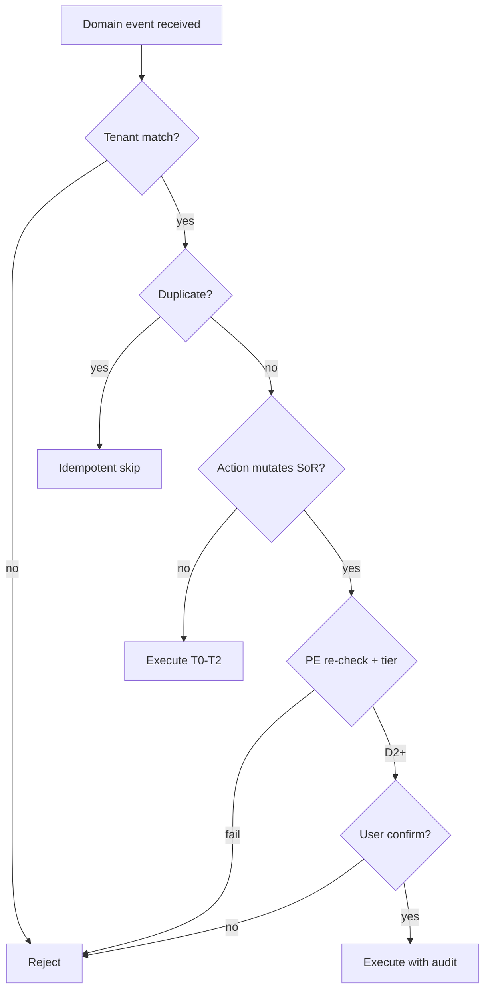

# Automation Trigger Safety Model

**Program:** Vssyl Relationship Framework  
**Phase:** 2C — Automation trigger constitutional architecture  
**Status:** Canonical safety rules (future automation)  
**Date:** 2026-06-14  
**Catalog:** [RELATIONSHIP_AUTOMATION_TRIGGER_CATALOG.md](./RELATIONSHIP_AUTOMATION_TRIGGER_CATALOG.md)

> **Scope:** Safety rules for **future** automation reacting to relationship lifecycle triggers. **No** workflow engine, rate limiter implementation, or UI in this phase.

---

## Purpose

Relationship triggers are powerful — shares, revokes, V_Link attachments, and deletes affect tenancy, privacy, and compliance. This model defines **non-negotiable safety rules** before any automation engine exists.

---

## Safety principles

| # | Principle |
|---|-----------|
| S1 | **Facts only** — triggers fire after successful authorized mutation |
| S2 | **Fail closed on action** — when in doubt, do not mutate SoR |
| S3 | **Tenant boundary is absolute** — no cross-tenant automation |
| S4 | **SoR writes through module services** — automation never raw-writes foreign tables |
| S5 | **Destructive actions need human tier** — unless pre-authorized rule with narrow scope |
| S6 | **AI proposes; humans or explicit rules dispose** — no silent destructive AI automation |
| S7 | **Idempotent consumers** — duplicate events must not double-harm |
| S8 | **Revoked access wins** — stale triggers cannot re-grant |

---

## Tenant isolation

| Rule | Requirement |
|------|-------------|
| **Event scope** | Every trigger payload carries `dashboardId` and/or `businessId` / `householdId` as applicable |
| **Consumer binding** | Automation rules scoped to tenant at registration — no global rules without admin partition |
| **Fan-out** | Webhooks and workflows deliver only to subscriptions registered in same business |
| **Cross-business V_Link** | Triggers include both scopes — consumer must not leak to non-members |
| **Forbidden** | "Copy relationship to tenant B" workflows; aggregate rules matching across businesses |

### Verification checklist

- [ ] Rule store keyed by tenant  
- [ ] Consumer rejects event if subscription tenant ≠ event tenant  
- [ ] No PII from tenant A in tenant B notification  

---

## Permissions

| Stage | Rule |
|-------|------|
| **At emit** | Emitter already passed module `authorize → execute` |
| **At consume (read)** | Consumer may use safe metadata only |
| **At consume (write)** | Consumer must call canonical module API with **acting user** or **system actor with PE proof** |
| **Elevated actions** | Business ADMIN, V_Link OWNER — explicit in rule definition |
| **Forbidden** | Consumer inferring permission from event payload alone |

### Permission re-check matrix

| Consumer action | Re-check required |
|-----------------|-------------------|
| Send notification to user | Recipient authorized to know event occurred |
| Invalidate search index | None — derived store |
| Webhook POST | Subscription owner authorized for event type |
| Create share / assign / link | Full PE on acting user |
| AI suggestion | No SoR write |
| AI auto-write | **Forbidden** (see AI boundary) |

---

## Destructive automation

**Destructive** = permanent delete, bulk unshare, bulk member remove, irreversible ownership transfer.

| Tier | Examples | Rule |
|------|----------|------|
| **D0** | Analytics increment | No confirmation |
| **D1** | Notification, index purge | No confirmation |
| **D2** | Single unshare via user-defined rule | User pre-authorizes rule template |
| **D3** | Bulk delete, bulk revoke | **Per-run confirmation** or ADMIN + audit |
| **D4** | Cross-module cascade | **Forbidden** in automation — cascade playbook manual/admin only |

Aligns with catalog trigger tiers T5.

### Destructive guardrails

- Dry-run mode required for D3+ rules in UI (future)  
- Audit log entry before execution  
- Rollback only via module restore paths — no automation "undo stack" as SoR  

---

## AI-initiated automation

| Allowed | Forbidden |
|---------|-----------|
| Observe domain events (subset) | Execute D2+ without user confirm |
| Schedule ambient suggestion correlation | Create `file.shared` from event chain |
| Draft action payload for user review | Accept `vlink.suggestion` without user |
| Record learning stub (diagnostic) | Persist UserMemoryFact from trigger alone |
| Re-fetch providers after signal | Use event payload as grounding SoR |

See [AI_AUTOMATION_BOUNDARY.md](./AI_AUTOMATION_BOUNDARY.md).

---

## User confirmation

| Automation class | Confirmation |
|------------------|--------------|
| Notify me when file shared | Opt-in rule at create — no per-event confirm |
| Add file to V_Link when uploaded | **Per suggestion** or rule opt-in with scope limits |
| Remove all shares when member leaves | D3 — confirm or ADMIN policy |
| AI: link related files | User accepts suggestion |
| Webhook to partner | Business ADMIN registers subscription |

**Rule:** First-time enable of any T4/T5 workflow requires explicit user or ADMIN consent documented in audit.

---

## Auditability

| Requirement | Detail |
|-------------|--------|
| **Trigger receipt** | Consumer logs `domainEventId`, type, tenant, rule id |
| **Action taken** | Log mutation operation + actor (user or system) |
| **Skipped action** | Log deny reason (PE, stale, duplicate) |
| **Retention** | [RELATIONSHIP_AUDIT_AND_RETENTION_POLICY.md](./RELATIONSHIP_AUDIT_AND_RETENTION_POLICY.md) tiers |
| **Admin export** | Business ADMIN may export automation audit — not raw message bodies |

Automation audit is **derivative** — does not replace domain event log or module activity.

---

## Replay protection

| Scenario | Rule |
|----------|------|
| **Duplicate delivery** | Consumer idempotency key: `(domainEventId, consumerId, ruleId)` |
| **At-least-once bus** | Safe retries — dedupe store or natural idempotency (index delete) |
| **Replay attack** | Reject events older than subscription `createdAt` unless admin replay tool |
| **Out-of-order** | Revoke processed after create must win — use entity version or latest timestamp |

### Idempotent operations (safe to retry)

- Search index delete  
- Analytics counter with event id dedupe  
- Notification with dedupe key  
- Learning stub insert with unique domainEventId  

### Non-idempotent (require dedupe)

- Share create  
- V_Link link  
- Member add  
- Webhook POST to partner (use idempotency-key header)  

---

## Duplicate event handling

| Cause | Handling |
|-------|----------|
| Dual emit (activity + domain) | Subscribe to **domain** only for automation |
| Retry after partial consumer success | Idempotency key prevents double webhook |
| Tag update emits two `updated` | Coalesce tag diff in consumer window or use diff metadata |
| Permanent delete + unlink | Both may fire — consumer treats unlink as idempotent if entity gone |

**Rule:** Catalog consumer must declare idempotency strategy per trigger type.

---

## Revoked access

| Trigger | Consumer must |
|---------|---------------|
| `file.unshared` | Invalidate share-scoped caches; cancel pending share workflows |
| `vlink.member.removed` | Stop hub notifications for removed user |
| `business.member.removed` | Disable business-scoped rules for user |
| Stale `file.shared` replay | Re-check FilePermission before acting |

**Fail closed:** If permission re-check fails at action time, **skip** — do not queue for later retry unless user still authorized.

---

## Soft-deleted entities

| State | Automation rule |
|-------|-----------------|
| Entity `trashedAt` set | No create-on-entity workflows; index purge allowed |
| V_Link archived | Membership triggers may notify; no attach automation |
| Trashed task assign | No assignee notify for new work |
| Restore event | May re-enable rules — do not auto-restore shares |

Consumers must read lifecycle matrix — trash ≠ relationship delete for assignments on trashed tasks.

---

## Rate limiting

| Layer | Purpose |
|-------|---------|
| **Per user rule execution** | Prevent runaway loops (A shares → B webhook → A share) |
| **Per business webhook** | Partner protection + platform stability |
| **Per consumer type** | AI correlation budget — already async in v1 stub |
| **Global platform** | Circuit breaker on automation worker (future) |

### Loop prevention

| Pattern | Guard |
|---------|-------|
| Event A triggers action emitting Event A | Rule may not subscribe to self-emitted type without dedupe + max depth |
| Cross-module ping-pong | Max chain depth = 3 (documentation default — tunable at implementation) |
| Bulk replay | ADMIN-only; rate capped |

**Phase 2C:** Document limits only — no implementation.

---

## Safety tier summary

---

## Related documents

| Document | Purpose |
|----------|---------|
| [AUTOMATION_CONSUMER_BOUNDARY.md](./AUTOMATION_CONSUMER_BOUNDARY.md) | Consumer allow/deny |
| [AI_AUTOMATION_BOUNDARY.md](./AI_AUTOMATION_BOUNDARY.md) | AI rules |
| [RELATIONSHIP_CASCADE_RULES.md](./RELATIONSHIP_CASCADE_RULES.md) | Delete cascades |

**Last updated:** 2026-06-14
