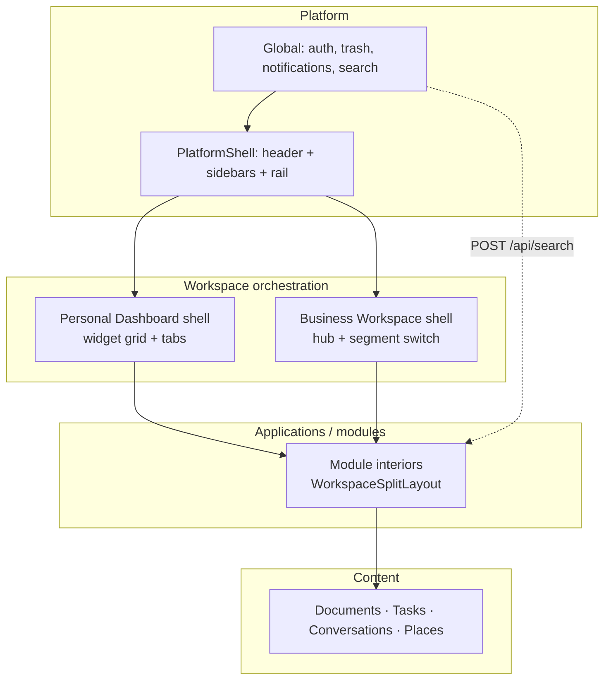
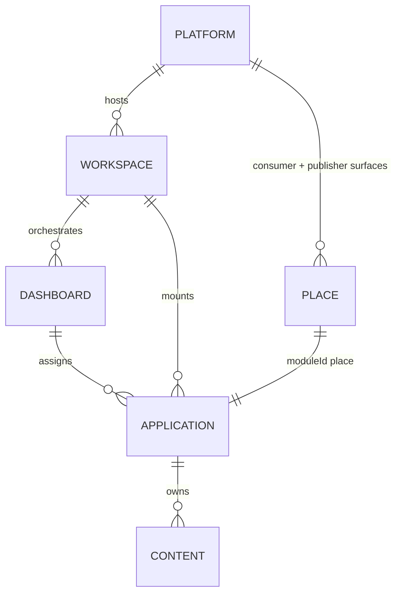

# Navigation & Workspace Architecture — Phase 0A Discovery

**Program:** Navigation & Workspace Architecture — Constitutional Discovery & Reality Assessment  
**Date:** 2026-06-29  
**Status:** Discovery complete — **no implementation, no UI changes, no code changes**  
**Authority:** Synthesizes existing Memory Bank, architecture, UX, workspace, search, and application-lifecycle decisions. Does not supersede constitutional documents; cites them.

**Related authorities:**
- [`REFERENCE_WORKSPACE_PLATFORM_SHELL.md`](./REFERENCE_WORKSPACE_PLATFORM_SHELL.md)
- [`WORKSPACE_OWNERSHIP_MODEL.md`](../workspace/WORKSPACE_OWNERSHIP_MODEL.md)
- [`UX_CONSTITUTION.md`](../ux/UX_CONSTITUTION.md)
- [`SEARCH_CONSTITUTION.md`](../search/SEARCH_CONSTITUTION.md)
- [`APPLICATION_LIFECYCLE.md`](./APPLICATION_LIFECYCLE.md)

---

## Executive summary

Vssyl **already has an implicit navigation philosophy**. It is not undocumented — it is **distributed** across the Reference Workspace Program, PlatformShell certification, UX pattern catalog, application lifecycle model, Place dual-surface architecture, and Unified Search constitution. This document consolidates those decisions into a single reference for Phase 0A.

**Core philosophy (confirmed):**

1. **One platform, two workspace archetypes** — Personal Dashboard (widget grid + module routes) and Business Workspace (hub + segment switch). Users should feel they are in **one product** with context switches, not separate products.
2. **Shell orchestrates; modules own interiors** — PlatformShell provides global chrome; workspace shells mount modules; modules own CRUD, secondary nav, and `WorkspaceSplitLayout` interiors.
3. **Navigation SSOT in code** — `personalDashboardNavigation.ts`, `businessWorkspaceNavigation.ts`, `crossSurfaceNavigation.ts`, `aiExperienceNavigation.ts` are authoritative; drift is CI-enforced.
4. **Discovery is federated, not navigational** — Unified Search (`POST /api/search`) finds authorized content; it does not replace navigation hierarchy.
5. **AI augments, does not replace** — AI is globally reachable (header, right rail, widget) but full sessions live in module routes; AI must not become the sole navigation paradigm.

**Recommendation:** Architectural work is **justified**. Vssyl should launch a **Navigation Reference Program** (peer to Reference Workspace and UX Reference) to extract `NAV-REF-*` patterns, resolve documented gaps, and prevent drift — **after** this discovery is ratified. Do not implement in this phase.

---

## 1. Navigation hierarchy

### 1.1 Confirmed hierarchy

```
Platform (global utilities + discovery)
    └── PlatformShell (header, left sidebar, right rail)
            └── Workspace (orchestration layer)
                    ├── Personal Dashboard shell (archetype: Dashboard)
                    └── Business Workspace shell (archetype: Hub)
                            └── Application / Module (product capability)
                                    └── Content (entities, documents, tasks, conversations)
```

**Context dimensions** (orthogonal to hierarchy, bound at runtime):

| Dimension | Scope | Binding artifact |
|-----------|-------|------------------|
| **Tenant** | `dashboardId`, `businessId`, `householdId` | Workspace runtime bridge |
| **Surface** | `personal-dashboard`, `business-workspace`, `place-consumer`, `place-publisher` | `CROSS_SURFACE_TRANSITIONS.md` |
| **Module** | `moduleId` (drive, chat, place, …) | Navigation SSOT helpers |
| **Application layer** | Platform / Core / Installed / Marketplace | `APPLICATION_LIFECYCLE.md` |

### 1.2 Hierarchy diagram



### 1.3 Teaching rules (confirmed)

| Rule | Source |
|------|--------|
| Shell owns **orchestration and chrome**; modules own **interiors and authoritative CRUD** | `REFERENCE_WORKSPACE_PLATFORM_SHELL.md` §2.4 |
| **Module = capability; widget = projection** | `WORKSPACE_RUNTIME_AND_MODULE_CONTRACTS.md` |
| Workspace reference governs **how modules mount**; UX references govern **module interiors** once mounted | `REFERENCE_WORKSPACE_CHARTER_REVIEW.md` |
| Dashboard is **Classification C — Hybrid**: shell orchestrates tabs/grid routing; Dashboard **module** owns widget grid product | `WORKSPACE_DASHBOARD_REALITY_ASSESSMENT.md` |

### 1.4 Application layers within hierarchy

From `APPLICATION_LIFECYCLE.md`:

| Layer | Examples | Installable? | Navigation role |
|-------|----------|--------------|-----------------|
| **Platform** | Dashboard, V_Link, Place, AI, Notifications | No | Always available; not in Application Manager |
| **Core Apps** | Drive, Chat, Calendar | No (always included) | Sidebar + dashboard membership |
| **Installed Applications** | Todo, Notes, HR, CRM | Yes | Gated by install + dashboard assignment |
| **Marketplace** | Catalog | Discovery only | Separate surface; install → manager → assignment |

**Separation of concerns (confirmed):** Application Manager owns **installation**; Dashboard picker owns **tab membership** (`dashboard.preferences.selectedModuleIds`); Marketplace owns **discovery**. These must not be conflated in navigation design.

---

## 2. Global navigation

### 2.1 What belongs in global navigation

**Confirmed always-visible platform affordances** (within authenticated PlatformShell):

| Affordance | Location | Owner | Notes |
|------------|----------|-------|-------|
| **Brand / home** | Header left | PlatformShell | Returns to active workspace home |
| **Search** | Header center-right | Unified Search | `GlobalSearchBar`; federated `POST /api/search` |
| **AI quick access** | Header + right rail | AI module | `AIChatDropdown` (overlay) + link to `/ai-chat` |
| **Notifications** | Header bell (intended) | Notifications module | RWS-27: sidebar entry also exists — product choice, not blocked |
| **Profile / account** | Header right | Platform auth | Avatar menu |
| **Trash** | Right rail | Platform | Global soft-delete |
| **V_Link** | Right rail | Platform module | Quick cross-context linking |
| **Modules / Application Manager** | Right rail | Application lifecycle | Install/configure entry |
| **Dashboard home** | Right rail index 0 | Workspace | Context-dependent target |

**Not global (certified exceptions):**

| Surface | Why excluded |
|---------|--------------|
| Admin Portal | Own dark shell + left nav — portal archetype |
| Auth pages | Centered card — no PlatformShell |
| Work tab (pre/post auth) | Full-bleed; sidebars hidden |
| Module interiors | `WorkspaceSplitLayout` — module-owned secondary nav |

### 2.2 PlatformShell geometry (confirmed)

From `PlatformShell.tsx` and `PLATFORMSHELL_CERTIFICATION.md`:

| Region | Default | Behavior |
|--------|---------|----------|
| Header | 64px fixed | Brand · tabs · actions |
| Left sidebar | 240px, collapsible | Module list + customization |
| Right rail | 40px fixed | Quick-access icons |
| Mobile breakpoint | 700px (`collapseBelow`) | Auto-collapse left nav |

**Certification:** PlatformShell **3C-4E** (personal) and **3C-4F** (business) — **PASS WITH FINDINGS** (2026-06-03).

---

## 3. Workspace navigation

### 3.1 Purpose of each workspace type

| Workspace | Archetype | Mental model | Separate product? |
|-----------|-----------|--------------|-------------------|
| **Personal Dashboard** | Dashboard (widget grid) | "My home" — customizable tabs, widgets, personal modules | **No** — one Vssyl; personal context |
| **Business Workspace** | Hub (module switch) | "Where I work" — operational modules for a business | **No** — context switch within Vssyl |
| **Place (consumer)** | Tab embed + `/place` route | "My community graph" — discovery outside immediate workspace | **No** — certified dual-surface module |
| **Place (publisher)** | Business hub module | "Our public presence" — business-facing storefront | **No** — same moduleId, different mount |

**Confirmed:** Users should **not** mentally switch products. Work tab, Place tab, and business workspace are **context switches** under one PlatformShell chrome family.

### 3.2 Co-surface program

Reference Workspace is a **hybrid holder program** — Business Workspace + Personal Dashboard shell under one WS-L3 certification umbrella (`WORKSPACE_REFERENCE_DECISION.md`, ratified 2026-06-19).

| Co-surface | URL root | Chrome consumer |
|------------|----------|-----------------|
| Personal | `/dashboard/*`, `/{module}?dashboard=` | `DashboardLayoutInner` |
| Business | `/business/:id/workspace/*` | `DashboardLayoutWrapper` |

### 3.3 URL philosophy (intentional asymmetry — confirmed)

| Surface | URL style | Example |
|---------|-----------|---------|
| Personal | **Query-canonical** | `/drive?dashboard=abc123` |
| Business | **Segment-canonical** | `/business/:id/workspace/drive` |

Translation: `crossSurfaceNavigation.ts` — not a conflict; documented in `CROSS_SURFACE_TRANSITIONS.md` §9.

---

## 4. Dashboard navigation

### 4.1 What is a dashboard?

**Constitutional answer (confirmed):** "Dashboard" names **two distinct things**:

| Concept | Owner | Artifact |
|---------|-------|----------|
| **Personal Dashboard shell** | Reference Workspace | Tabs, routing, sidebar — workspace orchestration |
| **Dashboard module** (`moduleId: dashboard`) | Product module (L1 stabilizing) | Widget grid, `DashboardClient`, widget registry |
| **Business hub "dashboard" case** | Business Workspace | `BusinessWorkspaceHubPanel` — stub cards, not full `DashboardClient` |

### 4.2 Can users have unlimited dashboards?

**Confirmed (personal):** Multiple dashboard **tabs** in header (`PlatformDashboardTab`). Routes: `/dashboard` (bootstrap) → `/dashboard/:dashboardId` (grid). Membership SoT: `dashboard.preferences.selectedModuleIds`.

**Business:** Single hub per business workspace at `/business/:id/workspace` → `dashboard` module case → hub panel. No multi-dashboard tab model on business side today.

### 4.3 Are dashboards collections of applications?

**Partially confirmed:**

- **Personal:** Yes — dashboard tabs are **collections of installed module widgets** plus platform/core modules. Assignment via Dashboard Build-Out modal; not installation.
- **Business:** Hub panel surfaces module entry points; not the same widget grid product.

### 4.4 Dashboard switching

| Action | Mechanism | SSOT |
|--------|-----------|------|
| Personal tab switch | Header tabs | `DashboardContext` |
| Personal dashboard switch while in module | `navigateToDashboard` → `buildPersonalDashboardSwitchHref` | `personalDashboardNavigation.ts` |
| Business module switch | Sidebar → segment URL | `buildBusinessWorkspaceModuleHref` |
| Cross-surface | Work tab / switch helpers | `crossSurfaceNavigation.ts` |

### 4.5 Do dashboards exist inside workspaces?

**Confirmed:** Dashboards are **orchestrated by** the Personal Workspace shell. They do not exist as a layer above workspace — they **are** the personal workspace landing pattern. Business workspace uses a hub, not a personal-style multi-dashboard tab model.

---

## 5. Left sidebar

### 5.1 Purpose (confirmed)

The left sidebar is the **primary module launcher** for the active workspace context. It represents **dashboard tab membership** (personal) or **installed business modules** (business), with user customization.

### 5.2 What belongs here

| Content | Personal | Business | Owner |
|---------|----------|----------|-------|
| **Module icons / list** | Yes | Yes | Installed modules + registry |
| **Folders** | Yes (customization) | Yes (customization) | `SidebarCustomizationContext` |
| **Favorites / pinned (left)** | Via folders/loose modules | Via folders/loose modules | Per-tab `LeftSidebarConfig` |
| **Workspace navigation** | No — header tabs | No — segment URLs | Header / URL |
| **Collections** | Folder abstraction only | Folder abstraction only | Single-level nesting (confirmed) |

**Confirmed:** Left sidebar should represent **effective module membership** for the active dashboard tab (personal) or business install list (business). It is **not** a generic file tree — module interiors own entity sidebars (Drive folders, Chat channels, etc.) inside `WorkspaceSplitLayout`.

### 5.3 Customization model

From `SIDEBAR_CUSTOMIZATION_IMPLEMENTATION_PLAN.md`:

- Stored in `Dashboard.preferences.sidebarCustomization`
- Per dashboard tab (personal) or per business context
- Single-level folders; modules may appear in multiple tabs
- Desktop-only customization; mobile uses collapse/sheet patterns

### 5.4 Prior decision: left sidebar philosophy

| Decision | Status |
|----------|--------|
| Shared `PlatformLeftSidebar` frame (3C-4B) | **Confirmed** |
| Module list from install + membership, not ad hoc | **Confirmed** |
| Sidebar customization is presentation-only | **Confirmed** |
| Business sidebar filtered by `BusinessConfigurationContext` + position | **Confirmed** (CI guarded) |
| Legacy duplicate personal/business sidebar implementations | **Superseded** by PlatformShell extraction |

---

## 6. Right sidebar / right rail

### 6.1 Purpose (confirmed)

The **right rail** (40px) is **platform quick-access**, not module secondary navigation. Module detail panels live in `WorkspaceSecondary` inside module interiors.

### 6.2 Fixed order (confirmed)

From `PLATFORMSHELL_STANDARDIZATION_PLAN.md`:

```
Dashboard (index 0) → pinned modules → spacer → AI → VLink → Modules → Trash
```

| Slot | Purpose |
|------|---------|
| Dashboard | Return to workspace home |
| Pinned | User-customized middle section |
| AI | Quick AI entry (`buildPersonalAIQuickHref` → `/ai-chat`) |
| VLink | Cross-context linking |
| Modules | Application Manager entry |
| Trash | Global trash |

### 6.3 Contextual vs fixed

**Confirmed:** Right rail is **primarily fixed platform utilities** with a **customizable pinned section**. It should **not** become a general-purpose contextual inspector — that belongs in module `WorkspaceSecondary` (UX-PAT-WS-003).

### 6.4 Prior decision: right sidebar philosophy

| Decision | Status |
|----------|--------|
| Right rail = platform quick-access, not module nav | **Confirmed** |
| `RightSidebarCustomizer` for pinned modules | **Confirmed** |
| Module detail in `WorkspaceSecondary` column | **Confirmed** (UX-PAT-WS-003) |
| Separate module-specific sidebars (Drive, Chat, HR) inside workspace split | **Confirmed** — distinct from platform rail |

---

## 7. Top navigation (header)

### 7.1 Responsibilities (confirmed)

| Region | Personal | Business |
|--------|----------|----------|
| **Brand** | Logo + context | Logo + business branding |
| **Center tabs** | Dashboard tabs, **Place tab**, **Work tab** | Business header tabs (`GlobalHeaderTabs`) |
| **Actions** | Search, AI, notifications, profile | Search, AI, notifications, profile, switch-to-personal |

### 7.2 Header tab model (personal — confirmed)

| Tab | Behavior | Sidebar visibility |
|-----|----------|------------------|
| Dashboard tabs | Widget grid or module child routes | Sidebars visible |
| **Work tab** | `BrandedWorkDashboard` embed; links to business | **Sidebars hidden** (full-bleed) |
| **Place tab** | `PlaceContent` embed | Sidebars visible |

Source: `DashboardLayoutInner.tsx` — Work tab hides sidebars; Place tab keeps global layout.

### 7.3 What does not belong in header

- Module secondary navigation ( belongs in module toolbar / sidebar)
- Business module segment switching (business uses left sidebar + segments)
- Application CRUD actions

---

## 8. Application navigation

### 8.1 Launch model (confirmed)

| Question | Answer |
|----------|--------|
| Do applications own navigation? | **Yes — interiors.** Modules own `WorkspaceSplitLayout`, toolbars, and in-module route families. |
| Do dashboards own navigation? | **Shell only.** Workspace shells own mount/switch; Dashboard module owns widget escalation hrefs. |
| How does secondary nav expose? | Module-internal: sidebars, `PageHeader` + `PageToolbar`, tab routes (UX-PAT-NAV-003/004/006/007). |

### 8.2 Mount patterns

| Pattern | Surface | Authority |
|---------|---------|-----------|
| **Switch mount** | Business | `BusinessWorkspaceContent.tsx` switch |
| **Segment-page mount** | Business | App Router children + `shouldRenderWorkspaceChildren` |
| **Full-page module route** | Personal | `/drive`, `/chat`, … + `?dashboard=` |
| **Tab embed** | Personal | Work tab, Place tab in `DashboardLayoutInner` |
| **Widget projection** | Personal | `WidgetContentRenderer` → escalation to full module |

### 8.3 Hub landing requirement (confirmed)

Every business module: `[Module]WorkspaceLanding.tsx` + `BusinessWorkspaceContent` case + `BrandedWorkDashboard` icon/name (UX-PAT-NAV-001, `module-development.mdc`).

### 8.4 Business workspace module table

Switch-mounted: dashboard, drive, chat, calendar, todo, place, ai, vlink  
Segment-page: notebook, hr, scheduling, members, analytics  

Source: `REFERENCE_WORKSPACE_PLATFORM_SHELL.md` §2.2.

---

## 9. Place

### 9.1 Architectural role (confirmed)

Place is **not** a workspace type. It is a **platform module** with a **dual-surface** pattern — the only certified module spanning personal consumer and business publisher contexts.

| Role | Description |
|------|-------------|
| **Product domain** | Personal and community layer for relating to organizations **outside** immediate workspace |
| **Consumer surface** | `/place`, Place tab embed — personal graph, explore, meetings |
| **Publisher surface** | `/business/:id/workspace/place` — business admin listing editor |
| **vs internal workspace** | Internal = tenant membership, operational CRUD; Place = market-facing graph, discovery |

Sources: `PLACE_DOMAIN_MODEL.md`, `PLACE_PATTERN_GUIDE.md`, `PLACE_PRODUCT_ARCHITECTURE_REVIEW.md`.

### 9.2 Navigation integration (confirmed)

| Entry | Route | Chrome |
|-------|-------|--------|
| Personal Place tab | Tab embed | PlatformShell personal |
| Personal module route | `/place` | `PlacePageShell` |
| Business sidebar | Segment (intended) | Business hub switch |
| Cross-surface | `crossSurfaceNavigation.ts` | XWS map in `CROSS_SURFACE_TRANSITIONS.md` |

### 9.3 Open gap (not superseded)

**RWS-F1:** Business Place publisher `/business/:id/workspace/place` returns **404**. Workaround: `?module=place` on hub. Documented certified exception CE-B1. Blocks plain registration; not an architectural reversal.

---

## 10. AI

### 10.1 How AI fits (confirmed)

| Dimension | Decision |
|-----------|----------|
| Always available? | **Yes** — header dropdown, right rail, dashboard widget |
| Contextual? | **Yes** — workspace-aware retrieval; module AI context providers |
| Workspace-aware? | **Yes** — runtime scope binding |
| Dashboard-aware? | **Yes** — widget escalation; personal/business hub landings |
| Replace navigation? | **No** — AI augments; canonical routes remain SSOT |

### 10.2 AI route SSOT

```typescript
// aiExperienceNavigation.ts
AI_EXPERIENCE_ROUTES = {
  chat: '/ai-chat',      // Full-page twin workspace (UX-PAT-WS-009)
  identity: '/ai',       // Control center tabs (UX-PAT-NAV-004)
}
```

### 10.3 Surface hierarchy

| Surface | Pattern | Certified exception |
|---------|---------|---------------------|
| `/ai-chat` | Full `AIChatPageShell` | Primary session surface |
| Business hub | `AIWorkspaceLanding` | Switch mount |
| Header | `AIChatDropdown` | UX-PAT-NAV-005 — overlay must link to full page |
| Widget | `AIWidget` → `/ai-chat` | Thin projection |
| `/ai` | Identity tabs | Not `WorkspaceSplitLayout` |

### 10.4 AI vs search (parallel — open integration)

AI retrieval and Unified Search share visibility primitives but **no shared adapter** today (`AI_RETRIEVAL_REALITY_ASSESSMENT.md`). Navigation Reference Program should address alignment; not merged in current architecture.

---

## 11. Business vs personal

### 11.1 Shared (confirmed)

| Element | Shared? |
|---------|---------|
| PlatformShell chrome family | Yes — 3C-4E / 3C-4F |
| Global search, trash, auth | Yes |
| Module interiors (Drive, Chat, …) | Same module code; tenant scope differs |
| UX pattern catalog | Yes — UX-PAT-NAV/WS-* |
| Navigation SSOT pattern | Yes — parallel `*Navigation.ts` helpers |
| Cross-surface transitions | Yes — `crossSurfaceNavigation.ts` |

### 11.2 Different (confirmed — intentional)

| Dimension | Personal | Business |
|-----------|----------|----------|
| Archetype | Dashboard (grid) | Hub (switch) |
| URL style | Query-canonical | Segment-canonical |
| Header tabs | Work, Place, dashboard tabs | Business branding only |
| Multi-dashboard | Yes (tabs) | No (single hub) |
| Runtime context | personal/household/education | business |
| Module gating | Dashboard membership | Install + business config + position |
| Place entry | Place tab + `/place` | Sidebar (intended segment) |

### 11.3 Unified architecture?

**Confirmed:** Architecture **is unified** at PlatformShell + Reference Workspace program level. **Intentional divergence** at orchestration layer (grid vs hub) is product design, not drift.

---

## 12. Mobile navigation

### 12.1 Current model (confirmed)

| Layer | Behavior | Pattern |
|-------|----------|---------|
| PlatformShell | Collapse at 700px | Auto-collapse left sidebar |
| Header | Stack vertically | `PlatformHeader` mobile classes |
| Module workspace | Sidebar → overlay sheet | UX-PAT-MOB-001 |
| Workspace split | Collapse sidebar < `lg` | UX-PAT-WS-001 |
| Detail panels | Drawer / full-screen at narrow widths | UX-PAT-WS-003 |

### 12.2 QA evidence

Reference Workspace Part 2H includes mobile shell cases (e.g. RWS-26 personal shell). Mobile is **architecturally considered** but not a dedicated Navigation Reference track yet.

### 12.3 Gaps

| Gap | Severity |
|-----|----------|
| Sidebar customization desktop-only | Documented — mobile uses default collapse |
| Work tab full-bleed on mobile | Confirmed behavior; limited mobile-specific Work tab UX spec |
| Command palette / search on mobile | `CompactSearchButton` exists; ⌘K not wired |

**Assessment:** Today's navigation **can scale** to mobile via existing sheet/collapse patterns, but a consolidated mobile navigation constitution would reduce module-by-module variance.

---

## 13. Multi-window / future desktop

### 13.1 Current state

**No formal architecture** for multi-window, multiple simultaneous workspaces, or desktop-native shell concepts exists in Memory Bank or architecture docs.

### 13.2 Implicit constraints from current model

| Concept | Current implication |
|---------|---------------------|
| Multiple workspaces | Supported via context switch — not simultaneous chrome |
| Multiple dashboards | Personal: yes (tabs). Business: no |
| Multiple application windows | Browser tabs only — no OS window management |
| V_Link | Cross-context deep linking — closest primitive to "open elsewhere" |

### 13.3 Future desktop mentions

`RELATIONSHIP_SEARCH_ARCHITECTURE.md` references **command palette / quick open** as a future navigation subset — not implemented. No multi-window spec found.

**Assessment:** **Undecided** — requires Navigation Reference Program scoping if desktop client is on roadmap.

---

## 14. Command palette / universal search

### 14.1 Terminology (confirmed)

| Term | Meaning in Vssyl |
|------|------------------|
| **Unified Search** | Constitutional platform capability — `POST /api/search`, federated providers |
| **Global Search UI** | `GlobalSearchBar`, `CompactSearchButton`, `GlobalSearchContext` |
| **Command palette** | **Not architected** — no `CommandPalette` component; ⌘K badge is decorative |

### 14.2 Constitutional model (ratified 2026-06-23)

From `SEARCH_CONSTITUTION.md`:

- Unified Search is **platform discovery infrastructure** — not a module, not a UI feature
- Federation first: orchestrator merges views; never owns entity truth
- Search returns deep links; navigation SSOT remains `*Navigation.ts`

### 14.3 Long-term roles (recommended framing)

| Capability | Role | Maturity |
|------------|------|----------|
| **Universal Search** | Find authorized content anywhere | 1.5/5 (`UNIFIED_SEARCH_PHASE_0A`) |
| **Command palette** | Fast navigation + actions | **Not started** — aspirational |
| **AI** | Natural language discovery + action | L3 retrieval; fragmented from search |
| **Quick actions** | Notification-driven deep links (UX-PAT-NAV-002) | Implemented for notifications |

### 14.4 Gaps

- No global `metaKey+K` listener despite UI badge
- Calendar/Todo manifest search claims without providers
- Business workspace lacks tenant-scoped search context (US-F10)
- AI search vs global search — parallel paths

---

## 15. Information architecture

### 15.1 Entity relationships (confirmed)



### 15.2 Concept definitions

| Concept | Definition | Navigation owner |
|---------|------------|------------------|
| **Platform** | Vssyl runtime + global utilities | PlatformShell, Unified Search |
| **Workspace** | Orchestration shell (personal or business) | Reference Workspace program |
| **Dashboard** | Personal: tab + widget grid product; Business: hub panel | Shell + Dashboard module (hybrid) |
| **Application** | Installable or core module capability | Application Manager + module routes |
| **Document** | Module-owned entity (file, note, …) | Module interior + search provider |
| **Task** | Module-owned entity (todo item) | Todo module |
| **Conversation** | Module-owned entity (chat, AI thread) | Chat / AI modules |
| **Place** | External graph entity + business listing | Place module (dual surface) |

### 15.3 Discovery vs navigation

| Operation | System | Must not |
|-----------|--------|----------|
| Browse by hierarchy | Sidebar, header tabs, segments | Bypass tenant scope |
| Find by query | Unified Search | Replace module SoR |
| Cross-module jump | Notification router, search results, V_Link | Bypass API proxy |
| AI-assisted jump | AI action executors | Replace navigation SSOT |

---

## Navigation responsibility matrix

| Component | Purpose | Owner | Scope | Visible where |
|-----------|---------|-------|-------|---------------|
| **PlatformShell** | Global chrome frame | Platform (3C) | Authenticated app | All PlatformShell routes |
| **PlatformHeader** | Brand, tabs, global actions | PlatformShell | Context mode | Header |
| **PlatformLeftSidebar** | Module launcher frame | PlatformShell | Active workspace | Left 240px |
| **PlatformRightRail** | Quick-access utilities | PlatformShell | User context | Right 40px |
| **GlobalSearchBar** | Federated discovery UI | Unified Search | Authorized tenant | Header |
| **DashboardLayoutInner** | Personal shell orchestration | Reference Workspace | Personal | `/dashboard/*`, module layouts |
| **DashboardLayoutWrapper** | Business shell orchestration | Reference Workspace | Business | `/business/:id/workspace/*` |
| **GlobalHeaderTabs** | Dashboard / Work / Place tabs | Personal shell | Personal | Header center |
| **BusinessWorkspaceContent** | Module switch authority | Business Workspace | Business | Hub routes |
| **BusinessWorkspaceHubPanel** | Business hub cards | Business Workspace | Business hub | `dashboard` case |
| **DashboardClient** | Widget grid product | Dashboard module | Personal grid | `/dashboard/:id` |
| **SidebarCustomization** | Left/right pin layout | Platform prefs | Per tab/context | Sidebar modals |
| **WorkspaceSplitLayout** | Module interior columns | Product modules | Module routes | Inside module |
| **WorkspaceSecondary** | Entity detail panel | Product modules | Selection context | Module interior |
| **crossSurfaceNavigation** | XWS href builders | Reference Workspace | Cross-surface | Transition triggers |
| **personalDashboardNavigation** | Personal URL SSOT | Personal shell | Personal | All personal nav |
| **businessWorkspaceNavigation** | Business URL SSOT | Business shell | Business | All business nav |
| **aiExperienceNavigation** | AI route SSOT | AI module | Global + business | AI surfaces |
| **Application Manager** | Install/configure | Application lifecycle | Installed apps | `/modules`, business `/modules` |
| **Admin Portal layout** | Operator navigation | Platform Controller | Admin | `/admin-portal/*` |

---

## Existing decisions register

### Confirmed (current authority)

| ID | Decision | Authority | Date |
|----|----------|-----------|------|
| NAV-D-001 | Reference Workspace **With Findings** (WS-L3) ratified | `WORKSPACE_REFERENCE_DECISION.md` | 2026-06-19 |
| NAV-D-002 | PlatformShell unified chrome (3C-4E/4F) certified | `PLATFORMSHELL_CERTIFICATION.md` | 2026-06-03 |
| NAV-D-003 | Business segment URLs + navigation SSOT | `WORKSPACE_ROUTING_CONTRACT.md` | 2026-06 |
| NAV-D-004 | Personal routing + widget escalation contract | `PERSONAL_DASHBOARD_ROUTING_CONTRACT.md` | 2026-06 |
| NAV-D-005 | Cross-surface transition map authoritative | `CROSS_SURFACE_TRANSITIONS.md` | 2026-06-14 |
| NAV-D-006 | Place dual-surface (consumer/publisher) locked | `PLACE_DOMAIN_MODEL.md` | 2026 |
| NAV-D-007 | Unified Search federation constitutional | `SEARCH_CONSTITUTION.md` | 2026-06-23 |
| NAV-D-008 | Dashboard = hybrid shell + product module (Classification C) | `WORKSPACE_DASHBOARD_REALITY_ASSESSMENT.md` | 2026-06-21 |
| NAV-D-009 | UX navigation patterns UX-PAT-NAV-001–007 | `NAVIGATION_PATTERNS.md` | 2026-06-03 |
| NAV-D-010 | Shell orchestrates; modules own interiors | `REFERENCE_WORKSPACE_PLATFORM_SHELL.md` | 2026-06-14 |
| NAV-D-011 | Application lifecycle: install ≠ dashboard assignment | `APPLICATION_LIFECYCLE.md` | 2026-06-29 |
| NAV-D-012 | Work tab full-bleed hides sidebars | `DashboardLayoutInner.tsx` | Implemented |
| NAV-D-013 | Right rail fixed order: Dashboard → pinned → AI → VLink → Modules → Trash | `PLATFORMSHELL_STANDARDIZATION_PLAN.md` | 2026-06 |
| NAV-D-014 | Intentional personal query vs business segment URL asymmetry | `CROSS_SURFACE_TRANSITIONS.md` §9 | 2026-06 |
| NAV-D-015 | AI overlay (dropdown) must link to full-page route | UX-PAT-NAV-005 | 2026-06 |

### Superseded

| Prior state | Superseded by |
|-------------|---------------|
| "Reference Workspace Candidate" | 2026-06-14 registration |
| Duplicate personal/business sidebar implementations | PlatformShell 3C-4A–4F extraction |
| Informal dashboard monolith assumptions | `WORKSPACE_DASHBOARD_REALITY_ASSESSMENT.md` |
| `memory-bank/globalSearchProductContext.md` (2024) | `SEARCH_CONSTITUTION.md` + Phase 0A search docs |
| WS-L2 as current certification tier | WS-L3 ratification (record retained) |
| `WORKSPACE_G1_G9_SCORECARD` | `WORKSPACE_CERTIFICATION_SCORECARD` |

### Conflicting / open

| ID | Tension | Nature | Resolution path |
|----|---------|--------|-----------------|
| NAV-O-001 | Place publisher URL 404 vs contract | Product bug (RWS-F1) | Business Wave 1E hygiene or waiver |
| NAV-O-002 | Legacy `?module=` vs segment URLs | Compatibility vs sunset (B-F2) | Resolve-only; no new query links |
| NAV-O-003 | Header bell vs sidebar Notifications | Product choice (RWS-27) | Navigation Reference decision |
| NAV-O-004 | ⌘K badge vs no keyboard hook | UI/implementation gap | Wire shortcut or remove badge |
| NAV-O-005 | AI search vs global search | Parallel paths | Unified Search + AI alignment program |
| NAV-O-006 | `WS-REF-*` pattern annex not extracted | REG-B3 partial | Navigation Reference or WS-L3 annex |
| NAV-O-007 | Runtime scope bridge untested (B-F3) | Test gap | Contract tests in WS-L3/ENG-2 |
| NAV-O-008 | Command palette role undefined | Undecided | Navigation Reference scoping |
| NAV-O-009 | Multi-window / desktop shell | Undecided | Future program — no current spec |
| NAV-O-010 | Business hub vs DashboardClient | By design | Dashboard module Wave 3 separate track |

### Denied / deferred (council)

| Request | Decision | Source |
|---------|----------|--------|
| Plain Reference Workspace (zero findings) | **Denied** | `WORKSPACE_REFERENCE_DECISION.md` |
| Bundling Dashboard module into workspace reference | **Denied** | Hybrid boundary |
| UX Reference #6 for Workspace shell | **Deferred** | Pattern annex path |
| Reference Implementation (L4 analog) for workspace | **Denied** | WS-L3 WITH FINDINGS sufficient |

---

## Gap analysis

### Already solved

| Area | Evidence |
|------|----------|
| Two-surface workspace model | WS-L3 ratified; operation matrices; 64+ navigation tests |
| PlatformShell extraction | 3C program complete; ~2900 lines duplication removed |
| Navigation SSOT + drift CI | `*Navigation.ts` + registry contract tests |
| Cross-surface transitions | Part 2H QA (23 PASS adjudicated) |
| Module hub landing pattern | UX-PAT-NAV-001; enforced in module-development.mdc |
| Place domain model | L2/L3 Place certification; dual-surface guide |
| Unified Search constitutional model | SEARCH_CONSTITUTION ratified 2026-06-23 |
| Application lifecycle separation | APPLICATION_LIFECYCLE.md (2026-06-29) |
| Mobile collapse/sheet patterns | UX-PAT-MOB-001, UX-PAT-WS-001 |
| AI route and surface model | `aiExperienceNavigation.ts` + UX-PAT-NAV-003/004/005 |

### Remains undecided

| Area | Question | Suggested owner |
|------|----------|-----------------|
| Command palette | Separate primitive or extension of Unified Search? | Navigation Reference Program |
| ⌘K global shortcut | Wire or remove decorative badge? | UX + search quick win |
| Notifications canonical entry | Header bell vs sidebar module | Product + Navigation Reference |
| Multi-window / desktop | OS window model for workspaces? | Future platform track |
| Search + AI unification | Shared adapter for retrieval? | AI + Search programs |
| Business multi-dashboard | Should business support tab model? | Product strategy |
| `WS-REF-*` / `NAV-REF-*` patterns | Extract pattern annex from stubs | Navigation Reference Program |
| Mobile navigation constitution | Consolidate module variance | Navigation Reference Program |
| Analytics navigation role | Pseudo-module scope | Dashboard/Analytics portfolio |

### Assumptions that drifted

| Drift | Reality |
|-------|---------|
| "Dashboard" is one thing | Hybrid Classification C — shell vs module |
| "Command palette exists" | Only Unified Search UI; no palette component |
| "Place is a workspace" | Place is a dual-surface **module** |
| "Navigation is undocumented" | Distributed across 15+ authoritative docs |
| "Personal and business should share URL style" | Intentional asymmetry with translators |

---

## Recommendations

### 1. Launch Navigation Reference Program (recommended)

**Justification:** Vssyl has sufficient implicit philosophy and certified implementation to formalize — but decisions are **distributed**, pattern annex extraction is **incomplete** (REG-B3), and open items (command palette, search/AI alignment, mobile constitution) need a **single owner**.

**Proposed scope (Phase 0B+):**

| Workstream | Deliverable |
|------------|-------------|
| Pattern extraction | `docs/ux/patterns/NAVIGATION_REFERENCE_PATTERNS.md` (`NAV-REF-*`) |
| Responsibility matrix maintenance | Living doc derived from this discovery |
| Command palette decision record | ADR: search-only vs palette vs hybrid |
| Gap closure prioritization | RWS-F1, ⌘K, RWS-27, US-F10 |
| Mobile navigation standard | Extend UX-PAT-MOB with platform-level rules |
| Cross-link programs | Reference Workspace, UX Reference, Unified Search, Application Lifecycle |

**Not in scope:** Module interior redesigns, Dashboard Wave 3 widget work, Place product features.

### 2. Do not reorganize navigation in code yet

Implementation should wait for:
- Phase 0B constitutional ratification of this discovery
- Navigation Reference Program charter approval
- Explicit prioritization against active programs (Dashboard Wave 3, Unified Search Phase 1B+, Business Place 1E)

### 3. Immediate documentation actions (low cost)

| Action | Owner |
|--------|-------|
| Cross-link this doc from `VSSYL_SOURCE_OF_TRUTH.md` | Architecture |
| Archive/update `memory-bank/globalSearchProductContext.md` pointer to SEARCH_CONSTITUTION | Memory Bank |
| Add Navigation Reference Program stub to `activeContext.md` when chartered | Memory Bank |

### 4. Success criteria met (Phase 0A)

| Criterion | Status |
|-----------|--------|
| Vssyl's navigation philosophy identified | ✅ One product, two archetypes, shell orchestrates |
| Prior decisions catalogued | ✅ Confirmed / superseded / open register |
| Drift assumptions surfaced | ✅ Dashboard hybrid, command palette, Place role |
| Constitutional gaps identified | ✅ Pattern annex, command palette, multi-window |
| Reference Architecture recommendation | ✅ Navigation Reference Program justified |

---

## Appendix: Key source index

| Topic | Primary sources |
|-------|-----------------|
| Workspace shell | `REFERENCE_WORKSPACE_PLATFORM_SHELL.md`, `WORKSPACE_OWNERSHIP_MODEL.md` |
| Routing contracts | `WORKSPACE_ROUTING_CONTRACT.md`, `PERSONAL_DASHBOARD_ROUTING_CONTRACT.md` |
| Cross-surface | `CROSS_SURFACE_TRANSITIONS.md`, `crossSurfaceNavigation.ts` |
| Platform chrome | `PLATFORMSHELL_STANDARDIZATION_PLAN.md`, `PlatformShell.tsx` |
| UX patterns | `NAVIGATION_PATTERNS.md`, `WORKSPACE_PATTERNS.md`, `LAYOUT_PATTERNS.md` |
| Place | `PLACE_PATTERN_GUIDE.md`, `PLACE_DOMAIN_MODEL.md` |
| Search | `SEARCH_CONSTITUTION.md`, `UNIFIED_SEARCH_PHASE_0A_EXECUTIVE_SUMMARY.md` |
| Application lifecycle | `APPLICATION_LIFECYCLE.md`, `applicationLifecycle.ts` |
| Dashboard boundary | `WORKSPACE_DASHBOARD_REALITY_ASSESSMENT.md` |
| Certification | `WORKSPACE_REFERENCE_DECISION.md`, `PLATFORMSHELL_CERTIFICATION.md` |
| Implementation SSOT | `personalDashboardNavigation.ts`, `businessWorkspaceNavigation.ts`, `aiExperienceNavigation.ts` |

---

**Last updated:** 2026-06-29 (Phase 0A discovery)
