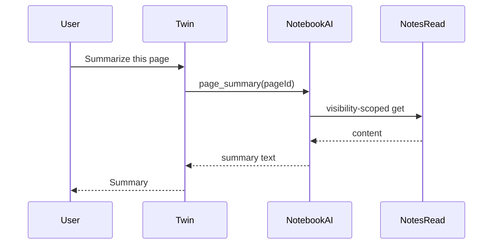
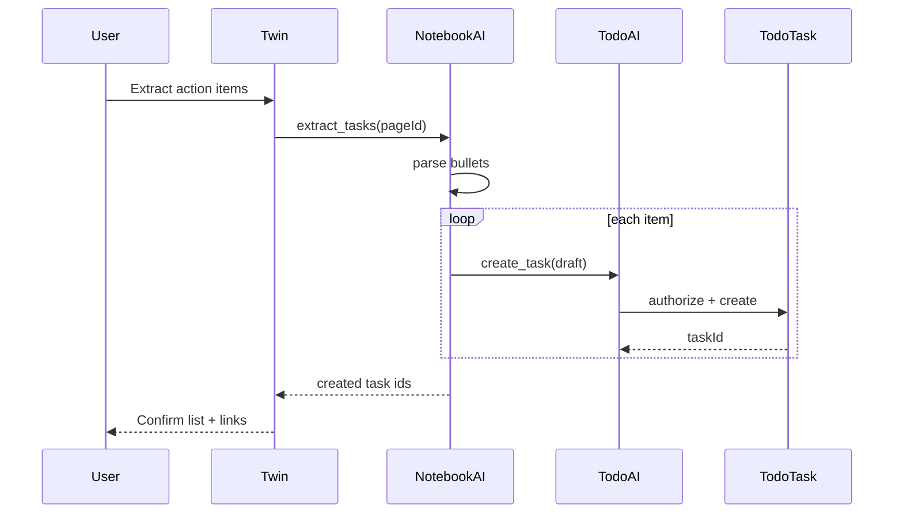

# Notebook AI Strategy

**Phase:** 0.5 / **6 implemented**  
**Parent:** [NOTEBOOK_WORKSPACE_ARCHITECTURE.md](./NOTEBOOK_WORKSPACE_ARCHITECTURE.md)  
**Date:** 2026-06-01 (Phase 6 shipped 2026-06-02)

---

## Principle

**Notebook AI orchestrates; domain modules execute.**

The Digital Life Twin routes intent to the correct **certified write path**. Notebook must not add Prisma mutations for tasks, files, or events.

---

## Capability matrix

| Capability | Notebook AI | Todo AI | Calendar AI | File Hub AI | Chat AI |
|------------|---------------|---------|-------------|-------------|---------|
| Summarize page | **Owns** (read) | — | — | — | — |
| Extract tasks from prose | **Owns** (parse) → **Todo executes** | — | — | — | — |
| Create / assign / complete task | delegates | **Owns** | — | — | partial (from message) |
| Meeting recap | **Owns** (read page + optional event context) | — | read event | — | — |
| Suggest tags for page | **Owns** | — | — | — | — |
| Suggest links (task/file/event) | **Owns** (suggest NL) | visibility | visibility | visibility | visibility |
| SOP draft from outline | **Owns** (write page via Notes path) | — | — | — | — |
| Project brief draft | **Owns** (write page) | — | — | — | — |
| Generate action plan | **Owns** narrative; tasks via Todo | **Owns** task rows | — | — | — |
| Prioritize / schedule tasks | — | **Owns** | assists | — | — |
| Create calendar event | delegates | bridge | **Owns** | — | — |
| File summarize / Q&A | delegates | — | — | **Owns** | — |
| Search file content | delegates | — | — | **Owns** | — |
| Thread summarize | delegates | — | — | — | **Owns** |
| Place recommendations | — | — | — | — | — | **Place AI** |

**Place AI** stays in `placeAIController` — Notebook only **links** listings.

---

## Notebook AI ownership (detailed)

### Reads (Phase 1–2)

| Provider | Endpoint (facade) | Delegates to |
|----------|-------------------|--------------|
| `recent_pages` | `/api/notebook/ai/context/recent` | `notes` recent |
| `pinned_pages` | `/api/notebook/ai/context/pinned` | `notes` pinned |
| `page_summary` | `/api/notebook/ai/context/page/:id` | Note body + metadata |
| `linked_work_summary` | Phase 2 | Todo list filter by page links |

### Writes (Phase 2+)

| Action | Service chain |
|--------|---------------|
| `update_page` | `notebookAIActionService` → Notes update path (future notes service) |
| `extract_tasks` | `notebookAIActionService` → `todoAIActionService.aiCreateTask` + `notebookLinkService` on confirm |
| `suggest_links` | Read-only suggestions; user links manually in rail |

**Phase 6 (2026-06-02):** `notebookAIContextService` + `notebookAIActionService`; grounding via `notebookContextService.getPageContext`; API under `/api/notebook/pages/:pageId/ai/*`; UI `NotebookAIPanel`.

| Endpoint | Capability |
|----------|------------|
| `POST .../ai/summary` | Summarize page (no writes) |
| `POST .../ai/action-items` | Propose tasks (no writes) |
| `POST .../ai/action-items/confirm` | Create tasks + PAGE→TASK links |
| `POST .../ai/meeting-recap` | Meeting recap (no writes) |
| `POST .../ai/suggest-links` | Read-only link suggestions |

---

## Execution flow diagrams

### Summarize page



### Extract tasks



### Meeting recap (with event)

Notebook AI **reads** Calendar event metadata via Calendar context provider (read-only) + Page body. **Does not** update event.

---

## Context provider registration (future manifest)

```typescript
// Design-only — registerBuiltInModules notebook block
contextProviders: [
  { name: 'recent_pages', endpoint: '/api/notebook/ai/context/recent' },
  { name: 'pinned_pages', endpoint: '/api/notebook/ai/context/pinned' },
  { name: 'page_summary', endpoint: '/api/notebook/ai/context/page/:id' },
  { name: 'open_tasks_for_dashboard', endpoint: '/api/todo/ai/context/...' }, // delegate
]
```

`moduleContextProviderSelection.ts` routes:

- “meeting”, “notes”, “page” → notebook providers
- “task”, “assign”, “due” → todo providers
- “file”, “document” → drive providers
- “event”, “calendar” → calendar providers

---

## Duplication avoidance rules

| Anti-pattern | Correct pattern |
|--------------|-----------------|
| `ActionExecutor` creates Task with Prisma | `todoAIActionService` only |
| Notebook controller updates Task | Todo controller / service |
| Duplicate `create_todo` in notebook executor | Single todo action; notebook calls it |
| File upload in notebook AI | Drive upload service |
| Calendar event create in notebook AI | Calendar AI action service |
| Place recommendation in notebook AI | Place providers; notebook links result |

---

## Page-type AI prompts (system intent)

| pageType | Default prompt bias |
|----------|---------------------|
| `meeting` | Decisions, action items, attendees; task links may carry `calendarEventId` metadata (Phase 4) for cross-context AI |
| `project` | Goals, risks, milestones, stakeholders |
| `daily` | Checklist completion, blockers, handoff |
| `sop` | Clarity, compliance, numbered steps |
| `general` | Neutral summarize |

Stored in manifest `aiContext.patterns` per type (Phase 2).

---

## Healthcare-specific AI (examples)

| Request | Owner |
|---------|-------|
| “Summarize yesterday’s dietary leadership meeting” | Notebook recap |
| “Create tasks for survey prep from this page” | Extract → Todo |
| “Find the EVS terminal cleaning SOP” | Notebook search + Drive |
| “When is tray line audit due?” | Calendar + Todo — not Notebook |

---

## Compliance checklist (pre-implementation)

| Requirement | Phase 1 | Phase 2 |
|-------------|---------|---------|
| AI reads via visibility services | Partial (notes inline) | Notes service + Todo visibility |
| AI writes via domain AI services | Todo only (manual) | + notebookAIActionService |
| No `todoController` import in notebook AI | ✅ | ✅ |
| Tests forbid Prisma in notebook AI | N/A Phase 1 | Required |
| Manifest actions match runtime | Facade declarations only | Enforced |

---

## Phase rollout

| Phase | AI deliverables |
|-------|-----------------|
| **1** | Manifest `aiContext`; delegate to existing notes + todo providers; no new executors |
| **2** | `notebookAIActionService`; extract_tasks; suggest_links; page_summary endpoint |
| **3** | Federated search context; SOP-specific prompts |

---

*Platform §6 AI Governance: [VSSYL_PLATFORM_STANDARDS_AND_MODULE_CONTRACT.md](./VSSYL_PLATFORM_STANDARDS_AND_MODULE_CONTRACT.md).*
