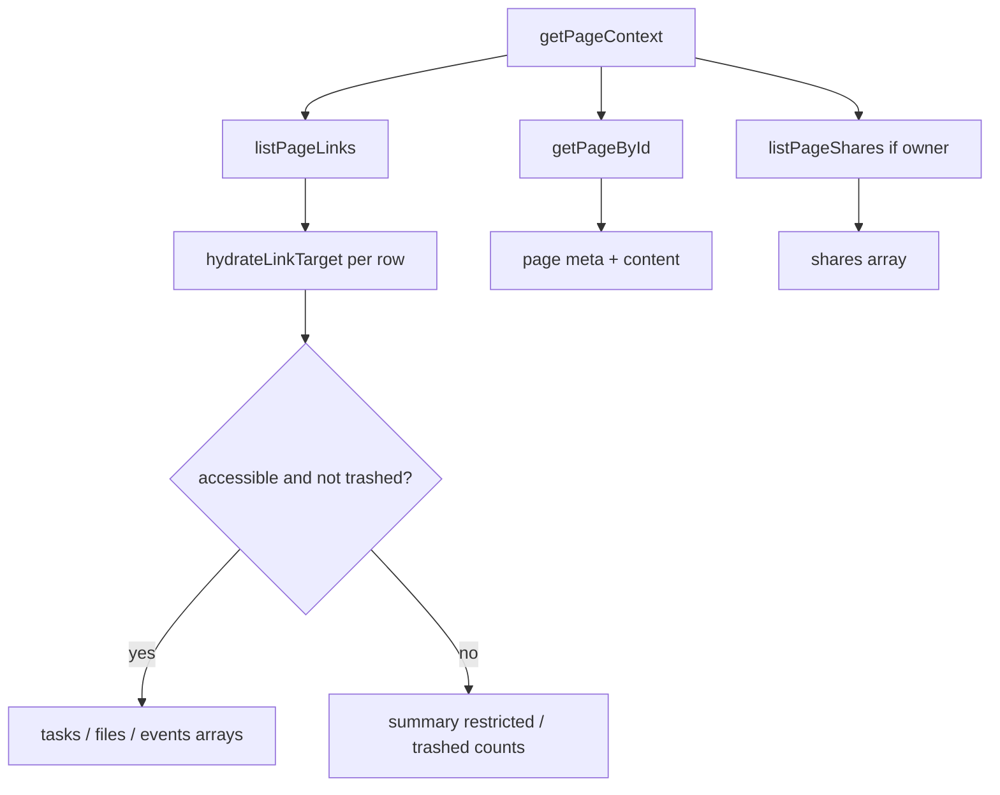

# Notebook Context Architecture

**Phase:** 5.5  
**Date:** 2026-06-02  
**Status:** Implemented  

**Purpose:** Define the canonical **read-only** aggregation layer for Notebook pages — the single object future AI, search, backlinks, and dashboard experiences consume without duplicating permission logic.

---

## Ownership boundaries

| Layer | Owner | Responsibility |
|-------|--------|----------------|
| Page content & metadata | **Notes** (`notesVisibilityService`) | `getPageById` — owner or shared read; excludes trashed pages |
| Page shares | **Notes** (`notesShareService`) | `listPageShares` — **owner only**; collaborators do not receive other recipients |
| Operational links | **Notebook** (`notebookLinkService` + `notebookLinkVisibilityService`) | Active `notebook_links` rows; target hydration via Todo / File Hub / Calendar visibility |
| Context aggregation | **Notebook** (`notebookContextService`) | Orchestrates the above; **no** direct cross-module Prisma bypass |

Notebook context **does not** own Todo tasks, Drive files, or Calendar events. It only maps hydrated snapshots returned by certified visibility paths.

---

## Canonical API

| Method | Path | Behavior |
|--------|------|----------|
| `GET` | `/api/notebook/pages/:pageId/context` | Returns `NotebookPageContext` for authenticated user |

**Not in scope (Phase 5.5):** summarization, extraction, writes, AI generation, new link types, schema changes.

---

## DTO structure (`notebookContextTypes.ts`)

- **`NotebookPageContext`** — root envelope (`pageId`, `page`, `shares`, `tasks`, `files`, `events`, `summary`, `relationshipCounts`, `generatedAt`)
- **`NotebookPageContextMeta`** — title, content, tags, tenancy, `canEdit` / `isOwner`
- **`NotebookPageShareContext`** — share rows (owner-visible only)
- **`NotebookTaskContext` / `NotebookFileContext` / `NotebookEventContext`** — accessible linked entities + link metadata
- **`NotebookContextSummary`** — counts and simple stats (content length, tag count, link totals)
- **`NotebookContextRelationshipCounts`** — totals by target/relationship type, restricted/trashed tallies

---

## Visibility rules

1. **Page read** — `getPageById(userId)`; missing page → `404` (`NotesServiceError`).
2. **Links** — `listPageLinks` (same read gate as link list API); archived links excluded.
3. **Target hydration** — `hydrateLinkTarget` per module:
   - **TASK** — `getTaskByIdIfAccessible` (Todo visibility)
   - **FILE** — `fetchAccessibleActiveFiles` (File Hub visibility)
   - **CALENDAR_EVENT** — calendar membership check + event row
4. **Inaccessible targets** — link row may exist; **not** included in `tasks` / `files` / `events`; counted in `restrictedLinks`.
5. **Trashed targets** — hydrated with `trashed: true` where visibility allows; **excluded** from entity arrays; counted in `trashedTargets`.
6. **Shares** — full list only when `page.isOwner`; otherwise `shares: []` (no leak of collaborators).
7. **V_Link** — not used for access; does not appear in page context.

---

## Hydration flow

---

## Future consumers

### AI (Phase 6 ✅)

- **`notebookAIContextService.loadGroundedAIContext`** calls `getPageContext`, truncates content, surfaces warnings for restricted/trashed links.
- **`notebookAIActionService`** consumes grounded context only; writes via `todoAIActionService` + `notebookLinkService`.
- See [NOTEBOOK_AI_STRATEGY.md](./NOTEBOOK_AI_STRATEGY.md) for API endpoints.

### Search

- Index **page meta** from Notes; optional denormalized link titles from context snapshot jobs.
- Context endpoint useful for “search within operational neighborhood” UIs.

### Workspace (Phase 6.5 ✅)

- **`getWorkspaceContext`** — dashboard-wide snapshot for Notebook Home; see [NOTEBOOK_WORKSPACE_INTELLIGENCE.md](./NOTEBOOK_WORKSPACE_INTELLIGENCE.md).
- Page-level AI should prefer `getPageContext`; dashboard AI may start from workspace context.

### Dashboards / backlinks

- `relationshipCounts` supports widgets (“3 tasks, 1 meeting, 2 files”).
- Entity backlink APIs remain separate; context is **page-centric** aggregation.

### Realtime

- Context is snapshot/read; invalidate on page update, link create/archive, or target module events (future).

---

## Testing

- `server/src/services/__tests__/notebookContextService.test.ts` — empty/mixed links, module hydration, restricted/trashed filtering, non-owner shares.
- `notebookContextController.contract.test.ts` — thin controller, no Prisma.

---

## Related docs

- [NOTEBOOK_RELATIONSHIP_MODEL.md](./NOTEBOOK_RELATIONSHIP_MODEL.md)
- [NOTEBOOK_LINK_ACCESS_RULES.md](./NOTEBOOK_LINK_ACCESS_RULES.md)
- [NOTEBOOK_IMPLEMENTATION_PLAN.md](./NOTEBOOK_IMPLEMENTATION_PLAN.md)
