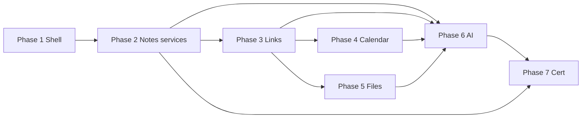

# Notebook Implementation Plan

**Phase:** 0.75  
**Date:** 2026-06-01  
**Status:** **Level 3 Certified** (2026-06-02) — Phase 8 sign-off; not Reference Module #5  
**Authorities:** [NOTEBOOK_TECHNICAL_ARCHITECTURE.md](./NOTEBOOK_TECHNICAL_ARCHITECTURE.md), product specs Phase 0.5  

**Hard constraints (all phases):** No Todo `todo*Service` / controller changes. No schema without explicit schema ACT. Notes domain extraction is **Notebook track hygiene**, not standalone Notes certification wave.

---

## Phase sequence (corrected)

Original proposal merged **Todo into Phase 3**; **MLVP requires Todo in Phase 1**. Calendar/File/AI reordered to match dependencies.

| Phase | Name | Duration (est.) | Schema ACT? |
|-------|------|-----------------|-------------|
| **1** | Shell + compose | 4–6 wk | No |
| **1.1** | Redirects + polish | 1 wk | No |
| **2** | Notes domain services | 4–6 wk | No (refactor only) |
| **3** | NotebookLink + linked UX | 6–8 wk | **Yes** — `notebook_links` |
| **4** | Calendar integration | 3–4 wk | Optional link metadata |
| **5** | File Hub integration | 3–4 wk | No |
| **6** | AI orchestration | 4–6 wk | No |
| **7** | Certification + deprecation | 4 wk | Optional `pageType` column |

---

## Phase 1 — Notebook shell (MLVP)

### Goal

One Notebook hub; meeting template + promote-to-task; no new domains.

### Backend checklist

- [x] `notebook` in `BUILT_IN_MODULE_IDS` (planning approved)
- [x] `seedNotebookModule.ts` — `dependencies: ['notes','todo']`, capabilities: read, write, ai (delegate), businessWorkspace — **no trash/vlink lies**
- [x] `builtInModuleManifests.ts` — `case 'notebook'`
- [x] `registerBuiltInModules.ts` — AI context keywords + delegate provider URLs
- [ ] Optional: `routes/notebook.ts`, `notebookSummaryService`, `notebookSummaryController` — GET only (deferred)
- [ ] `index.ts` mount `/api/notebook` (deferred — MLVP uses `/api/notes` + `/api/todo` only)
- [x] **Zero** edits to `notes.ts`, `todo*`, Prisma

### Frontend checklist

- [x] `app/notebook/**` routes per [NOTEBOOK_FRONTEND_ARCHITECTURE.md](./NOTEBOOK_FRONTEND_ARCHITECTURE.md)
- [x] `NotebookShell`, `NotebookSidebar`, `NotebookHome`
- [x] `NotebookWorkspaceLanding.tsx`
- [x] Wrap `NotesModule` in editor layout (`editorOnly` + page labels)
- [x] `NotebookTasksPanel` — `TaskList` + `QuickTaskInput`
- [x] `NotebookPromoteToTask.tsx`
- [x] `NotebookTemplatesView` (templates from `notebookTemplates.ts`)
- [x] `BusinessWorkspaceContent` — `case 'notebook'`
- [x] `coreModuleRegistry` + `moduleIcons` — notebook icon/name
- [x] `NotebookWidget` + `widgetRegistry` (replaces notes widget id)
- [ ] Page type via tags: `type:meeting`, `type:daily`, `type:project` (optional polish)

### Tests (Phase 1)

- [ ] Smoke: notebook route renders with mocked session
- [ ] Contract: `/api/notebook/summary` returns shape (if implemented)
- [x] `builtInModuleManifests.notebook.test.ts` — manifest truthfulness
- [ ] **Regression:** existing notes + todo integration tests green

### Exit criteria

- [x] Healthcare scenario §1 (leadership meeting) doable with template + manual promote
- [x] Todo cert test suite unchanged (no `todo*` edits)
- [x] No new Prisma migrations

---

## Phase 1.1 — Navigation polish

- [x] Redirect `/notes` → `/notebook` (personal + business `/workspace/notes`)
- [x] Hide `notes` from module picker lists (`coreModuleRegistry` `status: disabled`; `normalizeModuleId('notes')` → `notebook`)
- [x] `NotesModule` embedded mode (`editorOnly`, page labels, no list sidebar)
- [x] Mobile nav drawer (`NotebookSidebar`); home/tasks stack on small screens
- [x] Promote-to-task refreshes page task panel (`tasksRefreshKey`)
- [x] Vitest: `notebookPaths`, registry notebook/notes visibility
- [ ] Playwright E2E with auth (deferred — requires local `JWT_SECRET` + DB)

---

## Phase 2 — Notes domain hygiene ✅

### Goal

Thin controllers; Global Trash for pages; visibility — under Notebook initiative, not separate Notes cert PR wave.

### Backend checklist

- [x] `notesPageService`, `notesVisibilityService`, `notesPermissionService`, `notesPolicyDual`
- [x] `notesTrashService` + `registerGlobalTrashHandlers` (`moduleId: notes`, `type: note`)
- [x] `notesShareService`, `notesNotificationService`, `notesActivityService`, `notesDomainEventService`
- [x] `notesAIContextController` reads via visibility (`trashedAt`, not `deletedAt`)
- [x] Thin `notesController`, `notesShareController` — contract tests (no Prisma)
- [x] Platform entity `notes:page`; domain events `notes.page.*`
- [ ] `notesFolderService` — deferred (folders remain in `notesFolderController`)
- [ ] **Still no** `notebookLinkService`

### Frontend checklist

- [ ] Notebook Trash UI wired to Global Trash API (Phase 3+ UX)
- [x] Page list via same `api/notes.ts` (unchanged)

### Exit criteria

- [x] Notes soft-trash/restore/permanent-delete via Global Trash handler + `trashController`
- [x] Service-owned activity + domain events
- [ ] Operation matrix draft for **notes domain** (feeds Notebook cert later)

---

## Phase 3 — NotebookLink + operational UX

### Phase 3A — Design (complete 2026-06-01)

**No code, migration, or schema in 3A.** Authoritative design:

| Doc | Contents |
|-----|----------|
| [NOTEBOOK_LINK_SCHEMA_DESIGN.md](./NOTEBOOK_LINK_SCHEMA_DESIGN.md) | Prisma model, enums, indexes, additive migration |
| [NOTEBOOK_LINK_ACCESS_RULES.md](./NOTEBOOK_LINK_ACCESS_RULES.md) | Per-target authorization; V_Link never grants access |
| [NOTEBOOK_LINK_API_DESIGN.md](./NOTEBOOK_LINK_API_DESIGN.md) | REST contracts |
| [NOTEBOOK_LINK_IMPLEMENTATION_PLAN.md](./NOTEBOOK_LINK_IMPLEMENTATION_PLAN.md) | 3B scope, services, UI, events, manifest |

**Recommendation:** Proceed to **Phase 3B** after explicit **`ACT`** (schema + services + routes + minimal UI).

### Phase 3B — Implementation (complete 2026-06-02)

### Goal

First **Notebook-owned** persistence: operational page-centric links (not V_Link). MLVP right rail: linked tasks, files, events.

### Backend (3B) — done

- [x] Prisma `prisma/modules/notebook/notebook.prisma` + migration `20260601130000_add_notebook_links`
- [x] `notebookLink*` services under `server/src/services/notebook/`
- [x] `notebookLinkController` + `/api/notebook` routes
- [x] Policy actions `notebook:link:read`, `notebook:link:write`
- [x] Promote-to-task: frontend orchestration → `ACTION_SOURCE` link

### Frontend (3B) — done

- [x] `NotebookPageLinksRail`, linked tasks/files/events panels
- [x] `web/src/api/notebookLinks.ts`

### Exit criteria — met

- [x] Links persist; list respects domain visibility
- [x] No Todo/Notes/V_Link schema or service signature changes
- [x] Activity + `notebook.link.created` / `notebook.link.archived` on success only

---

## Phase 4 — Calendar meeting UX (complete 2026-06-02)

- [x] Meeting template (`meeting-notes`: agenda, decisions, action items)
- [x] `AGENDA` PAGE → `CALENDAR_EVENT` links via existing NotebookLink API
- [x] `NotebookLinkedEventsPanel` — search, context, restricted state
- [x] `GET /api/notebook/entities/CALENDAR_EVENT/:id/links` (backlinks for Calendar)
- [x] `EventDrawer` — Open / Create meeting page (frontend orchestration)
- [x] Promote-to-task includes `calendarEventId` in link metadata when page has event
- [x] **No** Calendar/Todo service or schema changes
- [ ] Deferred: Notebook Home “Upcoming meetings” card

---

## Phase 5 — File Hub integration ✅ (2026-06-02)

- [x] PAGE→FILE links via existing `POST /api/notebook/pages/:pageId/links` (`REFERENCE`)
- [x] `NotebookLinkedFilesPanel` — metadata cards, restricted/trash state, open/download via File Hub routes
- [x] `DriveFilePicker` reuse + file ID fallback
- [x] FILE hydration via `fetchAccessibleActiveFiles` (no File Hub service changes)
- [x] Tests: permission cross-dashboard, visibility hydration, service create/list restricted
- [ ] Deferred: Notebook Home recent linked files; page list “Files” count

---

## Phase 5.5 — Context aggregation ✅ (2026-06-02)

- [x] `notebookContextService.getPageContext` — page, links, shares, summary
- [x] `notebookContextTypes.ts` DTOs
- [x] `GET /api/notebook/pages/:pageId/context` (read-only)
- [x] [NOTEBOOK_CONTEXT_ARCHITECTURE.md](./NOTEBOOK_CONTEXT_ARCHITECTURE.md)
- [x] Tests: empty/mixed/restricted/trashed; controller contract

---

## Phase 6 — AI orchestration ✅ (2026-06-02)

- [x] `notebookAIContextService` — grounded context from `notebookContextService`
- [x] `notebookAIActionService` — summarize, extract, confirm tasks, meeting recap, suggest links
- [x] Routes `/api/notebook/pages/:pageId/ai/*` (thin controller)
- [x] UI `NotebookAIPanel` in page right rail
- [x] Tests: context, action service, controller contracts
- [ ] Deferred: Twin `ActionExecutor` registration; `update_page` AI write

---

## Phase 6.5 — Workspace intelligence ✅ (2026-06-02)

- [x] `notebookWorkspaceContextService.getWorkspaceContext`
- [x] Rule-based `workspaceInsights` + `suggestedFocus` (no LLM)
- [x] `GET /api/notebook/workspace/context` + `/insights`
- [x] Intelligent Notebook Home (`NotebookWorkspaceOverview`, insight + section panels)
- [x] [NOTEBOOK_WORKSPACE_INTELLIGENCE.md](./NOTEBOOK_WORKSPACE_INTELLIGENCE.md)

---

## Phase 7 — Certification audit ✅ (2026-06-02)

See [NOTEBOOK_CERTIFICATION_STRATEGY.md](./NOTEBOOK_CERTIFICATION_STRATEGY.md).

- [x] [NOTEBOOK_CONSTITUTIONAL_AUDIT.md](./audits/NOTEBOOK_CONSTITUTIONAL_AUDIT.md)
- [x] [NOTEBOOK_OPERATION_MATRIX.md](./audits/NOTEBOOK_OPERATION_MATRIX.md)
- [x] [NOTEBOOK_CERTIFICATION_READINESS_REVIEW.md](./audits/NOTEBOOK_CERTIFICATION_READINESS_REVIEW.md)
- [x] Manifest truth reviewed (no false trash/vlink on `notebook`)
- [x] Ledger: Notebook row **Ready for Level 3 review** (not certified)

## Phase 7+ — Certification hardening ✅ (2026-06-02)

- [x] `registerNotebookPlatformEntities` — product entity `notebook:page` (`NOTEBOOK_PAGE_ENTITY_TYPE`)
- [x] Manifest `entities[]` for `page` (V_Link alias `NOTE`)
- [x] `ActionExecutor.executeNotebookAction` — read-only ops; confirm rejected on executor
- [x] `toolExecutor` — `summarize_notebook_page`, `extract_notebook_action_items`
- [x] Tests: platform entity, manifest, ActionExecutor, toolExecutor, AI routing

## Phase 8 — Level 3 certification ✅ (2026-06-02)

- [x] [NOTEBOOK_LEVEL3_CERTIFICATION_REVIEW.md](./audits/NOTEBOOK_LEVEL3_CERTIFICATION_REVIEW.md)
- [x] Ledger: Notebook **Level 3 — Certified**
- [x] Reference #5: **Declined** — Place remains candidate

## Post-certification hygiene (optional)

- [ ] NB-H1–H7 per certification review §10
- [ ] Optional: deprecate standalone `notes` in admin module lists

---

## Dependency graph

---

## Risk controls per phase

| Phase | Top risk | Control |
|-------|----------|---------|
| 1 | Breaking Notes/Todo routes | No controller edits |
| 2 | Notes regression | Contract tests + trash e2e |
| 3 | Todo cert violation | Code review: only `todoTaskService` calls |
| 6 | AI Prisma bypass | Executor tests |
| 7 | Manifest lies | Capability audit vs runtime |

---

## Exact Phase 1 scope (build first)

**Single sentence:** Ship **NotebookShell + sidebar + Home + PageEditor(NotesModule) + TasksPanel + PromoteToTask + manifest/widget/landing** — optional read-only summary endpoint.

**PR boundaries:**

1. **PR1:** Manifest + seed + built-in registration (server only)
2. **PR2:** Notebook routes + layout + sidebar + Home (frontend)
3. **PR3:** Page editor wrap + Tasks panel + promote (frontend)
4. **PR4:** Business workspace + widget + landing

No PR may include Prisma schema or `todo*Service` edits.

---

*Master index: [NOTEBOOK_TECHNICAL_ARCHITECTURE.md](./NOTEBOOK_TECHNICAL_ARCHITECTURE.md).*
