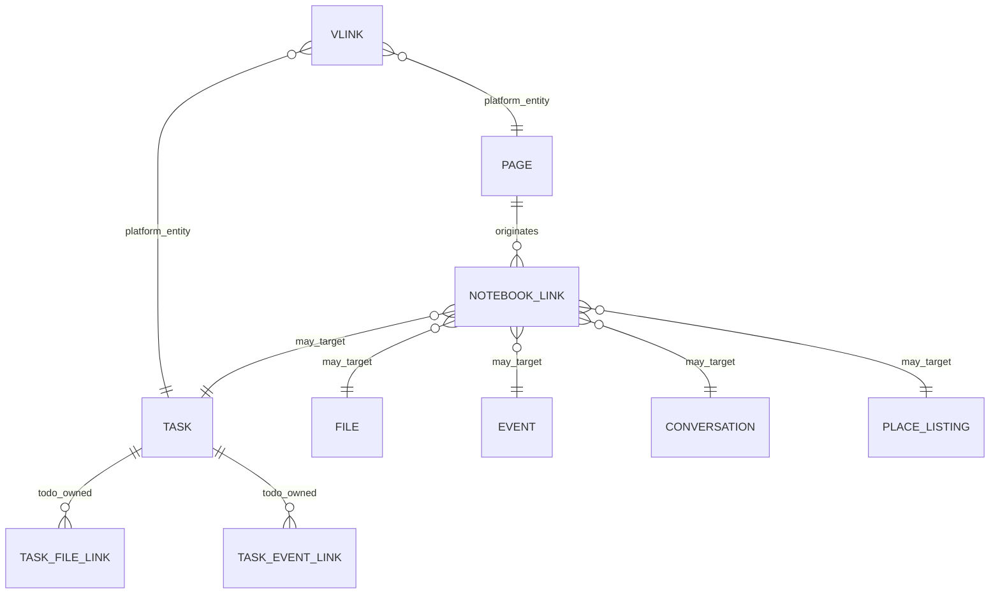

# Notebook Relationship Model

**Phase:** 0.5 (updated Phase 3A 2026-06-01)  
**Parent:** [NOTEBOOK_WORKSPACE_ARCHITECTURE.md](./NOTEBOOK_WORKSPACE_ARCHITECTURE.md)  
**Date:** 2026-06-01  
**Phase 3A design:** [NOTEBOOK_LINK_SCHEMA_DESIGN.md](./NOTEBOOK_LINK_SCHEMA_DESIGN.md), [NOTEBOOK_LINK_ACCESS_RULES.md](./NOTEBOOK_LINK_ACCESS_RULES.md)

---

## Core question

**Does Notebook own relationships, or does V_Link?**

**Answer: both — different jobs.**

| System | Owns | Analogy |
|--------|------|---------|
| **V_Link** | Platform graph edges between **entities** for discovery, AI context, “related items” | Social graph / platform linker |
| **NotebookLink** | **Operational** edges for work execution on a Page | Document bibliography + task spawn |

V_Link does **not** replace NotebookLink. NotebookLink does **not** create V_Link membership or content access.

---

## Relationship diagram (logical)



---

## Entity relationship map (ASCII)

```
                    ┌─────────────┐
                    │  V_Link     │  (platform — user curated)
                    │  membership │
                    └──────┬──────┘
                           │ resolves to
         ┌─────────────────┼─────────────────┐
         ▼                 ▼                 ▼
    ┌─────────┐       ┌─────────┐       ┌──────────┐
    │  Page   │◄─────►│  Task   │◄─────►│   File   │
    │ (Note)  │  NL   │ (Todo)  │  TFL  │  (Drive) │
    └────┬────┘       └────┬────┘       └──────────┘
         │                 │
         │    NotebookLink │    TaskEventLink (Todo)
         ▼                 ▼
    ┌─────────┐       ┌─────────┐
    │  Event  │       │  Chat   │
    │(Calendar)       │ thread  │
    └─────────┘       └─────────┘
         │
         ▼
    ┌─────────────┐
    │ Place       │
    │ listing     │  (external vendor / site — not internal SOP)
    └─────────────┘
```

**Legend:** `NL` = NotebookLink (Phase 3B table), `TFL` = TaskFileLink / TaskEventLink (existing Todo).

---

## NotebookLink specification (Phase 3A — canonical in schema doc)

**Authoritative Prisma design:** [NOTEBOOK_LINK_SCHEMA_DESIGN.md](./NOTEBOOK_LINK_SCHEMA_DESIGN.md).

Summary:

| Field | Notes |
|-------|--------|
| `sourceType` / `sourceId`, `targetType` / `targetId` | Polymorphic endpoints (`PAGE`, `TASK`, `FILE`, …) |
| `relationshipType` | `REFERENCE`, `ACTION_SOURCE`, `AGENDA`, `EVIDENCE`, `EMBED` |
| `direction` | `OUTBOUND` default for page-initiated links |
| `dashboardId`, `businessId?`, `createdById`, `metadata` | Tenant + audit |
| `archivedAt` | Soft remove (not Global Trash) |

**Uniqueness:** `(dashboardId, sourceType, sourceId, targetType, targetId, relationshipType)`.

---

## Per-relationship rules

### Page ↔ Task

| Rule | Detail |
|------|--------|
| **Create task from page** | `todoTaskService` / `todoAIActionService`; NotebookLink `action_source` |
| **Embed task** | Read task via `todoVisibilityService`; no access if PE denies |
| **Assign / complete** | **Todo UI only** — never Notes controller |
| **Duplicate links** | Task may link to multiple pages; Page lists many tasks |
| **Delete page** | Soft trash page; tasks remain (links orphaned until cleanup Phase 3) |
| **Delete task** | Todo trash; NotebookLink hidden or removed on permanent delete |

**Todo-owned today:** `Task` row, assignment, status, `TaskProject`.  
**Notebook-owned:** Page narrative + NotebookLink index.

### Page ↔ File (File Hub)

| Rule | Detail |
|------|--------|
| **Link** | NotebookLink `reference` or `evidence`; visibility via Drive |
| **Upload on page** | Phase 2+: upload still goes through **Drive**; link from Page |
| **Embed** | Show file metadata card; open in Drive |
| **V_Link** | Optional user V_Link file↔page for AI — separate from NotebookLink |

**File Hub owns:** bytes, versions, file trash, share on file.

### Page ↔ Event (Calendar)

| Rule | Detail |
|------|--------|
| **Meeting page** | NotebookLink `agenda` to `eventId` |
| **Create event from page** | Calendar services — not Notebook mutation |
| **RSVP / attendees** | Calendar only |
| **Bridge exists** | `todoCalendarBridgeService` for tasks — Notebook uses same visibility patterns |

### Page ↔ Conversation (Chat)

| Rule | Detail |
|------|--------|
| **Link thread** | NotebookLink `reference` — decision log from chat |
| **Create task from message** | `todoChatIntegrationService` (existing) — Notebook displays link |
| **Chat content access** | `chatVisibilityService` on open |

### Page ↔ Place

| Rule | Detail |
|------|--------|
| **Use case** | Vendor/supplier/site reference on project page (renovation, catering) |
| **Link target** | `BusinessPlaceListing` id — not user's Main Street graph |
| **Not for** | Internal SOPs, shift handoffs, resident care plans |
| **V_Link** | `PLACE` entity if registered — resolver read-only |

See [NOTEBOOK_WORKSPACE_ARCHITECTURE.md](./NOTEBOOK_WORKSPACE_ARCHITECTURE.md) §8.

### Page ↔ Analytics

| Rule | Detail |
|------|--------|
| **Analytics does not link to Page** | Analytics reads **activity** and domain events |
| **Notebook emits** | Facade activity `moduleId: notebook` with `subModule: notes|todo` |
| **Dashboards** | Business intelligence consumes activity — no NotebookLink |

---

## Ownership matrix

| Action | Notebook | Todo | File Hub | Calendar | Chat | Place | V_Link |
|--------|----------|------|----------|----------|------|-------|--------|
| Create Page | ✅ | — | — | — | — | — | — |
| Create Task | delegates | ✅ | — | — | — | — | — |
| Link Page→Task | ✅ NL | stores task | — | — | — | — | optional |
| Assign task | — | ✅ | — | — | — | — | — |
| Upload file | delegates | — | ✅ | — | — | — | — |
| Link Page→File | ✅ NL | TFL optional | ✅ | — | — | — | optional |
| Create event | delegates | bridge | — | ✅ | — | — | — |
| User “connect” entities for AI | suggests | — | — | — | — | — | ✅ approve |

---

## Phase 1 (no NotebookLink table)

| Relationship | Mechanism |
|--------------|-----------|
| Page → Task | Manual: create task in embedded panel; optional `taskId` in markdown metadata comment |
| Page → Event | Deep link `calendar?event=` |
| Page → File | Paste Drive URL / open Drive picker (Phase 1.5) |
| Page → Chat | Deep link |
| Page → Place | URL to listing |

Phase 3B shipped: `notebook_links`, page link API, right-rail UI. **Phase 4 (2026-06-02):** `AGENDA` PAGE→`CALENDAR_EVENT`, meeting template, Calendar `EventDrawer` → Notebook page, enriched event panel. **Phase 5 (2026-06-02):** PAGE→`FILE` right-rail panel, `DriveFilePicker`, enriched FILE hydration via File Hub visibility path; unlink archives link only (file unchanged).

---

## Integration with Todo Reference #4

**Reuse patterns, do not fork:**

- `todoIntegrationLinkService` — model for file/event links from **tasks**
- `todoVisibilityService` — all task reads from Notebook UI
- `todoVlinkAccessService` — V_Link resolve for `TASK` unchanged

**Additive:** `notebookLinkService` reads/writes NotebookLink; calls Todo/Drive/Calendar visibility before returning embed payloads.

---

## Conflict resolution

| Scenario | Resolution |
|----------|------------|
| User has V_Link to task but not task assignee | V_Link shows in AI panel; embed shows read-only or deny per Todo PE |
| Page shared viewer tries to complete linked task | Deny — task write requires Todo permissions |
| File link on page, file trashed | Embed shows “File in trash” — Drive trash UX |
| Duplicate NotebookLink | Idempotent create |

---

*AI routing for link suggestions: [NOTEBOOK_AI_STRATEGY.md](./NOTEBOOK_AI_STRATEGY.md).*
